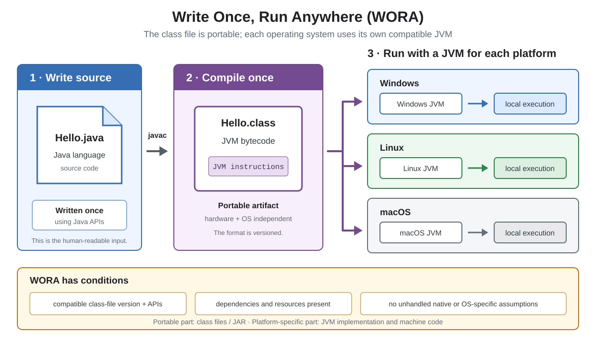

# WORA

## Front

What does Java's “Write Once, Run Anywhere” (WORA) mean, and what are its limits?

## Back

**Write Once, Run Anywhere** means Java source is normally compiled into portable Java Virtual Machine (JVM) bytecode, not one operating system's machine code. The same compatible `.class` files can run wherever a suitable JVM and required libraries exist.



```java
public class Hello {
    public static void main(String[] args) {
        System.out.println("Hi");
    }
}
```

`javac` compiles `Hello.java` into `Hello.class`. On each platform, its JVM loads and verifies the class, then executes its bytecode. A JVM may interpret instructions or compile them into local machine code.

WORA has conditions:

- The JVM must support the class-file version and Java APIs used; `javac --release N` targets release `N`.
- Dependencies and resources must be present.
- JNI/native libraries, OS commands, file paths, and other platform assumptions can still make a program platform-specific.

Therefore, WORA means **portable bytecode plus a compatible runtime**, not that every Java program is automatically portable.

## Sources

- [Java SE 26: `javac`](https://docs.oracle.com/en/java/javase/26/docs/specs/man/javac.html)
- [JVMS 26: The Java Virtual Machine](https://docs.oracle.com/en/java/javase/26/docs/specs/jvms/jvms-1.html)
- [JNI 26: Introduction](https://docs.oracle.com/en/java/javase/26/docs/specs/jni/intro.html)
