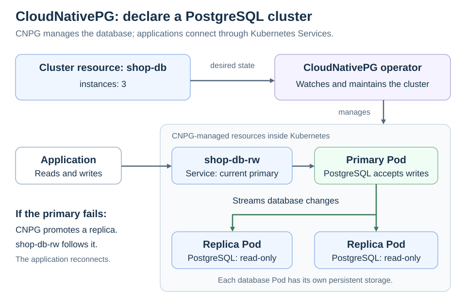

# CloudNativePG (CNPG)

<sub>[Back to Kubernetes](../Readme.md#content)</sub>

# Front

What does CloudNativePG (CNPG) do in Kubernetes?

# Back

**CloudNativePG (CNPG) is an open-source Kubernetes operator that deploys and manages PostgreSQL databases.** An **operator** is software that watches your declared configuration and keeps the running system aligned with it, using knowledge of the application.

## How it works

You declare a PostgreSQL **`Cluster` custom resource**: a configuration object added to the Kubernetes API by CNPG. This describes a database cluster running inside Kubernetes, not a new Kubernetes cluster.

CNPG manages database Pods, persistent storage, replication, and automatic **failover**—promoting a replica when the primary fails:

- **Primary:** the PostgreSQL instance that accepts writes.
- **Replicas:** instances that receive the primary's changes through PostgreSQL streaming replication. They can serve read-only queries or take over as primary.
- **Service:** a stable network endpoint. For a cluster named `shop-db`, `shop-db-rw` routes connections to the current primary; `shop-db-ro` routes read-only connections to replicas.

Read the top row as configuration becoming managed resources. Application traffic follows the middle row; the primary streams database changes to the replicas below.



CNPG uses its own controller to manage PostgreSQL Pods directly, rather than a `StatefulSet`.

## Minimal example

This learning example assumes CNPG is installed and a default storage class can provision persistent volumes:

```yaml
apiVersion: postgresql.cnpg.io/v1
kind: Cluster
metadata:
  name: shop-db
spec:
  instances: 3
  storage:
    size: 1Gi
```

`instances: 3` means **one primary plus two replicas**. Here, each database Pod gets its own **PersistentVolumeClaim (PVC)**, a request for persistent storage, sized at `1Gi`. PostgreSQL copies changes between instances; they do not share one data directory.

If CNPG promotes a replica, it updates the `shop-db-rw` Service to reach the new primary. The application keeps the same Service name, but must reconnect after interrupted connections.

### Important limits

- **Replication is asynchronous by default:** a write can be acknowledged before a replica has received it. Failover can therefore lose recent acknowledged writes. Synchronous replication is an explicit configuration choice.
- **Replicas are not backups:** an accidental deletion is replicated too. Configure backups separately so you can recover earlier data.

# Sources

- [CloudNativePG 1.28 — Overview and operator responsibilities](https://cloudnative-pg.io/docs/1.28/)
- [CloudNativePG 1.28 — Quickstart and minimal Cluster manifest](https://cloudnative-pg.io/docs/1.28/quickstart/)
- [CloudNativePG 1.28 — Architecture and failover routing](https://cloudnative-pg.io/docs/1.28/architecture/)
- [CloudNativePG 1.28 — Service management](https://cloudnative-pg.io/docs/1.28/service_management/)
- [CloudNativePG 1.28 — Custom Pod controller](https://cloudnative-pg.io/docs/1.28/controller/)
- [CloudNativePG 1.28 — Storage and per-instance claims](https://cloudnative-pg.io/docs/1.28/storage/)
- [CloudNativePG 1.28 — Replication and durability](https://cloudnative-pg.io/docs/1.28/replication/)
- [CloudNativePG 1.28 — Backup and recovery concepts](https://cloudnative-pg.io/docs/1.28/backup/)
