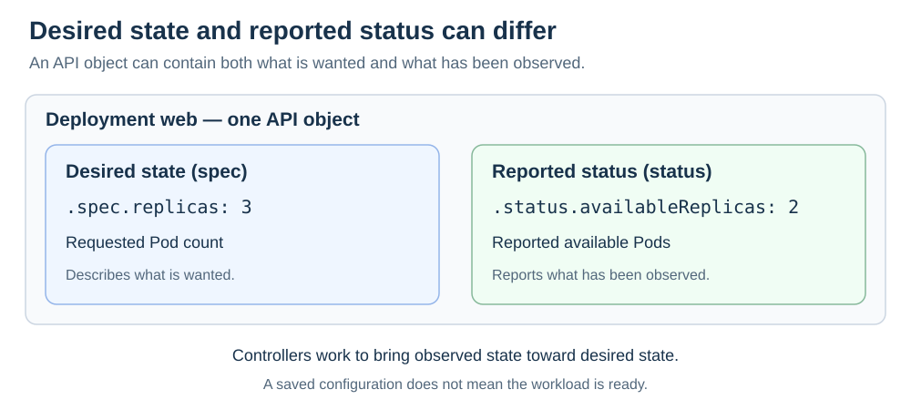

# Kubernetes cluster components

[Back to Kubernetes](../Readme.md#content)

**A Kubernetes cluster combines a control plane that manages the cluster with worker nodes that run applications.** This article explains those roles, the API they share, and the kubelet on each node.

A **node** is a physical or virtual machine. A **Pod** groups one or more containers that run together on a node. A container runs an application with its dependencies.

Components:
1. Control plane
2. Worker nodes
3. Kubernetes API
4. Kubelet

The overview below shows where these parts belong: the API server is inside the control plane, and each worker node has a kubelet. Boxes show grouping; arrows show communication or control.

## 1. Control plane

The **control plane** is the set of components that manages cluster state, assigns Pods to nodes, and works toward the configuration you requested. Its components coordinate through the Kubernetes **application programming interface (API)**.

| Component | Main responsibility |
| --- | --- |
| **kube-apiserver** | Serves the API used to read and change Kubernetes objects. |
| **etcd** | Stores the API server's data, including cluster configuration and state. |
| **kube-scheduler** | Selects a suitable node for a Pod that has no node assigned. |
| **kube-controller-manager** | Runs controllers that repeatedly compare desired and actual state and make corrections. |

That repeated comparison and correction is called **reconciliation**. For example, workload controllers can create replacement Pods to maintain a requested replica count.

An optional **cloud-controller-manager** connects Kubernetes with cloud-provider services.

### Master node in Kubernetes

**Master node** is the older name for a **control-plane node**: a machine hosting control-plane components. The control plane is the collection of components; the node is a machine on which they run.

A cluster does not have to rely on one such machine. Production clusters can replicate control-plane components across several nodes for availability.

## 2. Worker nodes

**Worker nodes provide the compute resources on which application Pods run.** Each node needs a **kubelet**, the local node agent, and a **container runtime**, the software that starts and manages containers.

**kube-proxy** commonly installs network rules for **Services**, which give applications stable network endpoints. Some network implementations provide this behavior without kube-proxy.

## 3. Kubernetes API

The **Kubernetes API** is the interface for reading and changing cluster resources, such as Pods and Deployments. An **object** is a stored representation of one resource, such as a Deployment named `web`. The **API server** is the component that serves this interface.

`kubectl` is a command-line client of the API. Controllers and other cluster components also use it. A manifest is a YAML or JSON description of objects that you submit through the API.

Many objects separate two kinds of information:

- **`spec`** describes the desired state you request.
- **`status`** reports the state observed by Kubernetes components.

In this example, the Deployment requests three Pod replicas, while its status reports two available. Compare the requested value on the left with the reported value on the right.

An accepted API update does **not** mean the application is already ready. Controllers work toward the desired state over time; lack of capacity or a bad image can prevent progress.

## 4. Kubelet

The **kubelet** is the agent that manages Pods on its own node. It reads the specifications of assigned Pods, asks the container runtime to run their containers, and reports Pod and node status to the API server.

The responsibilities are distinct: **the scheduler chooses the node; the kubelet manages assigned Pods; the runtime runs their containers.** Kubelet communicates with the runtime through the **Container Runtime Interface (CRI)**.

Kubelet is not limited to worker machines: control-plane nodes can run it too. Also distinguish **kubelet**, a long-running node agent, from **kubectl**, the client used to send commands.

# Sources

- [Kubernetes — Components](https://kubernetes.io/docs/concepts/overview/components/)
- [Kubernetes — Glossary and legacy master terminology](https://kubernetes.io/docs/reference/glossary/?fundamental=true)
- [Kubernetes — Production control-plane and worker-node layouts](https://kubernetes.io/docs/setup/production-environment/)
- [Kubernetes — Nodes and status reporting](https://kubernetes.io/docs/concepts/architecture/nodes/)
- [Kubernetes — The Kubernetes API](https://kubernetes.io/docs/concepts/overview/kubernetes-api/)
- [Kubernetes — Objects, spec, status, and manifests](https://kubernetes.io/docs/concepts/overview/working-with-objects/)
- [Kubernetes — Kubelet node agent](https://kubernetes.io/docs/reference/command-line-tools-reference/kubelet/)
- [Kubernetes — Container Runtime Interface](https://kubernetes.io/docs/concepts/containers/cri/)
- [Kubernetes — Containers and container runtimes](https://kubernetes.io/docs/concepts/containers/)
- [Kubernetes — Controllers](https://kubernetes.io/docs/concepts/architecture/controller/)
- [Kubernetes — Deployments](https://kubernetes.io/docs/concepts/workloads/controllers/deployment/)
