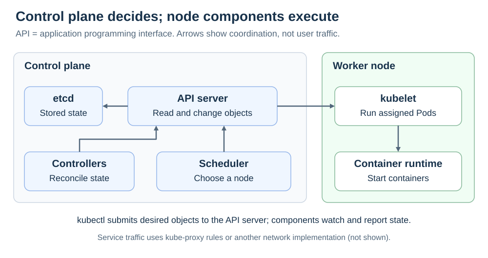

# Kubernetes cluster components

[Back to Kubernetes](../Readme.md#content)

# Front

How do the control plane and worker-node components turn a requested workload into running containers?

# Back

**The control plane manages cluster state and placement; node components run the containers.** Components coordinate through the Kubernetes application programming interface (**API**) exposed by the API server.

## Who does what?

| Component | Responsibility |
| --- | --- |
| **kube-apiserver** | Exposes the API used to read and change cluster objects. |
| **etcd** | Persists the API server's data. It is not the application's database. |
| **kube-controller-manager** | Runs controllers that reconcile desired and actual state. |
| **kube-scheduler** | Chooses a suitable node for a Pod that has no node assigned. |
| **kubelet** | Node agent that makes sure assigned Pods' containers run. |
| **Container runtime** | Starts and manages containers on the node. |

The diagram separates decisions from execution. The arrows show API coordination, not application request traffic.

## Follow a new Deployment

1. `kubectl`, the command-line client, submits your desired configuration to the API server.
2. Controllers create the required ReplicaSet and Pod objects.
3. The scheduler records a node assignment for each unscheduled Pod.
4. That node's kubelet uses the container runtime to run the containers and reports status.

These are cooperating control loops, not one synchronous command chain.

### Networking is another responsibility

**kube-proxy** commonly installs node rules for Service traffic. It is optional when another network implementation provides that behavior. A cloud-controller-manager is also optional and integrates a cluster with cloud-provider services.

# Sources

- [Kubernetes — Components](https://kubernetes.io/docs/concepts/overview/components/)
- [Kubernetes — Controllers](https://kubernetes.io/docs/concepts/architecture/controller/)
- [Kubernetes — Deployments](https://kubernetes.io/docs/concepts/workloads/controllers/deployment/)
