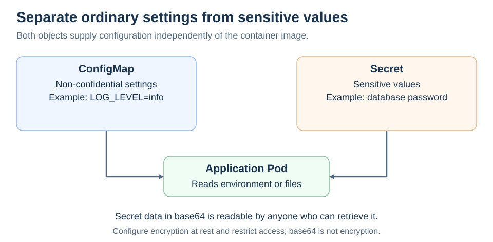

# ConfigMaps and Secrets

[Back to Kubernetes](../Readme.md#content)

# Front

When should configuration go in a ConfigMap rather than a Secret, and what protection does a Secret provide?

# Back

**Use a ConfigMap for non-confidential configuration and a Secret for sensitive values.** Both let you supply configuration independently of a container image. A Secret is a dedicated sensitive-data object, not an automatic guarantee of encryption or safe access.

## Keep the values in the right place

The diagram separates a harmless log setting from a password. A Pod can consume either object through environment variables or mounted files.

| ConfigMap | Secret |
| --- | --- |
| Log level, public endpoint, feature flag | Password, access token, private key |
| Has no secrecy or encryption guarantee | Requires restricted access and suitable storage protection |

An API key belongs in a Secret or an appropriate external secret-management system, never in a ConfigMap just because it is “configuration.”

## Encoding is not encryption

Values in a Secret manifest's `data` field use **base64**, a reversible encoding. Anyone who can read the value can decode it. The `stringData` field accepts clear text and is not a safer place to commit credentials.

By default, Kubernetes stores Secrets unencrypted in etcd. Configure encryption at rest and restrict access with **role-based access control (RBAC)**. Also limit who may create Pods that can mount the Secret. A managed service may configure encryption for you; verify its settings.

### Updates are not always immediate

Environment variables in an existing container do not change when the source object changes; replace or restart the container to reload them. Normal projected volume contents update eventually, but a `subPath` mount does not receive those updates. The application must also reload changed files.

# Sources

- [Kubernetes — ConfigMaps and update behavior](https://kubernetes.io/docs/concepts/configuration/configmap/)
- [Kubernetes — Secrets, encoding, storage, and mounted updates](https://kubernetes.io/docs/concepts/configuration/secret/)
- [Kubernetes — Good practices for Secrets](https://kubernetes.io/docs/concepts/security/secrets-good-practices/)
