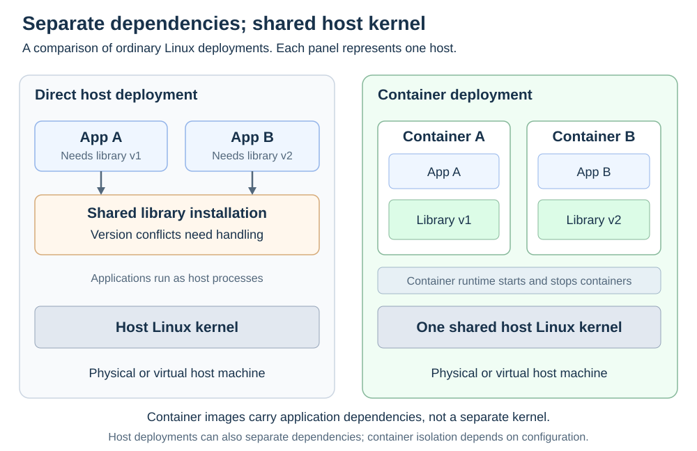

# Container fundamentals

[Back to Kubernetes](../Readme.md#content)

# Front

What is a container, and how does container deployment differ from installing applications directly on a host?

# Back

**A container is an isolated application environment created from an image. Containers still run on a host; ordinary Linux containers share its kernel while keeping their application files and dependencies separate.**

## Core terms

- **Host:** the physical or virtual machine running the applications.
- **Kernel:** the operating system's core, which manages processes, memory, and devices. Application libraries are separate from the kernel.
- **Image:** a read-only template containing application code, libraries, any required language runtime, and startup defaults. Multiple containers can be created from one image.
- **Container runtime:** software that creates, starts, stops, and manages containers, such as containerd.

A language runtime, such as Python, executes application code. A container runtime manages the container environment; these are different roles.

## Direct host deployment versus containers

| Aspect | Directly on a host | In containers |
| --- | --- | --- |
| **Dependencies** | Install libraries and language runtimes on the target machine; shared versions can conflict. | Package the required versions in each image. |
| **Environment** | Application processes use the host environment and its access controls. | Processes get configured isolation for their view of files, processes, and networking. |
| **Updates** | Update the application and required packages on the machine. | Build a new image and replace containers with instances of it. |
| **Kernel** | Applications use the host kernel. | Ordinary Linux containers also use the host kernel; each container does not boot its own. |

For example, App A needs version 1 of a library and App B needs version 2. Separate images can carry those versions without replacing a shared host installation. Host deployments can also use separate application environments; containers make that environment part of the deployable image.

Compare the shared dependency installation on the left with separate container environments on the right. Both approaches still need a host and its kernel.

## Isolation and practical limits

Linux **namespaces** control which processes, files, and network resources a process can see. **Control groups (cgroups)** account for resource use and can enforce configured processor and memory limits.

- **A container is not a virtual machine:** a virtual machine has its own operating-system kernel. Containers avoid that per-instance overhead.
- **Isolation is not absolute:** containers share a kernel, and privileged settings or access to host files can weaken isolation. Resource limits must be configured.
- **Portability requires compatibility:** the image still needs a compatible operating system and processor architecture.
- **Data needs a persistence plan:** removing a container discards its writable layer. Stopping it is different from removing it. Store lasting data in volumes or other persistent storage.

# Sources

- [Docker — Containers and virtual machines](https://docs.docker.com/get-started/docker-concepts/the-basics/what-is-a-container/)
- [Docker — Images and container lifecycle](https://docs.docker.com/get-started/docker-overview/)
- [Kubernetes — Images and container runtimes](https://kubernetes.io/docs/concepts/containers/)
- [Docker — Namespaces, control groups, and isolation](https://docs.docker.com/engine/security/)
- [Docker — Configuring resource limits](https://docs.docker.com/engine/containers/resource_constraints/)
- [Docker — Platform compatibility](https://docs.docker.com/build/building/multi-platform/)
- [Docker — Container storage and persistence](https://docs.docker.com/engine/storage/)
