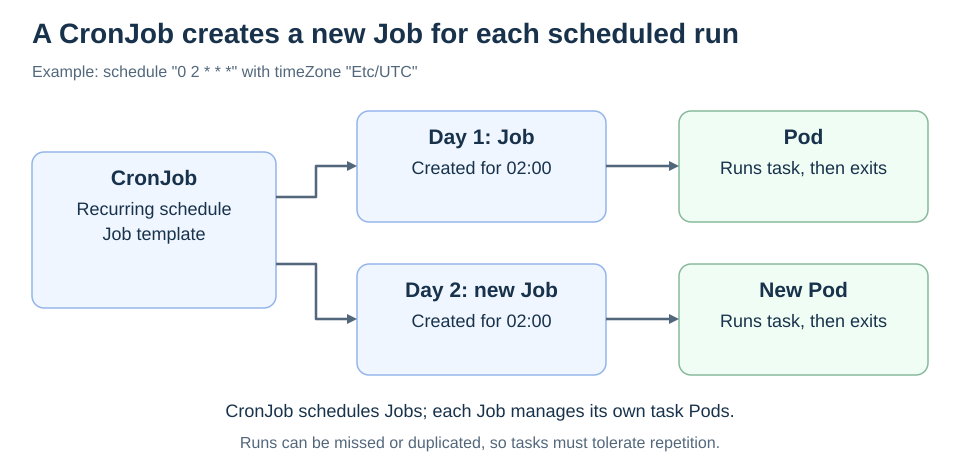

# CronJobs

<sub>[Back to Kubernetes](../Readme.md#content)</sub>

# Front

How does a CronJob schedule work, and how does it handle overlapping or missed runs?

# Back

**CronJob became stable in Kubernetes v1.21.**

A **CronJob** creates Jobs on a recurring schedule. Each Job manages the Pods that perform a finite task, such as generating a daily report.

## Schedule → Job → Pod

Each scheduled occurrence creates a separate Job. The Pod runs the task and exits; the CronJob remains to schedule future work.



## A scheduled task

This example targets Kubernetes v1.27 or later, where `.spec.timeZone` is stable. It prints a message daily at 02:00 UTC:

```yaml
apiVersion: batch/v1
kind: CronJob
metadata:
  name: daily-greeting
spec:
  schedule: "0 2 * * *"
  timeZone: "Etc/UTC"
  concurrencyPolicy: Forbid
  startingDeadlineSeconds: 600
  jobTemplate:
    spec:
      template:
        spec:
          restartPolicy: Never
          containers:
            - name: greeting
              image: busybox:1.36
              command: ["echo", "Scheduled greeting"]
```

The five schedule fields are minute, hour, day of month, month, and day of week. `startingDeadlineSeconds` allows a late start for up to 600 seconds; it is **not** the task's runtime limit.

## Overlap and missed runs

`concurrencyPolicy` applies only to Jobs from this same CronJob:

- `Allow` (default): permit overlap.
- `Forbid`: skip a scheduled start while a prior Job is active; a late start may still fit the deadline.
- `Replace`: replace the active Job with the new run.

Scheduling is approximate: an occurrence may be missed or duplicated. Make the task **idempotent**, so repeating it does not duplicate its effect. `Forbid` does not guarantee exactly-once execution.

# Sources

- [Kubernetes — CronJob stability, time zones, concurrency, and limitations](https://kubernetes.io/docs/concepts/workloads/controllers/cron-jobs/)
- [Kubernetes — CronJob API fields and deadlines](https://kubernetes.io/docs/reference/kubernetes-api/batch/cron-job-v1/)
- [Kubernetes — Running automated tasks with a CronJob](https://kubernetes.io/docs/tasks/job/automated-tasks-with-cron-jobs/)
