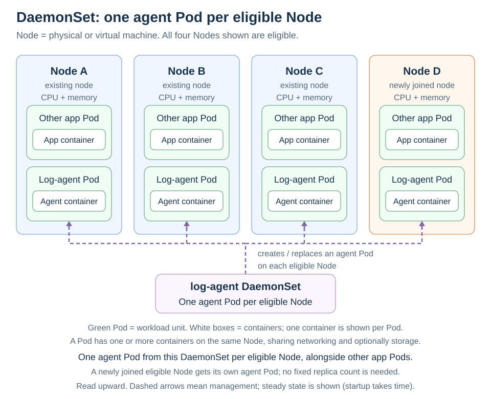

# DaemonSets

[Back to Kubernetes](../Readme.md#content)

# Front

What does a DaemonSet maintain, and when should you use one instead of a ReplicaSet?

# Back

**A DaemonSet aims to run one copy of its Pod on every eligible node.** A Pod runs one or more containers together; a node is a machine that runs Pods. Use a DaemonSet for services each machine needs, such as log collectors, node monitoring agents, or network helpers.

## Coverage follows the nodes

Follow the dashed arrows upward: the DaemonSet manages the agent Pods directly. Each eligible node gets its own log-agent Pod, including the newly joined Node D.

- When an eligible node joins, the controller creates an agent Pod for it.
- When a node is removed, its agent Pod is cleaned up.
- If an agent Pod is deleted, the controller replaces it on its eligible node.

A [ReplicaSet](../ReplicaSets/Readme.md) targets a total count, such as three application Pods. A DaemonSet has **no `.spec.replicas` setting**: its desired count follows the eligible nodes. A Deployment and ReplicaSet are not required between the DaemonSet and its Pods.

## What makes a node eligible?

The Pod template (the blueprint for new Pods) can use `nodeSelector` or node affinity to restrict which nodes qualify. A **taint** can repel Pods from a node; a matching **toleration** allows a Pod past that restriction. DaemonSets have some automatic tolerations, but they do not bypass every taint.

### Desired state, not an instant guarantee

A Pod still needs resources and a working configuration to run. During a rolling update, an agent can temporarily be unavailable, or old and new Pods can overlap if surge (extra Pods during an update) is enabled. “One per eligible node” describes the steady-state goal.

# Sources

- [Kubernetes — DaemonSet use cases, node selection, and Pod lifecycle](https://kubernetes.io/docs/concepts/workloads/controllers/daemonset/)
- [Kubernetes — DaemonSet API fields and rolling-update limits](https://kubernetes.io/docs/reference/kubernetes-api/apps/daemon-set-v1/)
- [Kubernetes — Taints and tolerations](https://kubernetes.io/docs/concepts/scheduling-eviction/taint-and-toleration/)
- [Kubernetes — ReplicaSet replica count](https://kubernetes.io/docs/concepts/workloads/controllers/replicaset/)
- [Kubernetes — Pods](https://kubernetes.io/docs/concepts/workloads/pods/)
