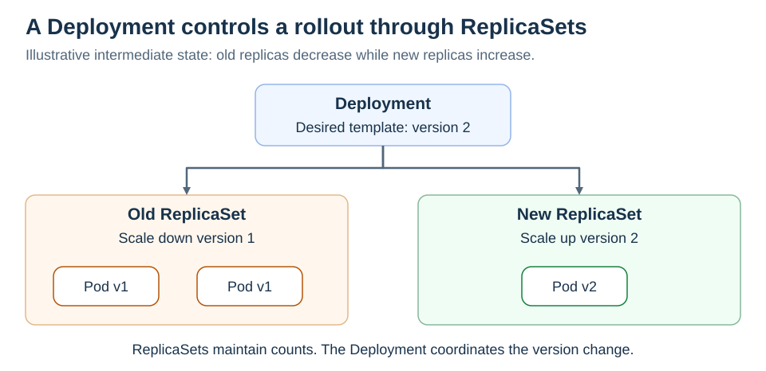

# Deployments and ReplicaSets

<sub>[Back to Kubernetes](../Readme.md#content)</sub>

# Back

A **Deployment** manages application Pods through **ReplicaSets**, which maintain the requested Pod counts. You declare the desired state; the Deployment controller manages updates. Avoid directly editing ReplicaSets owned by a Deployment.

## Where Deployments and ReplicaSets fit

The diagram shows two applications behind **Gateway API**, whose listeners and routes require a compatible controller. Solid arrows show the logical request path through a proxy or load balancer, a **Service**, and Pods; actual network hops depend on the implementation.

Dashed arrows show ownership: Deployments manage ReplicaSets, which manage Pods. These controllers are outside the request path. One active ReplicaSet per application is shown.



## Count versus version

A **Pod template** describes new Pods' containers and configuration. Changing it, such as updating an image, triggers a rollout. Changing only the replica count scales the workload without a new template rollout.

## Built-in Deployment strategies

Deployment resource has only two built-in update strategies, selected through `.spec.strategy.type`:
1. **RollingUpdate** — gradually replaces old Pods with new ones; the default.
2. **Recreate** — terminates all old Pods before creating the new ones during an upgrade.

### 1. Rolling update

**`RollingUpdate` is the default.** It gradually scales up the new ReplicaSet and scales down the old one. Old and new versions can coexist.

- `maxSurge` allows extra replicas; terminating Pods can temporarily raise the total further.
- `maxUnavailable` limits unavailable replicas during the update.
- A **readiness probe** checks whether a container is ready to serve, helping keep unready Pods out of Service traffic.

With three replicas, `maxSurge: 1`, and `maxUnavailable: 0`, a new Pod can become available before an old one is removed. This does not guarantee zero downtime if the application or readiness checks are faulty.

### 2. Recreate

**`Recreate` terminates all old Pods before creating new ones during an upgrade.** Expect a service gap. Use it when old and new versions must not overlap during that upgrade and downtime is acceptable.

This ordering applies to upgrades; it is not a general guarantee against overlapping Pods after manual deletion.

## Other release patterns

Kubernetes supports other release patterns, including:
1. **Blue-green** — run both versions, then switch traffic to the new version.
2. **Canary** — send a small share of traffic to the new version, then gradually increase it.

These patterns require additional workload and traffic-routing configuration. Tools such as Argo Rollouts automate them through their own resource types, rather than adding values to `Deployment.spec.strategy.type`.

## Observe and roll back

For an existing Deployment named `web` in the current namespace:

```bash
kubectl rollout status deployment/web
kubectl rollout history deployment/web
# Restore the preceding retained Pod-template revision:
kubectl rollout undo deployment/web
```

### Important limit

**A failed Deployment rollout does not automatically roll back.** `ProgressDeadlineExceeded` reports stalled progress; a person or automation must act. Rollback restores a retained Pod template, not database changes or all external configuration. A Service provides the stable network endpoint.

# Sources

- [Kubernetes — Deployments, rollout strategy, history, and failure conditions](https://kubernetes.io/docs/concepts/workloads/controllers/deployment/)
- [Kubernetes — ReplicaSet](https://kubernetes.io/docs/concepts/workloads/controllers/replicaset/)
- [Kubernetes — Readiness probes](https://kubernetes.io/docs/concepts/workloads/pods/probes/)
- [Kubernetes — Gateway API resources and request flow](https://kubernetes.io/docs/concepts/services-networking/gateway/)
- [Kubernetes — Services and their backend Pods](https://kubernetes.io/docs/concepts/services-networking/service/)
- [Argo Rollouts — Blue-green traffic switching](https://argo-rollouts.readthedocs.io/en/stable/features/bluegreen/)
- [Argo Rollouts — Canary steps and traffic-weighting limits](https://argo-rollouts.readthedocs.io/en/stable/features/canary/)
