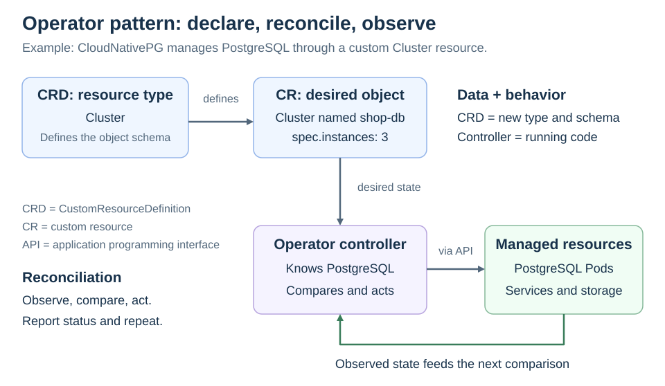

# Extending Kubernetes. Operator pattern

<sub>[Back to Kubernetes](../Readme.md#content)</sub>

# Front

How does the operator pattern extend Kubernetes?

# Back

**An operator combines custom resources with a controller that automates application-specific operations, without changing Kubernetes itself.** It turns operational knowledge—such as how to configure database replication, take backups, or perform upgrades—into software.

## Three parts to distinguish

The common setup uses a **CustomResourceDefinition (CRD)** to extend the Kubernetes application programming interface (**API**):

| Part | Responsibility | CloudNativePG example |
| --- | --- | --- |
| **CRD** | Registers a resource type and its schema: the allowed structure of its objects. | Defines the PostgreSQL `Cluster` type. |
| **Custom resource (CR)** | One object of that type, describing what you want. | A `Cluster` named `shop-db`. |
| **Controller** | Running code that observes the system and acts to satisfy the request. | The CloudNativePG operator. |

A resource's **`spec`** describes desired state; its **`status`** reports observed state. You manage custom resources through the Kubernetes API, including with `kubectl`.

## Reconciliation is a continuing loop

**Reconciliation** means bringing actual state closer to desired state:

1. Read the custom resource and observe the resources it manages.
2. Compare desired and actual state, then make the necessary changes. For example, request new Pods or Services through the API server.
3. Report observed status and repeat as changes occur.

Follow the diagram from the type definition to the desired object, then into the controller. The return arrow carries observations back so the controller can decide what still needs work.



The controller requests changes; Kubernetes components such as the scheduler and kubelet place and run the resulting Pods.

## Example: CloudNativePG

With CloudNativePG (CNPG) installed and a working default storage class, this minimal learning example creates a **custom resource**:

```yaml
apiVersion: postgresql.cnpg.io/v1
kind: Cluster
metadata:
  name: shop-db
spec:
  instances: 3
  storage:
    size: 1Gi
```

CNPG interprets this as one PostgreSQL primary plus two replicas, with persistent storage. Its controller handles database-specific work such as replication and failover. See the [CNPG card](../CloudNativePG/Readme.md) for that database model.

### Important distinction

**A CRD alone does not run an application.** It lets Kubernetes validate and store a new kind of object. A matching controller must implement the behavior. Available operations depend on that controller; defining a field called `backup` does not automatically implement backups.

# Sources

- [Kubernetes — Operator pattern and application-specific automation](https://kubernetes.io/docs/concepts/extend-kubernetes/operator/)
- [Kubernetes — Custom resources, CRDs, and custom controllers](https://kubernetes.io/docs/concepts/extend-kubernetes/api-extension/custom-resources/)
- [Kubernetes — Controllers and the desired-state control loop](https://kubernetes.io/docs/concepts/architecture/controller/)
- [CloudNativePG 1.28 — Quickstart and example custom resource](https://cloudnative-pg.io/docs/1.28/quickstart/)
- [CloudNativePG 1.28 — Operator capabilities, replication, storage, and status](https://cloudnative-pg.io/docs/1.28/operator_capability_levels/)
