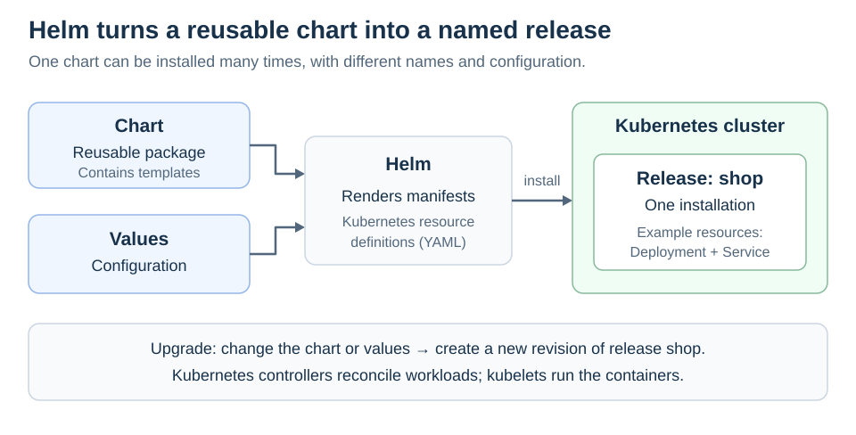

# Helm

<sub>[Back to Kubernetes](../Readme.md#content)</sub>

# Front

How do Helm charts, values, and releases make Kubernetes applications reusable?

# Back

**Helm is a package manager for Kubernetes: it installs and upgrades applications described by charts.** A chart can generate several related Kubernetes objects, such as a Deployment and a Service.

## Package, configuration, installation

- A **chart** is a reusable package of templates and metadata. `Chart.yaml` describes the chart; `templates/` contains resource templates.
- **Values** are configuration inputs. `values.yaml` provides defaults; a file passed with `-f` can override them.
- A **release** is one named installation of a chart. The same chart can produce multiple releases with different names and values.

Follow the diagram: chart templates and values produce **manifests**, the resource definitions sent to Kubernetes during installation or upgrade.



## A small workflow

Assume `./web-chart` is an existing chart, `demo` is an existing namespace, and `prod-values.yaml` contains its settings:

```bash
# Render locally to inspect the generated manifests.
helm template shop ./web-chart -f prod-values.yaml -n demo

# Install the release, or upgrade it if it already exists.
helm upgrade --install shop ./web-chart -f prod-values.yaml -n demo

helm history shop -n demo
# If revision 1 exists, restore that release configuration.
helm rollback shop 1 -n demo
```

### Important limits

`helm template` does not prove that the cluster will accept the generated resources. Helm rollback restores a release revision; **do not treat it as a database backup or assume it reverses application data changes**. Kubernetes controllers still manage the workloads created from the chart.

# Sources

- [Helm — Chart structure](https://helm.sh/docs/topics/charts/)
- [Helm — Values files](https://helm.sh/docs/chart_template_guide/values_files/)
- [Helm — Releases and revisions](https://helm.sh/docs/chart_template_guide/builtin_objects/)
- [Helm — Local template rendering](https://helm.sh/docs/helm/helm_template/)
- [Helm — Upgrade and install](https://helm.sh/docs/helm/helm_upgrade/)
- [Helm — Rollback scope and revision selection](https://helm.sh/docs/helm/helm_rollback/)
- [Kubernetes — Controllers](https://kubernetes.io/docs/concepts/architecture/controller/)
