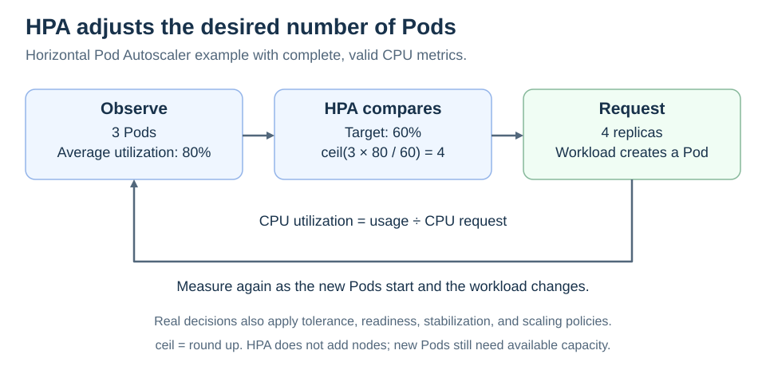

# Horizontal Pod Autoscaling

<sub>[Back to Kubernetes](../Readme.md#content)</sub>

# Front

How does the Horizontal Pod Autoscaler decide to change a workload's replica count?

# Back

**The Horizontal Pod Autoscaler (HPA) periodically compares observed metrics with a target and changes a scalable workload's desired replica count.** It can target a Deployment or StatefulSet. It changes the number of Pods, not the size of existing Pods or the number of nodes.

## Understand a utilization target

For a central processing unit (**CPU**) utilization target, usage is measured relative to the configured CPU **request**, not its limit and not the node's total CPU. A request describes the capacity used for scheduling; a limit constrains runtime usage.

Example: each Pod requests `200m` CPU (0.2 CPU) and uses `100m`, so utilization is 50%. Changing requests can therefore change HPA's decisions even when actual CPU usage stays the same.

The diagram shows the simplified calculation with complete, valid metrics. Three Pods at 80% utilization and a 60% target suggest four replicas.



```text
desired replicas = ceil(current replicas × current metric / target metric)
                 = ceil(3 × 80 / 60) = 4
```

`ceil` means round upward to a whole number. Actual decisions also consider tolerance, missing metrics, Pod readiness, stabilization, scaling policies, and minimum/maximum replicas.

## What must exist?

- A metrics API: CPU and memory metrics commonly come from **Metrics Server**; custom or external metrics need appropriate adapters.
- Relevant resource requests for utilization-based scaling. Missing requests can make Pod utilization undefined.
- Capacity to run the new Pods. HPA can request more replicas while some remain `Pending`; node autoscaling is a separate mechanism.

### Practical distinction

Use the current `autoscaling/v2` API for HPA configuration with multiple or custom metrics. HPA is a feedback loop, so it reacts over time and cannot guarantee immediate capacity for a sudden traffic spike.

# Sources

- [Kubernetes — Horizontal Pod Autoscaling, algorithm, metrics, and scaling policies](https://kubernetes.io/docs/concepts/workloads/autoscaling/horizontal-pod-autoscale/)
- [Kubernetes — Resource requests, CPU units, and limits](https://kubernetes.io/docs/concepts/configuration/manage-resources-containers/)
- [Kubernetes — Node autoscaling](https://kubernetes.io/docs/concepts/cluster-administration/node-autoscaling/)
