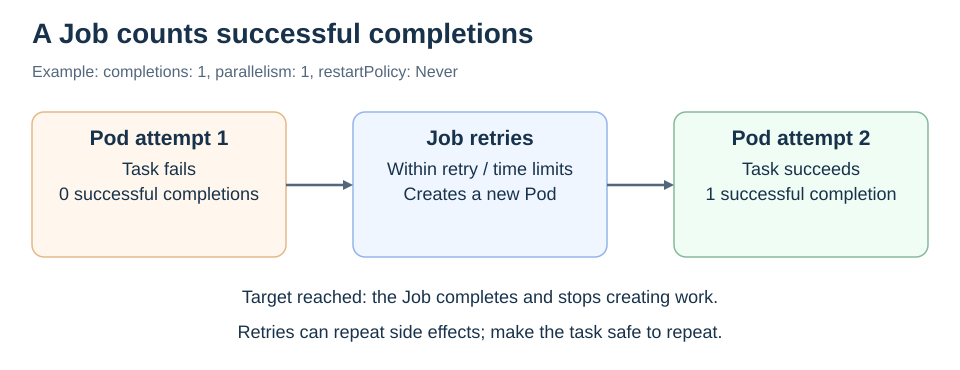

# Jobs

<sub>[Back to Kubernetes](../Readme.md#content)</sub>

# Front

How does a Job run a finite task, and why must the task tolerate retries?

# Back

**A Job manages Pods for work that should finish, such as a report or batch calculation.** It tracks successful completions and can retry failed attempts within configured limits.

## Completion is the goal

In this example, the first Pod fails and a replacement succeeds. Once the required completion is reached, the Job stops creating work.



## A minimal Job

This manifest runs a short command with one required completion:

```yaml
apiVersion: batch/v1
kind: Job
metadata:
  name: greeting
spec:
  completions: 1
  parallelism: 1
  backoffLimit: 2
  activeDeadlineSeconds: 120
  template:
    spec:
      restartPolicy: Never
      containers:
        - name: greeting
          image: busybox:1.36
          command: ["echo", "Hello from a Job"]
```

- `completions` is the target number of successful Pods; `parallelism` bounds how many should run at once.
- `backoffLimit` bounds retries. `activeDeadlineSeconds` limits the Job's active duration, including retries.
- `restartPolicy: Never` prevents a container restart inside that Pod; the Job can still create a replacement Pod. Jobs also permit `OnFailure`, which allows container restarts.

## Success does not mean exactly once

Even with one completion and one parallel Pod, the program can start more than once. Make side effects **idempotent**: repeating the same work should not duplicate its effect. For example, save a report under a stable report ID rather than creating another report on every attempt.

A Job that exhausts its retries or deadline can fail permanently. Use a **CronJob** when new Jobs should be created on a recurring schedule.

# Sources

- [Kubernetes — Jobs, retries, completion, and duplicate execution](https://kubernetes.io/docs/concepts/workloads/controllers/job/)
- [Kubernetes — Job API fields](https://kubernetes.io/docs/reference/kubernetes-api/batch/job-v1/)
