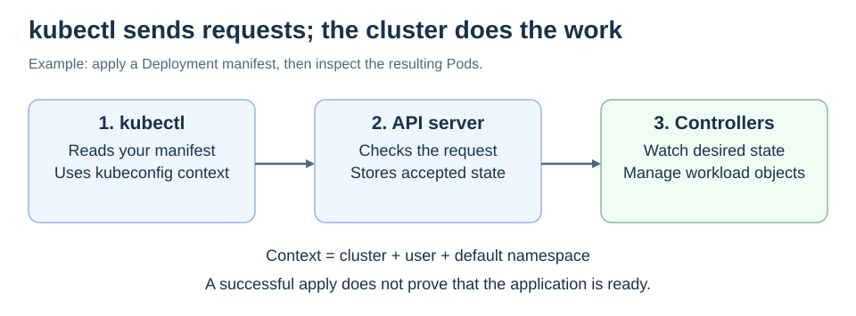

# kubectl

<sub>[Back to Kubernetes](../Readme.md#content)</sub>

# Front

What does `kubectl` do, and how do you use it to inspect and update a Kubernetes application?

# Back

**`kubectl` is the command-line client for the Kubernetes API (application programming interface).** It sends requests to the cluster's API server to inspect or change Kubernetes objects.

## Choose the target, then send a request

A **kubeconfig** file holds cluster connection and authentication settings. Its **context** selects a cluster, user, and default namespace. A namespace groups resources within a cluster. `--context` and `-n` can select these explicitly for a command.

Read the flow from left to right. After an update is accepted, Kubernetes controllers work toward the requested state; `kubectl` does not itself keep the application running.



## Inspect before changing

For a configured cluster with namespace `demo`, replace `web-pod` with a real Pod name:

```bash
kubectl config current-context
kubectl get pods -n demo
kubectl describe pod web-pod -n demo
kubectl logs web-pod -n demo
```

- `get` gives a resource summary.
- `describe` adds details and events, useful for scheduling or image-pull failures.
- `logs` reads a container's output. Add `-c NAME` to choose a container, or `--previous` for its previous terminated instance.

## Declare the desired state

A **manifest** is a YAML or JSON description of Kubernetes objects. Given a prepared `deployment.yaml`:

```bash
kubectl diff -n demo -f deployment.yaml
kubectl apply -n demo -f deployment.yaml
```

`diff` previews changes; `apply` creates or updates the declared objects. An accepted update does **not** mean the application is already ready. Check its Pods and, for a Deployment named `web`, `kubectl rollout status deployment/web -n demo`.

# Sources

- [Kubernetes — kubectl syntax and operations](https://kubernetes.io/docs/reference/kubectl/)
- [Kubernetes — kubeconfig and contexts](https://kubernetes.io/docs/concepts/configuration/organize-cluster-access-kubeconfig/)
- [Kubernetes — Debug running Pods](https://kubernetes.io/docs/tasks/debug/debug-application/debug-running-pod/)
- [Kubernetes — Declarative object management](https://kubernetes.io/docs/tasks/manage-kubernetes-objects/declarative-config/)
- [Kubernetes — Cluster components](https://kubernetes.io/docs/concepts/overview/components/)
