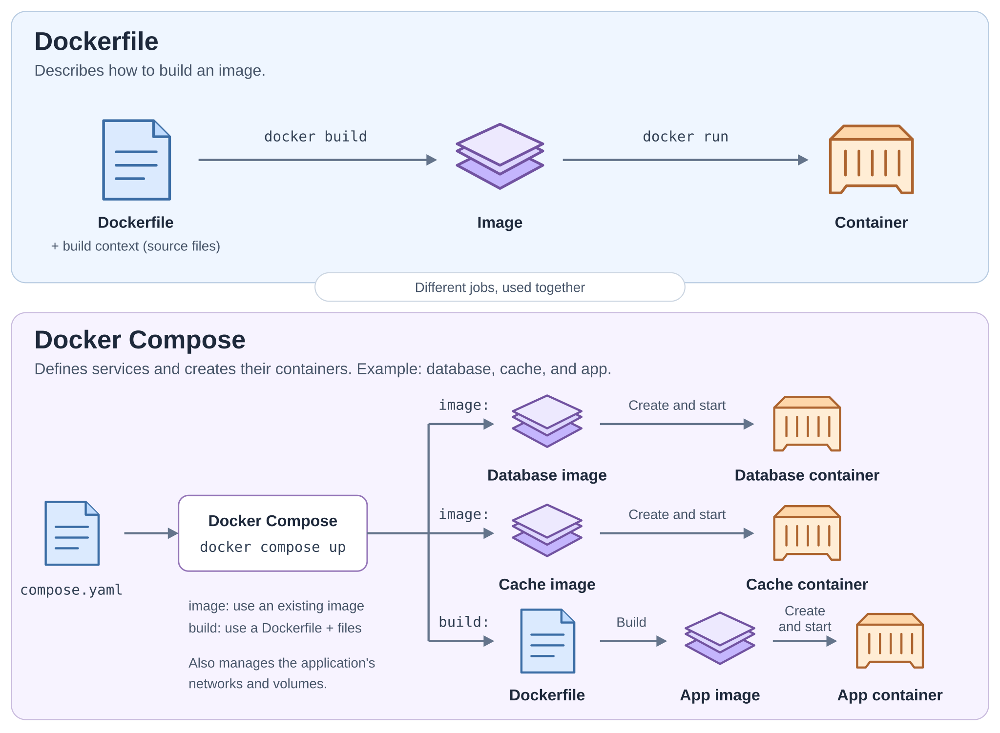
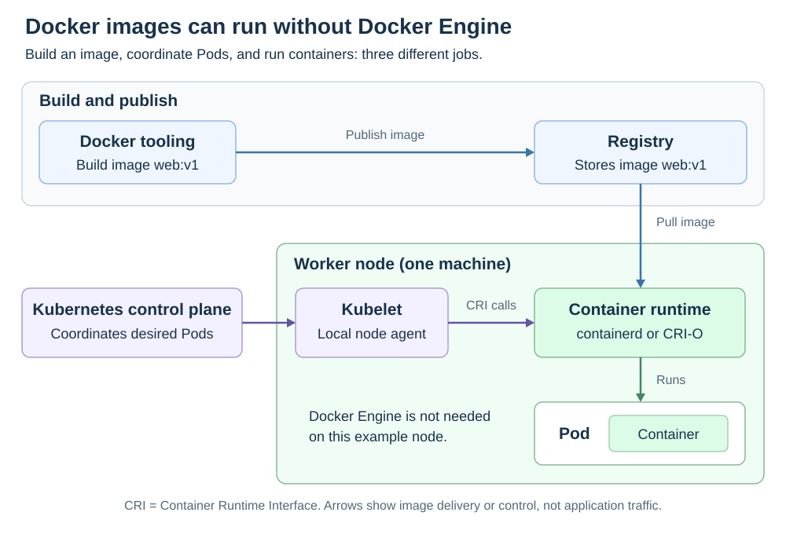

# Kubernetes and Docker

[Back to Kubernetes](../Readme.md#content)

**Docker provides tools to build, share, and run containers.**

**Kubernetes is a cluster orchestration system**.

## What is Docker?

Docker is a containerization platform that solves the **it works on my machine** problem.

Definitions:
* An **image** is a packaged application with its dependencies and startup instructions.
* A **container** is an instance created from an image.
* A **registry** stores images for other machines to download.

It builds images, runs containers, and primarily runs them on a single host (without `Docker Swarm`). Applications are packaged with everything they need and run as lightweight, isolated containers. The focus is on running software consistently with simple primitives like images and containers. A continuous integration (CI) pipeline can build an image and push it to a registry..

A Dockerfile describes an image build; Compose defines services that use existing or built images.

### Connection between Docker and Kubernetes

**Docker Engine** runs and manages containers on a host through its background service, `dockerd`. It uses **containerd** to manage their lifecycle.

**containerd can also run independently of Docker Engine**, including as a Kubernetes node's runtime.

## Orchestration and container runtimes

Kubernetes groups containers into **Pods** and assigns Pods to **nodes** (physical or virtual machines).

| Part | Responsibility |
| --- | --- |
| **Kubernetes orchestration** | Coordinates where Pods run, how many copies should exist, updates, and recovery. Controllers repeatedly work toward the desired state. |
| **Kubelet** | The agent on each node that asks its runtime to run the containers for assigned Pods. |
| **Container runtime**, such as containerd or CRI-O | Pulls images and manages starting, stopping, and inspecting containers on that node. |

The kubelet talks to the runtime through the **Container Runtime Interface (CRI)**, a standard interface for runtime operations. **Orchestration depends on runtimes to execute its decisions; a runtime alone does not coordinate an application across the cluster.**

## Recommended workflow and where Docker fits

**For a web application with interchangeable copies, use a Deployment to create and manage Pods.** Its Pod template describes the containers to run. It replaces missing Pods and supports controlled updates.

1. **Build an image** using Docker (`Dockerfile` and `docker build`) or another compatible builder. You build the image; Kubernetes creates the Pods.
2. **Push the image to a registry**, for example with `docker push`, so cluster nodes can download it.
3. **Write a Deployment YAML file** specifying the image, application configuration, and desired number of Pod copies.
4. **Apply it** with `kubectl apply -f deployment.yaml`. Kubernetes assigns the resulting Pods to nodes; kubelet asks the node's runtime to start their containers.

Docker is useful for **building and local testing**. During **deployment and execution**, a runtime such as containerd can run the image without Docker Engine. Prefer a Deployment over standalone Pods for this kind of application.

The diagram separates the image's path from Kubernetes' control path. The runtime receives the image from the registry and instructions from kubelet.

### Why older diagrams show Docker on every node

Kubernetes removed **dockershim**, its built-in adapter for Docker Engine, in **v1.24**. Docker Engine does not implement CRI itself; using it as a Kubernetes runtime requires an adapter such as **cri-dockerd**.

**Docker-built images still work with compatible runtimes such as containerd and CRI-O.** Removing the adapter did not remove support for those images.

# Sources

- [Docker — Compose application model](https://docs.docker.com/compose/intro/compose-application-model/)
- [Docker — Platform, Engine, images, containers, and registries](https://docs.docker.com/get-started/docker-overview/)
- [Docker — containerd in Docker Engine](https://docs.docker.com/engine/storage/containerd/)
- [Docker — Build and publish an image](https://docs.docker.com/get-started/docker-concepts/building-images/build-tag-and-publish-an-image/)
- [Kubernetes — Deployments and Pod templates](https://kubernetes.io/docs/concepts/workloads/controllers/deployment/)
- [Kubernetes — Controllers and orchestration](https://kubernetes.io/docs/concepts/architecture/controller/)
- [Kubernetes — Container Runtime Interface](https://kubernetes.io/docs/concepts/containers/cri/)
- [Kubernetes — Node runtimes and Docker Engine adapters](https://kubernetes.io/docs/setup/production-environment/container-runtimes/)
- [Kubernetes — Dockershim removal and image compatibility](https://kubernetes.io/blog/2022/02/17/dockershim-faq/)
