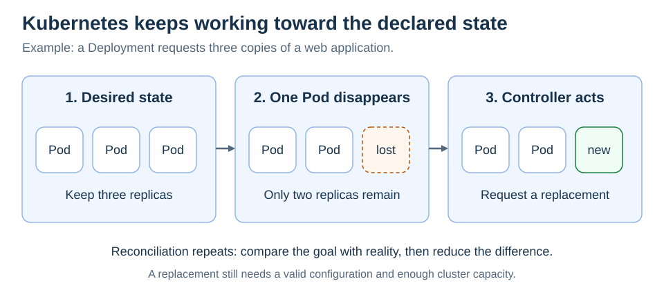

# What problem does Kubernetes solve?

[Back to Kubernetes](../Readme.md#content)

# Front

What problem does Kubernetes solve when running containerized applications?

# Back

**Kubernetes automates running containerized applications across a cluster of machines.** You declare the state you want; its controllers continually work to make the actual state match. This coordination is called **container orchestration**.

## Declare a goal, then reconcile

* A **container** runs an application with its dependencies.
* A **Pod** groups one or more containers that run together.
* A **node** is a machine that runs Pods.
* A **cluster** combines nodes with components that manage them.

For example, a Deployment can request three interchangeable copies of a web application. If one Pod disappears, its controller requests a replacement. **Reconciliation** means repeatedly comparing what exists with what was requested and acting on the difference.

Read left to right: the desired count stays three while Kubernetes repairs the missing copy.

## What this gives you

Kubernetes provides scheduling, controlled application updates, service discovery, and mechanisms for scaling and recovery. You still supply the application, container images, configuration, and suitable infrastructure.

### Important limit

**Recovery is not instant or guaranteed to fix the application.** A replacement may wait for capacity or fail because of a bad image or configuration. Restarting a process does not repair a software bug or restore lost application data. Kubernetes keeps trying to satisfy the declared goal; you must make that goal achievable.

# Sources

- [Kubernetes — Overview](https://kubernetes.io/docs/concepts/overview/)
- [Kubernetes — Controllers and reconciliation](https://kubernetes.io/docs/concepts/architecture/controller/)
- [Kubernetes — Self-healing and its limits](https://kubernetes.io/docs/concepts/architecture/self-healing/)
