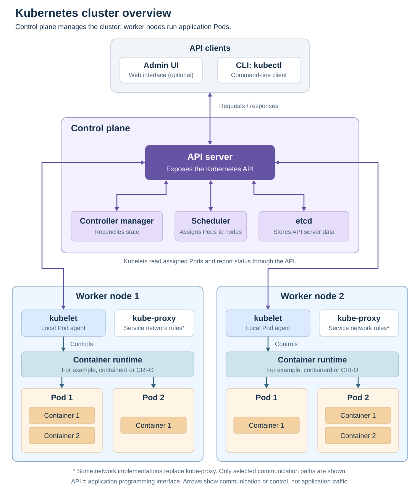

# Kubernetes

[Back to Kubernetes](../Readme.md#content)

**Kubernetes is an open-source platform that automates running, scaling, and updating containerized applications.** Its central idea is simple: describe what you want, and Kubernetes continually works to maintain it.

Three terms help explain this:

- A **container** runs an application with its dependencies.
- A **Pod** groups one or more containers that run together on the same machine.
- A **node** is a physical or virtual machine in the cluster.

## 1. Orchestration

**Container orchestration** means automating the coordination of containers: where they run, how many copies are needed, how they are updated, and how failures are handled.

In Kubernetes, you declare a **desired state**, such as “run three copies of my web application.” **Controllers** are processes that repeatedly compare the actual state with that goal and request changes. This ongoing correction is called **reconciliation**.

For example, a **Deployment** manages interchangeable copies of an application. If it requests three Pods and one disappears, Kubernetes requests a replacement. The new Pod still needs a suitable node and a working application image.

Read left to right: the desired count stays three while Kubernetes works to replace the missing copy. These checks continue after the application starts.

## 2. Cluster in Kubernetes

A **Kubernetes cluster** is a system made up of a control plane and one or more worker nodes:

- The **control plane** manages cluster state and decides where Pods should run.
- **Worker nodes** provide the resources that run application Pods and their containers.

The diagram places the control plane above two example worker nodes. Inside each worker, the Pod boxes contain application containers. Arrows show communication or control.

For the individual components, see [Cluster components](../Cluster%20components/Readme.md).

## 3. Features of Kubernetes

| Feature | What it does |
| --- | --- |
| **Scheduling** | Assigns Pods to suitable nodes using resource needs and placement rules. |
| **Self-healing** | Restarts failed containers according to policy and replaces missing Pods managed by controllers. |
| **Scaling** | Changes the number of application copies manually or through a configured autoscaler. |
| **Rollouts and rollbacks** | Updates applications gradually and lets you return a Deployment to an earlier revision. |
| **Service discovery and load balancing** | Gives applications stable network endpoints and distributes traffic across available Pods. |
| **Storage orchestration** | Makes configured storage available to applications. |
| **Configuration and Secrets** | Supplies settings and sensitive values separately from application images. |

Automatic scaling needs an autoscaler and suitable metrics, such as processor usage; it is not enabled for every application by default.

### Important limit

**Kubernetes automates operations, but it does not fix application bugs.** You still provide application images, configuration, and suitable infrastructure. Recovery can be delayed by missing capacity or a bad image, and restarting a container does not restore lost data.

# Sources

- [Kubernetes — Overview](https://kubernetes.io/docs/concepts/overview/)
- [Kubernetes — Cluster components](https://kubernetes.io/docs/concepts/overview/components/)
- [Kubernetes — Pods](https://kubernetes.io/docs/concepts/workloads/pods/)
- [Kubernetes — Nodes](https://kubernetes.io/docs/concepts/architecture/nodes/)
- [Kubernetes — Controllers and reconciliation](https://kubernetes.io/docs/concepts/architecture/controller/)
- [Kubernetes — Self-healing and its limits](https://kubernetes.io/docs/concepts/architecture/self-healing/)
- [Kubernetes — Horizontal Pod autoscaling](https://kubernetes.io/docs/concepts/workloads/autoscaling/horizontal-pod-autoscale/)
- [Kubernetes — Deployment updates and rollbacks](https://kubernetes.io/docs/concepts/workloads/controllers/deployment/)
