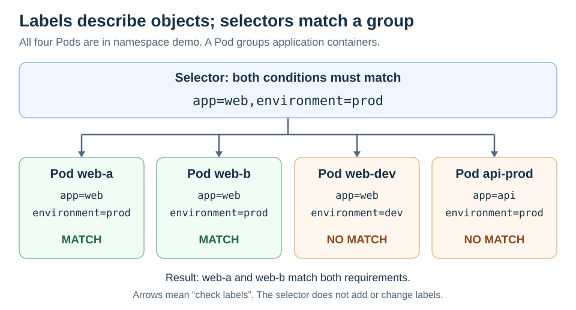

# Labels and Selectors

<sub>[Back to Kubernetes](../Readme.md#content)</sub>

# Front

How do labels and label selectors work together to group Kubernetes objects?

# Back

**Labels are key-value tags on Kubernetes objects; label selectors are rules that find objects with matching tags.** Many objects can share the same labels, so a selector can identify a group.

## Attach labels to an object

A **Pod** groups one or more containers. This fragment gives a Pod two labels under `metadata.labels`:

```yaml
metadata:
  name: web-a
  labels:
    app: web
    environment: prod
```

`app` is a label key and `web` is its value. Each key can appear only once on that object; other Pods can use the same key and value.

## Select the matching group

The selector `app=web,environment=prod` requires **both** conditions. Commas between requirements mean logical **AND**: every requirement must match.

Follow the arrows to check four Pods in the `demo` namespace, a named scope within the cluster. Only `web-a` and `web-b` have both required labels.



With `kubectl`, the Kubernetes command-line client, list those Pods and display their labels:

```bash
kubectl get pods -n demo -l 'app=web,environment=prod' --show-labels
```

`-l` supplies the label selector; `-n demo` selects the namespace. The selector filters existing labels; it does not add or change them.

## Common selector expressions

These expressions work with `kubectl -l`:

| Expression | Matches |
| --- | --- |
| `app=web` | `app` equals `web`. |
| `environment in (prod,qa)` | The value is either `prod` or `qa`. |
| `environment` | The key exists, with any value. |
| `!environment` | The key is absent. |
| `environment!=prod` | A different value **or a missing key**. |

To require a present, non-production value, use `environment,environment!=prod`.

## Why applications depend on selectors

- A **Service** provides network access to backends. Its `.spec.selector` can select Pods by their labels as those Pods are replaced. This field is an equality map such as `app: web`; it does not accept `matchExpressions`.
- A **Deployment** manages application replicas and updates through ReplicaSets. Its `.spec.selector` supports `matchLabels` and `matchExpressions`. The labels in `.spec.template.metadata.labels`, which go on new Pods, must satisfy that selector.

### Label the right object

A Deployment's own `metadata.labels` label the Deployment. To label its Pods, use the Pod template's `metadata.labels`. A Service selecting Pods checks **Pod labels**, not the Deployment's name or labels.

# Sources

- [Kubernetes — Labels, selector syntax, and matching rules](https://kubernetes.io/docs/concepts/overview/working-with-objects/labels/)
- [Kubernetes — kubectl get, namespace selection, and label filters](https://kubernetes.io/docs/reference/kubectl/generated/kubectl_get/)
- [Kubernetes — Services and selecting backend Pods](https://kubernetes.io/docs/concepts/services-networking/service/)
- [Kubernetes — Deployment selectors and Pod-template labels](https://kubernetes.io/docs/concepts/workloads/controllers/deployment/)
