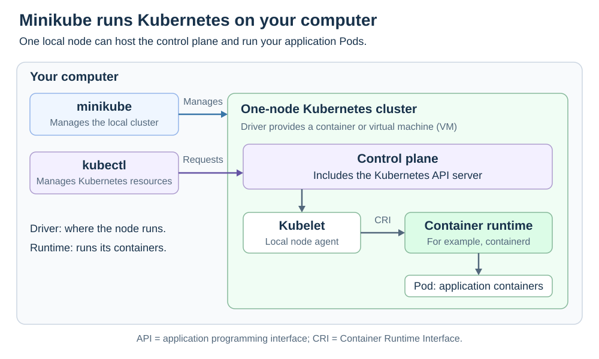

# Minikube

<sub>[Back to Kubernetes](../Readme.md#content)</sub>

# Front

What does Minikube do, and how do its driver, container runtime, and kubectl fit together?

# Back

**Minikube creates and manages a local Kubernetes cluster for learning, development, and testing.** It runs real Kubernetes on your computer, so you can practise deploying applications without first setting up a remote cluster.

A **node** is a machine environment that runs Kubernetes components. The **control plane** manages the cluster; **Pods** group application containers. By default, Minikube starts one node that hosts the control plane and can run your application Pods. It also supports multiple nodes.

## How the pieces fit

| Part | Role |
| --- | --- |
| **minikube** | Creates, starts, stops, and deletes the local cluster. |
| **Driver** | Provides the node environment, such as a Docker container or a virtual machine. Available drivers depend on your operating system. |
| **Container runtime** | Runs application containers inside the node, for example containerd. |
| **kubectl** | Sends requests to the Kubernetes application programming interface (API) to create and inspect resources. |

**The driver and container runtime are separate choices.** For example, the Docker driver can host a node that uses containerd to run its application containers. Choosing the Docker driver does not mean Kubernetes must use Docker Engine as its runtime.

The diagram shows the default one-node arrangement. Minikube manages the cluster's lifecycle; kubectl talks to its API. The node also runs kubelet, its local agent, and a container runtime.



## Basic commands

After installing Minikube and a supported container or virtual-machine environment:

```bash
# Create or restart the local cluster
minikube start

# Check the local cluster's status
minikube status

# Inspect its Kubernetes nodes
minikube kubectl -- get nodes

# Stop the cluster while preserving its data
minikube stop
```

`minikube kubectl -- ...` downloads and runs a kubectl version matching the cluster when needed. You can also use a separately installed `kubectl` configured for that cluster.

Run `minikube start` again to resume. **`minikube delete` removes the local cluster and its associated files**, rather than merely stopping it.

### Scope

Minikube is intended for local learning and development, not production hosting. It uses your computer's resources, so it cannot reproduce every networking, storage, or failure condition of a production cluster.

# Sources

- [Minikube — Getting started](https://minikube.sigs.k8s.io/docs/start/)
- [Minikube — Drivers](https://minikube.sigs.k8s.io/docs/drivers/)
- [Minikube — Container runtimes](https://minikube.sigs.k8s.io/docs/runtimes/)
- [Minikube — Multiple nodes](https://minikube.sigs.k8s.io/docs/tutorials/multi_node/)
- [Minikube — kubectl command](https://minikube.sigs.k8s.io/docs/commands/kubectl/)
- [Minikube — Stop](https://minikube.sigs.k8s.io/docs/commands/stop/)
- [Minikube — Delete](https://minikube.sigs.k8s.io/docs/commands/delete/)
- [Minikube — Intended use and FAQ](https://minikube.sigs.k8s.io/docs/faq/)
