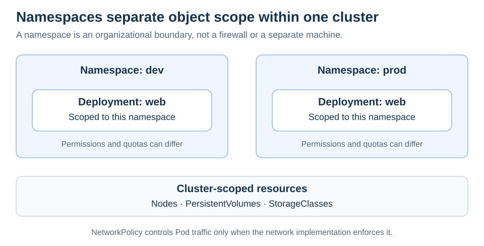

# Namespaces

<sub>[Back to Kubernetes](../Readme.md#content)</sub>

# Front

What does a Kubernetes Namespace isolate, and what does it leave shared?

# Back

**A Namespace scopes the names and organization of namespaced resources inside one cluster.** It gives teams or environments separate places for objects, but does not by itself provide network isolation or a separate cluster.

## Same name, different scope

A Deployment called `web` can exist in both `dev` and `prod`. Names must be unique for a resource type within its namespace. Commands can select the namespace explicitly:

```bash
kubectl get deployments -n dev
kubectl get deployments -n prod
```

In the diagram, the two `web` Deployments are distinct objects. The cluster's nodes remain shared infrastructure.



## Add the controls you need

| Requirement | Mechanism |
| --- | --- |
| Limit who can read or change objects | Role-based access control (**RBAC**) |
| Bound aggregate resource consumption | `ResourceQuota` |
| Restrict traffic to or from Pods | `NetworkPolicy`, enforced by a compatible network implementation |

### Important limits

Nodes, PersistentVolumes, and StorageClasses are **cluster-scoped**; they do not belong to a namespace. Namespaces also do not reserve separate physical machines.

Without applicable NetworkPolicies, namespace membership alone does not block Pod communication. RBAC controls API permissions, not application network traffic. Use the controls together instead of treating the namespace name as a security boundary.

# Sources

- [Kubernetes — Namespaces and cluster-scoped resources](https://kubernetes.io/docs/concepts/overview/working-with-objects/namespaces/)
- [Kubernetes — Resource quotas](https://kubernetes.io/docs/concepts/policy/resource-quotas/)
- [Kubernetes — Network policies and default behavior](https://kubernetes.io/docs/concepts/services-networking/network-policies/)
- [Kubernetes — Using RBAC authorization](https://kubernetes.io/docs/reference/access-authn-authz/rbac/)
