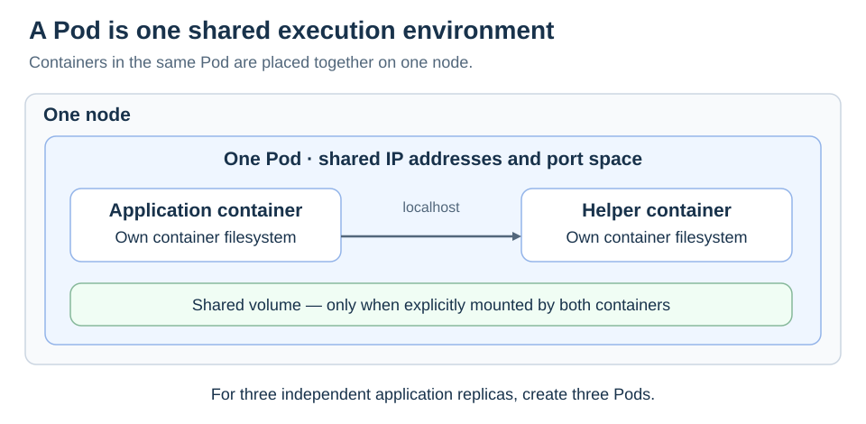

# Pods

[Back to Kubernetes](../Readme.md#content)

# Front

What is a Pod, and what do containers inside the same Pod share?

# Back

**A Pod is Kubernetes' smallest deployable unit: one or more closely cooperating containers scheduled together on one node.** A single application container per Pod is common.

## One shared network, optional shared volumes

Containers in a Pod share its network namespace: Internet Protocol (**IP**) addresses and port space. They can reach each other through `localhost`, so two containers cannot independently bind the same address and port. A Pod can also define volumes that multiple containers mount.

The two containers below run on the same node. They share a network and the explicitly mounted volume; each still has its own container filesystem.

## Scale Pods, not containers inside a Pod

To run three independent copies of a web application, normally use three Pods managed by a Deployment. Putting three web containers into one Pod couples their placement and lifecycle instead of creating independently managed replicas.

### A replacement is a new Pod

A container can restart inside an existing Pod. If the Pod itself is deleted or lost, a workload controller can create a **new Pod**, potentially on another node and with different IP addresses. A Pod does not migrate between nodes. A standalone Pod has no workload controller to replace it automatically.

# Sources

- [Kubernetes — Pods and shared resources](https://kubernetes.io/docs/concepts/workloads/pods/)
- [Kubernetes — Pod lifecycle and replacement](https://kubernetes.io/docs/concepts/workloads/pods/pod-lifecycle/)
