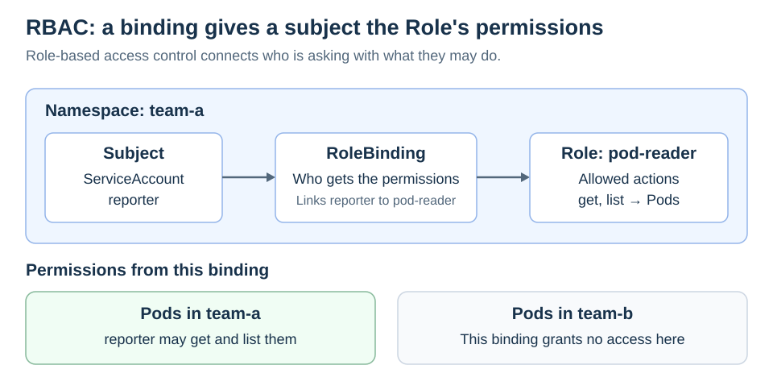

# Role-Based Access Control (RBAC)

<sub>[Back to Kubernetes](../Readme.md#content)</sub>

# Front

How do roles and bindings control access to Kubernetes resources?

# Back

**Role-Based Access Control (RBAC) grants identities permission to perform specific actions on Kubernetes resources.** Authentication establishes who is calling; authorization decides what that identity may do.

## Rules describe what; bindings say who

A **subject** is a user, group, or ServiceAccount (an identity for a workload). A **namespace** groups resources within a cluster.

| Object | Purpose |
| --- | --- |
| `Role` | Defines allowed actions on resources in one namespace. |
| `ClusterRole` | Defines reusable rules, including rules for cluster-scoped resources. |
| `RoleBinding` | Grants a Role or ClusterRole to subjects within the binding's namespace. |
| `ClusterRoleBinding` | Grants a ClusterRole to subjects across the cluster. |

The example grants `reporter` permission to get and list Pods in `team-a`. This binding grants nothing in `team-b`.



**A ClusterRole alone grants no access.** A RoleBinding referencing it still grants access only within that namespace.

## Check access

Check whether your current identity can list Pods in `team-a`:

```bash
kubectl auth can-i list pods -n team-a
```

### Permissions add up

RBAC has **no deny rules**. Permissions from applicable bindings accumulate; a narrow role cannot cancel a broader grant. Grant only the actions and scope the workload needs.

# Sources

- [Kubernetes — RBAC roles, bindings, and additive permissions](https://kubernetes.io/docs/reference/access-authn-authz/rbac/)
- [Kubernetes — Authentication and authorization](https://kubernetes.io/docs/reference/access-authn-authz/authorization/)
- [Kubernetes — Check access with kubectl auth can-i](https://kubernetes.io/docs/reference/kubectl/generated/kubectl_auth/kubectl_auth_can-i/)
- [Kubernetes — ServiceAccounts](https://kubernetes.io/docs/concepts/security/service-accounts/)
- [Kubernetes — RBAC good practices](https://kubernetes.io/docs/concepts/security/rbac-good-practices/)
