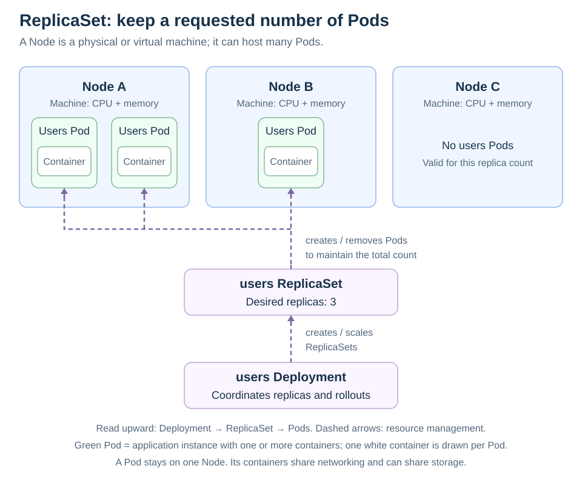

# ReplicaSets

[Back to Kubernetes](../Readme.md#content)

# Back

A **ReplicaSet**'s purpose is to maintain a stable set of replica Pods running at any given time. Usually, you define a Deployment and let that Deployment manage ReplicaSets automatically.

## Count across the cluster

A ReplicaSet uses three main fields:

- `.spec.replicas`: the desired count.
- `.spec.selector`: a rule matching Pod labels (key/value metadata), such as `app: users`.
- `.spec.template`: the blueprint for new Pods, with labels matching the selector.

Follow the dashed arrows upward. The ReplicaSet maintains three users Pods in total. The illustrated placement has two on Node A, one on Node B, and none on Node C; **three replicas does not mean one per node**. A node is a machine that runs Pods. The scheduler chooses placement based on constraints and available resources.

If one managed Pod is deleted, the controller creates a replacement from the template. Creation alone does not guarantee that the replacement can be scheduled or become ready.

## Let a Deployment handle updates

A [Deployment](../Deployments/Readme.md) manages ReplicaSets and coordinates rolling updates between Pod templates. A ReplicaSet itself does not roll out a changed template to existing Pods. Normally, configure the Deployment and let it manage its ReplicaSets.

For one agent Pod on **each eligible node**, use a [DaemonSet](../DaemonSets/Readme.md).

# Sources

- [Kubernetes — ReplicaSet fields, reconciliation, and update limitations](https://kubernetes.io/docs/concepts/workloads/controllers/replicaset/)
- [Kubernetes — Deployments and ReplicaSet management](https://kubernetes.io/docs/concepts/workloads/controllers/deployment/)
- [Kubernetes — Scheduler and Pod placement](https://kubernetes.io/docs/concepts/scheduling-eviction/kube-scheduler/)
- [Kubernetes — Pods](https://kubernetes.io/docs/concepts/workloads/pods/)
- [Kubernetes — DaemonSets](https://kubernetes.io/docs/concepts/workloads/controllers/daemonset/)
