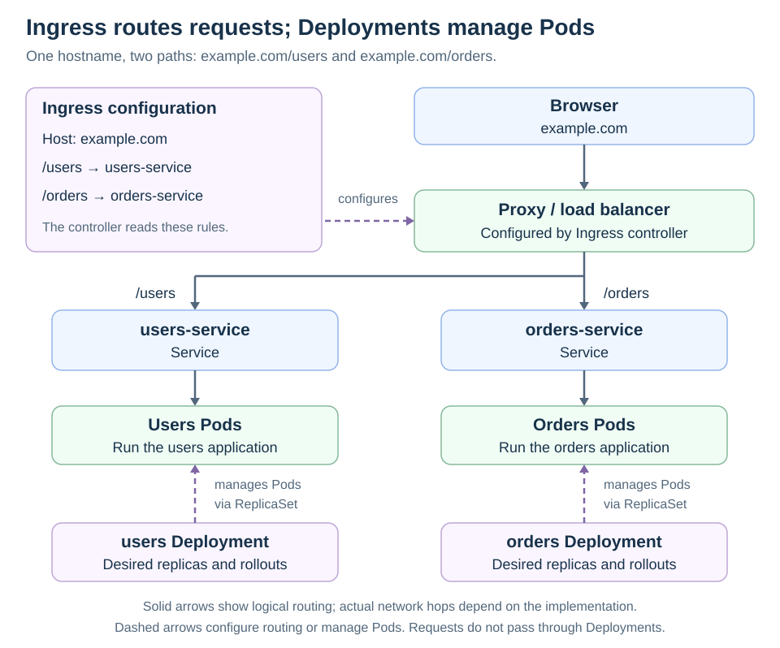

# Services

[Back to Kubernetes](../Readme.md#content)

# Front

How does a Kubernetes Service provide access to Pods when their addresses change?

# Back

**A Service gives clients a stable way to reach a changing set of backends.** A typical Service has a virtual Internet Protocol (**IP**) address and a Domain Name System (**DNS**) name, while its selected Pods may be replaced.

## Selection connects the pieces

A **label** is an object's key-value tag. A Service's **selector** matches Pod labels, such as `app: web`. Kubernetes maintains **EndpointSlices**, objects describing the matching backend addresses and readiness. The cluster's networking implementation uses them to forward Service traffic.

Read left to right: clients use the Service identity; backend membership follows labels and readiness. The Service does not create or restart Pods.

## Choose the exposure

| Service type | What it provides |
| --- | --- |
| `ClusterIP` | A cluster-internal virtual IP; the default type. |
| `NodePort` | Access through a port on node addresses, subject to network reachability. |
| `LoadBalancer` | Requests an external load balancer from a supporting implementation. |
| `ExternalName` | A DNS alias for another name; no Service proxying. |

### Exceptions matter

A **headless Service**, configured with `clusterIP: None`, has no virtual IP. With selectors, DNS can return Pod addresses directly. Services may also omit selectors and use separately managed EndpointSlices for other backends.

The normal readiness-based routing rule has exceptions, including `publishNotReadyAddresses`. Readiness is routing information, not a firewall.

# Sources

- [Kubernetes — Service types, selectors, and headless Services](https://kubernetes.io/docs/concepts/services-networking/service/)
- [Kubernetes — EndpointSlices and endpoint conditions](https://kubernetes.io/docs/concepts/services-networking/endpoint-slices/)
