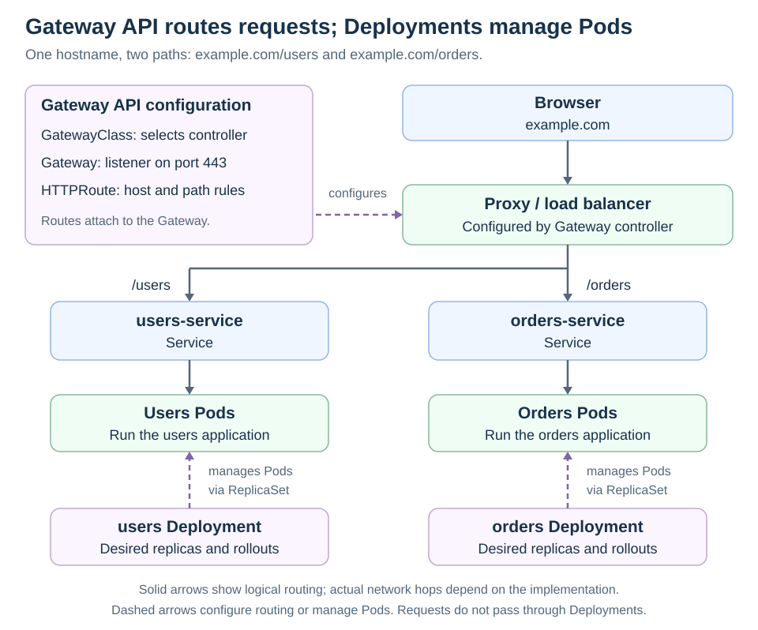

# Services

[Back to Kubernetes](../Readme.md#content)

# Front

How does a Kubernetes Service provide access to Pods when their addresses change?

# Back

**A Service gives clients a stable way to reach a changing set of backends.** A typical Service has a virtual Internet Protocol (**IP**) address and a Domain Name System (**DNS**) name, while its selected Pods may be replaced.

## Selection connects the pieces

A **label** is an object's key-value tag. A Service's **selector** matches Pod labels, such as `app: web`. Kubernetes maintains **EndpointSlices**, objects describing the matching backend addresses and readiness. The cluster's networking implementation uses them to forward Service traffic.

Read top to bottom: an **Ingress** defines web routing rules, implemented by an **Ingress controller** through a proxy or load balancer. Here, `/users` selects `users-service` and `/orders` selects `orders-service`; each Service identifies its application's Pods. This is a logical routing flow; the exact network hops depend on the controller. The Service does not create or restart Pods.

Each example application has a **Deployment** that controls replicas and updates through **ReplicaSets** that maintain its Pods. Solid arrows show request routing; dashed arrows show configuration or Pod management. Requests do not pass through Deployments.

## With Gateway API

**Gateway API** can provide the entry point instead of Ingress. `GatewayClass` selects a controller implementation, `Gateway` defines the listener, and an attached `HTTPRoute` maps hosts and paths to Services. Here, HTTPS arrives on port 443. The Services still identify their backend Pods, and Deployments still manage those Pods through ReplicaSets.

Gateway API requires its **Custom Resource Definitions (CRDs)** and a compatible controller to configure the proxy or load balancer.

## Choose the exposure

| Service type | What it provides |
| --- | --- |
| `ClusterIP` | A cluster-internal virtual IP; the default type. |
| `NodePort` | Access through a port on node addresses, subject to network reachability. |
| `LoadBalancer` | Requests an external load balancer from a supporting implementation. |
| `ExternalName` | A DNS alias for another name; no Service proxying. |

### Exceptions matter

A **headless Service**, configured with `clusterIP: None`, has no virtual IP. With selectors, DNS can return Pod addresses directly. Services may also omit selectors and use separately managed EndpointSlices for other backends.

The normal readiness-based routing rule has exceptions, including `publishNotReadyAddresses`. Readiness is routing information, not a firewall.

# Sources

- [Kubernetes — Service types, selectors, and headless Services](https://kubernetes.io/docs/concepts/services-networking/service/)
- [Kubernetes — EndpointSlices and endpoint conditions](https://kubernetes.io/docs/concepts/services-networking/endpoint-slices/)
- [Kubernetes — Ingress routing rules and controllers](https://kubernetes.io/docs/concepts/services-networking/ingress/)
- [Kubernetes — Gateway API](https://kubernetes.io/docs/concepts/services-networking/gateway/)
- [Kubernetes — Deployments and their ReplicaSets](https://kubernetes.io/docs/concepts/workloads/controllers/deployment/)
