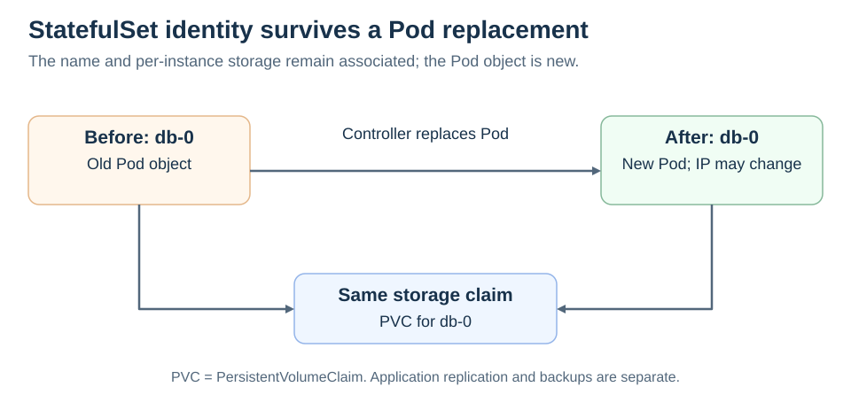

# StatefulSets

[Back to Kubernetes](../Readme.md#content)

A **StatefulSet** runs a group of Pods, and maintains a sticky identity for each of those Pods. This is useful for managing applications that need persistent storage or a stable, unique network identity.

`StatefulSet` is the workload API object used to manage stateful applications.

Manages the deployment and scaling of a set of Pods, and provides guarantees about the ordering and uniqueness of these Pods.

Like a `Deployment`, a `StatefulSet` manages Pods that are based on an identical container spec. Unlike a `Deployment`, a `StatefulSet` maintains a sticky identity for each of its Pods. These pods are created from the same spec, but are not interchangeable: each has a persistent identifier that it maintains across any rescheduling.

If you want to use storage volumes to provide persistence for your workload, you can use a `StatefulSet` as part of the solution. Although individual Pods in a `StatefulSet` are susceptible to failure, the persistent Pod identifiers make it easier to match existing volumes to the new Pods that replace any that have failed.

## Using StatefulSets
StatefulSets are valuable for applications that require one or more of the following:

* Stable, unique network identifiers.
* Stable, persistent storage.
* Ordered, graceful deployment and scaling.
* Ordered, automated rolling updates.

In the above, stable is synonymous with persistence across Pod (re)scheduling. If an application doesn't require any stable identifiers or ordered deployment, deletion, or scaling, you should deploy your application using a workload object that provides a set of stateless replicas. `Deployment` or `ReplicaSet` may be better suited to your stateless needs.

**Choose a StatefulSet when individual application instances need stable identities or stable per-instance storage.** A `Deployment` is usually simpler when replicas are interchangeable.

## Identity survives replacement

`StatefulSet` Pods have an ordinal identity, such as `db-0` and `db-1`. With a governing headless Service, they have stable network names. Their Internet Protocol (**IP**) addresses can still change.

For storage, a `volumeClaimTemplates` entry creates a **PersistentVolumeClaim (PVC)** for each Pod. A PVC requests storage backed by a **PersistentVolume (PV)**. A replacement for `db-0` can use `db-0`'s existing claim and data instead of becoming an unrelated database instance.

Read across the top: the Pod is replaced, while the identity and storage claim stay associated.

## Ordering and responsibility

By default, `StatefulSets` create and scale Pods in ordinal order and wait for predecessors to be ready. `podManagementPolicy: Parallel` changes scaling behavior; it does not change rolling-update behavior.

### Important limits

- Stable identity does **not** configure database replication, leader election, or backups. The application or an operator must handle those.
- Claims are retained by default when the StatefulSet is deleted or scaled down. A configured PVC retention policy can change that behavior. The PV's reclaim policy also affects what happens to the underlying storage after a claim is deleted.
- A stable network name is not a promise of uninterrupted availability.

# Sources

- [Kubernetes — StatefulSets, identity, ordering, and PVC retention](https://kubernetes.io/docs/concepts/workloads/controllers/statefulset/)
- [Kubernetes — PersistentVolumes, claims, and reclaim policies](https://kubernetes.io/docs/concepts/storage/persistent-volumes/)
