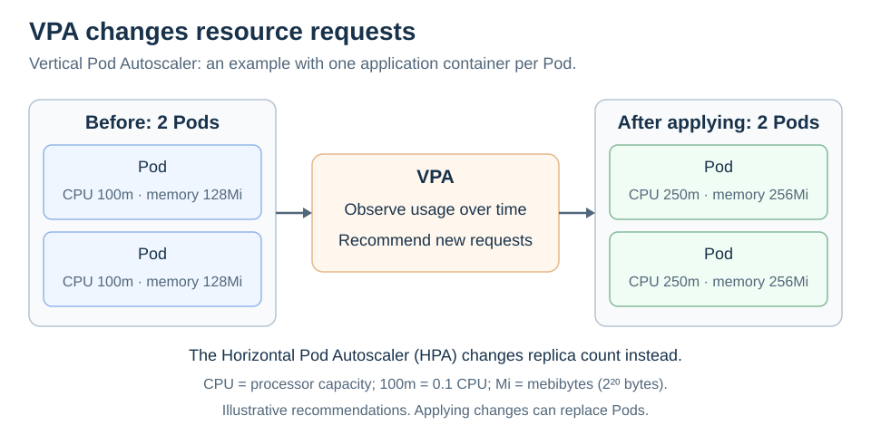

# VPA

[Back to Kubernetes](../Readme.md#content)

# Front

How does the Vertical Pod Autoscaler (VPA) size containers compared with the Horizontal Pod Autoscaler (HPA)?

# Back

**The Vertical Pod Autoscaler (VPA) recommends and can adjust container requests for central processing unit (CPU) capacity and memory based on observed usage.** It is a separately installed Kubernetes add-on that helps match resource settings to an application's needs.

## What changes?

A **Pod** groups one or more containers. A **request** states the capacity Kubernetes uses when deciding where a Pod can fit. A **limit** constrains a container's runtime resource use.

VPA changes resource settings for containers in the targeted workload. The **Horizontal Pod Autoscaler (HPA)** changes the workload's desired number of Pod replicas. Neither mechanism directly adds cluster nodes.

Read left to right: these two Pods each contain one application container. In this illustrative increase, each container's requests change from `100m` CPU and `128Mi` memory to `250m` and `256Mi`; the desired replica count stays two. VPA can recommend decreases too.

`100m` means 0.1 CPU; `Mi` means mebibytes, or units of 2²⁰ bytes. These values are examples, not a fixed VPA scaling formula.

## From measurements to changes

VPA needs usage metrics, commonly supplied by **Metrics Server**. Its components divide the work:

1. The **recommender** analyzes current and historical usage and records recommended requests in the VPA object's status.
2. The **updater** decides whether existing Pods need changes and applies the configured update policy.
3. The **admission controller** sets resource values when matching Pods are created, including replacements.

By default, VPA can scale existing limits proportionally with requests. A container policy using `controlledValues: RequestsOnly` keeps limits unchanged.

## Recommendation does not always mean resizing

Set `spec.updatePolicy.updateMode` explicitly:

| Mode | Behavior |
| --- | --- |
| `Off` | Produce recommendations without changing Pod resources. |
| `Initial` | Apply recommendations when Pods are created. |
| `Recreate` | Also allow eviction of existing Pods so their workload controller creates replacements with new resource settings. |
| `InPlaceOrRecreate` | Try resizing existing Pods; fall back to replacement when needed. Requires supported and enabled in-place scaling. |

### Important limits

Applying recommendations can disrupt an application, and larger requests still need available node capacity. In-place behavior depends on the installed VPA and Kubernetes versions and settings.

Avoid having VPA change the same CPU or memory requests used by HPA's utilization target: utilization is usage divided by request, so VPA can change HPA's scaling signal. Use separate resource metrics or an appropriate custom/external HPA metric when combining them.

# Sources

- [Kubernetes — Vertical Pod Autoscaling and installation requirements](https://kubernetes.io/docs/concepts/workloads/autoscaling/vertical-pod-autoscale/)
- [Kubernetes — Resource requests, limits, CPU units, and memory units](https://kubernetes.io/docs/concepts/configuration/manage-resources-containers/)
- [Kubernetes Autoscaler — VPA components and recommendation flow](https://github.com/kubernetes/autoscaler/blob/master/vertical-pod-autoscaler/docs/components.md)
- [Kubernetes Autoscaler — VPA update modes and resource policies](https://github.com/kubernetes/autoscaler/blob/master/vertical-pod-autoscaler/docs/api.md)
- [Kubernetes Autoscaler — VPA limitations and combining it with HPA](https://github.com/kubernetes/autoscaler/blob/master/vertical-pod-autoscaler/docs/known-limitations.md)
- [Kubernetes — Horizontal Pod Autoscaling and utilization targets](https://kubernetes.io/docs/concepts/workloads/autoscaling/horizontal-pod-autoscale/)
