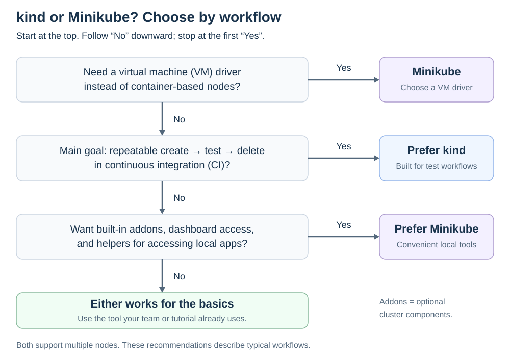

# kind vs Minikube

[Back to Kubernetes](../Readme.md#content)

# Front

How do kind and Minikube compare, and when should you choose each?

# Back

**As a rule of thumb, choose kind for disposable automated test clusters; choose Minikube for interactive learning with built-in helpers or a virtual-machine driver.** This recommendation follows their documented workflows; it is not a hard limit on either tool.

Both run real Kubernetes locally. A **node** is an environment that runs Kubernetes components. A **driver/provider** supplies that environment.

## Pros and cons

An **addon** is an optional cluster component. A **LoadBalancer Service** exposes an application through a load balancer; local clusters need tooling to supply that behavior.

| | kind | Minikube |
| --- | --- | --- |
| **Node environment** | Nodes are containers, hosted through Docker, Podman, or nerdctl. | Drivers support containers or virtual machines (VMs), depending on your operating system. |
| **Pros** | Create/delete commands suit repeatable tests. A configuration file defines multi-node layouts. Designed around Kubernetes testing and continuous integration (CI). | Built-in addon management and dashboard access. Commands help expose local apps. `stop` and `start` preserve and resume a cluster. VM drivers provide another hosting option. |
| **Cons** | Requires a compatible container environment. Accessing apps from your computer may need port mappings or extra tooling; LoadBalancer support uses a separate helper. | Setup and networking vary by driver and operating system. VM drivers need a VM manager. Some access helpers, such as `minikube tunnel`, must keep running. |

## How to choose

Read the diagram from top to bottom. Stop at the first matching need:

1. **Need a VM driver? → Minikube.** kind's nodes run as containers.
2. **Mainly creating, testing, and deleting clusters in CI? → Prefer kind.** Its test-oriented workflow fits that job.
3. **Want addons, a dashboard, and app-access helpers for local practice? → Prefer Minikube.** These conveniences reduce manual setup.
4. **Only learning the basics? → Either.** Follow your team's or tutorial's tool; if starting fresh and wanting helpers, use Minikube.

### Keep the comparison fair

**Both support multiple nodes; Minikube can also use containers.** Multi-node support alone does not decide the choice. Neither is intended for production hosting, and several local nodes still share your computer's resources.

# Sources

- [kind — Purpose and features](https://kind.sigs.k8s.io/)
- [kind — Node configuration and host access](https://kind.sigs.k8s.io/docs/user/configuration/)
- [kind — Local LoadBalancer support](https://kind.sigs.k8s.io/docs/user/loadbalancer/)
- [kind — Production is outside its intended scope](https://kind.sigs.k8s.io/docs/contributing/1.0-roadmap/)
- [Minikube — Getting started and developer tools](https://minikube.sigs.k8s.io/docs/start/)
- [Minikube — Accessing applications](https://minikube.sigs.k8s.io/docs/handbook/accessing/)
- [Minikube — Stop and resume](https://minikube.sigs.k8s.io/docs/commands/stop/)
- [Minikube — Multiple nodes](https://minikube.sigs.k8s.io/docs/tutorials/multi_node/)
