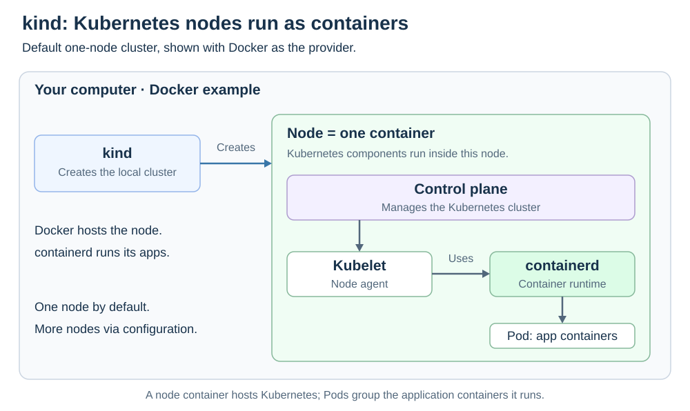

# kind

<sub>[Back to Kubernetes](../Readme.md#content)</sub>

# Front

What is kind, and how does it run Kubernetes locally?

# Back

**kind (Kubernetes IN Docker) creates local Kubernetes clusters whose nodes run as containers.** It runs real Kubernetes for learning, development, and automated tests, including continuous integration (CI).

## How it works

A **node** is an environment that runs Kubernetes components. A **Pod** groups one or more application containers.

- **Outside the node:** a container provider, such as Docker, hosts the node container. kind also supports Podman and nerdctl; their setup requirements differ.
- **Inside the node:** kubelet, the node agent, uses a container runtime to run application containers in Pods. Current kind node images use **containerd** for this runtime.

**The node container and the application containers are different layers.** Docker can host the node while containerd runs its workloads.

By default, kind creates one node that hosts the **control plane**, which manages the cluster, and can run application Pods. A configuration file can add worker nodes or more control-plane nodes.

The diagram shows the default arrangement with Docker as the provider. Everything inside the node box belongs to the same node container.



## Basic commands

With kind, kubectl, and a supported container provider installed and ready:

```bash
# Create a local cluster named study
kind create cluster --name study

# Inspect this cluster using its kubectl context
kubectl cluster-info --context kind-study
kubectl get nodes --context kind-study

# Delete the cluster when finished
kind delete cluster --name study
```

**kind manages the cluster's lifecycle; kubectl manages Kubernetes resources.** A kubectl *context* selects the cluster and access settings to use; kind creates one named `kind-study` for this example.

### Using an image you built locally

For a Docker image already built as `demo:dev`, load it into the named cluster:

```bash
kind load docker-image demo:dev --name study
```

Then reference `demo:dev` in your workload and set `imagePullPolicy: IfNotPresent` so Kubernetes can use the loaded image. Loading an image alone does not deploy an application.

### Scope

kind is intended for local development and testing, not production hosting. Multiple nodes on one computer still share its resources; they do not provide the capacity or fault isolation of separate machines.

# Sources

- [kind — Quick Start](https://kind.sigs.k8s.io/docs/user/quick-start/)
- [kind — Cluster configuration](https://kind.sigs.k8s.io/docs/user/configuration/)
- [kind — Node image contract](https://kind.sigs.k8s.io/docs/design/node-image/)
- [kind — Node runtime configuration (source)](https://github.com/kubernetes-sigs/kind/blob/main/pkg/cluster/internal/kubeadm/config.go)
- [kind — Intended uses and non-goals](https://kind.sigs.k8s.io/docs/contributing/1.0-roadmap/)
- [Kubernetes — Cluster access and contexts](https://kubernetes.io/docs/concepts/configuration/organize-cluster-access-kubeconfig/)
