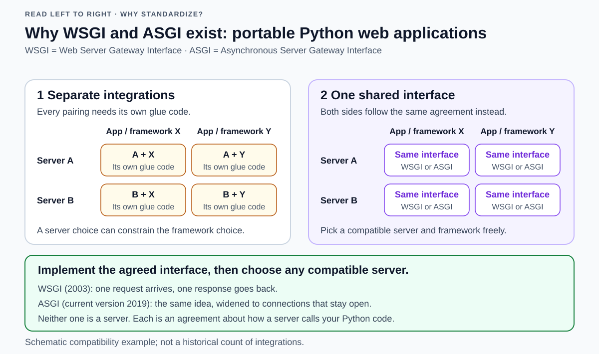
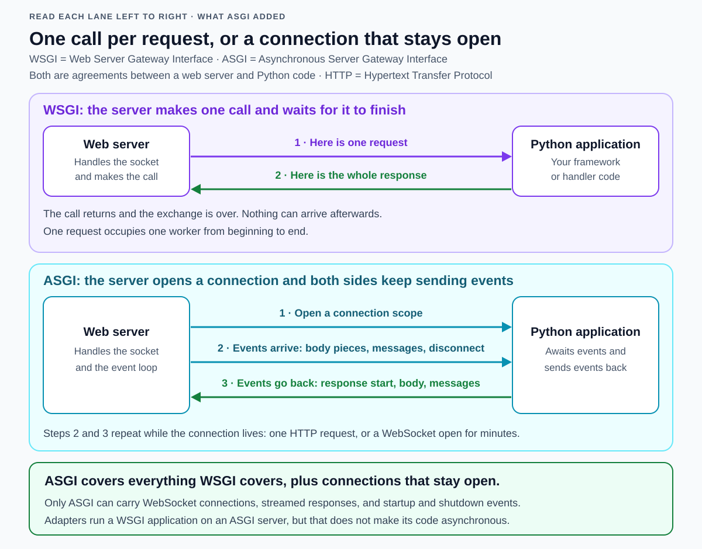
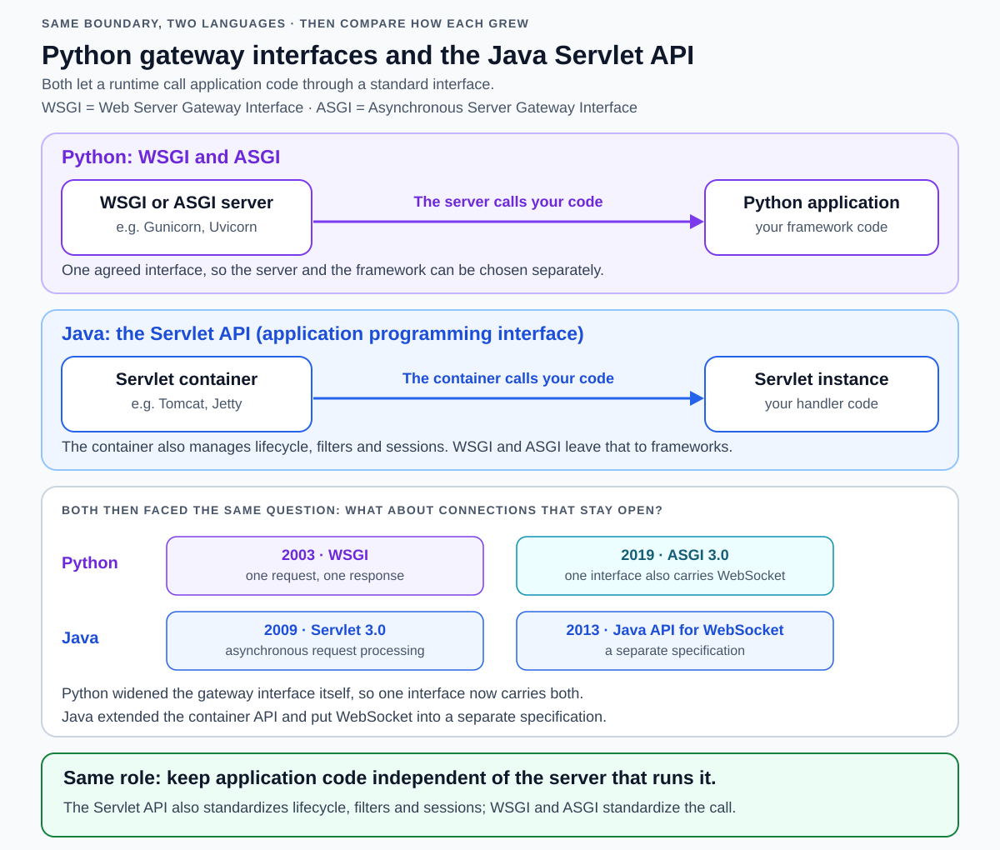
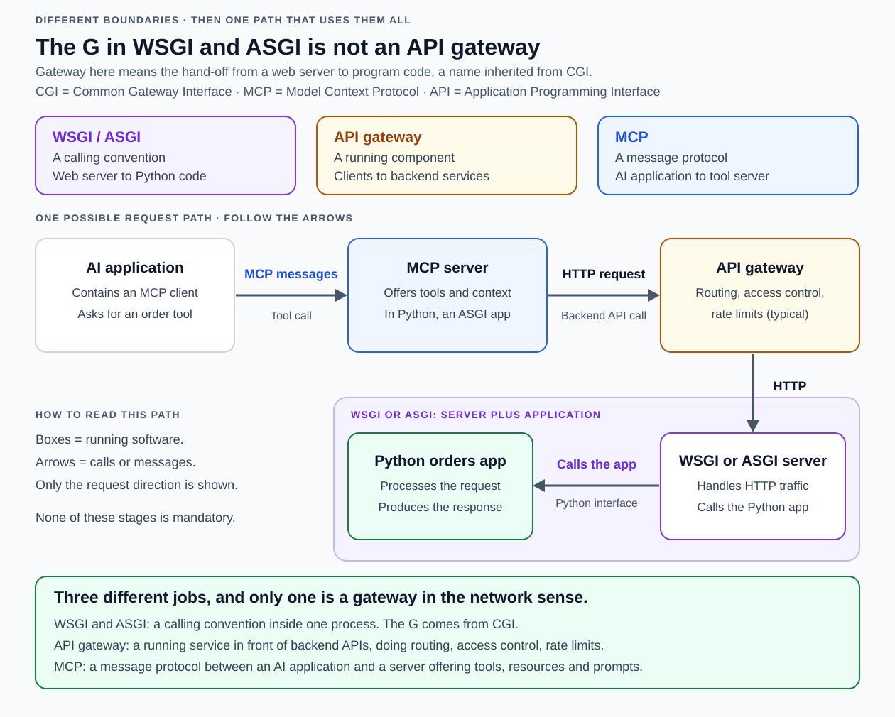

# WSGI and ASGI

<!-- Card mode: complex. Validate with --mode complex. -->

## Front

Why do WSGI and ASGI exist, how did ASGI grow out of WSGI, where do both standards stand today, and how do they compare with Java servlets, an API gateway, and MCP?

## Back

**Web Server Gateway Interface (WSGI)** and the **Asynchronous Server Gateway Interface (ASGI)** are agreements about how a web server hands a request over to Python application code.
- **WSGI** covers one request and one response.
- **ASGI** keeps the same idea but also covers connections that stay open, such as WebSocket.

Neither one is a server, a library, or a network protocol. Each is a calling convention: a rule both sides agree to follow so that any compatible server can run any compatible application.

This card explains where the names come from, why WSGI was written in 2003, what it could not do, how ASGI answered that, where both standards stand today, why the Java Servlet API (application programming interface) is their closest relative, and how an API gateway and the Model Context Protocol (MCP) fit into the same picture without being the same kind of thing.

### The one idea behind both names

Imagine a wall socket. Appliance makers and electricity suppliers never speak to each other, yet any lamp works in any socket, because both sides agreed on the shape of the plug in advance.

A Python web application needs the same kind of agreement. Somebody has to accept the network connection, read the incoming bytes, and understand HTTP (Hypertext Transfer Protocol, the rules for web messages). Somebody else has to decide what the answer should be. Those are two different jobs, usually written by two different groups of people.

Without a shared agreement, every server and every framework pairing needs its own glue code, and picking one side limits your choice on the other. With a shared agreement, both sides write to the same interface and the pairings stop mattering.

Read the diagram left to right. Panel 1 is the situation the standards were written to fix: four pairings, four pieces of glue. Panel 2 is the fix: the same interface in every cell, so a server and a framework can be chosen independently. The green band names the two versions of that interface and the difference between them.

### Where the "G" comes from: CGI, not an API gateway

The **G** in both names stands for **Gateway**, and it is the single most misread letter in Python web terminology. It has nothing to do with an API gateway product.

The word was inherited from **CGI (Common Gateway Interface)**, the early convention for letting a web server run an external program to build a page, later written down as RFC 3875. Under CGI the web server acts as an application gateway: it takes the client's request, converts it into a form the program understands, runs the program, and turns the program's output back into an HTTP response. The request details reach the program as named environment values such as `REQUEST_METHOD`, `PATH_INFO`, `SCRIPT_NAME`, and `QUERY_STRING`.

WSGI inherited that vocabulary literally. Its specification describes servers that "invoke Python via a gateway protocol (e.g. CGI, FastCGI, etc.)", and the dictionary of request information it passes to the application, named `environ`, is explicitly described as containing CGI-style environment variables, including the same `REQUEST_METHOD`, `SCRIPT_NAME`, and `PATH_INFO` names.

So in this family of names, **gateway means the hand-off point between a web server and program code**. It is a doorway inside one running process, not a piece of network infrastructure.

### 2003: how WSGI appeared

**The problem.** By 2003 Python had many web frameworks and no agreement about how a server should call one. **PEP 333** (Python Enhancement Proposal 333) states the consequence directly: a developer's choice of web framework generally limited their choice of usable web server, and the choice of server limited the usable frameworks. Deciding how to write your application therefore quietly decided how you could deploy it.

**The proposal.** Phillip J. Eby wrote PEP 333, created on 7 December 2003 and now marked Final. Its stated goal is a standard interface between web servers and Python applications so that applications become portable between servers.

**The model it copied.** The rationale points directly at Java. It observes that although Java also has many web frameworks, Java's servlet interface lets an application written with any of them run in any server that supports that interface. WSGI set out to give Python the same property. That is why the servlet comparison later in this card is not a loose analogy: it is the design's acknowledged source.

**What the agreement actually says.** A WSGI application is a Python *callable* — anything Python can call, such as a function. For each request, the server calls it with two things:

- `environ`, a dictionary of request and server information, including a stream to read the request body from;
- `start_response`, a callback the application invokes to hand back the status line and the response headers.

The application then returns an *iterable* of body chunks — an object the server can loop over, yielding the response body in pieces. Because both sides only need to agree on this, the interface stayed small enough that server authors and framework authors could both adopt it.

**Middleware came free.** A component can present itself as an application to the server above it and as a server to the application below it. Sitting in the middle, it can inspect or change requests and responses without either neighbour knowing. This is why WSGI middleware for logging, sessions, or path rewriting can be shared across frameworks.

**PEP 3333 (2010).** Python 3 changed what a string is, so Eby published a revision, created on 26 September 2010, that replaces PEP 333 and clarifies which values are text and which are bytes. The interface itself did not change; a compliant Python 2 application stayed compliant. PEP 3333 is the WSGI specification people mean today.

**What WSGI deliberately left out.** It does not standardize deployment. The specification says plainly that it does not define how a server finds or loads the application to invoke, because those are server-specific matters. That is why every WSGI server still has its own configuration and its own way of naming your application.

### The wall WSGI hit

WSGI's shape encodes one assumption: **a request arrives, the application is called once, the response comes back, and the exchange is finished.**

That assumption held for a decade of ordinary web pages and then stopped holding:

- **WebSocket** connections stay open and carry messages in both directions for as long as the user is on the page. A single call that must return the whole answer has nowhere to put "a message arrived four minutes later".
- **Long-polling and streamed responses**, such as live dashboards, chat, and server-sent event feeds, want to keep pushing data over a connection that is still open.
- **Concurrency costs.** Because the call is synchronous, each request occupies a worker from beginning to end. Flask's own documentation states this directly: each request still ties up one worker, even for an `async` view, so the number of requests the application can handle at once does not change.
- **No startup and shutdown hook.** WSGI has no standard moment at which an application can open a database connection pool before serving and close it afterwards.

The ASGI documentation states the verdict plainly: a single-callable interface is not suited to more involved web protocols such as WebSocket.

### How ASGI appeared

**Where it came from.** The pressure came from the Django world. **Django Channels** is the Django project that added support for WebSocket and other long-lived protocols, and the ASGI documentation names Channels as the original driving force behind the ASGI project. ASGI is maintained as a specification in its own right rather than as a Django feature: Channels describes ASGI as the asynchronous server specification it is built on, designed like WSGI to let you choose between different servers and frameworks.

**What it changed.** ASGI keeps WSGI's purpose — one agreement, many servers, many frameworks — and replaces the single synchronous call with a conversation:

- **`scope`** describes the connection: what kind it is, which path was requested, which headers arrived. For an HTTP request the scope covers that request; for a WebSocket it lasts as long as the socket does.
- **`receive`** is how the application waits for the next incoming event: a piece of the request body, a WebSocket message, a disconnect.
- **`send`** is how the application emits events back: the response start, body pieces, WebSocket messages.

Because the application awaits events instead of returning once, the connection can stay open and either side can speak again later.

Compare the two lanes. The WSGI lane has exactly two arrows and then stops; that is the whole protocol. The ASGI lane opens a scope first, and its event arrows repeat for as long as the connection lives. The green band states the relationship between them: ASGI is a superset, so anything WSGI can express, ASGI can express too.

**Its version history is short.** ASGI 2.0 (November 2017) used two callables; ASGI 3.0 (March 2019) simplified this to a single asynchronous callable taking the scope and the two event functions. Version 3.0 is still the current specification.

**It is a family of documents, not one specification.** The specifications index lists four: three that define the protocol, plus one optional extension.
* The **core specification** defines the application shape and the idea of a connection scope.
* The **HTTP and WebSocket message format** says how those two protocols are carried, covering HTTP/1.1, HTTP/2, and WebSocket connections.
* The **Lifespan protocol** defines startup and shutdown events, so an application can build resources such as a connection pool when the server starts and release them when it stops — the hook WSGI never had.
* The **TLS extension** is optional and cannot be used on its own: it adds details about an encrypted connection to a scope that already follows one of the others.

**Compatibility was designed in.** ASGI was written as a superset of WSGI with a defined translation between them, and adapters exist in both directions. Running an old WSGI application on an ASGI server works because the adapter executes the synchronous code in a thread pool. It does not make that code asynchronous, and it does not remove the one-worker-per-request cost.

### Where the two standards stand today

Both are current. Neither replaces the other on paper, and neither is deprecated.

| | WSGI | ASGI |
| --- | --- | --- |
| Specified in | PEP 3333, a Python Enhancement Proposal, Final since 2010 | Its own documentation, maintained with the `asgiref` project by the Django organisation; not a PEP |
| Current version | 1.0.1, unchanged since 2010 | 3.0, unchanged since March 2019 |
| Call style | One synchronous call per request | One asynchronous call per connection, then events both ways |
| Protocols covered | HTTP request and response | HTTP, WebSocket, plus application startup and shutdown |
| Reference code | `wsgiref` in the Python standard library | `asgiref`, an external package |
| Typical frameworks | Flask, Django | FastAPI, Starlette, Litestar, Quart, Django, Channels |
| Typical servers | Gunicorn, Waitress, uWSGI, Apache with `mod_wsgi` | Uvicorn, Hypercorn, Daphne, Granian, Gunicorn |

A few things worth knowing about the current landscape:

- **Django supports both, on purpose.** Django added ASGI support in version 3.0 and stated at the time that this was in addition to existing WSGI support and that it intends to support both for the foreseeable future. Django's deployment documentation calls ASGI the emerging Python standard for asynchronous web servers and applications, and still documents WSGI deployment beside it.
- **Flask remains a WSGI framework.** It can run `async` view functions, but it does so by starting an event loop in a worker thread per request. For a mainly asynchronous codebase its own documentation points to Quart, which it describes as a reimplementation of Flask on ASGI instead of WSGI.
- **Servers now often speak both.** Gunicorn, historically the archetypal WSGI server, gained a native ASGI worker in version 24.0.0 (23 January 2026) and promoted it from beta to stable in 25.1.0 (13 February 2026), so a Gunicorn deployment can now serve an ASGI framework without an extra worker package. Hypercorn serves both ASGI and WSGI applications and supports HTTP/2; Uvicorn describes itself simply as an ASGI web server for Python, supporting HTTP/1.1 and WebSocket with experimental HTTP/2; Daphne is the ASGI reference server, maintained as part of Channels; Granian is a Rust server that speaks ASGI, WSGI, and its own **Rust Server Gateway Interface (RSGI)**.
- **RSGI is a reminder, not a standard.** One server defining its own interface shows the pattern can repeat, but a convention only becomes useful when many independent servers and frameworks implement it. WSGI and ASGI are the two that cleared that bar.
- **Choosing between them is still a real decision.** If the application is a conventional request-and-response service with synchronous database access, WSGI is not a legacy choice; it is the simpler one, with a smaller failure surface. ASGI earns its extra complexity when you need WebSocket, streaming, many slow outbound calls at once, or startup and shutdown hooks.

### The closest relative: the Java Servlet API

A **servlet** is a Java component that handles a request and produces a response. A **servlet container**, such as Tomcat or Jetty, loads servlets and calls them. The **Servlet API** is the agreement between the two. That is structurally the same boundary WSGI and ASGI draw, which is exactly why PEP 333 cited it.

The upper half of the diagram shows the same shape twice: a runtime on the left calling application code on the right. The lower half shows something more interesting — both ecosystems later had to answer the same question about connections that stay open, and they answered it differently.

| Role | Python | Java |
| --- | --- | --- |
| Hosting runtime | WSGI or ASGI server, such as Gunicorn or Uvicorn | Servlet container, such as Tomcat |
| Application entry point | A callable the server invokes | A servlet the container invokes |
| Request information | A dictionary of request values, or the ASGI connection scope | A request object |
| Producing the response | A status-and-headers callback plus body chunks, or `send` events | Methods on a response object |
| Long-lived connections | Built into ASGI | Asynchronous processing added to the container; WebSocket in a separate specification |

Two differences matter.

**Scope.** WSGI and ASGI standardize the call and stop there. The Servlet API standardizes much more: the servlet lifecycle, filters, sessions, and asynchronous request processing are all part of the specification. In Python those services come from frameworks and middleware rather than the interface. This is a deliberate trade: a small interface is easy for server authors to adopt, which is what WSGI wanted.

**How each grew.** Java extended what it already had. Servlet 3.0, finalised on 10 December 2009, added asynchronous request processing and non-blocking input and output to the container. WebSocket then arrived in 2013 as the Java API for WebSocket — a *separate* specification alongside the servlet one, and still separate today as Jakarta WebSocket. Python took the other route: rather than bolting protocols onto WSGI, it defined a new gateway interface in which HTTP and WebSocket are carried by a single message specification. Same problem, two architectures.

These are role mappings, not interchangeable signatures. A servlet handler writes through its response object and returns nothing, where a WSGI application returns a body iterable.

### Neighbours that are easy to confuse

Three names sound related and are not the same kind of thing. Sorting them by *what kind of thing they are* dissolves most of the confusion.

The top row of the diagram separates the three roles; the lower half shows one way they can appear in a single system.

| | WSGI / ASGI | API gateway | MCP |
| --- | --- | --- | --- |
| Kind of thing | A calling convention inside one process | A running service you deploy | A message protocol between two programs |
| Boundary it sits at | Web server ↔ Python application | Network clients ↔ backend services | AI application ↔ tool and context server |
| What crosses it | Python function arguments and events | Network requests and responses | Structured JSON-RPC messages |
| Main job | Let any compatible server run any compatible application | Route traffic and apply access control, limits, monitoring | Let an AI application discover and use tools, resources, and prompts |
| Can you "run" it? | No, you implement it | Yes, it is a process | No, you implement it on both ends |

**API gateway.** A real service placed in front of backend services. Amazon's documentation calls it a "front door" for applications reaching backend data and business logic, and lists what it handles: traffic management, authorization and access control, monitoring, and API version management. It is a network component making policy decisions about requests. WSGI and ASGI make no policy decisions and handle no traffic; they describe a function call. The shared word "gateway" is a historical accident of CGI's vocabulary, nothing more.

**MCP (Model Context Protocol).** An open protocol that lets an AI application connect to outside data and tools. It carries its messages in the JSON-RPC 2.0 format — JSON objects that name a method and carry its arguments — between **hosts** (the AI application), **clients** (the connector inside it), and **servers** (which expose **resources**, **prompts**, and **tools**). The current specification revision is dated 28 July 2026. Like WSGI, it exists so that independently written pieces interoperate — but it standardizes a conversation between two programs, whereas WSGI and ASGI standardize a call inside one.

Put plainly: **the Servlet API is WSGI's sibling, MCP is a cousin that shares the interoperability motive, and an API gateway shares only a word.**

### How they can all appear in one system

These are not competitors, so a single request can pass through all of them. Follow the lower half of the previous diagram.

An AI application wants to look up an order. Its MCP client asks an MCP server for a `list_orders` tool. The MCP server's tool implementation makes an ordinary HTTP request to a backend API. That request arrives at an API gateway, which authorizes it and routes it to a web server. The web server calls the Python orders application through WSGI or ASGI. The answer travels back along the same path.

Two links in that chain are worth pointing out, because they are concrete rather than metaphorical:

- **An MCP server that talks HTTP is itself a web application.** MCP defines two standard transports: `stdio`, for a server the client launches as a subprocess, and **Streamable HTTP**, where each message is an HTTP POST to a single endpoint and replies come back either as a JSON object or as a stream of server-sent events. In Python, that is exactly an ASGI application. The official Python MCP SDK says so: a Starlette app is an ASGI app, so anything that hosts ASGI — Uvicorn, Hypercorn, another Starlette app, FastAPI — can host your MCP server.
- **The streaming is why ASGI, not WSGI.** A request-scoped event stream that stays open while a tool runs is precisely the pattern WSGI's one-call-and-done shape cannot express. The same SDK also relies on ASGI's Lifespan sub-specification: when an MCP server is mounted inside a larger application, the outermost application must run the MCP session manager in its own lifespan, or the first request fails.

None of these stages is mandatory. A Python web application can run with no gateway and no MCP anywhere near it, and an MCP server can be written in another language or read a database directly.

### Misconceptions worth clearing

- **"ASGI replaced WSGI."** No. Both specifications are current, and Django explicitly intends to support both for the foreseeable future.
- **"Running my app under ASGI makes it faster."** No. An adapter runs synchronous code in a thread pool. Asynchronous execution helps when work is spent waiting on input and output, not on computation.
- **"WSGI means the server handles one request at a time."** No. The *call* is synchronous, but servers run many workers, threads, or processes concurrently.
- **"WSGI or ASGI is a server."** No. Gunicorn is a server; WSGI is what Gunicorn and your application both agree to.
- **"The G means gateway like an API gateway."** No. It came from CGI and means the hand-off from a server to program code.
- **uWSGI, uwsgi, and WSGI are three different things**: a server, a wire protocol that server speaks, and the Python interface.

**Remember the shape of the answer: WSGI and ASGI are one language's agreement about how a server calls application code, the Servlet API is the same agreement in Java, an API gateway is a service that stands in front of your APIs, and MCP is a protocol that lets an AI application use tools — and a modern system can contain all four at once.**

## Sources

- [PEP 333 — Python Web Server Gateway Interface v1.0, created 7 December 2003](https://peps.python.org/pep-0333/)
- [PEP 3333 — Python Web Server Gateway Interface v1.0.1, created 26 September 2010](https://peps.python.org/pep-3333/)
- [PEP 3333 — Original Rationale and Goals, including the Java servlet comparison](https://peps.python.org/pep-3333/#original-rationale-and-goals-from-pep-333)
- [PEP 3333 — The application callable, environ, and start_response](https://peps.python.org/pep-3333/#specification-details)
- [RFC 3875 — The Common Gateway Interface (CGI) Version 1.1](https://www.rfc-editor.org/rfc/rfc3875.html)
- [Python documentation — wsgiref, the standard-library WSGI reference implementation](https://docs.python.org/3/library/wsgiref.html)
- [ASGI — Introduction: relationship to WSGI, WebSocket limits, and backwards compatibility](https://asgi.readthedocs.io/en/latest/introduction.html)
- [ASGI — Specification: connection scope, version history, and legacy applications](https://asgi.readthedocs.io/en/latest/specs/main.html)
- [ASGI — HTTP and WebSocket message format, covering HTTP/1.1, HTTP/2, and WebSocket](https://asgi.readthedocs.io/en/latest/specs/www.html)
- [ASGI — Lifespan protocol: startup and shutdown events](https://asgi.readthedocs.io/en/latest/specs/lifespan.html)
- [ASGI — TLS extension, an optional addition that cannot be used on its own](https://asgi.readthedocs.io/en/latest/specs/tls.html)
- [ASGI — Implementations: servers, frameworks, and adapters](https://asgi.readthedocs.io/en/latest/implementations.html)
- [asgiref — ASGI specification and utilities, maintained by the Django organisation](https://github.com/django/asgiref)
- [Django Channels — Introduction and its relationship to ASGI](https://channels.readthedocs.io/en/latest/introduction.html)
- [Django 3.0 release notes — ASGI support added alongside WSGI](https://docs.djangoproject.com/en/stable/releases/3.0/)
- [Django — How to deploy with ASGI](https://docs.djangoproject.com/en/stable/howto/deployment/asgi/)
- [Django — How to deploy with WSGI](https://docs.djangoproject.com/en/stable/howto/deployment/wsgi/)
- [Flask — Using async and await, worker cost, and when to use Quart](https://flask.palletsprojects.com/en/stable/async-await/)
- [Flask — Deploying to production with a WSGI server](https://flask.palletsprojects.com/en/stable/deploying/)
- [Gunicorn — Native ASGI worker](https://gunicorn.org/asgi/)
- [Gunicorn — 2026 changelog: ASGI worker added in 24.0.0 and stable in 25.1.0](https://gunicorn.org/2026-news/)
- [Uvicorn — An ASGI web server for Python](https://github.com/encode/uvicorn/blob/master/docs/index.md)
- [Hypercorn — An ASGI server supporting HTTP/1, HTTP/2, WebSocket, and WSGI applications](https://hypercorn.readthedocs.io/en/latest/)
- [Granian — A Rust server supporting ASGI/3, RSGI, and WSGI](https://github.com/emmett-framework/granian)
- [RSGI — The Rust Server Gateway Interface specification](https://github.com/emmett-framework/granian/blob/master/docs/spec/RSGI.md)
- [mod_wsgi — Hosting WSGI applications with Apache](https://www.modwsgi.org/en/develop/)
- [Waitress — A production-quality pure-Python WSGI server](https://docs.pylonsproject.org/projects/waitress/en/stable/)
- [uWSGI — Python and WSGI quickstart](https://uwsgi-docs.readthedocs.io/en/latest/WSGIquickstart.html)
- [uWSGI — The uwsgi binary protocol, distinct from the WSGI interface](https://uwsgi-docs.readthedocs.io/en/latest/Protocol.html)
- [JSR 315 — Java Servlet 3.0, final release 10 December 2009, adding asynchronous processing](https://jcp.org/en/jsr/detail?id=315)
- [JSR 356 — Java API for WebSocket, final release 22 May 2013](https://jcp.org/en/jsr/detail?id=356)
- [Jakarta WebSocket — A specification separate from Jakarta Servlet](https://jakarta.ee/specifications/websocket/)
- [Jakarta Servlet specification — Containers, lifecycle, filters, sessions, and asynchronous processing](https://jakarta.ee/specifications/servlet/6.1/jakarta-servlet-spec-6.1)
- [Apache Tomcat — A servlet container implementation](https://tomcat.apache.org/tomcat-11.0-doc/index.html)
- [Eclipse Jetty — A web server and servlet container](https://jetty.org/)
- [Amazon API Gateway — The "front door" role and what it handles](https://docs.aws.amazon.com/apigateway/latest/developerguide/welcome.html)
- [MCP — Specification overview: hosts, clients, servers, and JSON-RPC](https://modelcontextprotocol.io/specification/latest)
- [MCP — Transports: stdio and Streamable HTTP](https://modelcontextprotocol.io/specification/2026-07-28/basic/transports)
- [MCP Python SDK — Serving an MCP server from an ASGI application](https://py.sdk.modelcontextprotocol.io/run/asgi/)
