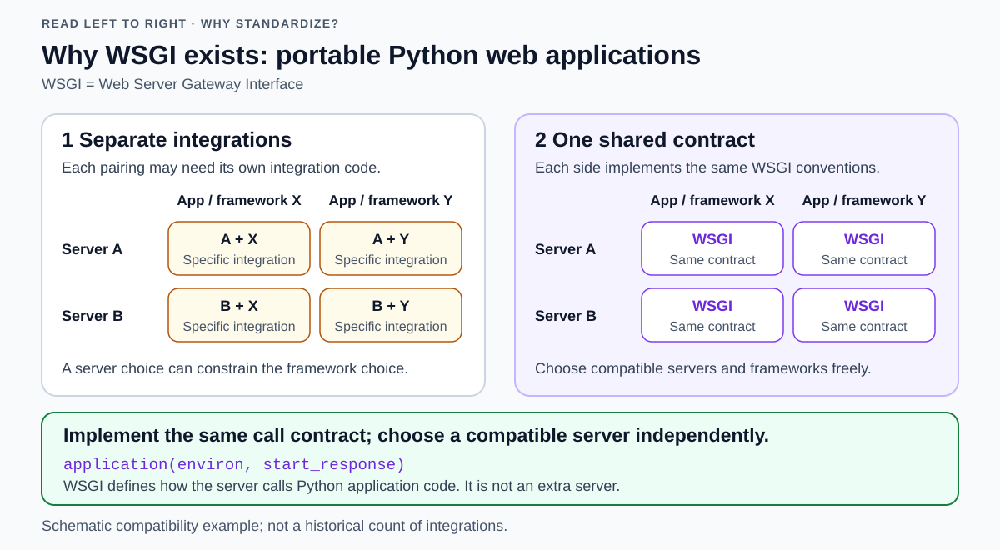
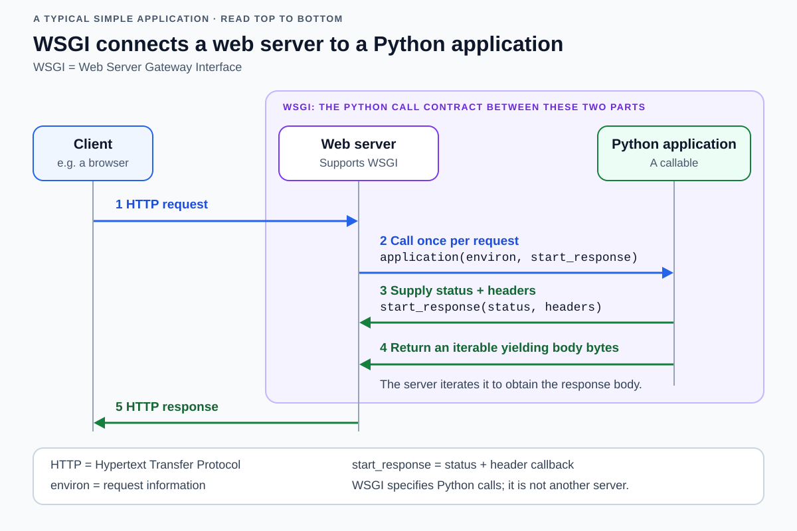
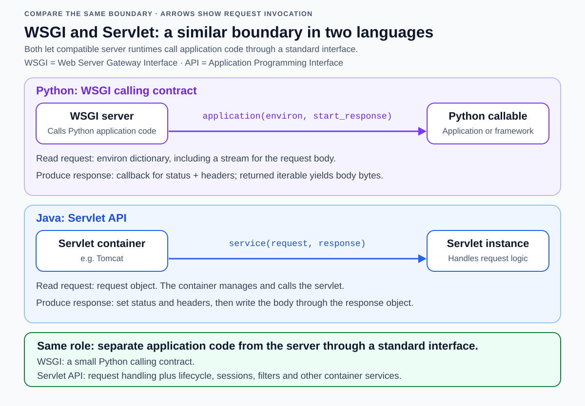
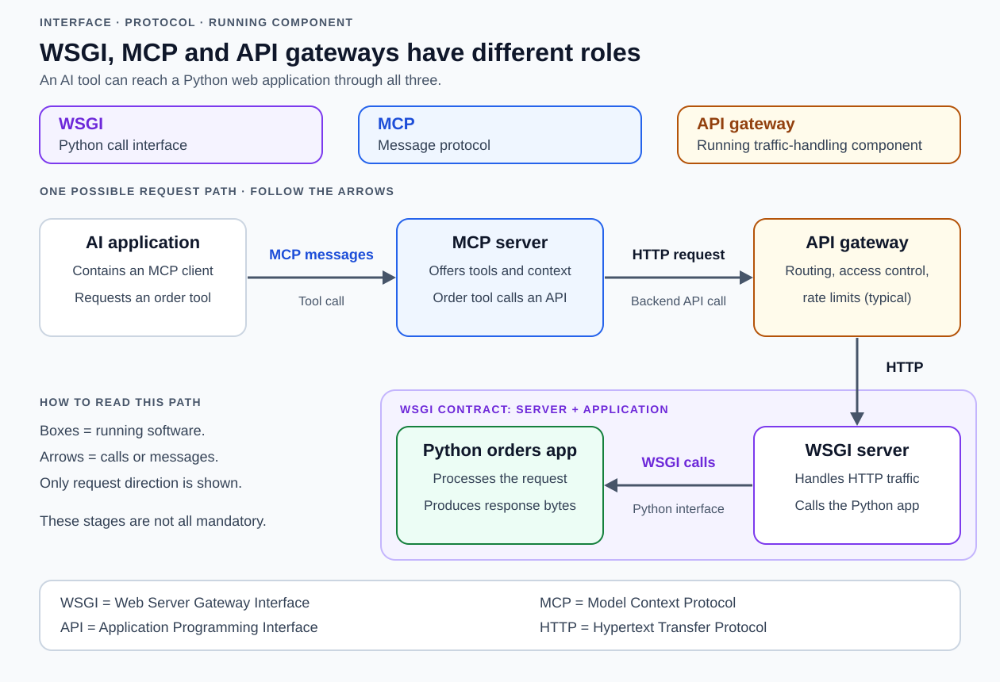

# WSGI

<!-- Card mode: complex. Validate with --mode complex. -->

## Front

Why does WSGI exist, how does its application contract work, which servers support it, and how does it compare with Java servlets, an API gateway, and MCP?

## Back

**WSGI (Web Server Gateway Interface) exists to let Python web applications and frameworks work with different compatible web servers through one standard interface.** Its purpose is portability: choosing a framework should not lock you into one server.

### Why WSGI exists: the original rationale

**The problem:** Servers and frameworks can use different ways to call application code and exchange request/response data. Supporting another server can then require a custom adapter. HTTP (Hypertext Transfer Protocol) defines messages exchanged with the client, but does not define how a server calls Python application code.

**The solution:** Both sides implement the WSGI contract. The server knows how to call the application, and the application knows how to supply its response. The diagram contrasts separate integrations with a shared calling convention; WSGI is the agreed interface, not an extra server.



PEP 3333's **Original Rationale and Goals (from PEP 333)** identifies several goals:

- **Independent choices:** select a framework and a compatible server separately. The rationale points to Java's standardized server–application boundary, the servlet interface, as an analogy.
- **A small interface:** make support straightforward for existing server and framework authors; application developers can keep using their framework's higher-level features.
- **Reusable middleware:** allow a wrapper to modify requests or responses while presenting the same interface on both sides. For example, middleware can transform response content.

WSGI does not standardize deployment: configuration, dependencies, and server-specific extensions can still differ between servers.

The rationale is historical text inherited from the original proposal. Its statements about a lack of implementations describe that early context; the server implementations listed below exist today. This card uses PEP 3333's rules for Python 3.

### The two sides of the interface

A **WSGI application** is a Python **callable**: something Python can call, such as a function or an object implementing `__call__`. A **web framework** supplies facilities such as routing requests to handlers. Flask supplies a WSGI application object; Django exposes an `application` callable through a project's `wsgi.py`.

A WSGI server or hosting integration loads and invokes that callable, supplies request information, and processes the returned response. PEP 3333 calls this the **server/gateway side**. It can be a standalone server such as Gunicorn or a hosting integration such as Apache's `mod_wsgi` module.

A **reverse proxy** receives client requests and forwards them to another server. In an **nginx → Gunicorn → Python application** deployment, nginx forwards HTTP to Gunicorn; Gunicorn calls the application through WSGI. Gunicorn can also receive HTTP directly, so the reverse proxy is optional.

Read the diagram from top to bottom. It shows a direct HTTP connection to the WSGI server, without a reverse proxy, followed by Python calls between the server and application. This simple application supplies its headers before returning the body iterable.



### The application contract

For each request directed at the application, the server calls `application(environ, start_response)` with two positional arguments. These names are conventional; the argument roles define the interface.

| Part | Purpose |
| --- | --- |
| `environ` | A dictionary containing request and server information. Examples include `REQUEST_METHOD`, `PATH_INFO`, and `wsgi.input`, a stream for reading the request body. |
| `start_response(status, headers)` | A server-supplied **callback**: a function the application calls to provide a status such as `"200 OK"` and a list of header name/value pairs. |
| Return value | An **iterable** of body chunks: an object the server can loop over, such as a list or generator. Each chunk must be `bytes` in Python 3. |

The application must call `start_response` before its iterable yields the first body chunk. That call can happen during iteration; it need not happen before the application returns the iterable.

**`start_response` must not transmit the status and headers immediately.** It stores them for the server/gateway to send when the iterable first yields a non-empty byte chunk, or when the iterable is exhausted if no body data was produced. An empty yielded chunk does not trigger transmission.

The first call to the legacy `write()` callable returned by `start_response` is another transmission trigger. PEP 3333 also permits an exception to deferred transmission when the response explicitly includes `Content-Length: 0`.

Deferral allows an error handler to replace the pending status and headers by calling `start_response(status, headers, exc_info)`, where `exc_info` carries exception information. If headers have already been sent, that call must raise an error instead.

The server consumes the iterable and sends the response. If the iterable has a `close()` method, the server calls it when the request finishes, including after an error or early client disconnect. This allows the application to release resources.

### Minimal Python 3 application

Save this example as `app.py`:

```python
def application(environ, start_response):
    body = b"Hello!\n"
    headers = [
        ("Content-Type", "text/plain; charset=utf-8"),
        ("Content-Length", str(len(body))),
    ]
    start_response("200 OK", headers)
    return [body]
```

The response body is `Hello!` followed by a newline. The `b` prefix creates bytes; `[body]` supplies the required iterable of byte chunks. Status and header values are Python strings. `Content-Length` describes the body's length in bytes.

Returning `body` alone is incorrect: iterating a Python `bytes` object produces integers. Returning `["Hello!\n"]` is also incorrect because its element is text rather than bytes.

With the chosen server installed, either of these commands can load the same application. They are alternatives:

```bash
gunicorn app:application
waitress-serve app:application
```

Here, `app` is the importable module `app.py`, and `application` is its callable. The server supplies `environ` and `start_response`; the example does not open a listening socket itself.

### Servers that support WSGI

| Server or integration | How it supports WSGI | Useful distinction |
| --- | --- | --- |
| **Gunicorn** | Loads and serves a Python WSGI callable. | An HTTP/application server, separate from the framework. |
| **Waitress** | A production-oriented WSGI server written in Python. | Supports Unix and Windows. |
| **uWSGI with Python support** | Loads Python WSGI applications through its Python support/plugin. | A modular application server; some installations require explicitly loading the Python plugin. |
| **Apache HTTP Server + mod_wsgi** | The `mod_wsgi` module hosts Python WSGI applications inside an Apache deployment. | Apache requires the module; the server does not have to be written in Python. |
| **`wsgiref.simple_server`** | Python's standard-library reference HTTP server for WSGI. | Suitable for learning and testing; not recommended for production. |

Distinguish the **uWSGI server**, the **uwsgi network protocol**, and the **WSGI Python interface**: the similar names refer to different things.

### Concurrency and scope

WSGI uses a **synchronous call interface**: the server invokes a normal callable and consumes its returned iterable. A server can still handle multiple requests concurrently using threads or processes. WSGI therefore does not imply that the entire server handles only one request at a time.

WSGI can stream an HTTP response as successive byte chunks. **ASGI (Asynchronous Server Gateway Interface)** is an alternative at the same server–application boundary. It provides an asynchronous interface and supports WebSocket connections for two-way messaging.

### Java servlets: the closest architectural analogy

A **servlet** is a Java web component that handles requests and produces responses. A **servlet container**, such as Apache Tomcat, manages servlet instances and invokes them for requests. The **Servlet API (application programming interface)** defines the contract between the container and those components.

This is the analogy used in PEP 3333's rationale: both the Servlet API and WSGI standardize how server-side application code connects to its runtime. Compare the matching roles in the two lanes below.



| Role | Python / WSGI | Java / Servlet API |
| --- | --- | --- |
| Hosting runtime | WSGI server, such as Gunicorn | Servlet container, such as Tomcat |
| Application entry point | `application(environ, start_response)` | Servlet `service(request, response)`; `HttpServlet` dispatches to handlers such as `doGet` and `doPost` |
| Request information | `environ` dictionary and request-body stream | `HttpServletRequest` object |
| Response construction | Status/header callback plus an iterable of byte chunks | `HttpServletResponse` methods to set status/headers and write the body |

These are mappings of roles, not interchangeable signatures. Servlet request handlers return `void`; they write through the response object rather than returning a WSGI-style body iterable.

**The main difference is scope.** WSGI specifies a small calling contract. The Servlet API also standardizes container services such as servlet lifecycle, filters, sessions, and asynchronous request processing. Python frameworks or middleware can provide higher-level facilities around WSGI.

The container manages `init`, `service`, and `destroy`; it does not create a new servlet instance for every request. The same instance can serve concurrent requests. WSGI does not prescribe that servlet lifecycle model.

### WSGI, API gateways, and MCP

An **API gateway** is a running service placed in front of backend services. **MCP (Model Context Protocol)** defines messages between an artificial intelligence (AI) application's MCP client and an MCP server that exposes tools and context. The **MCP server** is the running component that implements the protocol.

| Aspect | WSGI | API gateway | MCP |
| --- | --- | --- | --- |
| Kind of thing | Python calling interface | Running infrastructure component | Client–server message protocol |
| Boundary | WSGI server ↔ Python application | API clients ↔ backend services | AI application's MCP client ↔ MCP server |
| Main job | Standardize application invocation and responses | Route traffic and typically enforce access controls and traffic limits | Standardize discovery and use of tools, resources, and prompts |
| What passes across it | Python arguments, a callback, and body chunks | Network requests and responses | Structured protocol messages |

**The closeness is about integration:** WSGI and MCP each define a common contract so different implementations can interoperate. The Servlet API is the closer architectural analogy because it shares WSGI's server–application boundary.

WSGI itself supplies neither gateway routing policies nor MCP tool discovery. The word *Gateway* in WSGI's name does not make it an API gateway.

### One possible combined architecture

The diagram shows one possible deployment in which an AI application's tool call reaches an ordinary backend API.



For example, an MCP server can expose a `list_orders` tool whose implementation sends an HTTP request through an API gateway to a WSGI server hosting an orders application. The MCP server provides the tool-to-API mapping. Neither WSGI nor the API gateway automatically turns an ordinary endpoint into an MCP tool.

All three are optional choices for their respective roles: a WSGI application can run without an API gateway or MCP, and an MCP server can use a backend implemented in another language or access data directly.

Remember the roles: **WSGI and the Servlet API standardize their language's server–application boundary; an API gateway manages API traffic; MCP standardizes access to tools and context for AI applications.**

## Sources

- [PEP 3333 — Python Web Server Gateway Interface specification](https://peps.python.org/pep-3333/)
- [PEP 3333 — start_response, deferred headers, and error handling](https://peps.python.org/pep-3333/#the-start-response-callable)
- [PEP 3333 — Original Rationale and Goals (from PEP 333)](https://peps.python.org/pep-3333/#original-rationale-and-goals-from-pep-333)
- [Python documentation — WSGI reference implementation, examples, and validation](https://docs.python.org/3/library/wsgiref.html)
- [Gunicorn — Running a WSGI application](https://gunicorn.org/run/)
- [Waitress — WSGI server and platform support](https://docs.pylonsproject.org/projects/waitress/en/stable/)
- [Waitress — Command-line invocation](https://docs.pylonsproject.org/projects/waitress/en/stable/runner.html#invocation)
- [uWSGI — Python/WSGI quickstart](https://uwsgi-docs.readthedocs.io/en/latest/WSGIquickstart.html)
- [mod_wsgi — Hosting WSGI applications with Apache](https://www.modwsgi.org/en/develop/)
- [Flask — WSGI application hosting, servers, and reverse proxies](https://flask.palletsprojects.com/en/stable/deploying/)
- [Django — Deployment with WSGI](https://docs.djangoproject.com/en/stable/howto/deployment/wsgi/)
- [Jakarta Servlet specification — Containers, request handling, lifecycle, and asynchronous processing](https://jakarta.ee/specifications/servlet/6.1/jakarta-servlet-spec-6.1)
- [Jakarta Servlet API — HttpServlet request dispatch and response handling](https://jakarta.ee/specifications/servlet/6.1/apidocs/jakarta.servlet/jakarta/servlet/http/httpservlet)
- [Jakarta Servlet API — Servlet lifecycle methods](https://jakarta.ee/specifications/servlet/6.1/apidocs/jakarta.servlet/jakarta/servlet/servlet)
- [Apache Tomcat — Servlet container implementation](https://tomcat.apache.org/tomcat-11.0-doc/index.html)
- [Amazon API Gateway — Architecture and capabilities](https://docs.aws.amazon.com/apigateway/latest/developerguide/welcome.html)
- [MCP — Architecture, participants, and tools/resources/prompts](https://modelcontextprotocol.io/docs/learn/architecture)
- [MCP — Servers that expose tools, resources, and prompts](https://modelcontextprotocol.io/docs/learn/server-concepts)
- [ASGI documentation — Synchronous WSGI and the asynchronous interface](https://asgi.readthedocs.io/en/latest/introduction.html)
