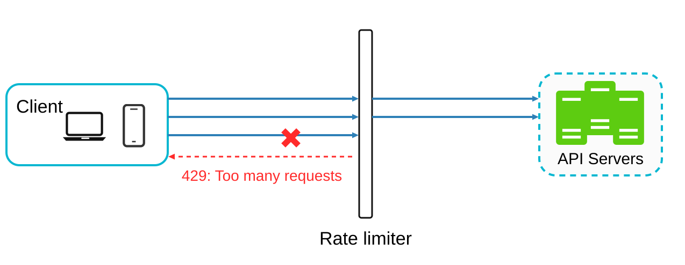
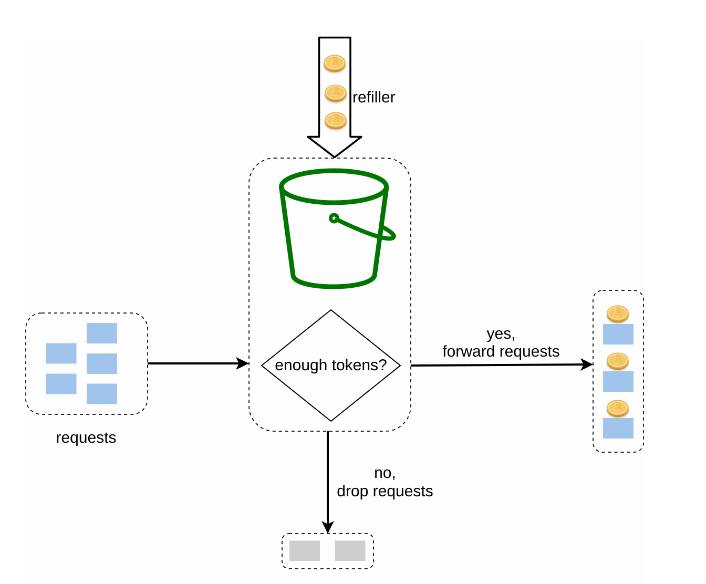
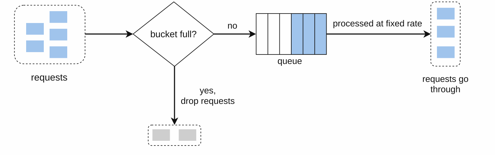
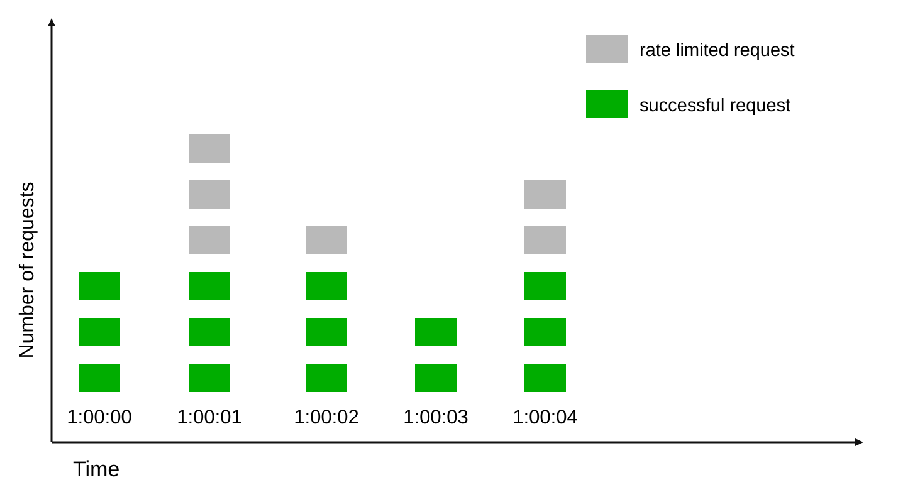
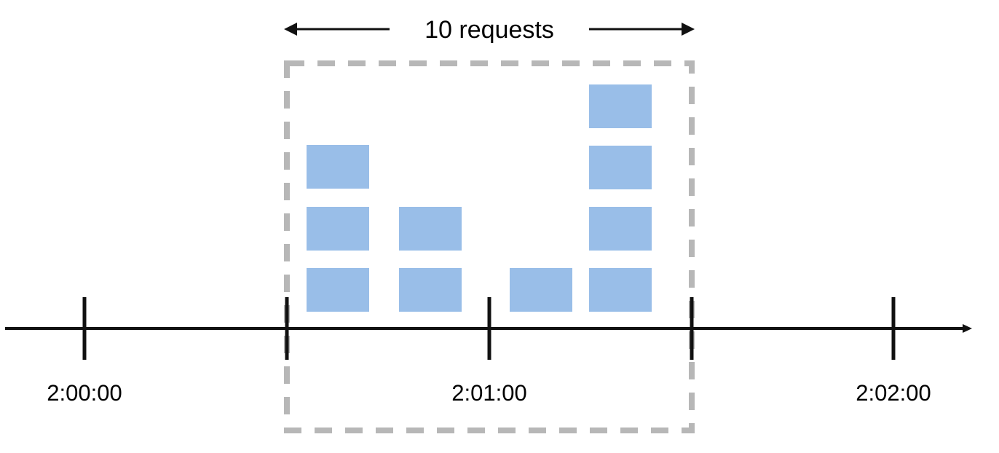
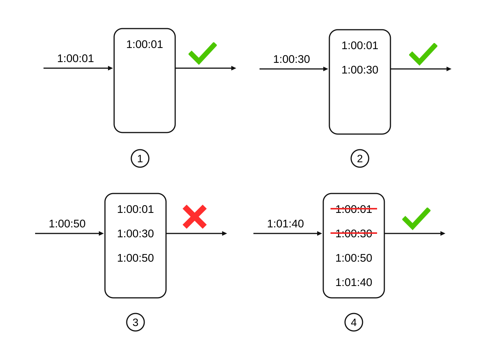
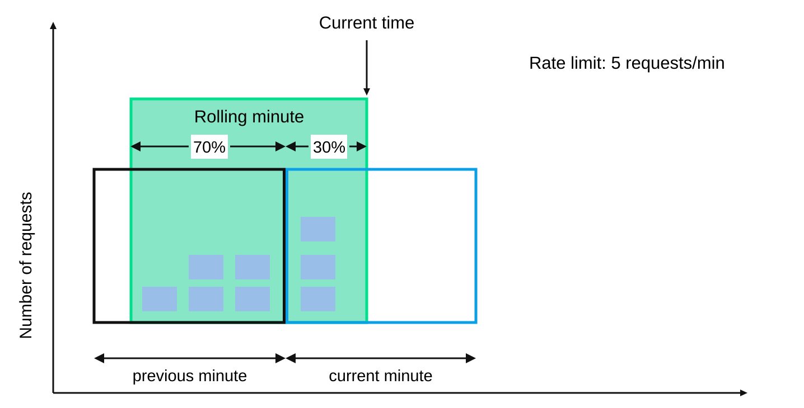
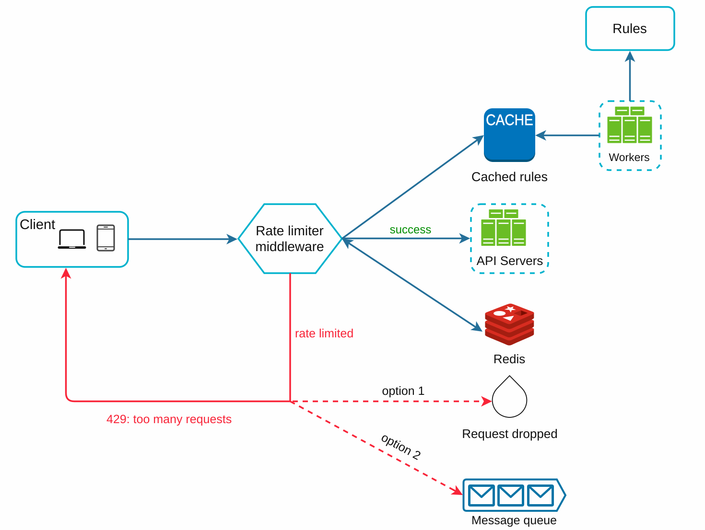

# Chapter 4: Design a Rate Limiter
[Back to System Design](../Readme.md#content)

## Introduction
This chapter explores the design and implementation of a rate limiter—a system component used to control traffic rates sent by clients or services. Rate limiters are crucial for preventing abuse, reducing costs, and ensuring the stability of server resources. Examples of their use include limiting posts, account creations, and reward claims.

## Benefits of Rate Limiting
- **Preventing DoS Attacks:** Blocking excess calls to avoid resource starvation.
- **Cost Reduction:** Limiting unnecessary requests to reduce server expenses.
- **Preventing Overloads:** Filtering out excessive requests to stabilize server performance.

## Step 1: Understanding the Problem
### Key Features
- Server-side API rate limiter.
- Support for multiple throttle rules.
- Handle large-scale systems in distributed environments.
- Option for a standalone service or application-level code.
- Inform users when throttled.

### Requirements
- Accurate request throttling.
- Minimal latency.
- Low memory usage.
- Distributed capability.
- Clear exception handling.
- High fault tolerance.

## Step 2: High-Level Design
### Placement Options

    

1. **Client-Side Implementation:** Unreliable due to potential misuse.
2. **Server-Side Implementation:** Preferred for control and reliability.
3. **Middleware (API Gateway):** A flexible option for integrated rate limiting.

### Guidelines for Placement
- Evaluate current tech stack and choose efficient options.
- Select appropriate algorithms based on business needs.
- Use an API gateway if microservices are employed.
- Opt for commercial solutions if resources are limited.

## Step 3: Rate Limiting Algorithms
### 1. Token Bucket

  

- **Description:** Tokens are added to a bucket at a fixed rate; each request consumes a token.
- **Parameters:** Bucket size and refill rate.
- **Pros:** Easy to implement, memory-efficient, supports traffic bursts.
- **Cons:** Requires careful parameter tuning.

### 2. Leaking Bucket

  

- **Description:** Processes requests at a fixed rate using a FIFO queue.
- **Pros:** Memory-efficient, stable outflow rate.
- **Cons:** Traffic bursts may delay recent requests.

  Example: https://github.com/uber-go/ratelimit

### 3. Fixed Window Counter

  

- **Description:** Divides time into fixed intervals and uses counters to limit requests.
- **Pros:** Simple, efficient for specific use cases.
- **Cons:** Traffic spikes at window edges can exceed limits.

- A sudden burst of traffic at the edges of time windows
could allow more requests than the allotted quota.

  

### 4. Sliding Window Log

  

- **Description:** Tracks timestamps to allow a rolling time window.
- **Pros:** Accurate rate limiting.
- **Cons:** High memory consumption.

### 5. Sliding Window Counter

  

- **Description:** Combines fixed window and sliding log methods for smoothing spikes.
- **Pros:** Memory-efficient, handles traffic bursts.
- **Cons:** Approximation may not be perfectly strict.

## High-Level Architecture

  

- **Data Storage:** Use in-memory caching (e.g., Redis) for fast counter operations.
- **Steps:**
  1. Client sends request to middleware.
  2. Middleware checks counters in Redis.
  3. Request is processed or rejected based on limits.

## Advanced Considerations
### Distributed Environments
- **Challenges:** Race conditions, synchronization issues.
- **Solutions:** Use locks, Lua scripts, or sorted sets in Redis. Employ centralized data stores for synchronization.

### Performance Optimizations
- Multi-data center setups for reduced latency.
- Eventual consistency models for synchronization.

### Monitoring
- Regular analytics to ensure algorithm effectiveness and adjust rules as needed.

## Reference materials

1. [Rate-limiting strategies and techniques](https://cloud.google.com/solutions/rate-limiting-strategies-techniques)
2. [Twitter rate limits](https://developer.twitter.com/en/docs/basics/rate-limits)
3. [Google docs usage limits](https://developers.google.com/docs/api/limits)
4. [IBM microservices](https://www.ibm.com/cloud/learn/microservices)
5. [Throttle API requests for better throughput](https://docs.aws.amazon.com/apigateway/latest/developerguide/api-gateway-request-throttling.html)
6. [Stripe rate limiters](https://stripe.com/blog/rate-limiters)
7. [Shopify REST Admin API rate limits](https://help.shopify.com/en/api/reference/rest-admin-api-rate-limits)
8. [Better Rate Limiting With Redis Sorted Sets](https://engineering.classdojo.com/blog/2015/02/06/rolling-rate-limiter/)
9. [System Design — Rate limiter and Data modelling](https://medium.com/@saisandeepmopuri/system-design-rate-limiter-and-data-modelling-9304b0d18250)
10. [How we built rate limiting capable of scaling to millions of domains](https://blog.cloudflare.com/counting-things-a-lot-of-different-things/)
11. [Redis website](https://redis.io/)
12. [Lyft rate limiting](https://github.com/lyft/ratelimit)
13. [Scaling your API with rate limiters](https://gist.github.com/ptarjan/e38f45f2dfe601419ca3af937fff574d#request-rate-limiter)
14. [What is edge computing](https://www.cloudflare.com/learning/serverless/glossary/what-is-edge-computing/)
15. [Rate Limit Requests with Iptables](https://blog.programster.org/rate-limit-requests-with-iptables)
16. [OSI model](https://en.wikipedia.org/wiki/OSI_model#Layer_architecture)
