# Chapter 5: Design Consistent Hashing
[Back to System Design](../Readme.md#content)

## Introduction
This chapter explores consistent hashing, a technique essential for achieving horizontal scaling by efficiently distributing requests and data across servers. It minimizes data redistribution when servers are added or removed and ensures an even distribution of data to mitigate issues like server hotspots.

## The Rehashing Problem
### Explanation
In traditional hashing methods, such as `serverIndex = hash(key) % N`, data redistribution becomes problematic when the number of servers changes. For example:
- Removing a server causes most keys to be reassigned, leading to cache misses.
- Adding a server results in unnecessary key redistributions.

  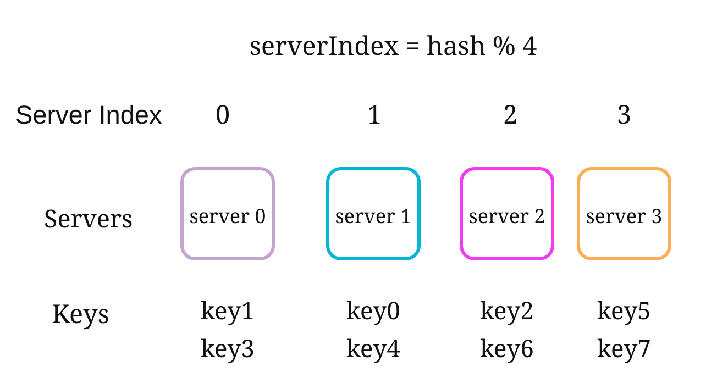

- This approach works well when the size of the server pool is fixed. However, problems arise when new servers are added, or existing servers are removed.

  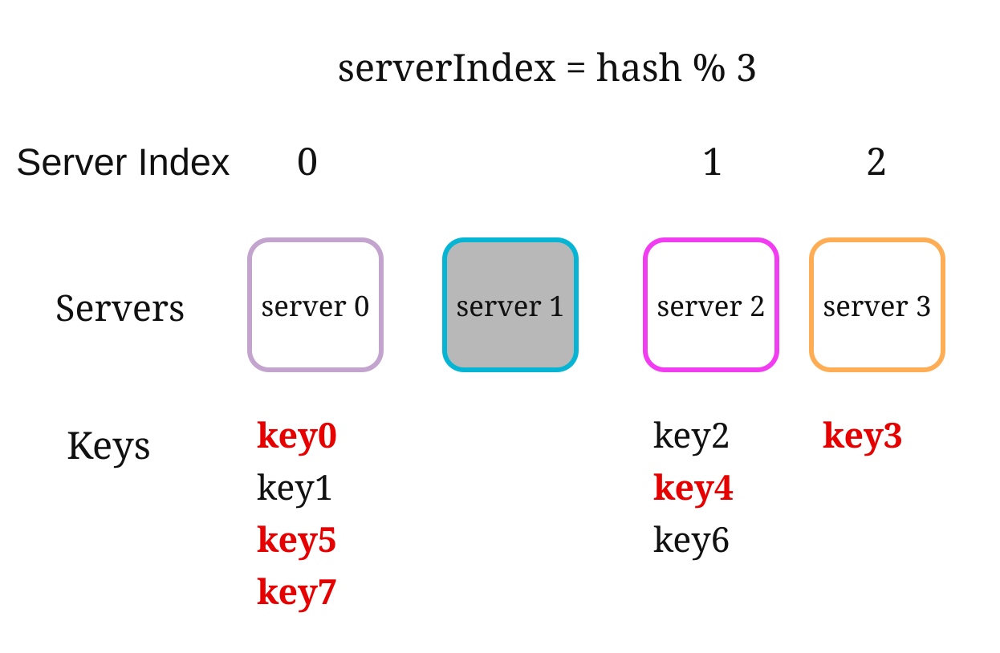

### Key Issue
Redistribution of most keys when server count changes causes inefficiency and overload.

## Consistent Hashing
### Definition
Consistent hashing ensures that only a fraction of keys are remapped when servers are added or removed. This minimizes disruptions and enhances scalability.

### Key Concepts
1. **Hash Space and Ring:** The hash space forms a continuous ring, with hash values distributed from `0` to `2^160-1` (e.g., using a hash function like SHA-1). By connecting both ends, we get a ring.
    

    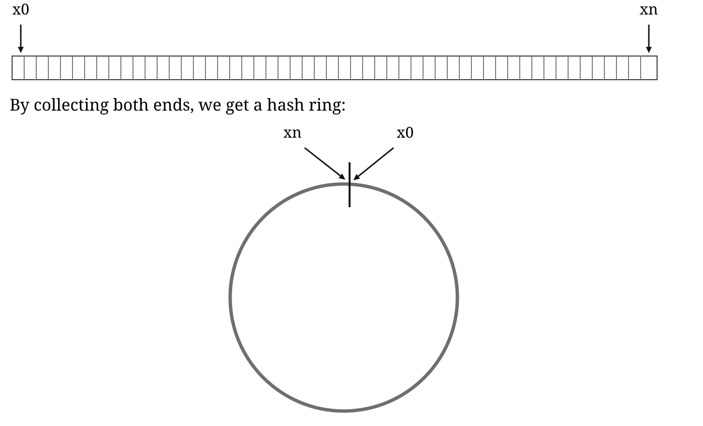
    

- Using the same hash function f, we map servers based on server IP or name onto the ring.

    

    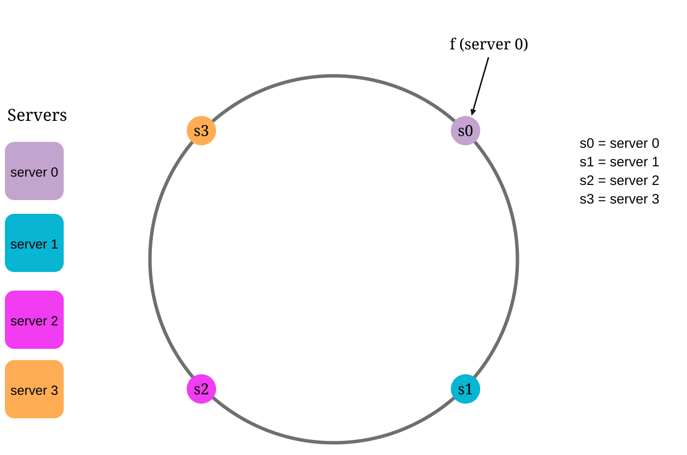
    

1. **Server Lookup**
- A key's server is determined by traversing clockwise on the ring until a server is found.

  

  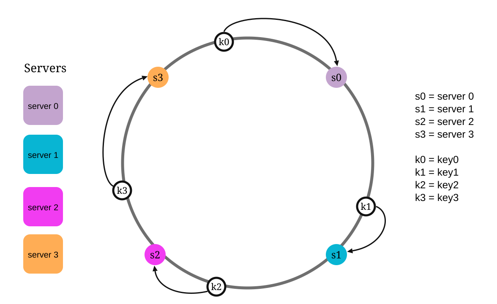
  

2. **Adding and Removing Servers**
- Adding a server redistributes only nearby keys. Only a fraction of keys are redistributed to the new server.

  

  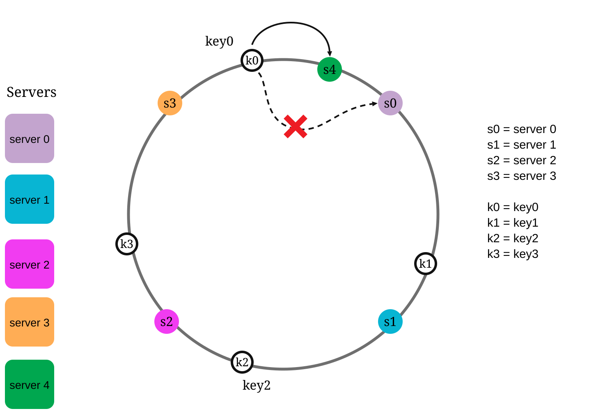
  

- Removing a server affects only the keys in its range. Only keys from the removed server are reassigned to the next server clockwise.

  

  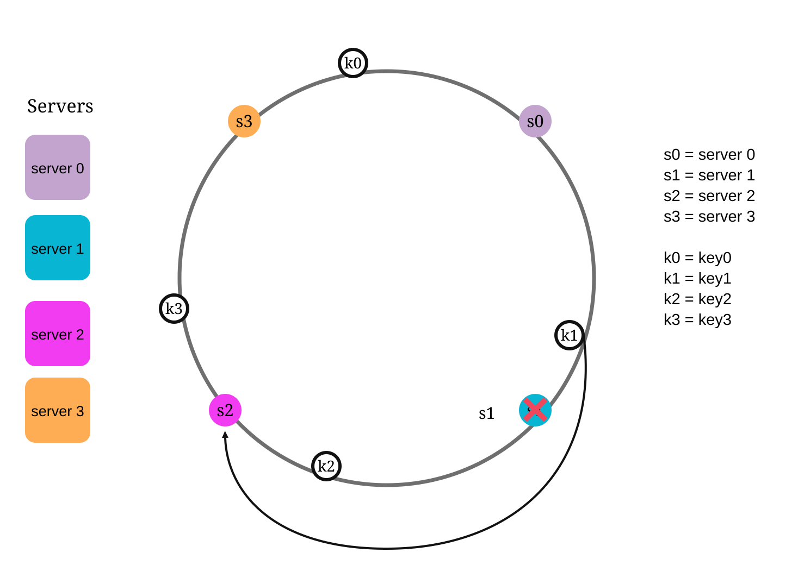
  

## Challenges and Solutions
### Two Issues in Basic Approach
1. **Uneven Partition Sizes:** Servers may have unequal data partitions.
2. **Non-uniform Key Distribution:** Some servers may receive significantly more keys than others.

### Solution: Virtual Nodes

A virtual node refers to the real node, and each server is represented by multiple virtual nodes on the ring.

In the below image, both server 0 and server 1 have 3 virtual nodes. The 3 is arbitrarily chosen; and in real-world systems, the number of virtual nodes is much larger. Instead of using `s0`, we have `s0_0`, `s0_1`, and `s0_2` to represent server 0 on the ring. Similarly, `s1_0`, `s1_1`, and `s1_2` represent server 1 on the ring. With virtual nodes, each server is responsible for multiple partitions. Partitions (edges) with label `s0` are managed by server 0. On the other hand, partitions with label s1 are managed by server 1.

  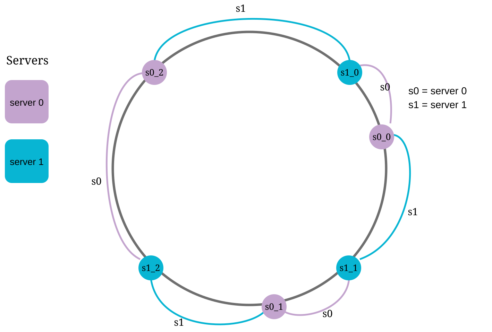

To find which server a key is stored on, we go clockwise from the key’s location and find the first virtual node encountered on the ring. In the below image, to find out which server `k0` is stored on, we go clockwise from `k0`’s location and find virtual node `s1_1`, which refers to server 1.

  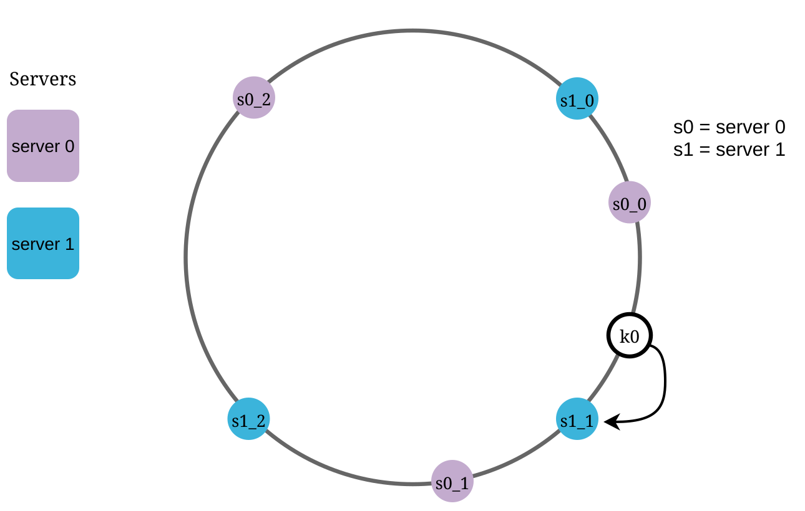

As the number of virtual nodes increases, the distribution of keys becomes more balanced. This is because the standard deviation gets smaller with more virtual nodes, leading to balanced data distribution.

However, more spaces are needed to store data about virtual nodes. This is a tradeoff, and we can tune the number of virtual nodes to fit our system requirements.

### Affected Keys
When servers are added or removed:
- **Added Server:** Affected keys are those between the new server and its predecessor.
  In the following example `server 4` is added onto the ring. The affected range starts from s4 (newly
  added node) and moves anticlockwise around the ring until a server is found (`s3`). Thus, keys
  located between `s3` and `s4` need to be redistributed to `s4`.

  

  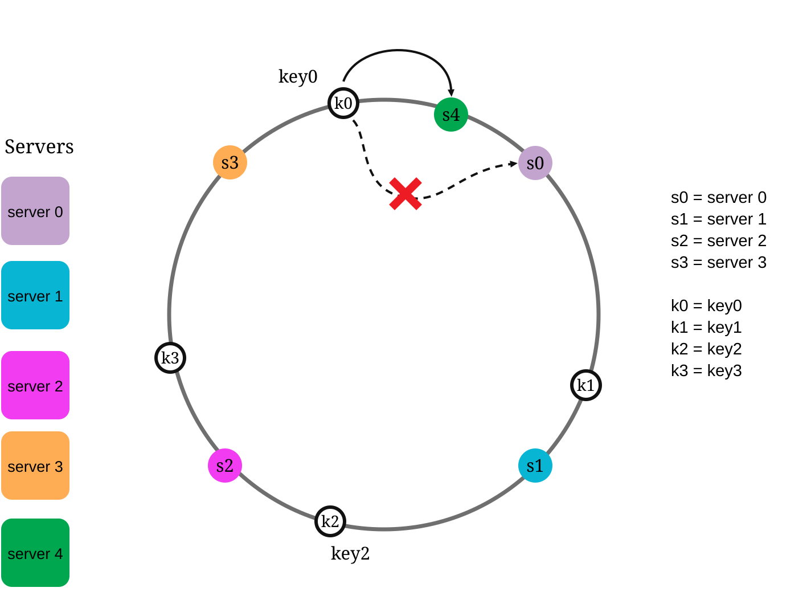
  

- **Removed Server:** Affected keys are those between the removed server and its predecessor. In the following example, when a server (`s1`) is removed, the affected range starts from `s1`
(removed node) and moves anticlockwise around the ring until a server is found (`s0`). Thus, keys located between `s0` and `s1` must be redistributed to `s2`.

  

  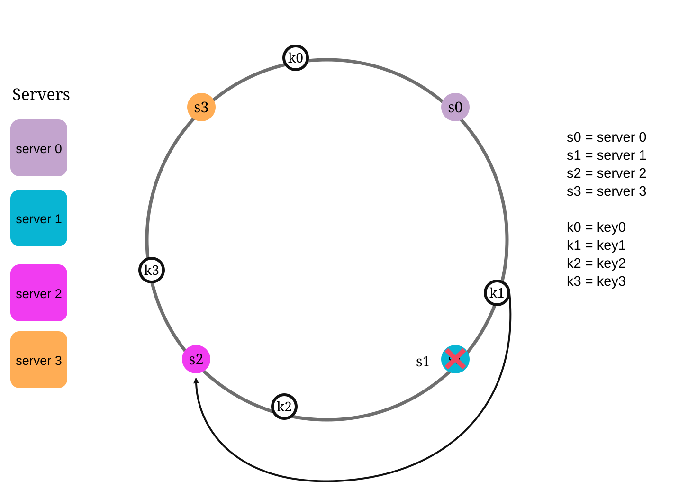
  

## Benefits of Consistent Hashing
- **Minimized Redistribution:** Only a fraction of keys are reassigned.
- **Scalability:** Enables horizontal scaling.
- **Mitigates Hotspots:** Balances data distribution to avoid server overload.

## Real-World Applications
- Amazon Dynamo DB
- Apache Cassandra
- Discord
- Akamai CDN
- Maglev Load Balancer

## Reference materials

1. [Consistent hashing — Wikipedia overview](https://en.wikipedia.org/wiki/Consistent_hashing)
2. [Consistent Hashing — Tom White’s practical Java guide](https://tom-e-white.com/2007/11/consistent-hashing.html)
3. [Dynamo: Amazon’s Highly Available Key-value Store](https://www.allthingsdistributed.com/files/amazon-dynamo-sosp2007.pdf)
4. [Cassandra - A Decentralized Structured Storage System](http://www.cs.cornell.edu/Projects/ladis2009/papers/Lakshman-ladis2009.PDF)
5. [How Discord Scaled Elixir to 5,000,000 Concurrent Users](https://blog.discord.com/scaling-elixir-f9b8e1e7c29b)
6. [CS168: The Modern Algorithmic Toolbox Lecture #1: Introduction and Consistent Hashing](http://theory.stanford.edu/~tim/s16/l/l1.pdf)
7. [Maglev: A Fast and Reliable Software Network Load Balancer](https://static.googleusercontent.com/media/research.google.com/en//pubs/archive/44824.pdf)
