# Chapter 5: Design Consistent Hashing
[Back to System Design](../Readme.md#content)

## Introduction
This chapter explores consistent hashing, a technique essential for achieving horizontal scaling by efficiently distributing requests and data across servers. It minimizes data redistribution when servers are added or removed and ensures an even distribution of data to mitigate issues like server hotspots.

## The rehashing problem

If you have `n` cache servers, a common way to balance the load is to use the following hash method:

`serverIndex = hash(key) % N`, where `N` is the size of the server pool.

To find the server where a key is stored, we perform the modular operation f(key) % 4. For instance, `hash(key0) % 4 = 1` means a client must contact `server 1` to fetch the cached data.

The image below shows the distribution of keys.

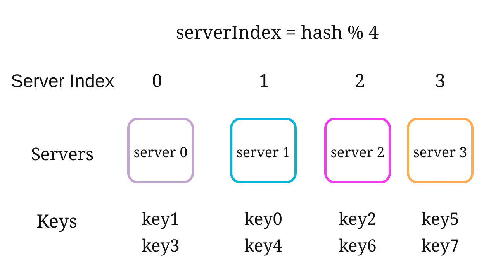

This approach works well when the size of the server pool is fixed and the data distribution is even. However, problems arise when new servers are added or existing servers are removed.

For example, if `server 1` goes offline, the size of the server pool becomes 3. Using the same hash function, we get the same hash value for a key. But applying the modular operation gives us different server indexes because the number of servers is reduced by 1. The image below shows the new distribution of keys.

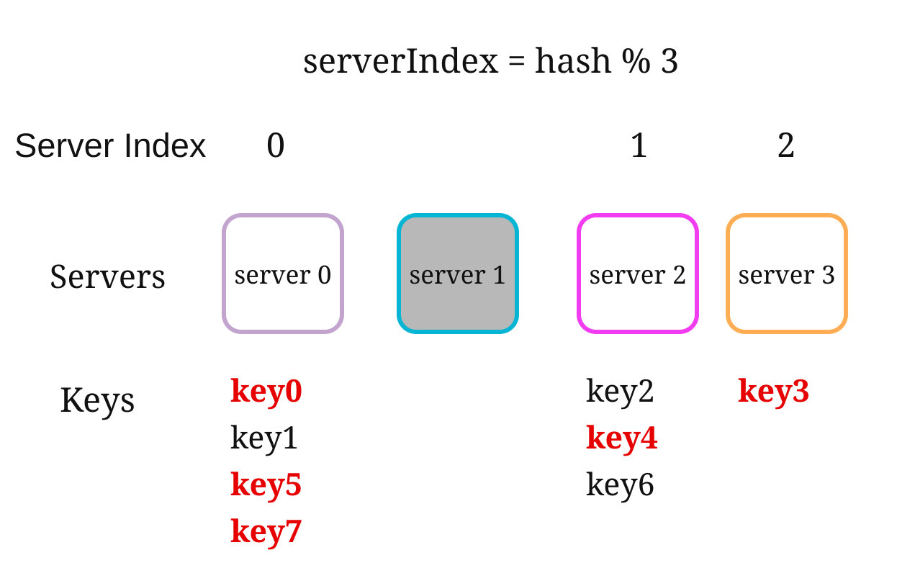

Redistribution of most keys when the server count changes causes inefficiency and overload. This causes a storm of cache misses.

## Consistent hashing

**Consistent hashing** is a special kind of hashing technique such that when a hash table is resized, only `n/m` keys need to be remapped on average, where `n` is the number of keys and `m` is the number of slots. In contrast, in most traditional hash tables, a change in the number of array slots causes nearly all keys to be remapped because the mapping between the keys and the slots is defined by a modular operation.

### Hash space and hash ring

Assume SHA-1 is used as the hash function `f`, and the output range of the hash function is `x0`, `x1`, `x2`, `x3`, ..., `xn`. In cryptography, SHA-1's hash space goes from 0 to 2^160-1. That means `x0` corresponds to 0, `xn` corresponds to 2^160-1, and all the other hash values in the middle fall between 0 and 2^160-1. The image below shows the hash space and hash ring.

  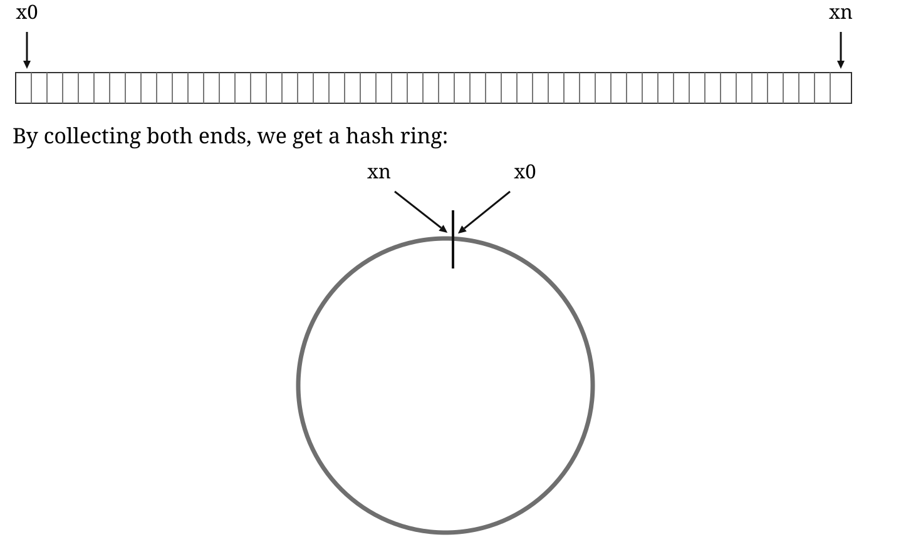

### Hash servers

Using the same hash function f, we map servers based on their IP addresses or names onto the ring.

  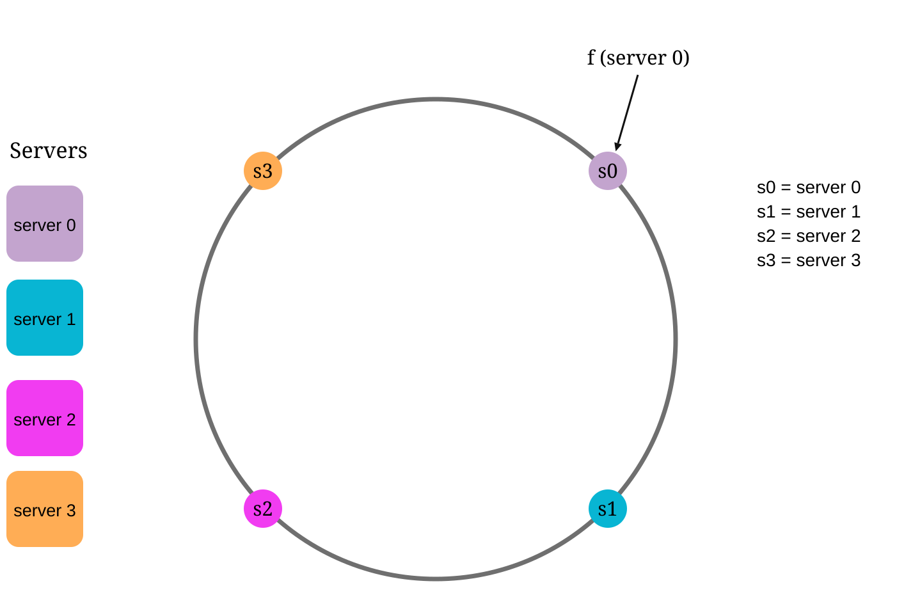

### Hash keys

One thing worth mentioning is that the hash function used here is different from the one in 'The rehashing problem', and there is no modular operation. In the image below, 4 cache keys (`key0`, `key1`, `key2`, and `key3`) are hashed onto the hash ring.

  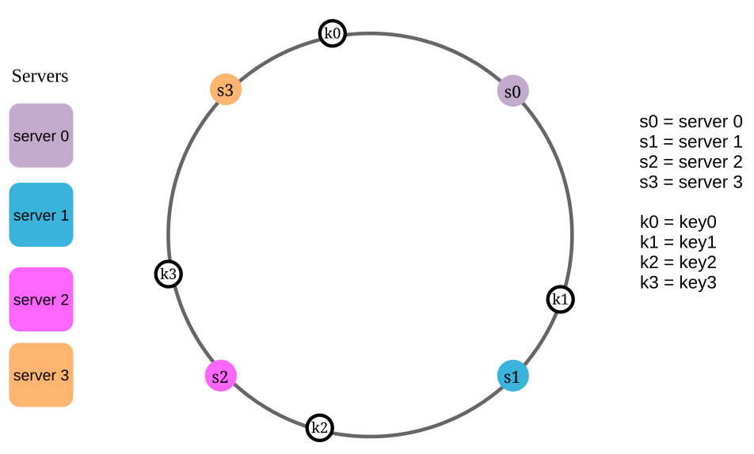

### Server Lookup

A key's server is determined by traversing clockwise on the ring until a server is found.

  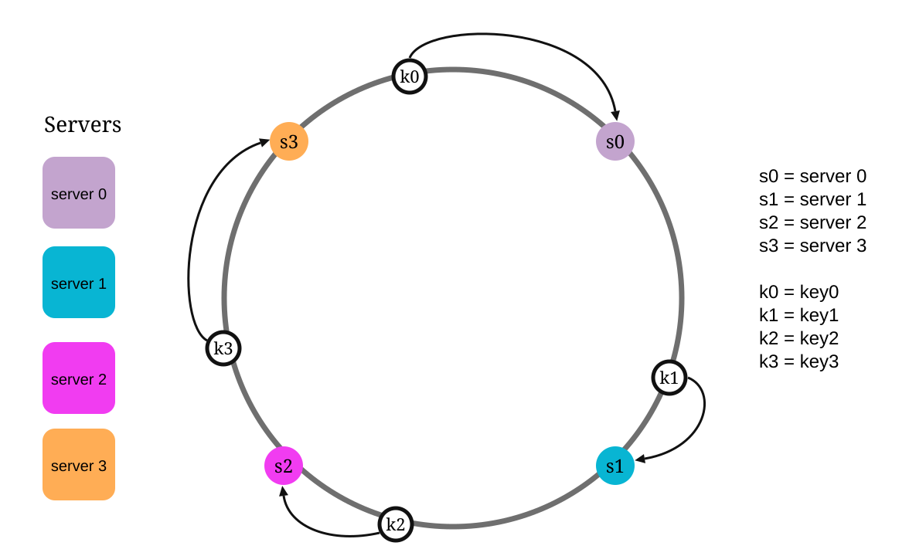

### Add a server

Adding a new server will only require redistribution of a fraction of keys.

  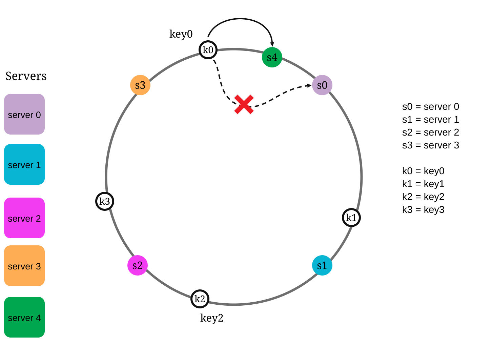

### Remove a server

Removing a server affects only the keys in its range. Only keys from the removed server are reassigned to the next server clockwise.

  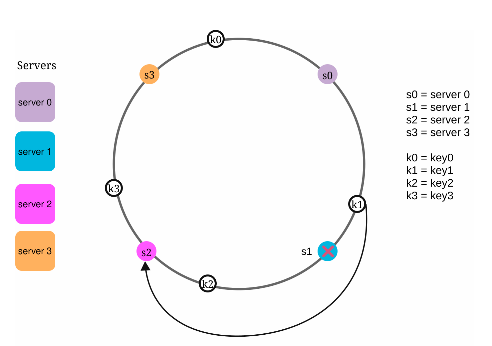

## Challenges and Solutions

### Two Issues in the Basic Approach

The basic steps of the consistent hashing algorithm are:
* Map servers and keys on the ring using a uniformly distributed hash function.
* To find out which server a key is mapped to, go clockwise from the key position until the first server on the ring is found.

Two problems are identified with this approach:
* uneven partition sizes.
* non-uniform key distribution.

#### **Uneven Partition Sizes**

It's impossible to keep partitions on the ring the same size for all servers, considering that a server can be added or removed. A partition is the hash space between adjacent servers. It is possible that the size of the partition on the ring assigned to each server is very small or fairly large. In the image below, if `s1` is removed, `s2`'s partition (highlighted with the bidirectional arrows) is twice as large as the partitions of `s0` and `s3`.

  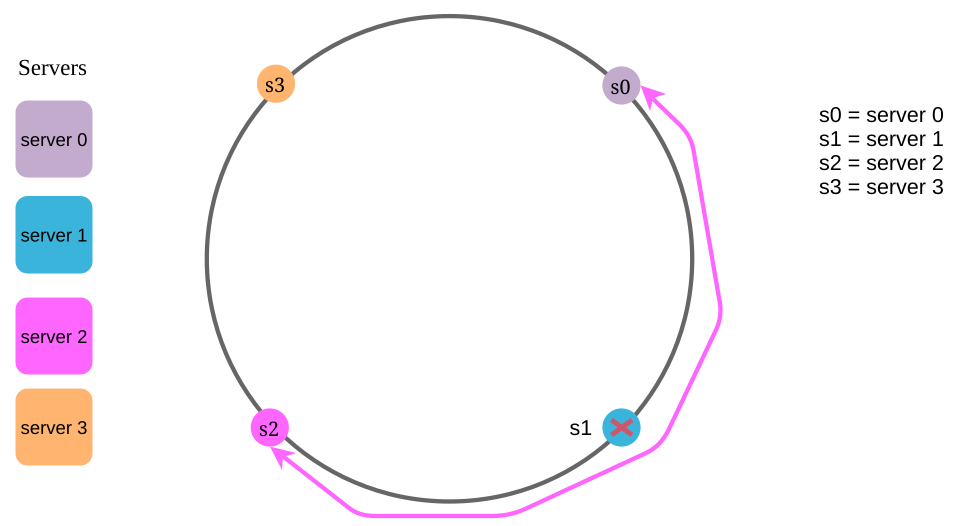

#### **Non-uniform Key Distribution**

It is possible to have a non-uniform key distribution on the ring. For instance, if servers are mapped to the positions shown in the image below, most of the keys are stored on `server 2`. However, `server 1` and `server 3` have no data.

  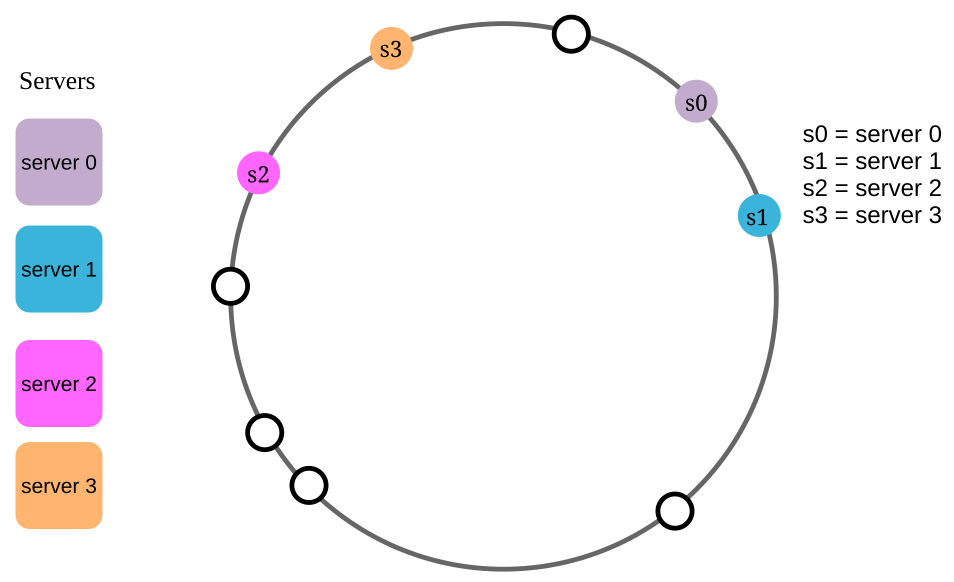

### Solution: Virtual Nodes

A virtual node refers to a real node, and each server is represented by multiple virtual nodes on the ring.

In the image below, both `server 0` and `server 1` have 3 virtual nodes. The number 3 is arbitrarily chosen, and in real-world systems, the number of virtual nodes is much larger. Instead of using `s0`, we have `s0_0`, `s0_1`, and `s0_2` to represent server 0 on the ring. Similarly, `s1_0`, `s1_1`, and `s1_2` represent server 1 on the ring. With virtual nodes, each server is responsible for multiple partitions. Partitions (edges) with the label `s0` are managed by server 0. On the other hand, partitions with the label s1 are managed by server 1.

  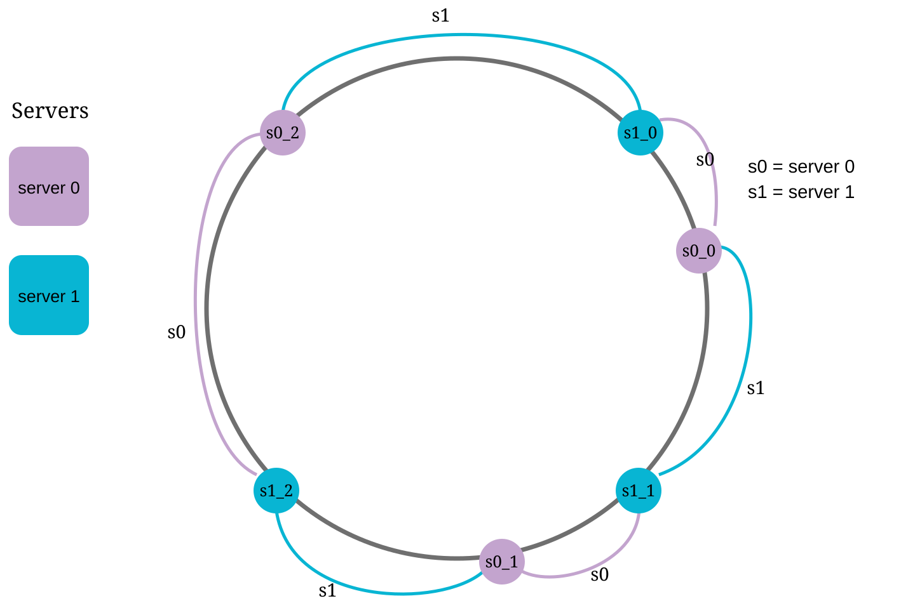

To find which server a key is stored on, we go clockwise from the key’s location and find the first virtual node encountered on the ring. In the image below, to find out which server `k0` is stored on, we go clockwise from `k0`’s location and find virtual node `s1_1`, which refers to server 1.

  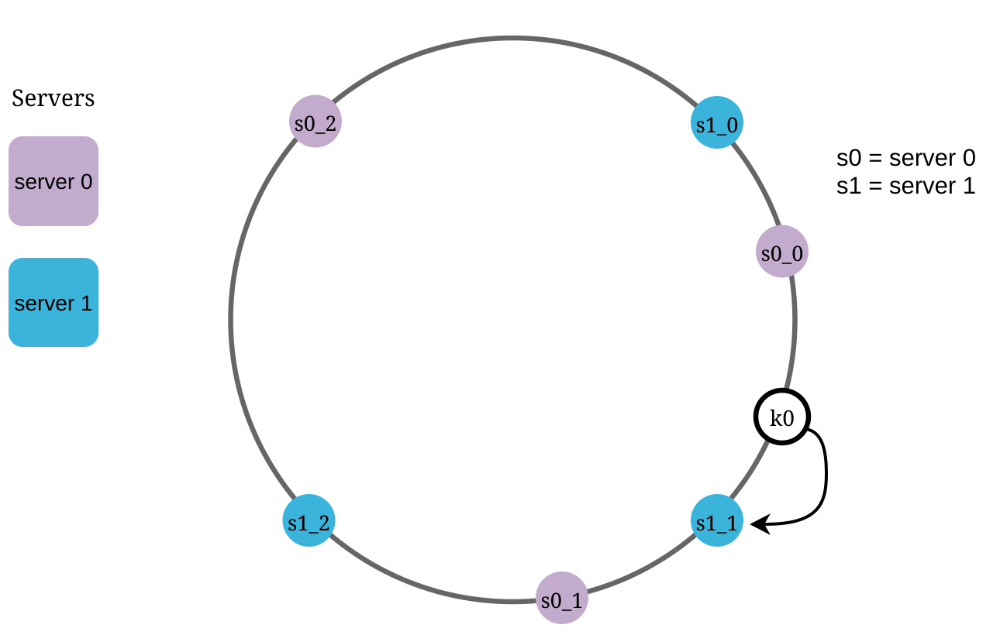

As the number of virtual nodes increases, the distribution of keys becomes more balanced. This is because the standard deviation gets smaller with more virtual nodes, leading to balanced data distribution.

However, more space is needed to store data about virtual nodes. This is a tradeoff, and we can tune the number of virtual nodes to fit our system requirements.

### Find Affected Keys

When a server is added or removed, a fraction of data needs to be redistributed.

#### **Add a server:**

In the image below, `server 4` is added onto the ring. The affected range starts from `s4` (the newly
added node) and moves anticlockwise around the ring until a server is found (`s3`). Thus, keys
located between `s3` and `s4` need to be redistributed to `s4`.

  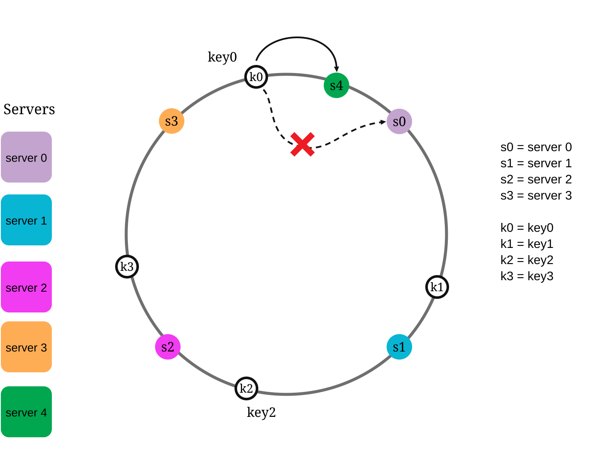

#### **Remove a server:**

In the image below, when a server (`s1`) is removed, the affected range starts from `s1`
(the removed node) and moves anticlockwise around the ring until a server is found (`s0`). Thus, keys located between `s0` and `s1` must be redistributed to `s2`.

  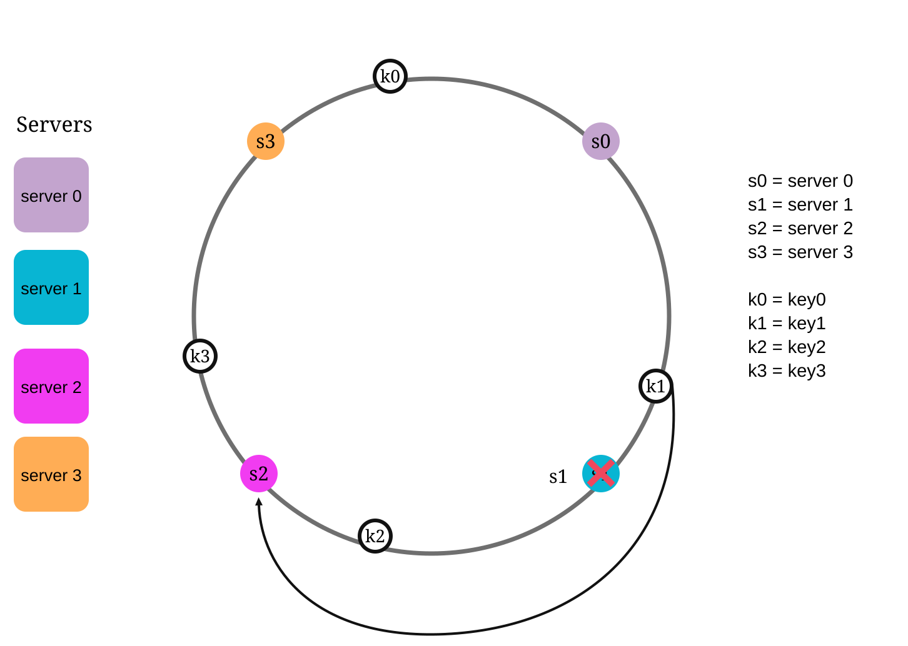

## Wrap-up

### Benefits of Consistent Hashing
- **Minimized Redistribution:** Only a fraction of keys are reassigned.
- **Scalability:** Enables horizontal scaling.
- **Mitigates Hotspots:** Balances data distribution to avoid server overload.

### Real-World Applications
- Amazon DynamoDB
- Apache Cassandra
- Discord
- Akamai CDN
- Maglev Load Balancer

## Reference materials

1. [Consistent hashing — Wikipedia overview](https://en.wikipedia.org/wiki/Consistent_hashing)
2. [Consistent Hashing — Tom White’s practical Java guide](https://tom-e-white.com/2007/11/consistent-hashing.html)
3. [Dynamo: Amazon’s Highly Available Key-value Store](https://www.allthingsdistributed.com/files/amazon-dynamo-sosp2007.pdf)
4. [Cassandra - A Decentralized Structured Storage System](http://www.cs.cornell.edu/Projects/ladis2009/papers/Lakshman-ladis2009.PDF)
5. [How Discord Scaled Elixir to 5,000,000 Concurrent Users](https://blog.discord.com/scaling-elixir-f9b8e1e7c29b)
6. [CS168: The Modern Algorithmic Toolbox Lecture #1: Introduction and Consistent Hashing](http://theory.stanford.edu/~tim/s16/l/l1.pdf)
7. [Maglev: A Fast and Reliable Software Network Load Balancer](https://static.googleusercontent.com/media/research.google.com/en//pubs/archive/44824.pdf)
