# Chapter 8: Design a URL Shortener
[Back to System Design](../Readme.md#content)

## Introduction
This chapter discusses the design of a URL shortening service like TinyURL. The system's main goals include **URL shortening**, **redirecting**, and **high scalability** to handle large traffic volumes.

## Step 1: Understand the Problem and Establish Design Scope

### Requirements
- Shortened URLs must be **unique** and as **short as possible**.
- Handle **100 million URL generations per day** with a 10-year support capacity.
- Support **efficient read operations** with a 10:1 read-to-write ratio.
- Store 365 billion records, requiring approximately **365 TB** of storage over 10 years.

## Step 2: Propose High-Level Design and Get Buy-In

### API Endpoints

1. **URL Shortening:**
   - Endpoint: `POST api/v1/data/shorten`
   - Parameters: `{longUrl: longURLString}`
   - Returns: `shortURL`
2. **URL Redirecting:**
   - Endpoint: `GET api/v1/shortUrl`
   - Returns: `longURL` for redirection.

### URL Redirection

The image below shows what happens when you enter a TinyURL into the browser. Once the server receives a TinyURL request, it changes the short URL to the long URL with a 301 redirect.

    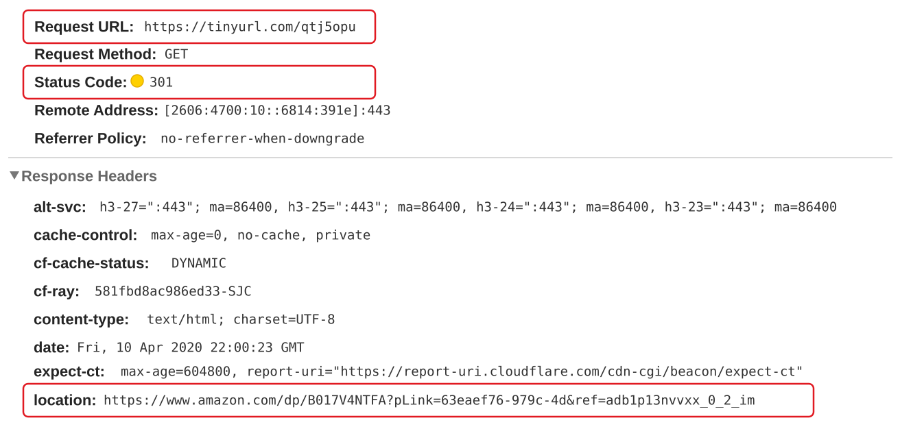

The detailed communication between clients and servers is shown in the image below.

    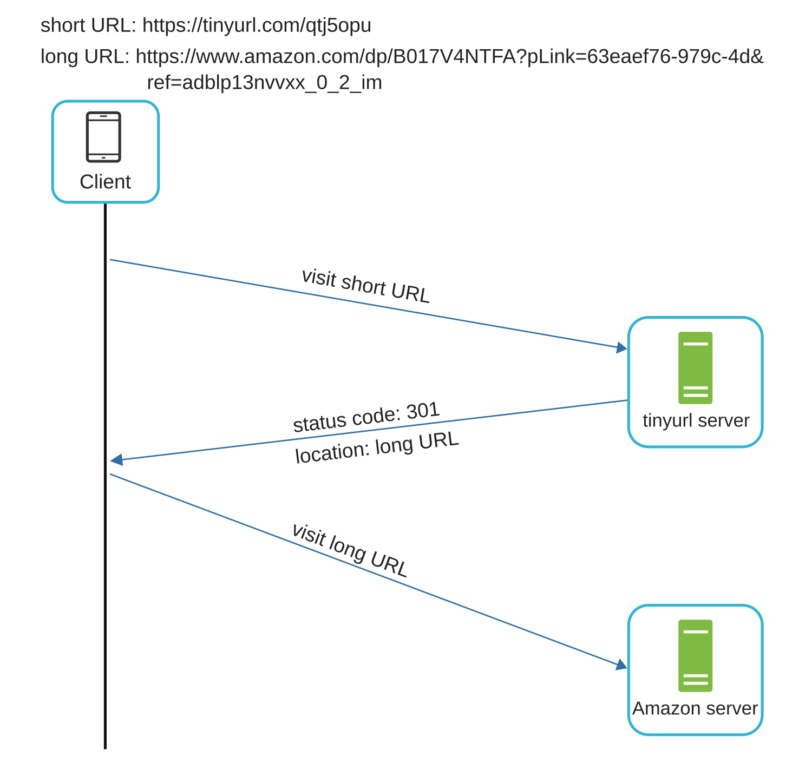

- **301 Redirect:** A 301 redirect shows that the requested URL is "permanently" moved to the long URL. Since it is permanently redirected, the browser caches the response, and subsequent requests for the same URL will not be sent to the URL shortening service. Instead, requests are redirected to the long URL server directly.
- **302 Redirect:** A 302 redirect means that the URL is "temporarily" moved to the long URL, meaning that subsequent requests for the same URL will be sent to the URL shortening service first. Then, they are redirected to the long URL server.

Each redirection method has its pros and cons. If the priority is to reduce the server load, using a 301 redirect makes sense as only the first request for the same URL is sent to URL shortening servers. However, if analytics is important, a 302 redirect is a better choice as it can track the click rate and source of each click more easily.

The most intuitive way to implement URL redirecting is to use hash tables. Assuming the hash table stores `<shortURL, longURL>` pairs, URL redirecting can be implemented as follows:
* Get `longURL`: `longURL = hashTable.get(shortURL)`
* Once you get the `longURL`, perform the URL redirect.

### URL shortening

Let us assume the short URL looks like this: `www.tinyurl.com/{hashValue}`. To support the URL shortening use case, we must find a hash function *fx* that maps a long URL to the `hashValue`, as shown in the image below.

    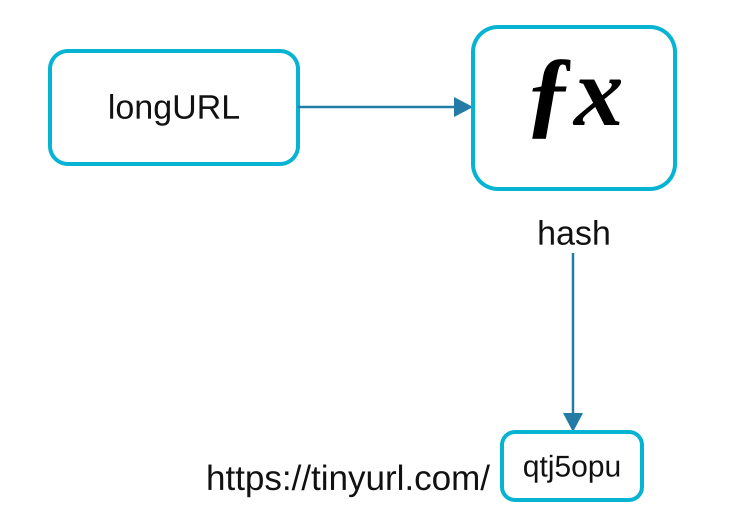

The hash function must satisfy the following requirements:
* Each `longURL` must be hashed to one `hashValue`.
* Each `hashValue` can be mapped back to the `longURL`.

## Step 3: Design Deep Dive

### Data Model

Store `<shortURL, longURL>` mappings in a relational database to optimize memory usage.

The image below shows a simple database table design.

    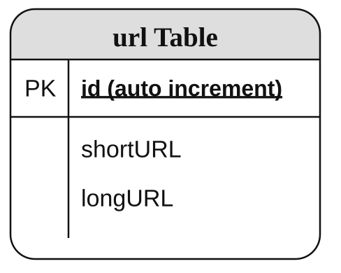

The simplified version of the table contains 3 columns: `id`, `shortURL`, and `longURL`.

### Hash Function

#### **Hash value length**

The `hashValue` consists of characters from the set [0-9,a-z,A-Z], which contains 10 + 26 + 26 = 62 possible characters.

The image below shows the length of `hashValue` and the corresponding maximal number of URLs it can support.

    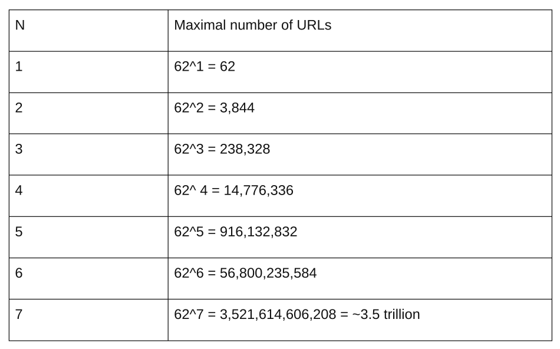

For n = 7, it's ~3.5 trillion unique URLs. That is more than enough.

#### **Hash + Collision Resolution**

To shorten a long URL, we should implement a hash function that hashes a long URL to a 7-character string. A straightforward solution is to use a well-known hash function like CRC32, MD5, or SHA-1. The following table compares the hash results after applying different hash functions to this URL: `https://en.wikipedia.org/wiki/Systems_design`.

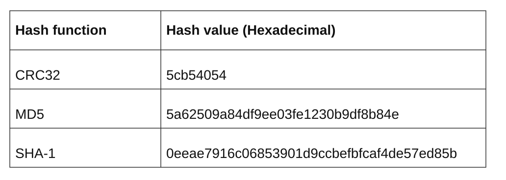

- One approach is to collect the first 7 characters of a hash value; however, this method can lead to hash collisions.
- To resolve collisions, recursively append a new predefined string until there are no more collisions, but this is expensive as it requires querying the database to check if a `shortURL` exists for every request.

    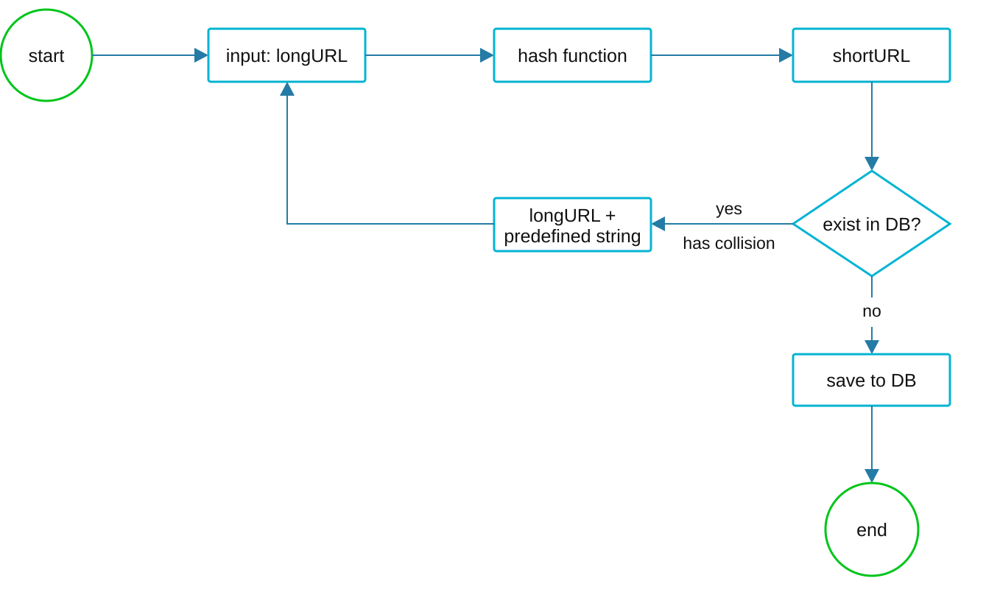

- Resolve collisions with **Bloom Filters** [[2]](#ref-2) for efficient lookup.

#### **Base 62 Conversion:**

Base conversion is another approach commonly used for URL shorteners. Base conversion helps to convert the same number between different number representation systems. Base 62 conversion is used as there are 62 possible characters for `hashValue`. Let us use an example to explain how the conversion works: convert 1115710 to its base 62 representation (1115710 represents 11157 in a base 10 system).

As its name suggests, base 62 is a way of using 62 characters for encoding. The mappings are 0-0, ... , 9-9, 10-a, 11-b, ... , 35-z, 36-A, ... , 61-Z, where 'a' stands for 10, 'Z' stands for 61, etc.

1115710 = 2x62^2 + 55x62^1 + 59x62^0 = [2,55,59] -> [2,T,X] in base 62 representation. The image below shows the conversion process.

    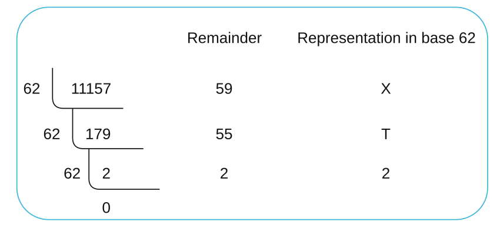

Thus, the short URL is `https://tinyurl.com/2TX`.

### Comparison

    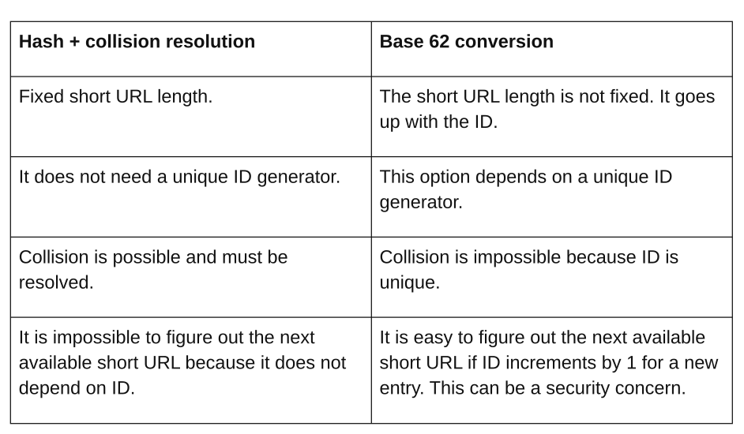

### URL Shortening Flow

We are going to use Base 62 conversion in our design.

    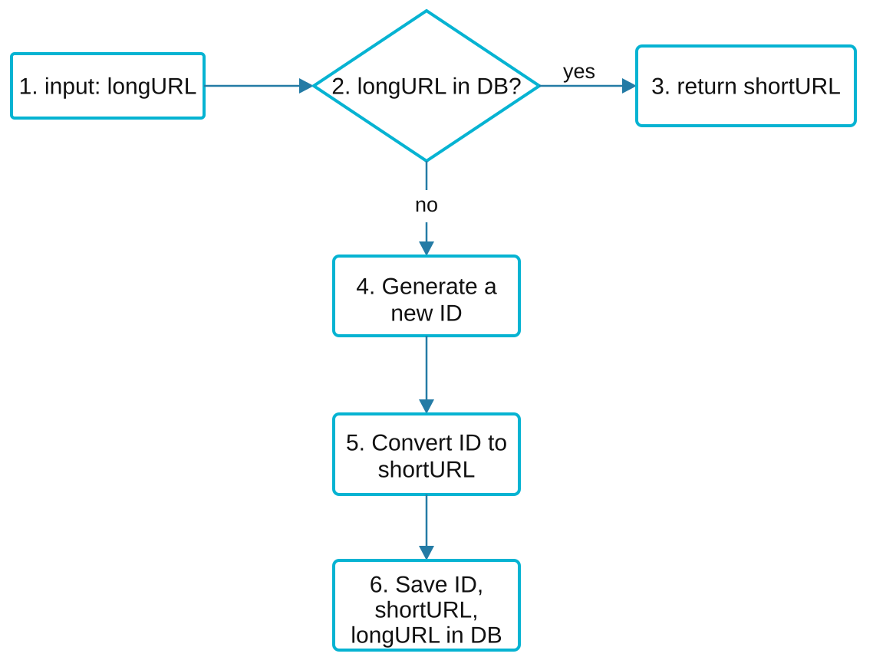

1. `longURL` is the input.
2. The system checks if the `longURL` is in the database.
3. If it is, it means the `longURL` was converted to `shortURL` before. In this case, fetch the `shortURL` from the database and return it to the client.
4. If not, the `longURL` is new. A new unique ID (primary key) is generated by the unique ID generator.
5. Convert the ID to `shortURL` with base 62 conversion.
6. Create a new database row with the `ID`, `shortURL`, and `longURL`.

Let's see how it works:
* The input URL is `https://en.wikipedia.org/wiki/Systems_design`.
* The unique ID generator returns 2009215674938.
* Convert the ID to `shortURL` using the base 62 conversion. The ID (2009215674938) is converted to "zn9edcu".
* The result is shown in the image below.

    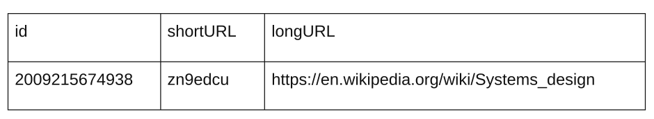

To generate a unique ID, use the approach from the previous chapter.

### URL Redirecting Flow

The image below shows the detailed design of URL redirecting.
As there are more reads than writes, the `<shortURL, longURL>` mapping is stored in a cache to improve performance.

    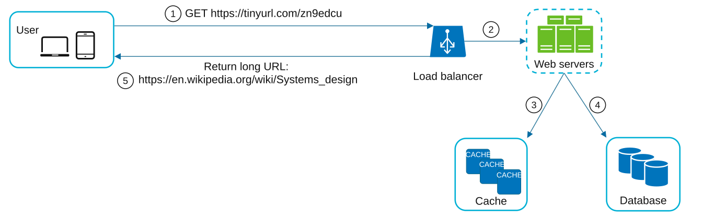

1. A user clicks a short URL link: `https://tinyurl.com/zn9edcu`.
2. The load balancer forwards the request to web servers.
3. If a `shortURL` is already in the cache, return the `longURL` directly.
4. If a `shortURL` is not in the cache, fetch the `longURL` from the database. If it is not in the database, it is likely that a user entered an invalid `shortURL`.
5. The `longURL` is returned to the user.

## Step 4: Wrap Up

### Rate Limiter
- Prevent abuse by setting limits on requests per IP.

### Scalability
1. **Web Tier:** Stateless, scalable by adding/removing web servers.
2. **Database Tier:** Use replication and sharding.

### Analytics
- Collect data like click rates, source, and timestamps for business insights.

### High Availability and Reliability
- Ensure consistent and reliable services using database replication and fault-tolerant design.

## Reference materials

1. [A RESTful Tutorial](https://www.restapitutorial.com/index.html)
2. [Bloom filter](https://en.wikipedia.org/wiki/Bloom_filter)
