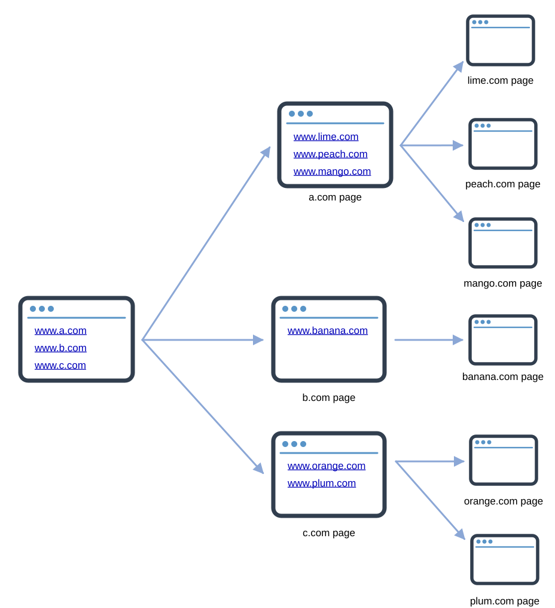
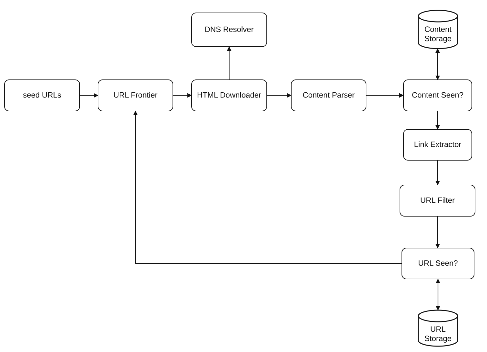
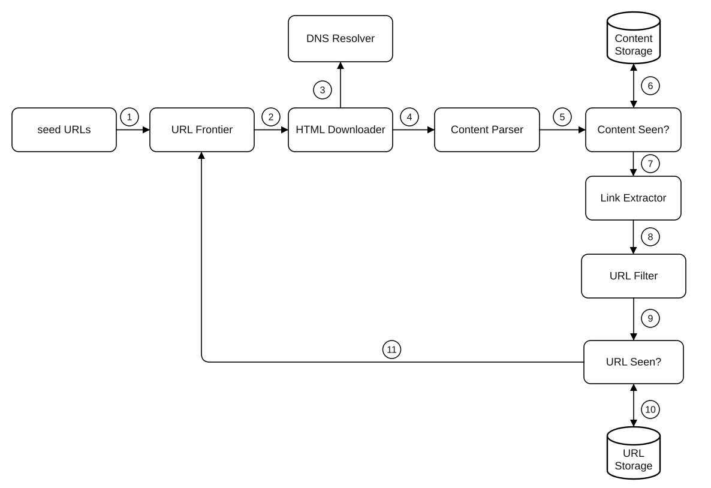
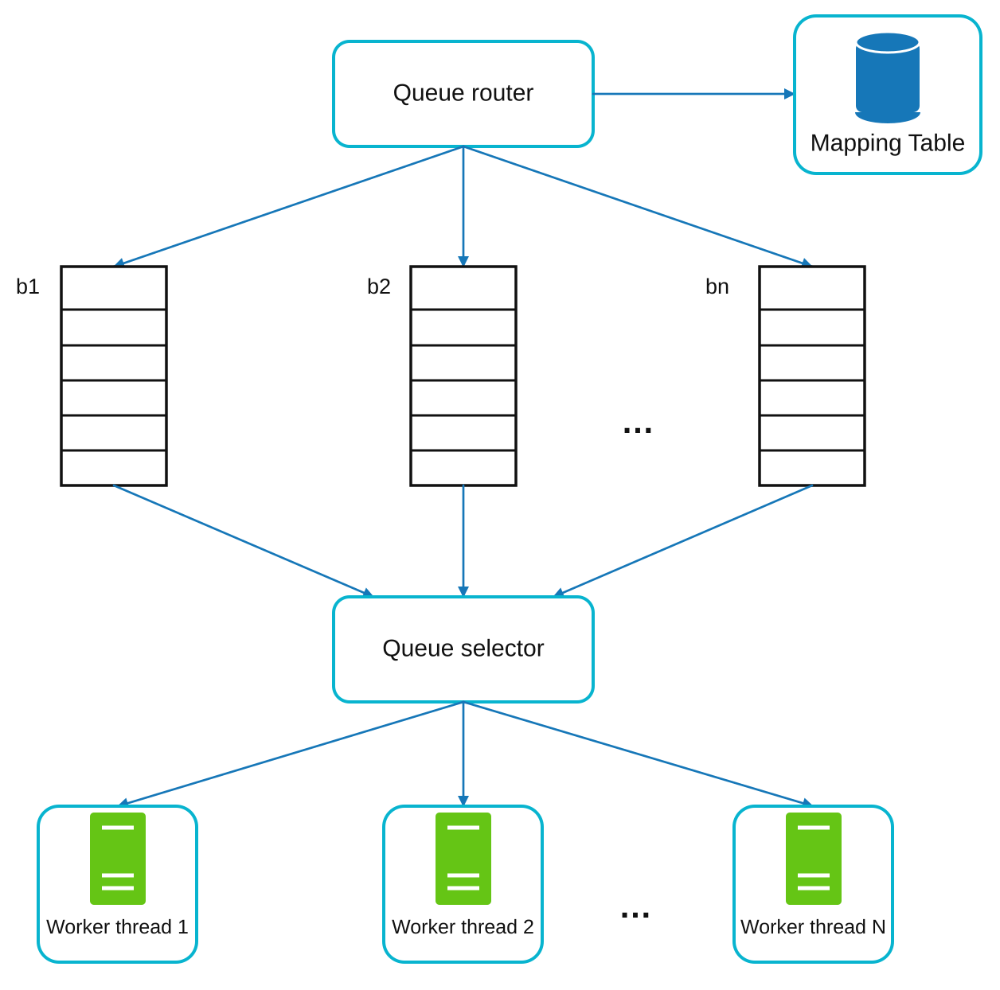
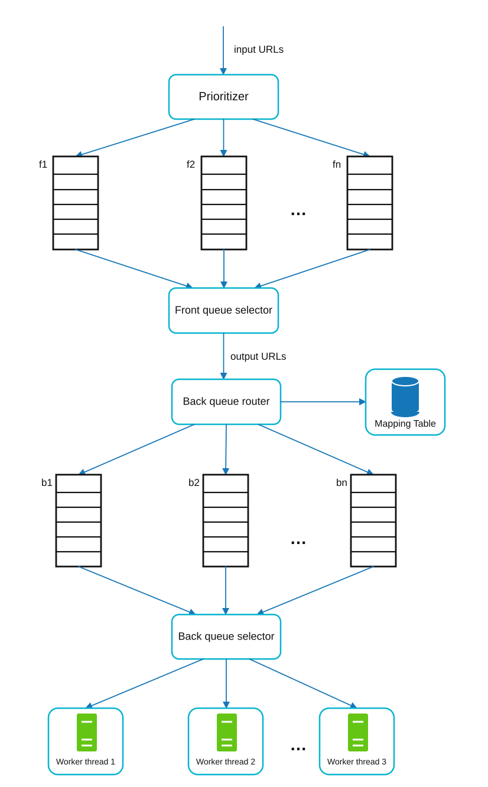
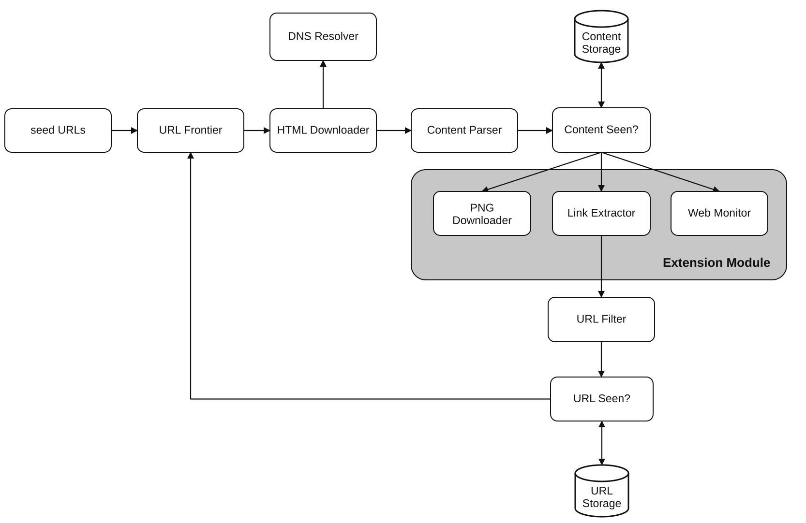

# Chapter 9: Design a Web Crawler
[Back to System Design](../Readme.md#content)

## Introduction
A **web crawler**, also known as a spider or robot, is used to discover and collect web content, such as web pages, images, and videos. This chapter focuses on designing a scalable web crawler for **search engine indexing**.

Visual example of the crawl process:

### Applications of Web Crawlers
1. **Search Engine Indexing:** Collect web pages to create searchable indexes (e.g., Googlebot).
2. **Web Archiving:** Preserve web data for future use (e.g., US Library of Congress).
3. **Web Mining:** Extract knowledge from web data (e.g., financial analysis of shareholder reports).
4. **Web Monitoring:** Detect copyright or trademark infringements.

### Design Challenges
A good web crawler must address:
- **Scalability:** Handle billions of pages using parallelization.
- **Robustness:** Manage bad HTML, crashes, and malicious links.
- **Politeness:** Avoid overwhelming servers with too many requests.
- **Extensibility:** Support new content types with minimal changes.

---

## Step 1: Understanding the Problem

Here's a set of potential questions between Candidate and Interviewer:

* C: What is the main purpose of the crawler? Is it used for search engine indexing, data mining, or something else?
* I: Search engine indexing.
* C: How many web pages does the web crawler collect per month?
* I: 1 billion pages.
* C: What content types are included? HTML only or other content types such as PDFs and images as well?
* I: HTML only.
* C: Shall we consider newly added or edited web pages?
* I: Yes, we should consider the newly added or edited web pages.
* C: Do we need to store HTML pages crawled from the web?
* I: Yes, up to 5 years
* C: How do we handle web pages with duplicate content?
* I: Pages with duplicate content should be ignored.

### Requirements
1. Crawl **1 billion web pages per month** (400 pages/second, peak 800 QPS).
2. Collect **HTML-only content**.
3. Track new and updated pages.
4. Ignore duplicate content.
5. Store crawled data for **5 years**, requiring ~30 PB of storage.

---

## Step 2: High-Level Design

### Components

1. **Seed URLs:** Starting points for the crawler.
    - They need to be selected as good starting points that a crawler can use to traverse as many links as possible.
    - They can be based on locality, popular websites, or topics.
    - Strategies: Categorize by locality or topic (e.g., sports, healthcare).

2. **URL Frontier:** Stores URLs to be downloaded.
   - Implemented as a **FIFO queue**.

3. **HTML Downloader:** Downloads web pages from URLs provided by the URL Frontier.

4. **DNS Resolver:** Converts URLs to IP addresses.

5. **Content Parser:** Validates and parses web pages.
   - Discards malformed pages.

6. **Content Seen?:** Checks for duplicate content using hash comparisons (compare the hash values of the two web pages).

7. **Content Storage:** Stores HTML pages on disk (popular content in memory to reduce latency).

8. **URL Extractor:** Extracts new links from parsed pages.

9. **URL Filter:** Excludes blacklisted or erroneous URLs.

10. **URL Seen?** Tracks visited URLs to avoid duplication.
    - Bloom filter and hash table are common techniques to implement the “URL Seen?” component.

11. **URL Storage:** Stores already visited URLs.

---

### Workflow

1. Add **Seed URLs** to the **URL Frontier**
2. **HTML Downloader** fetches a list of URLs from **URL Frontier**.
3. **HTML Downloader** gets IP addresses of URLs from **DNS resolver** and starts downloading.
4. **Content Parser** parses HTML pages and checks if pages are malformed.
5. After content is parsed and validated, it is passed to the **Content Seen?** component.
6. **Content Seen?** component checks if a HTML page is already in the storage.
    - If it is in the storage, this means the same content in a different URL has already been processed. In this case, the HTML page is discarded.
    - If it is not in the storage, the system has not processed the same content before. The content is passed to **Link Extractor**.
7. **Link extractor** extracts links from HTML pages.
8. Extracted links are passed to the **URL filter**. 
9. After links are filtered, they are passed to the **URL Seen?** component.
10. **URL Seen** component checks if a URL is already in the storage, if yes, it is processed before, and nothing needs to be done.
11. If a URL has not been processed before, it is added to the URL Frontier.

---

## Step 3: Deep Dive into Key Components
### DFS/BFS
- The web can be thought of as a directed graph where web pages are nodes and hyperlinks (URLs) are edges.
- BFS is usually used for graph traversal because the depth can be very large; thus, DFS is not ideal.
- Standard BFS does not take the priority of a URL into consideration. Not every page has the same level of quality and importance.

### URL Frontier
- **Politeness:**
    - Ensure only one request per host at a time. Add a delay between two download tasks.
    - Use a mapping from hostnames to queues and worker (download) threads.
    - Each downloader thread has a separate FIFO queue and only downloads URLs from that queue.

        

    - **Queue router:** Ensures that each queue (b1, b2, … bn) only contains URLs from the same host.
    - **Mapping table:** It maps each host to a queue.
    - **Queue selector:** Each worker thread is mapped to a FIFO queue, and it only downloads URLs from that queue. The queue selection logic is handled by the queue selector.
    - **Worker thread 1 to N.** A worker thread downloads web pages sequentially from the same host. A delay can be added between two download tasks.

- **Priority:**
    - Assign higher priority to important pages (e.g., by PageRank or update frequency).

        

    - **Prioritizer:** It takes URLs as input and computes the priorities.
    - **Queue f1 to fn:** Each queue has an assigned priority. Queues with high priority are selected with higher probability.
    - **Queue selector:** Randomly choose a queue with a bias towards queues with higher priority.
    - **Front queues:** Manage prioritization.
    - **Back queues:** Manage politeness.

- **Freshness:** Recrawl based on update history or importance.

### HTML Downloader
- **Robots.txt Compliance:** Respect rules in robots.txt files.
- **Performance Optimizations:**
  1. Distributed crawling using multiple servers.
  2. Use a **DNS cache** to avoid repeated lookups.
  3. Geographically distribute crawl servers for faster downloads.
  4. Use a short timeout to avoid slow or unresponsive servers.

### Robustness
1. **Consistent Hashing:** Distribute load among servers effectively.
2. **Error Handling:** Prevent system crashes from exceptions.
3. **Data Validation:** Ensure content integrity.

### Extensibility
- Add modules for new content types (e.g., PNG downloader, web monitor).
- Example: Plug in a module to monitor web content for copyright violations.

    
---

### Avoiding Problematic Content
1. **Duplicate Content:** Detect using hash comparisons.
2. **Spider Traps:** Avoid infinite loops with techniques like URL length limits.
3. **Data Noise:** Filter irrelevant content like ads or spam.

---

## Step 4: Wrap Up
### Key Takeaways
1. Web crawlers must balance scalability, robustness, politeness, and extensibility.
2. **Politeness** prevents overloading servers, while **priority** ensures important pages are crawled first.
3. Efficient storage and error handling are crucial for handling large-scale crawling.

### Additional Considerations
- **Server-Side Rendering:** Handle dynamic content generated by JavaScript or AJAX.
- **Anti-Spam Measures:** Exclude low-quality or irrelevant pages.
- **Database Sharding:** Scale the data layer using replication and sharding.
- **Horizontal Scaling:** Use stateless servers to scale crawl jobs efficiently.
- **Analytics:** Collect and analyze data for insights.

## Reference materials

1. [US Library of Congress](https://www.loc.gov/websites/)
2. [EU Web Archive](http://data.europa.eu/webarchive)
3. [Digimarc](https://www.digimarc.com/products/digimarc-services/piracy-intelligence)
4. [Heydon A., Najork M. Mercator: A scalable, extensible web crawler World Wide Web, 2 (4) (1999), pp. 219-229](https://research.google/pubs/mercator-a-scalable-extensible-web-crawler/)
5. [By Christopher Olston, Marc Najork: Web Crawling](http://infolab.stanford.edu/~olston/publications/crawling_survey.pdf)
6. [29% Of Sites Face Duplicate Content Issues](https://tinyurl.com/y6tmh55y)
7. [Rabin M.O., et al. Fingerprinting by random polynomials Center for Research in Computing Techn., Aiken Computation Laboratory, Univ. (1981)](https://books.google.com/books/about/Fingerprinting_by_Random_Polynomials.html?id=Emu_tgAACAAJ)
8. [B. H. Bloom, “Space/time trade-offs in hash coding with allowable errors,” Communications of the ACM, vol. 13, no. 7, pp. 422–426, 1970.](https://doi.org/10.1145/362686.362692)
9. [Donald J. Patterson, Web Crawling](https://www.ics.uci.edu/~lopes/teaching/cs221W12/slides/Lecture05.pdf)
10. [L. Page, S. Brin, R. Motwani, and T. Winograd, “The PageRank Citation Ranking: Bringing Order to the Web,” Technical Report, Stanford University, 1998 (archived PDF).](https://gwern.net/doc/technology/google/1998-page.pdf)
11. [Google Dynamic Rendering](https://developers.google.com/search/docs/guides/dynamic-rendering)
12. [T. Urvoy, T. Lavergne, and P. Filoche, “Tracking web spam with hidden style similarity,” in Proceedings of the 2nd International Workshop on Adversarial Information Retrieval on the Web, 2006.](https://airweb.cse.lehigh.edu/2006/urvoy.pdf)
13. [H.-T. Lee, D. Leonard, X. Wang, and D. Loguinov, “IRLbot: Scaling to 6 billion pages and beyond,” in Proceedings of the 17th International World Wide Web Conference, 2008.](https://irl.cse.tamu.edu/people/hsin-tsang/papers/www2008.pdf)
