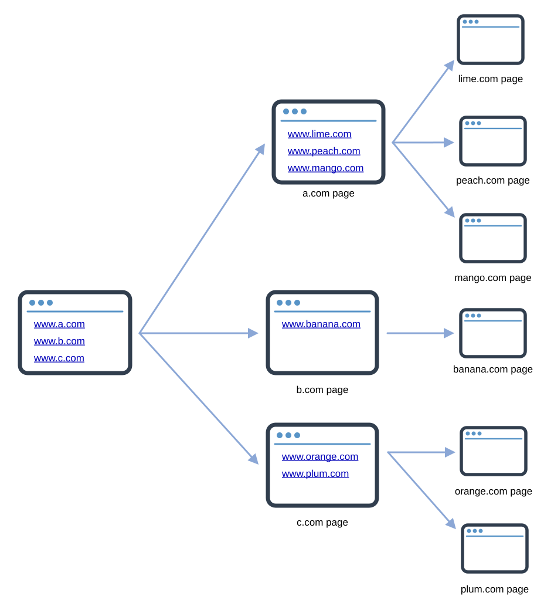
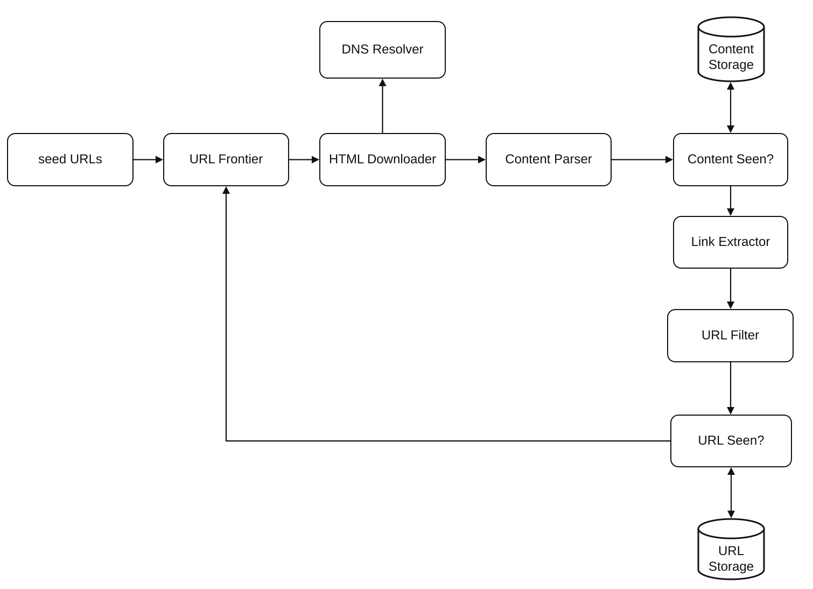
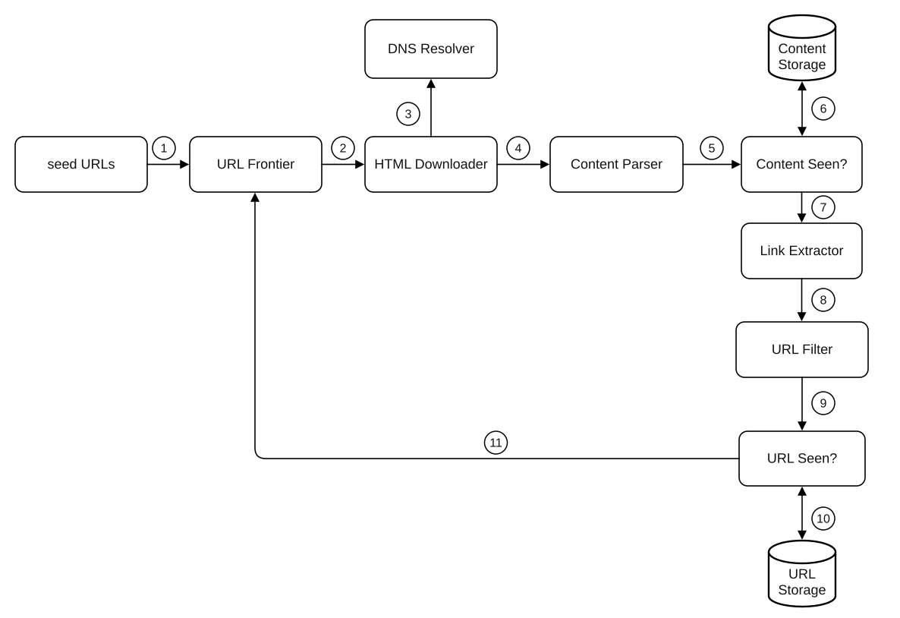
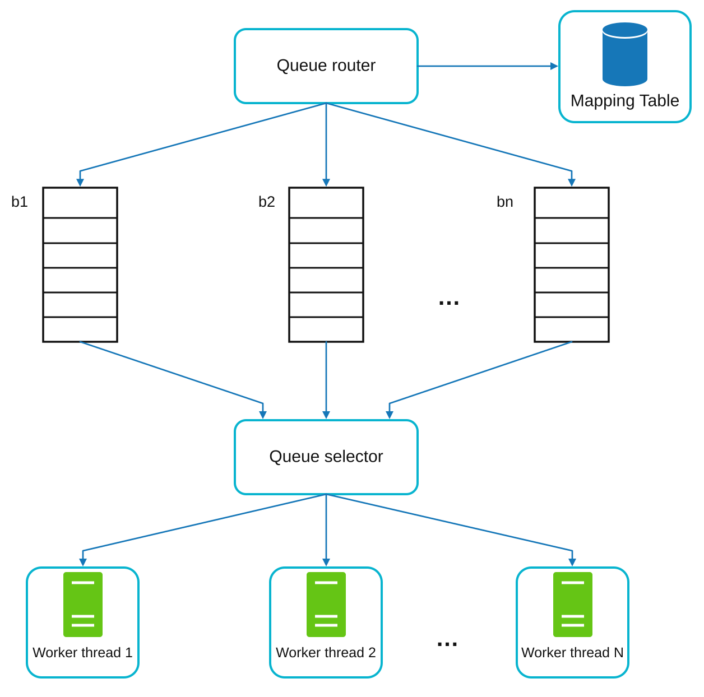
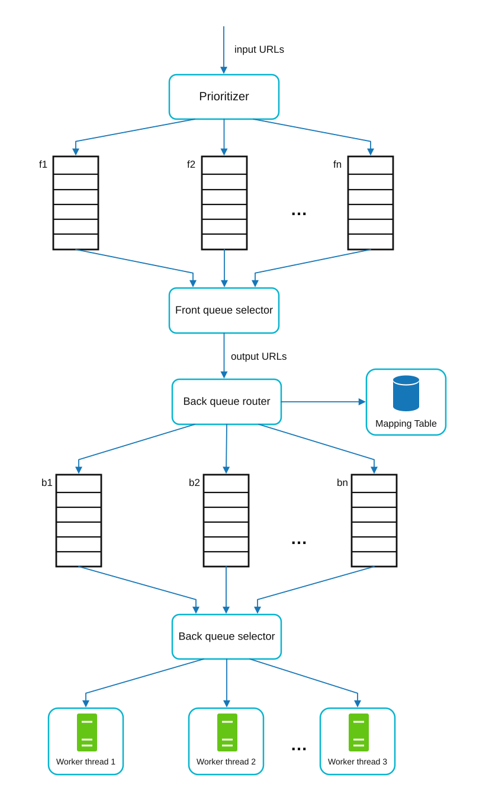
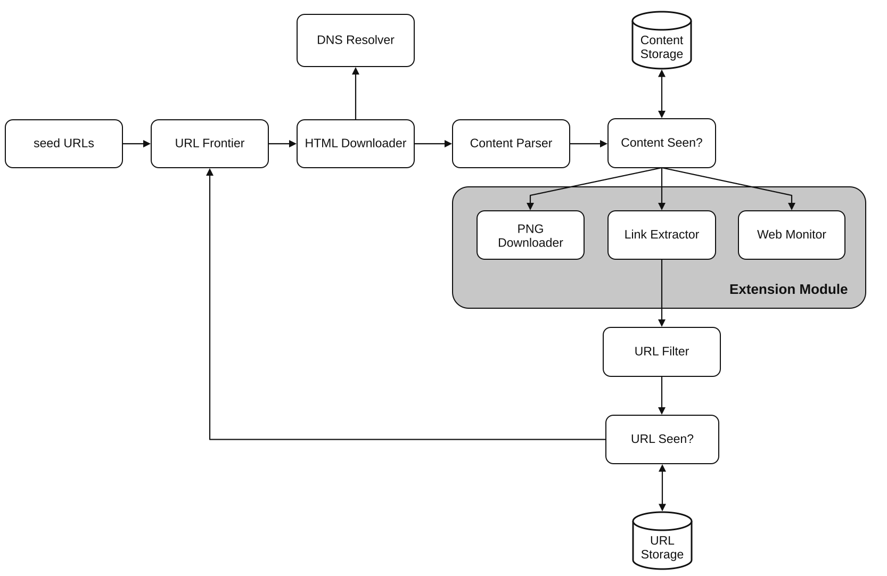

# Chapter 9: Design a Web Crawler

[Back to System Design](../Readme.md#content)

## Introduction

A **web crawler**, also known as a spider or robot, is used to discover and collect web content, such as web pages, images, and videos. This chapter focuses on designing a scalable web crawler for **search engine indexing**.

Visual example of the crawl process:

    

A crawler is used for many purposes:
1. **Search Engine Indexing:** Collect web pages to create searchable indexes (e.g., Googlebot).
2. **Web Archiving:** Preserve web data for future use (e.g., US Library of Congress).
3. **Web Mining:** Extract knowledge from web data (e.g., financial analysis of shareholder reports).
4. **Web Monitoring:** Detect copyright or trademark infringements.

## Step 1: Understanding the Problem

Here's a set of potential questions and answers between a candidate and an interviewer:

* C: What is the main purpose of the crawler? Is it used for search engine indexing, data mining, or something else?
* I: Search engine indexing.
* C: How many web pages does the web crawler collect per month?
* I: 1 billion pages.
* C: What content types are included? HTML only or other content types such as PDFs and images as well?
* I: HTML only.
* C: Shall we consider newly added or edited web pages?
* I: Yes, we should consider the newly added or edited web pages.
* C: Do we need to store HTML pages crawled from the web?
* I: Yes, for up to 5 years.
* C: How do we handle web pages with duplicate content?
* I: Pages with duplicate content should be ignored.

### **Back-of-the-envelope estimation**

* Assume 1 billion web pages are downloaded each month.
* QPS: 1,000,000,000 / 30 days / 24 hours / 3600 seconds = ~400 pages per second.
* Peak QPS = 2 * average QPS = 800.
* Assume the average web page size is 500k.
* 1 billion pages x 500k = 500 TB of storage per month.
* Assuming data are stored for five years, 500 TB * 12 months * 5 years = ~30 PB of storage.

## Step 2: High-Level Design

### **Components**

    

1. **Seed URLs:** Starting points for the crawler.
    - They need to be selected as good starting points that a crawler can use to traverse as many links as possible.
    - They can be based on locality, popular websites, or topics.
    - Strategies: Categorize by locality or topic (e.g., sports, healthcare).

2. **URL Frontier:** Stores URLs to be downloaded.
   - Implemented as a **FIFO queue**.

3. **HTML Downloader:** Downloads web pages from URLs provided by the URL Frontier.

4. **DNS Resolver:** Converts URLs to IP addresses.

5. **Content Parser:** Validates and parses web pages.
   - Discards malformed pages.

6. **Content Seen?:** Checks for duplicate content using hash comparisons (compare the hash values of the two web pages).

7. **Content Storage:** Stores HTML pages on disk (popular content in memory to reduce latency).

8. **URL Extractor:** Extracts new links from parsed pages.

9. **URL Filter:** Excludes blacklisted or erroneous URLs.

10. **URL Seen?** Tracks visited URLs to avoid duplication.
    - Bloom filters and hash tables are common techniques to implement the “URL Seen?” component.

11. **URL Storage:** Stores already visited URLs.

### **Web crawler workflow**

    

1. Add **Seed URLs** to the **URL Frontier**.
2. The **HTML Downloader** fetches a list of URLs from the **URL Frontier**.
3. The **HTML Downloader** gets IP addresses of URLs from the **DNS resolver** and starts downloading.
4. The **Content Parser** parses HTML pages and checks if pages are malformed.
5. After content is parsed and validated, it is passed to the **Content Seen?** component.
6. The **Content Seen?** component checks if an HTML page is already in storage.
    - If it is in storage, this means the same content at a different URL has already been processed. In this case, the HTML page is discarded.
    - If it is not in storage, the system has not processed the same content before. The content is passed to the **Link Extractor**.
7. The **Link extractor** extracts links from HTML pages.
8. Extracted links are passed to the **URL filter**.
9. After links are filtered, they are passed to the **URL Seen?** component.
10. The **URL Seen?** component checks if a URL is already in storage. If so, it has been processed before, and nothing needs to be done.
11. If a URL has not been processed before, it is added to the URL Frontier.

## Step 3: Deep Dive into Key Components

### **DFS / BFS**

- The web can be thought of as a directed graph where web pages are nodes and hyperlinks (URLs) are edges.
- BFS is usually used for graph traversal because the depth can be very large; thus, DFS is not ideal.
- Standard BFS does not take the priority of a URL into consideration. Not every page has the same level of quality and importance.

### **URL Frontier**

The URL frontier helps to address these problems. A URL frontier is a data structure that stores URLs to be downloaded. The URL frontier is an important component to ensure politeness, URL prioritization, and freshness. A few noteworthy papers on the URL frontier are mentioned in the reference materials [[5]](#ref-5) [[9]](#ref-9). The findings from these papers are as follows:

#### **Politeness**

The general idea of enforcing politeness is to download one page at a time from the same host. A delay can be added between two download tasks. The politeness constraint is implemented by maintaining a mapping from website hostnames to download (worker) threads. Each downloader thread has a separate FIFO queue and only downloads URLs obtained from that queue.

- **Queue router:** It ensures that each queue (b1, b2, …, bn) only contains URLs from the same host.
- **Mapping table:** It maps each host to a queue.
- **FIFO queues b1, b2, …, bn:** Each queue contains URLs from the same host.
- **Queue selector:** Each worker thread is mapped to a FIFO queue, and it only downloads URLs from that queue. The queue selection logic is handled by the queue selector.
- **Worker threads 1 to N:** A worker thread downloads web pages sequentially from the same host. A delay can be added between two download tasks.

#### **Priority**

We prioritize URLs based on usefulness, which can be measured by PageRank [[10]](#ref-10), website traffic, update frequency, etc.

- **Prioritizer:** It takes URLs as input and computes the priorities.
- **Queues f1 to fn:** Each queue has an assigned priority. Queues with high priority are selected with higher probability.
- **Queue selector:** Randomly chooses a queue with a bias towards queues with higher priority.
- **Front queues:** Manage prioritization.
- **Back queues:** Manage politeness.

#### **Freshness**

Web pages are constantly being added, deleted, and edited. A web crawler must periodically recrawl downloaded pages to keep our data set fresh.

### HTML Downloader

The HTML Downloader downloads web pages from the internet using the HTTP protocol. Before discussing the HTML Downloader, we look at the Robots Exclusion Protocol first.

#### **Robots.txt**

Robots.txt, called the `Robots Exclusion Protocol`, is a standard used by websites to communicate with crawlers. It specifies what pages crawlers are allowed to download. Before attempting to crawl a website, a crawler should check its corresponding robots.txt first and follow its rules.

To avoid repeated downloads of the robots.txt file, we cache the results of the file. The file is downloaded and saved to the cache periodically.

#### **Performance Optimizations**

1. **Distributed crawl** - to achieve high performance, crawl jobs are distributed across multiple servers, and each server runs multiple threads. The URL space is partitioned into smaller pieces, so each downloader is responsible for a subset of the URLs.
2. **Cache DNS Resolver** - The DNS Resolver is a bottleneck for crawlers because DNS requests might take time due to the synchronous nature of many DNS interfaces. So, to avoid it, we can use our DNS cache.
3. **Locality** - distribute crawl servers geographically.
4. **Short timeout** - set a timeout for URL links; unresponsive links will be removed from the list.

#### **Robustness**

* **Consistent Hashing:** Distribute load among servers effectively.
* **Save crawl states and data:** To guard against failures, crawl states and data are written to a storage system. A disrupted crawl can be restarted easily to continue its work.
* **Error Handling:** Prevent system crashes from exceptions.
* **Data Validation:** Ensure content integrity.

#### **Extensibility**

The crawler should be able to be extended by plugging in new modules.

* The PNG Downloader module is plugged in to download PNG files.
* The Web Monitor module is added to monitor the web and prevent copyright and trademark infringements.

#### **Avoiding Problematic Content**

1. **Redundant content:** Detect using hash comparisons.
2. **Spider traps:** Avoid infinite loops with techniques like URL length limits.
3. **Data noise:** Filter irrelevant content like ads or spam.

## Step 4: Wrap Up

**Politeness** prevents overloading servers, while **priority** ensures important pages are crawled first.

Additional Considerations:
- **Server-side rendering:** Handle dynamic content generated by JavaScript or AJAX.
- **Filter out unwanted pages:** Exclude low-quality or irrelevant pages.
- **Database replication and sharding:** Scale the data layer using replication and sharding.
- **Horizontal Scaling:** Use stateless servers to scale crawl jobs efficiently.
- **Availability, consistency, and reliability:** These concepts are at the core of any large system.
- **Analytics:** Collect and analyze data for insights.

## Reference materials

1. [US Library of Congress](https://www.loc.gov/websites/)
2. [EU Web Archive](http://data.europa.eu/webarchive)
3. [Digimarc](https://www.digimarc.com/products/digimarc-services/piracy-intelligence)
4. [Heydon A., Najork M. Mercator: A scalable, extensible web crawler World Wide Web, 2 (4) (1999), pp. 219-229](https://research.google/pubs/mercator-a-scalable-extensible-web-crawler/)
5. [By Christopher Olston, Marc Najork: Web Crawling](http://infolab.stanford.edu/~olston/publications/crawling_survey.pdf)
6. [29% Of Sites Face Duplicate Content Issues](https://tinyurl.com/y6tmh55y)
7. [Rabin M.O., et al. Fingerprinting by random polynomials Center for Research in Computing Techn., Aiken Computation Laboratory, Univ. (1981)](https://books.google.com/books/about/Fingerprinting_by_Random_Polynomials.html?id=Emu_tgAACAAJ)
8. [B. H. Bloom, “Space/time trade-offs in hash coding with allowable errors,” Communications of the ACM, vol. 13, no. 7, pp. 422–426, 1970.](https://doi.org/10.1145/362686.362692)
9. [Donald J. Patterson, Web Crawling](https://www.ics.uci.edu/~lopes/teaching/cs221W12/slides/Lecture05.pdf)
10. [L. Page, S. Brin, R. Motwani, and T. Winograd, “The PageRank Citation Ranking: Bringing Order to the Web,” Technical Report, Stanford University, 1998 (archived PDF).](https://gwern.net/doc/technology/google/1998-page.pdf)
11. [Google Dynamic Rendering](https://developers.google.com/search/docs/guides/dynamic-rendering)
12. [T. Urvoy, T. Lavergne, and P. Filoche, “Tracking web spam with hidden style similarity,” in Proceedings of the 2nd International Workshop on Adversarial Information Retrieval on the Web, 2006.](https://airweb.cse.lehigh.edu/2006/urvoy.pdf)
13. [H.-T. Lee, D. Leonard, X. Wang, and D. Loguinov, “IRLbot: Scaling to 6 billion pages and beyond,” in Proceedings of the 17th International World Wide Web Conference, 2008.](https://irl.cse.tamu.edu/people/hsin-tsang/papers/www2008.pdf)
