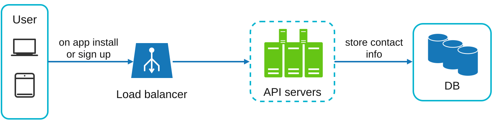
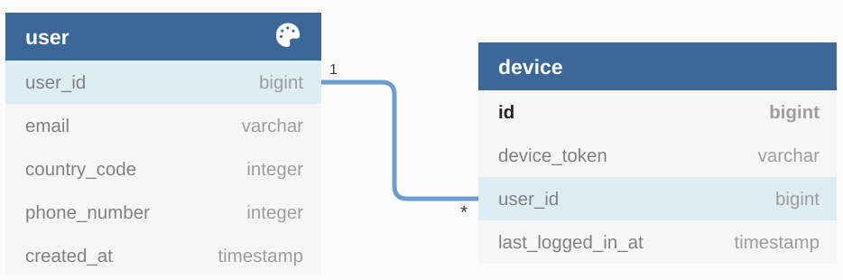
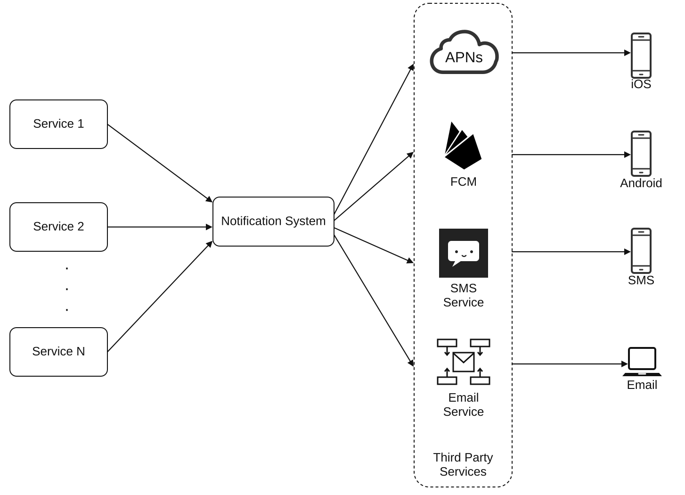
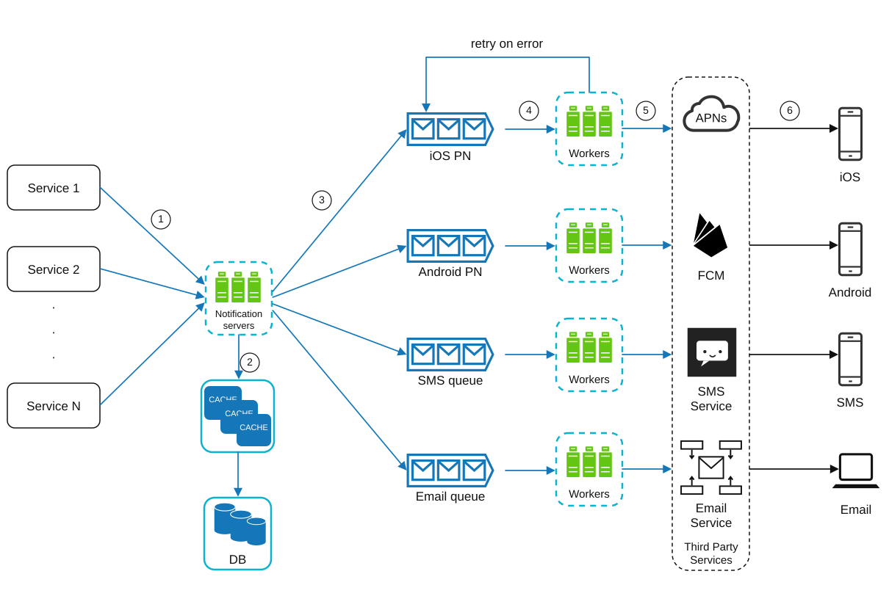
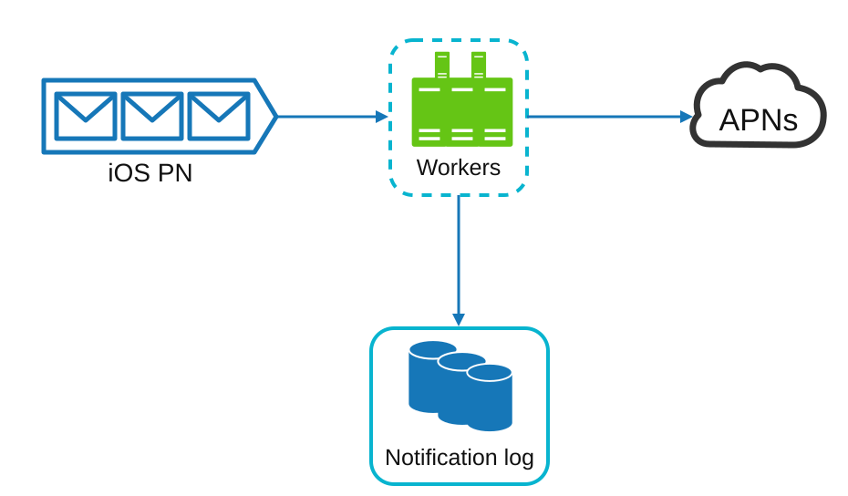
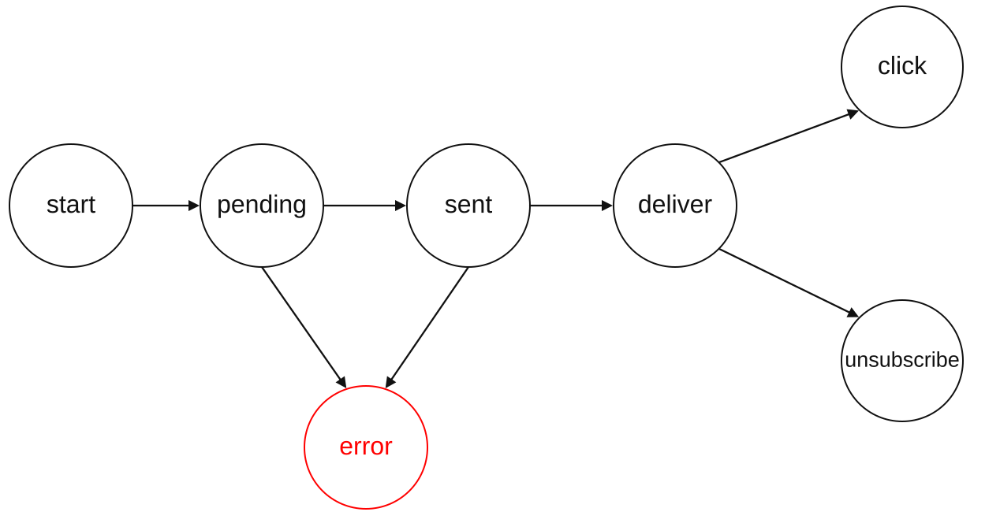
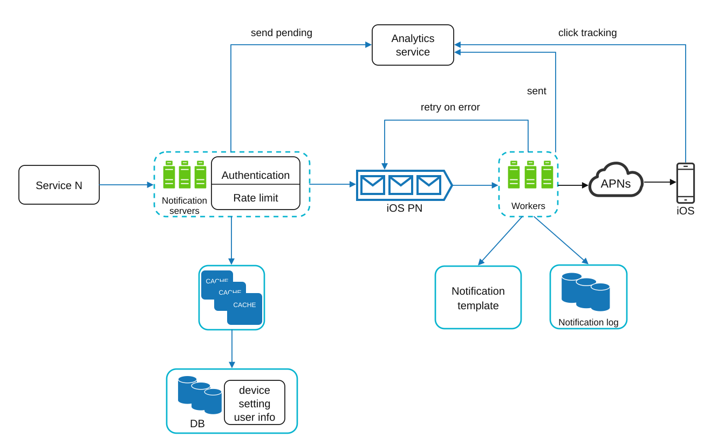

# Chapter 10: Design a Notification System

<sub>[Back to System Design](../Readme.md#content)</sub>

## Introduction

A **notification system** is essential for modern applications, providing timely updates like product notifications, events, offers, and alerts. Notifications can be sent through:
1. **Push notifications** (mobile or desktop)
2. **SMS messages**
3. **Emails**

The chapter focuses on designing a scalable system capable of sending millions of notifications daily.

## Step 1: Understanding the Problem
### Requirements
- **Notification Types:** Push notifications, SMS, and emails.
- **Delivery:** Soft real-time system with minimal delays.
- **Platforms:** iOS, Android, and desktop.
- **Triggers:** Notifications can be triggered by client applications or scheduled on servers.
- **Scale:**
  - **Push Notifications:** 10 million/day,
  - **SMS:** 1 million/day,
  - **Emails:** 5 million/day.
- **Opt-out Support:** Users can disable specific notification types.

## Step 2: High-Level Design

### Components

### **Notification Types:**
- **iOS Push Notifications:** Use **Apple Push Notification service (APNs)** [[6]](#ref-6).
- **Android Push Notifications:** Use **Firebase Cloud Messaging (FCM)** [[6]](#ref-6).
- **SMS Messages:** Third-party services like Twilio [[1]](#ref-1) or Nexmo [[2]](#ref-2).
- **Emails:** Commercial email services like SendGrid [[3]](#ref-3) or Mailchimp [[4]](#ref-4).

### **Contact Info Gathering:**

To send notifications, we need to gather mobile device tokens, phone numbers, or email addresses. As shown in the image below, when a user installs our app or signs up for the first time, API servers collect user contact info and store it in the database.

<div style="margin-left:3rem">
   
</div>

The image below shows simplified database tables to store contact info. Email addresses and phone numbers are stored in the `user` table, whereas device tokens are stored in the `device` table. A user can have multiple devices, indicating that a push notification can be sent to all of the user's devices.

<div style="margin-left:3rem">
   
</div>

### **Notification Sending/Receiving Flow:**

<div style="margin-left:3rem">
   
</div>

- **Trigger Services:**
   - Generate events to initiate notifications (e.g., billing reminders, shipping updates).
   - A service can be a microservice, a cron job, or a distributed system that triggers notification-sending events.
- **Notification Server:**
   - Provide APIs for services to send notifications.
   - Carry out basic validation to verify email addresses and phone numbers.
   - Query the database or cache to fetch data needed to render a notification.
- **Third-Party Services:** Deliver notifications to users. These systems should be flexible as different countries could apply different restrictions on what is allowed. For example, FCM is unavailable in China.
- **iOS, Android, SMS, Email:** Users receive notifications on their devices.

#### **Issues in this design**
- **Single Point of Failure (SPOF):** A failure of the only notification server can bring down the entire system.
- **Scalability Issues:** Hard to scale databases, caches, and processing components independently.
- **Performance Bottlenecks:** High resource demands for sending notifications.

### Improved Design

<div style="margin-left:3rem">
   
</div>

The best way to go through the above diagram is from left to right:

**Service 1 to N**: They represent different services that send notifications via APIs provided by notification servers.

**Notification servers**: They provide the following functionalities:
   - Provide APIs for services to send notifications. Those APIs are only accessible internally or by verified clients to prevent spam.
   - Carry out basic validation to verify email addresses, phone numbers, etc.
   - Query the database or cache to fetch data needed to render a notification.
   - Put notification data into message queues for parallel processing.

API to send an email:
```http
POST https://api.example.com/v/email/send
```

Request body:
```json
{
  "to": [
    {
      "user_id": 123456
    }
  ],
  "from": {
    "email": "from_address@example.com"
  },
  "subject": "Hello, World!",
  "content": [
    {
      "type": "text/plain",
      "value": "Hello, World!"
    }
  ]
}
```

**Cache**: User info, device info, and notification templates are cached.

**DB**: It stores data about users, notifications, settings, etc.

**Message queues**: They reduce dependencies between components. Message queues serve as buffers when high volumes of notifications are to be sent out [[7]](#ref-7).

**Workers**: Workers are servers that pull notification events from message queues and send them to the corresponding third-party services.

**Third-party services, iOS, Android, SMS, Email**: Already explained in the initial design.

Next, let us examine how every component works together to send a notification:

1. A service calls APIs provided by notification servers to send notifications.
2. Notification servers fetch metadata such as user info, device tokens, and notification settings from the cache or database.
3. A notification event is sent to the corresponding queue for processing. For instance, an iOS push notification event is sent to the iOS PN queue.
4. Workers pull notification events from message queues.
5. Workers send notifications to third-party services.
6. Third-party services send notifications to users' devices.

## Step 3: Design Deep Dive

### Reliability

#### **Data Loss Prevention:**

One of the most important requirements in a notification system is that it cannot lose data. Notifications can usually be delayed or reordered, but never lost. To satisfy this requirement, the notification system persists notification data in a database and implements a retry mechanism.

The notification log database is included for data persistence, as shown in the image below:

<div style="margin-left:3rem">
   
</div>

#### **Deduplication:**

It's impossible to guarantee exactly-once delivery [[5]](#ref-5) in all cases, but that doesn't mean we should not try to reduce duplicate notifications. For that, we introduce a dedupe mechanism and handle failures carefully. A simple deduplication approach is to check each notification's ID.

### Additional Components

1. **Notification templates:** Preformatted templates for consistent and efficient notifications.
2. **Notification settings:**
   - Users can opt in or opt out of specific channels (push, SMS, or email).
   - Stored in a dedicated notification settings table.
3. **Rate limiting:** Cap the frequency of notifications sent to users.
4. **Retry mechanism:** Retry sending notifications if third-party services fail.
5. **Security in push notifications:** An `appKey`/`appSecret` pair can be used to authenticate clients of our notification APIs. Only authenticated or verified clients are allowed to send push notifications using our APIs.
6. **Monitoring queued notifications:** Track queued notifications to scale workers dynamically.
7. **Event tracking:** Collect metrics like open rate, click rate, and engagement. The image below shows an example of events that might be tracked for analytics purposes.
<div style="margin-left:3rem">
   
</div>

### Notification Flow

Putting everything together, the image below shows the updated notification system design.

<div style="margin-left:3rem">
   
</div>

In this design, many new components are added in comparison with the previous design.
* The notification servers are equipped with two more critical features: authentication and rate limiting.
* We also add a retry mechanism to handle notification failures. If the system fails to send notifications, they are put back in the message queue and the worker will retry a predefined number of times.
* Furthermore, notification templates provide a consistent and efficient notification creation process.
* Finally, monitoring and tracking systems are added for system health checks and future improvements.

## Step 4: Wrap Up

Notifications are indispensable because they keep us posted about important information.

Besides the high-level design, we dug deep into more components and optimizations.
* Reliability: We proposed a robust retry mechanism to minimize the failure rate.
* Security: An `appKey`/`appSecret` pair is used to ensure only verified clients can send notifications.
* Tracking and monitoring: These are implemented at any stage of a notification flow to capture important stats.
* Respect user settings: Users may opt out of receiving notifications. Our system checks user settings first before sending notifications.
* Rate limiting: Users will appreciate a cap on the number of notifications they receive.


# Sources

1. <a id="ref-1"></a>[Twilio SMS](https://www.twilio.com/sms)
2. <a id="ref-2"></a>[Nexmo SMS](https://www.nexmo.com/products/sms)
3. <a id="ref-3"></a>[SendGrid](https://sendgrid.com/)
4. <a id="ref-4"></a>[Mailchimp](https://mailchimp.com/)
5. <a id="ref-5"></a>[You Cannot Have Exactly-Once Delivery](https://bravenewgeek.com/you-cannot-have-exactly-once-delivery/)
6. <a id="ref-6"></a>[Push Notifications — IBM Cloud Event Notifications](https://cloud.ibm.com/docs/event-notifications?topic=event-notifications-en-destinations-push)
7. <a id="ref-7"></a>[RabbitMQ](https://www.rabbitmq.com/)
