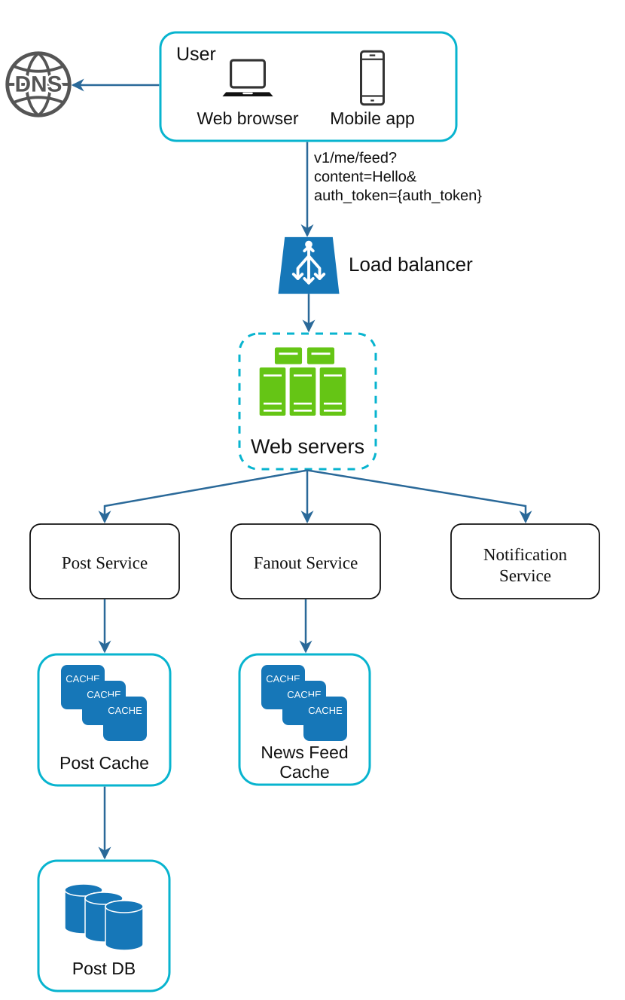
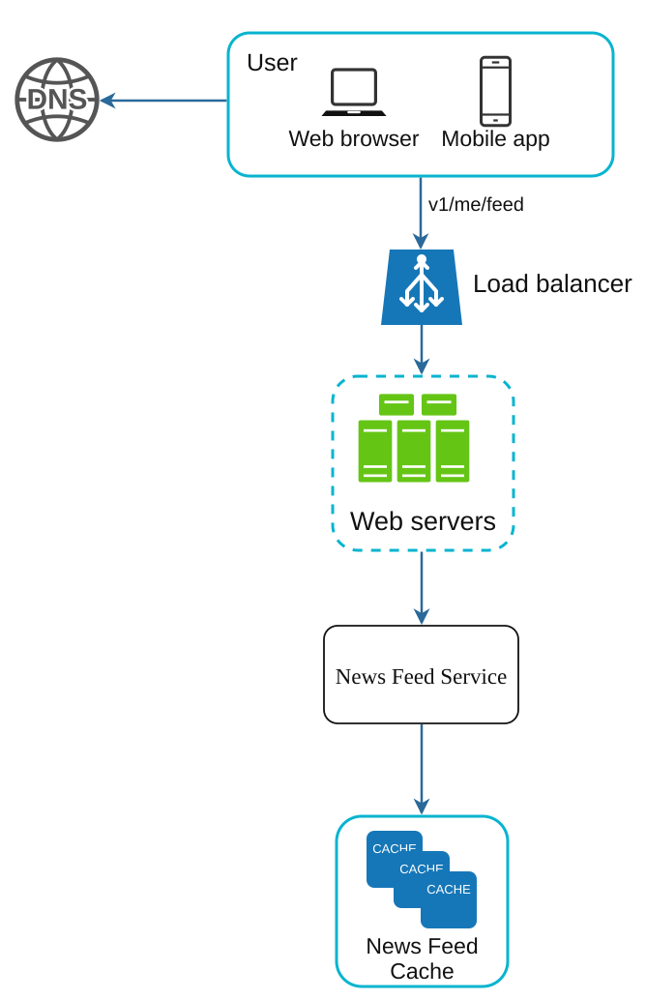
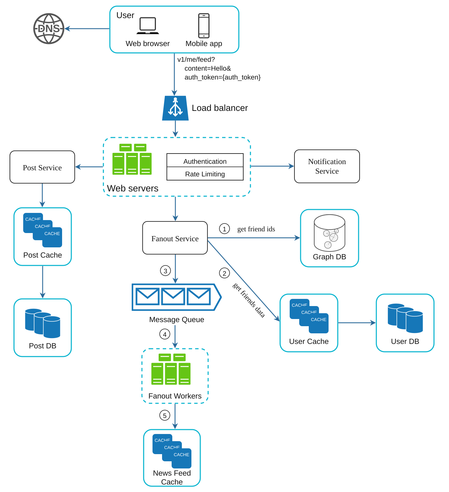
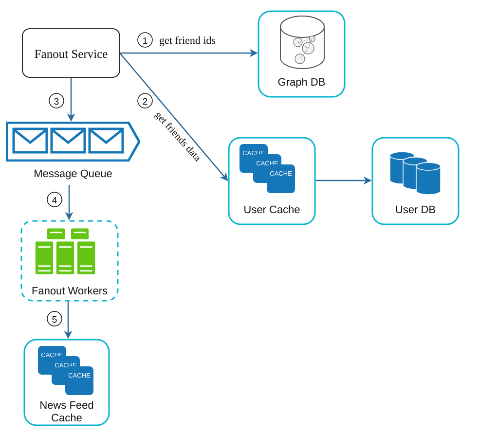
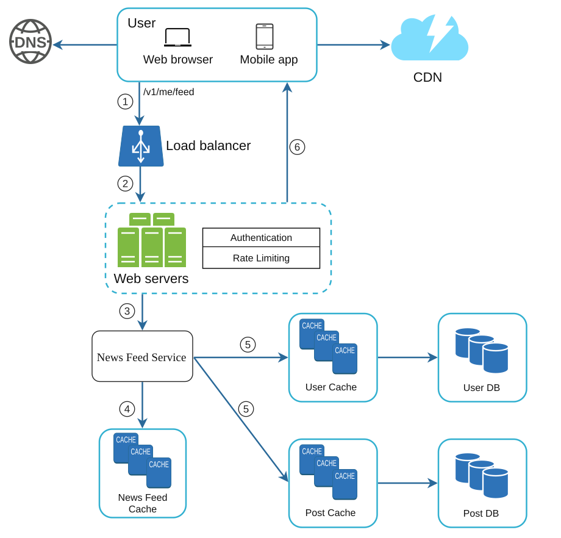
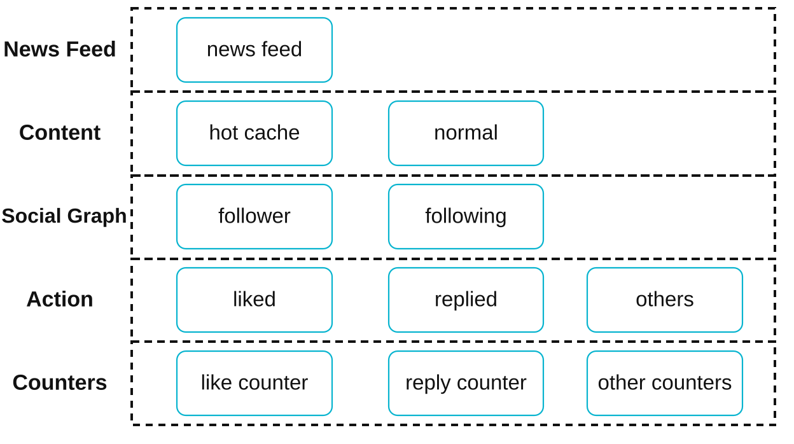

# Chapter 11: Design a News Feed System
[Back to System Design](../Readme.md#content)

## Introduction
A **news feed system** displays a constantly updating list of posts (status updates, photos, videos, and links) from a user’s connections. Examples include Facebook’s news feed, Instagram’s feed, and Twitter’s timeline. This chapter explores the design of a scalable news feed system.

## Step 1: Understanding the Problem

### Requirements
1. **Platform:** The system supports both web and mobile apps.
2. **Features:**
   - Users can publish posts.
   - Users can view posts from friends in their news feed.
3. **Sorting:** Feeds are sorted in **reverse chronological order** for simplicity.
4. **Scale:**
   - Users can have up to 5,000 friends.
   - 10 million daily active users (DAU).
   - Feeds may include text, images, and videos.

## Step 2: High-Level Design

### Overview
The design includes two main flows:
1. **Feed Publishing:** A user publishes a post, which is written to the database and propagated to their friends’ feeds.
2. **News Feed Building:** A user retrieves their news feed by aggregating posts from friends in reverse chronological order.

### News Feed APIs
1. **Feed Publishing API:**
   - **Endpoint:** `POST /v1/me/feed`
   - **Params:** `content` (post text) and `auth_token` (authentication).

2. **News Feed Retrieval API:**
   - **Endpoint:** `GET /v1/me/feed`
   - **Params:** `auth_token` (authentication).

### Feed Publishing

   

      
   

1. **User Interaction:** The user publishes a post via the feed publishing API.
2. **Load Balancer:** Distributes traffic to web servers.
3. **Web Servers:** Authenticate requests and redirect to services.
4. **Post Service:** Stores the post in the database and cache.
5. **Fanout Service:** Propagates the post to friends’ news feeds in the cache.
6. **Notification Service:** Sends notifications to friends.

### News Feed Building

   

      
   

1. **User Interaction:** The user requests their news feed via the retrieval API.
2. **Load Balancer:** Distributes traffic to web servers.
3. **Web Servers:** Forward requests to the news feed service.
4. **News Feed Service:** Fetches post IDs from the news feed cache and retrieves complete post details from the database or cache.

## Step 3: Design Deep Dive

### Feed Publishing Deep Dive

The image below, outlines the detailed design for feed publishing.

We have discussed most of components in high-level design, and we will focus on two components:
* web servers
* fanout service

#### **Web Servers**

Besides communicating with clients, web servers enforce authentication and rate-limiting. Only users signed in with valid `auth_token` are allowed to make posts. The system limits the number of posts a user can make within a certain period, vital to prevent spam and abusive content.

#### **Fanout Service**

Fanout is the process of delivering a post to all friends. Two types of fanout models are:
* fanout on write (also called push model)
* fanout on read (also called pull model)

Both models have pros and cons. We explain their workflows and explore the best approach to support our system.

**Fanout on write**

- **Pros:** Real-time updates, fast feed retrieval.
- **Cons:** Resource-intensive for users with many friends.

**Fanout on read**

- **Pros:** Efficient for inactive users.
- **Cons:** Slower feed retrieval.

**Hybrid approach**

We adopt a hybrid approach to get benefits of both approaches and avoid pitfalls in them. Since fetching the news feed fast is crucial, we use a push model for the majority of users. For celebrities or users who have many friends/followers, we let followers pull news content on-demand to avoid system overload. Consistent hashing is a useful technique to mitigate the hotkey problem as it helps to distribute requests/data more evenly. Let us take a close look at the fanout service as shown in the image below.

1. **Fetch Friend IDs:** Retrieve the friend list from a graph database.
2. **Filter Friends from Cache:** Access user settings in the cache to exclude certain friends (e.g., muted friends or selective sharing preferences).
3. **Send to Message Queue:** Send the filtered friend list along with the new post ID to a message queue for processing.
4. **Fanout Workers** fetch data from the message queue and store news feed data in the news feed cache. You can think of the news feed cache as a `<post_id, user_id>` mapping table. Whenever a new post is made, it will be appended to the news feed table as shown in the image above. The memory consumption can become very large if we store the entire user and post objects in the cache. Thus, only IDs are stored. To keep the memory size small, we set a configurable limit. The chance of a user scrolling through thousands of posts in news feed is slim. Most users are only interested in the latest content, so the cache miss rate is low.
5. **Store in News Feed Cache:** Append new post IDs to the friends’ news feed cache. A configurable limit ensures that only recent posts are stored, as most users focus on the latest content, keeping cache memory consumption manageable.

### News Feed Retrieval Deep Dive

The image below, illustrates the detailed design for news feed retrieval.

All media content (images, videos, etc.) are stored in CDN for fast retrieval. Let us look at how a client retrieves news feed.

1. A user sends a request to retrieve her news feed. The request looks like this: /v1/me/feed
2. The load balancer redistributes requests to web servers.
3. Web servers call the news feed service to fetch news feeds.
4. News feed service gets a list post IDs from the news feed cache.
5. A user’s news feed is more than just a list of feed IDs. It contains username, profile picture, post content, post image, etc. Thus, the news feed service fetches the complete user and post objects from caches (user cache and post cache) to construct the fully hydrated news feed.
6. The fully hydrated news feed is returned in JSON format back to the client for rendering.

### Cache Architecture

Cache is extremely important for a news feed system. The cache is divided into five layers:
1. **News Feed Cache:** Stores post IDs for quick retrieval.
2. **Content Cache:** Stores post details (popular posts in hot cache).
3. **Social Graph Cache:** Stores user relationship data.
4. **Action Cache:** Tracks user actions (likes, replies, shares).
5. **Counter Cache:** Maintains counts for likes, replies, followers, etc.

## Step 4 - Wrap up

In this chapter, we designed a news feed system. Our design contains two flows: feed publishing and news feed retrieval.

Like any system design interview questions, there is no perfect way to design a system. Every company has its unique constraints, and you must design a system to fit those constraints. Understanding the tradeoffs of your design and technology choices are important. If there are a few minutes left, you can talk about the below issues.

### Scaling
1. **Database Scaling:**
   - Horizontal scaling and sharding.
   - Use of read replicas for high-traffic queries.
2. **Stateless Web Tier:** Keep web servers stateless to enable horizontal scaling.

### Caching
1. Store frequently accessed data in memory.
2. Use cache layers to reduce latency and database load.

### Reliability
1. **Consistent Hashing:** Distribute requests evenly across servers.
2. **Message Queues:** Decouple system components and buffer traffic.

### Monitoring
1. Track key metrics like QPS (queries per second) and latency.
2. Monitor cache hit rates and adjust configurations accordingly.

## Reference materials

1. [How Machine Learning Powers Facebook's News Feed Ranking](https://engineering.fb.com/2021/01/26/core-infra/news-feed-ranking/)
2. [Friend of Friend recommendations Neo4j and SQL Sever](http://geekswithblogs.net/brendonpage/archive/2015/10/26/friend-of-friend-recommendations-with-neo4j.aspx)
