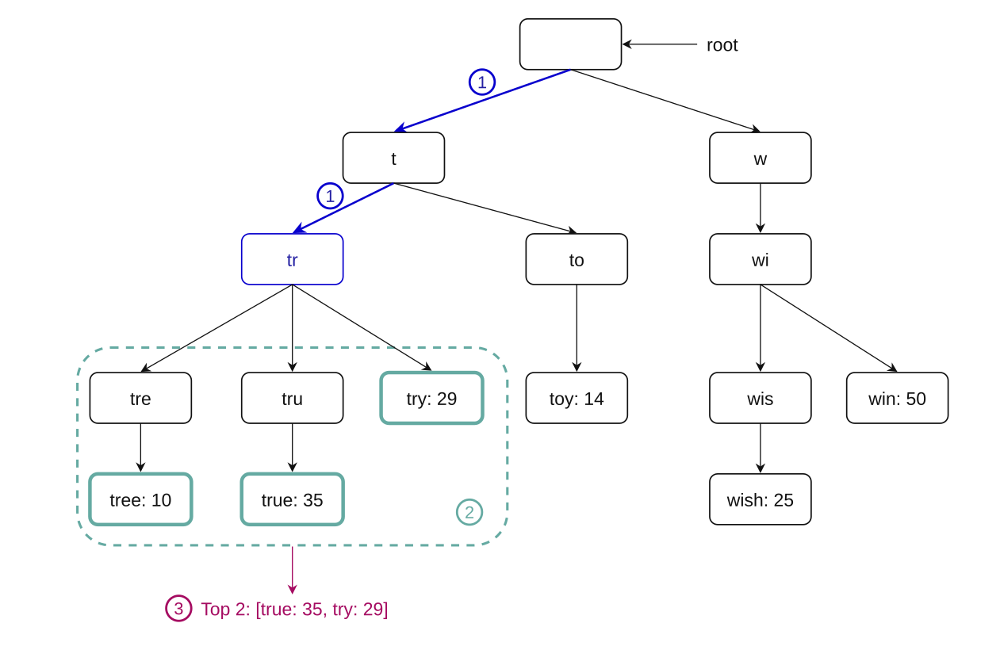
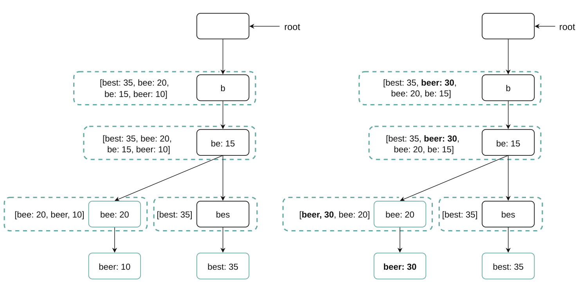
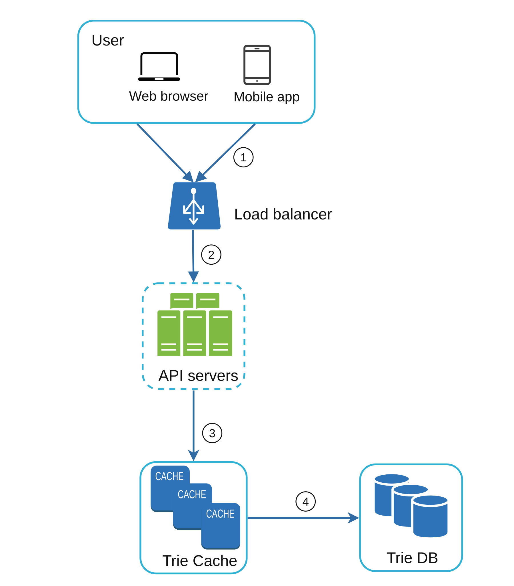

# Chapter 13: Design a Search Autocomplete System

<sub>[Back to System Design](../Readme.md#content)</sub>

## Introduction

Autocomplete, also known as typeahead or incremental search, provides real-time suggestions to users as they type in search boxes. The system must efficiently deliver the top-k relevant and popular suggestions based on historical query data.

### Key Features

- Suggest up to **5 autocomplete results**.
- Rank suggestions by **query popularity** (frequency).
- Support only **lowercase English characters**.
- Respond quickly (<100 ms) and scale to handle growing demand.

## Step 1: Understanding the Problem

### Requirements

1. **Real-Time Suggestions:** Display relevant matches as the user types.
2. **Top-k Results:** Return up to 5 results sorted by popularity.
3. **Scalability:** Handle **10 million daily active users (DAU)** with a peak of **48,000 queries per second (QPS)**.
4. **High Availability:** Handle failures without system downtime.
5. **Data Growth:** Support daily storage growth of **0.4 GB** for new query data.

### Back-of-the-Envelope Estimation

* Assume 10 million daily active users (DAU).
* The average user performs 10 searches per day.
* Assume 20 bytes of data per query string:
   * Assume we use ASCII character encoding. Each character occupies 1 byte.
   * Assume a query contains 4 words, and each word contains 5 characters on average.
   * That is 4 × 5 = 20 bytes per query.
* For every character entered into the search box, a client sends a request to the backend for autocomplete suggestions.

On average, 20 requests are sent for each search query. For example, the following 6 requests are sent to the backend by the time you finish typing “dinner”.

```text
search?q=d
search?q=di
search?q=din
search?q=dinn
search?q=dinne
search?q=dinner
```

* ~24,000 queries per second (QPS) = 10,000,000 users × 10 queries / day × 20 characters / 24 hours / 3,600 seconds.
* Peak QPS = QPS × 2 = ~48,000.
* Assume 20% of the daily queries are new. 10 million × 10 queries / day × 20 bytes per query × 20% = 0.4 GB.

This means 0.4 GB of new data is added to storage daily.

## Step 2: High-Level Design

At a high level, the system is broken down into two services:

1. **Data Gathering Service:**
    - Collects user queries and aggregates them for frequency analysis in real time.
    - Real-time processing is not practical for large data sets; however, it is a good starting point.

2. **Query Service:** Provides the top-k suggestions based on the user’s input.

### Data Gathering Service

<div style="margin-left:3rem">
    
</div>

- Aggregates query data from analytics logs and updates the frequency table.
- Processes historical data weekly to build a **trie** (prefix tree).

### Query Service

<div style="margin-left:3rem">
    
    
</div>

- Uses the frequency table from the data gathering service.
- Processes user input and retrieves top-k suggestions from the frequency table using a trie.
- Uses caching and efficient data structures for fast lookups.
- For example, when a user types `tw` in the search box, the system returns the 5 most frequently searched queries, as shown above.

To get the 5 most frequently searched queries, execute the following SQL query:

```sql
SELECT * FROM frequency_table
WHERE query LIKE 'prefix%'
ORDER BY frequency DESC
LIMIT 5
```

This is an acceptable solution when the data set is small.

## Step 3: Design Deep Dive

### Trie Data Structure

The **trie** is a tree-like data structure used to store and retrieve query strings efficiently.

#### **Key Features**

1. **Compact Storage:** Represents prefixes hierarchically to minimize redundancy.
2. **Frequency Information:** Stores the popularity of queries at each node.
3. **Steps to Get the Top-k Most Frequently Searched Queries**
   <div style="margin-left:3rem">
      
   </div>

How does autocomplete work with a trie? Before diving into the algorithm, let us define some terms.

* `p`: length of a prefix
* `n`: total number of nodes in a trie
* `c`: number of children of a given node

The steps to get the top `k` most frequently searched queries are listed below:

1. Find the prefix. Time complexity: `O(p)`.
2. Traverse the subtree from the prefix node to get all valid children. A child is valid if it can form a valid query string. Time complexity: `O(c)`.
3. Sort the children and get the top `k` queries. Time complexity: `O(c log c)`.

Let us use the example in the image below to explain the algorithm. Assume `k` equals 2 and a user types `tr` in the search box. The algorithm works as follows:

* Step 1: Find the prefix node `tr`.
* Step 2: Traverse the subtree to get all valid children. In this case, the nodes `tree: 10`, `true: 35`, and `try: 29` are valid.
* Step 3: Sort the children and get the top 2 queries. `true: 35` and `try: 29` are the top 2 queries with the prefix `tr`.

<div style="margin-left:3rem">
   
</div>

The time complexity of this algorithm is the sum of the time spent on each step: `O(p) + O(c) + O(c log c)`.

The algorithm above is straightforward. However, it is too slow because we need to traverse the entire trie to get the top `k` results in the worst-case scenario. Below are two optimizations:

1. Limit the maximum length of a prefix.
2. Cache the top search queries at each node.

<div style="margin-left:3rem">
   
</div>

#### **Limit the Maximum Length of a Prefix**

Users rarely type long search queries into the search box. Thus, it is safe to say that `p` is a small integer, such as 50. If we limit the length of a prefix, the time complexity of finding the prefix can be reduced from `O(p)` to `O(small constant)`, or `O(1)`.

#### **Cache Top Search Queries at Each Node**

To avoid traversing the whole trie, we store the top `k` most frequently used queries at each node. Since 5 to 10 autocomplete suggestions are enough for users, `k` is a relatively small number. In our specific case, only the top 5 search queries are cached.

By caching the top search queries at every node, we significantly reduce the time required to retrieve the top 5 queries. However, this design requires a lot of space to store the top queries at every node. Trading space for time is well worth it, as fast response times are very important.

The image below shows the updated trie data structure. The top 5 queries are stored at each node. For example, the node with the prefix `be` stores the following: `[best: 35, bet: 29, bee: 20, be: 15, beer: 10]`.


Let us revisit the time complexity of the algorithm after applying these two optimizations:

1. Find the prefix node. Time complexity: `O(1)`.
2. Return the top `k` queries. Since the top `k` queries are cached, the time complexity for this step is `O(1)`.

As the time complexity of each step is reduced to `O(1)`, our algorithm takes `O(1)` time to fetch the top `k` queries.

### Trie Operations

The trie is a core component of the autocomplete system. Let us look at how trie operations (create, update, and delete) work.

#### **Create**

- The trie is built weekly using aggregated query data.
- The data comes from analytics logs or a database.

#### **Update**

There are two ways to update the trie.

Option 1: Update the trie weekly. Once a new trie is created, the new trie replaces the old one.

Option 2: Update individual trie nodes directly. We try to avoid this operation because it is slow. However, if the trie is small, this is an acceptable solution. When we update a trie node, its ancestors all the way up to the root must be updated because they store their children's top queries.

The image below shows an example of how the update operation works. On the left, the search query `beer` has an original frequency of 10. On the right, its frequency is updated to 30. The frequency of `beer` is updated to 30 in both the node and its ancestors.

<div style="margin-left:3rem">
   
</div>

#### **Delete**

<div style="margin-left:3rem">
   
</div>

- Filters remove unwanted or harmful suggestions (e.g., hate speech).
- Having a filter layer gives us the flexibility to remove results based on different filter rules.
- Unwanted suggestions are physically removed from the database asynchronously.

### Data Gathering Service

In the high-level design, whenever a user types a search query, the data is updated in real time. This approach is not practical.

- Users may enter billions of queries per day. Updating the trie on every query is not feasible.
- Top suggestions may not change much once the trie is built.

#### **Updated Design**

<div style="margin-left:3rem">
   
</div>

1. **Analytics Logs:**
   - Store raw query data for weekly aggregation.
   - Logs are append-only and are not indexed.
2. **Aggregators:**
   - Process logs into frequency tables suitable for trie construction.
   - For real-time applications such as Twitter, aggregate data at shorter time intervals.
   - For other cases, aggregating data less frequently, such as once per week, is good enough.
3. **Workers:**
   - Asynchronous servers rebuild the trie and store it in persistent storage.
4. **Storage Options:**
    - **Trie Cache:** The trie cache is a distributed caching system that keeps the trie in memory for fast reads.
    - **Trie DB:**
        1. **Document Store (e.g., MongoDB):** Since a new trie is built weekly, we can periodically take a snapshot of it, serialize it, and store the serialized data in a database like MongoDB.
        2. **Key-Value Store:**
            - Maps prefixes to node data for fast access.
            - Every prefix in the trie is mapped to a key in a hash table.
            - Data in each trie node is mapped to a value in a hash table.

                

### Query Service



1. A search query is sent to the load balancer.
2. The load balancer routes the request to API servers.
3. API servers get trie data from the trie cache and construct autocomplete suggestions for the client.
4. If the data is not in the trie cache, we repopulate the cache with the missing data. This way, subsequent requests for the same prefix are served from the cache. A cache miss can happen when a cache server is out of memory or offline.

The query service requires very fast responses. We propose the following optimizations:

* AJAX requests. Use lightweight asynchronous requests for real-time responses.
* Browser caching. Save autocomplete results in the browser cache for frequently searched terms.

### List of All Optimizations

1. **Cache at Each Node:**
   - Store the top-k queries to avoid redundant traversals.
2. **Limit Prefix Length:**
   - Cap prefix length to a small value (e.g., 50 characters) for faster lookups.
3. **AJAX Requests:**
   - Use lightweight asynchronous requests for real-time responses.
4. **Browser Caching:**
   - Save autocomplete results in the browser cache for frequently searched terms.

### Scalability

1. **Sharding:**
   - Distribute trie nodes across servers based on prefix ranges (e.g., `a-m`, `n-z`).
   - Further shard the data within prefixes to balance uneven distributions (e.g., `aa-ag`, `ah-an`).
2. **Load Balancing:**
   <div style="margin-left:3rem">
      
   </div>

   - Use a shard map manager to route requests to the appropriate server.

## Step 4: Advanced Features

### Multilingual Support

1. **Unicode Characters:** Use Unicode to support non-English languages.
2. **Country-Specific Tries:** Build separate tries for different countries or regions.

### Trending Queries

- Handle real-time events by dynamically updating trie nodes or weighting recent queries more heavily.

## Reference materials

1. [The Life of a Typeahead Query](https://engineering.fb.com/2010/05/17/web/the-life-of-a-typeahead-query/)
2. [How We Built Prefixy: A Scalable Prefix Search Service for Powering Autocomplete](https://medium.com/@prefixyteam/how-we-built-prefixy-a-scalable-prefix-search-service-for-powering-autocomplete-c20f98e2eff1)
3. [Brief Announcement: Prefix Hash Tree](https://dsf.berkeley.edu/papers/podc04-pht.pdf)
4. [MongoDB on Wikipedia](https://en.wikipedia.org/wiki/MongoDB)
5. [Unicode Frequently Asked Questions](https://www.unicode.org/faq/basic_q.html)
6. [Apache Hadoop](https://hadoop.apache.org/)
7. [Spark Streaming](https://spark.apache.org/streaming/)
8. [Apache Storm](https://storm.apache.org/)
9. [Apache Kafka](https://kafka.apache.org/documentation/)
