# Chapter 14: Design YouTube
[Back to System Design](../Readme.md#content)

## Introduction
YouTube is a massive video streaming platform supporting video uploads, playback, and various interactions. This chapter focuses on designing a scalable video streaming system with the following core features:
- **Fast video uploads**
- **Smooth video streaming**
- **Ability to change video quality**
- **Low infrastructure cost**
- **High availability and reliability**

### Key Statistics (2020)
- **2 billion monthly active users**
- **5 billion videos watched per day**
- **37% of mobile internet traffic comes from YouTube**
- Available in **80 languages**
- **$15.1 billion ad revenue** in 2019

---

## Step 1: Understand the Problem and Scope

### Core Functionalities
1. Upload videos
2. Watch videos

### Supported Platforms
- Mobile apps, web browsers, and smart TVs

### Assumptions
- **Daily Active Users (DAU):** 5 million
- **Average Video Size:** 300 MB
- **Upload Limits:** Max 1 GB per video
- **Daily Storage Need:** 150 TB
- **CDN Costs:** 5 million * 5 videos * 0.3 GB * $0.02 = $150,000/day (using Amazon CloudFront)

---

## Step 2: High-Level Design

### Components

    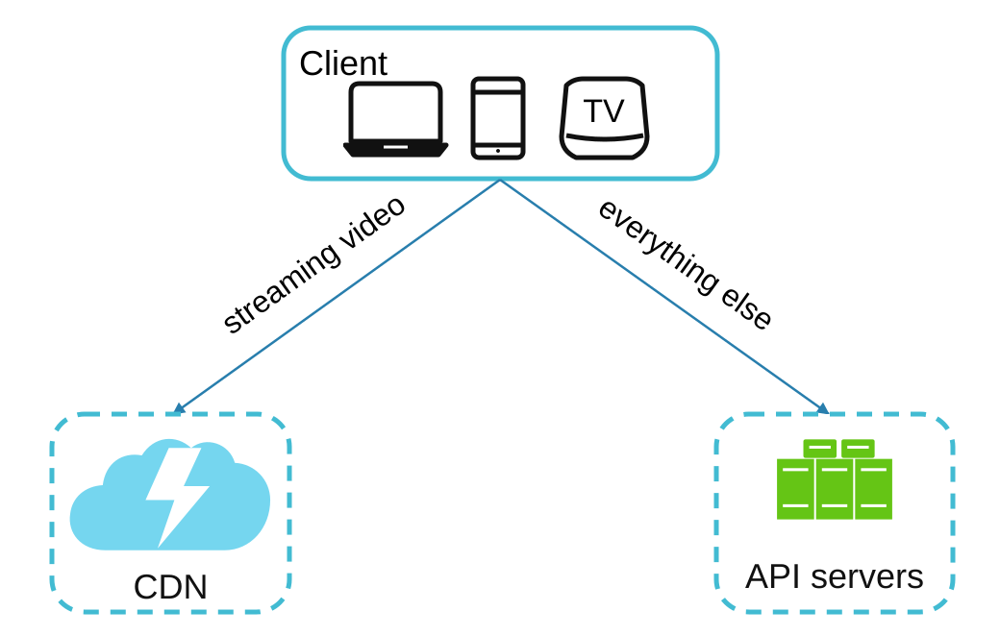

1. **Client:** Devices like smartphones, computers, and TVs.
2. **CDN (Content Delivery Network):** Stores and streams videos.
3. **API Servers:** Handle all user interactions except video streaming (e.g., uploads, metadata updates).
4. **Metadata Database:** Stores video metadata (e.g., title, description, size).
5. **Original Storage:** Blob storage for uploaded videos.
6. **Transcoding Servers:** Convert videos into multiple resolutions and formats.
7. **Transcoded Storage:** Blob storage for transcoded videos.

---

### Core Workflows
#### 1. Video Uploading Flow
- **Parallel Processes:**
  1. Upload video to original storage.
  2. Update video metadata in the database.

- **Video Upload (Steps):**

    

        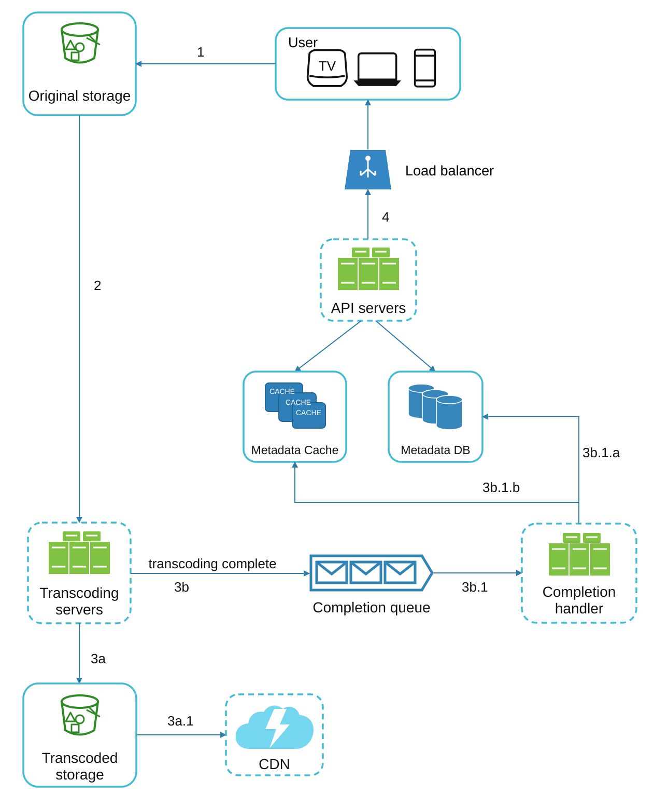
    

    - [1] Videos are uploaded to the original storage.
    - [2] Transcoding servers fetch videos from the original storage and start transcoding.
    - [3] Once transcoding is complete, the following two steps are executed in parallel:
        - [3a] Transcoded videos are sent to transcoded storage.
        - [3b] Transcoding completion events are queued in the completion queue.
    - [3a.1] Transcoded videos are distributed to CDN.
    - [3b.1] Completion handler contains a bunch of workers that continuously pull event data from the queue.
    - [3b.1.a] and [3b.1.b] Completion handler updates the metadata database and cache when video transcoding is complete.
    - [4] API servers inform the client that the video is successfully uploaded and is ready for streaming.

- **Metadata Upload (Steps):**

    

        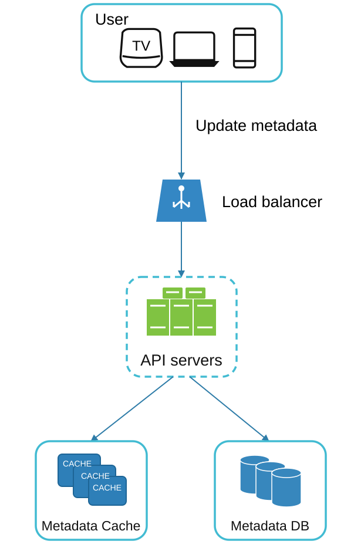
    

    - In parallel, the client sends a request to update the video metadata.
    - The request contains video metadata, including file name, size, format, etc.

#### 2. Video Streaming Flow

  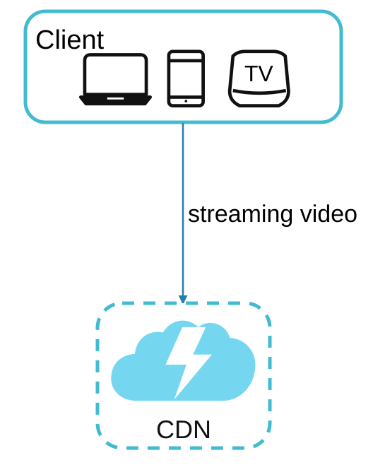

- Videos are streamed directly from the CDN using edge servers to minimize latency.
- Some popular streaming protocols are MPEG-DASH, Apple HLS, and Adobe HDS.
- *Different streaming protocols support different video encodings and playback players.*

---

## Step 3: Design Deep Dive

### Video Transcoding
#### Importance
1. Video transcoding reduces the large amount of storage space consumed by raw video.
2. Ensures compatibility across devices and browsers.
3. Adapts video quality to network conditions.

#### Components
- **Container:** Encapsulates video, audio, and metadata (e.g., MP4, AVI).
- **Codecs:** Compression and decompression algorithms (e.g., H.264, VP9).

#### Directed Acyclic Graph (DAG) Model

    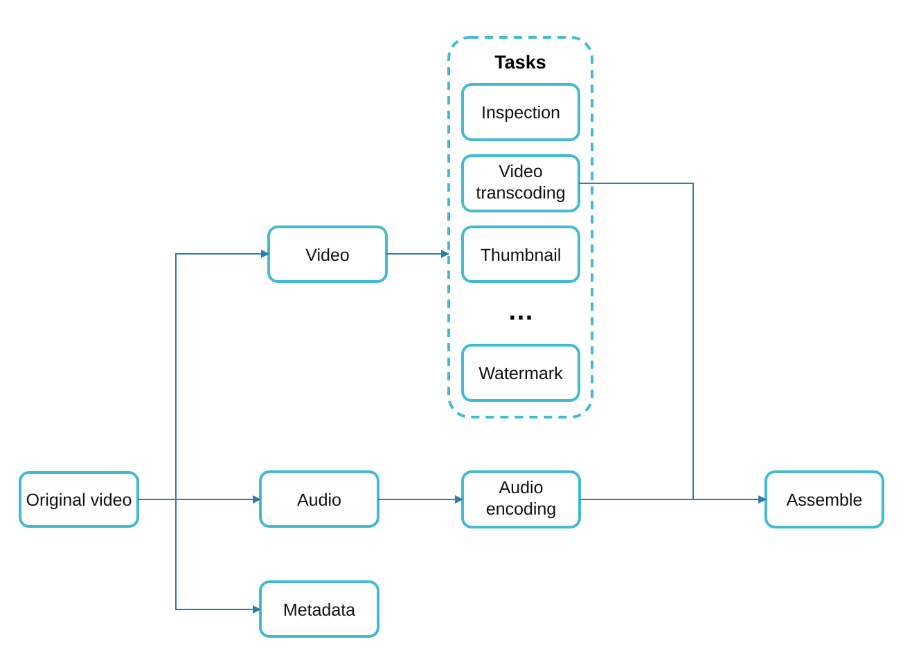

- Transcoding a video is computationally expensive and time-consuming.
- The DAG model defines tasks like encoding, thumbnail generation, and watermarking.
- Allows high parallelism in video processing.

- The original video is split into video, audio, and metadata.
    - Video encodings: Videos are converted to support different resolutions, codecs, and bitrates.
    - Thumbnail: It can either be uploaded by a user or automatically generated by the system.
    - Watermark: An image overlay on top of a video contains identifying information about the video.

---

### Video Transcoding Architecture

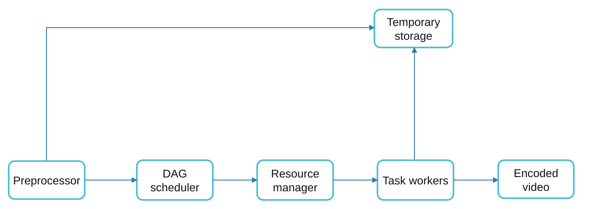

1. **Preprocessor:** Splits videos into smaller chunks (GOP alignment). It has 4 responsibilities.

    

        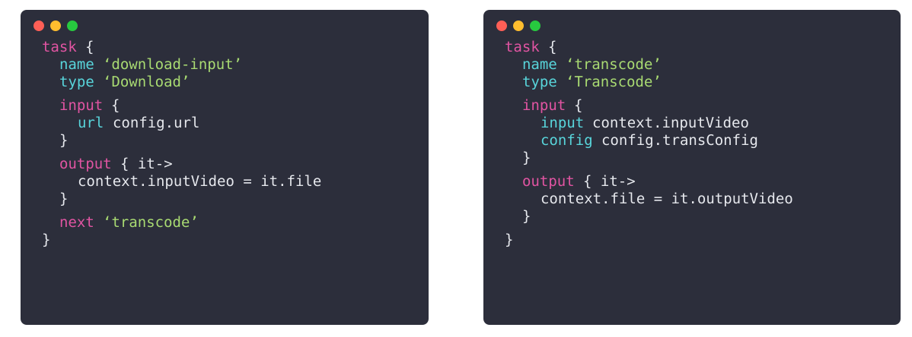
    

    - Video splitting: A video stream is split or further divided along Group of Pictures (GOP) boundaries.
    - It splits videos along GOP boundaries for old clients.
    - It generates a DAG based on configuration files that client programmers write.
    - It stores GOPs and metadata in temporary storage. If encoding fails, the system can use persisted data for retry operations.

2. **DAG Scheduler:** Organizes tasks into sequential or parallel stages.
    

        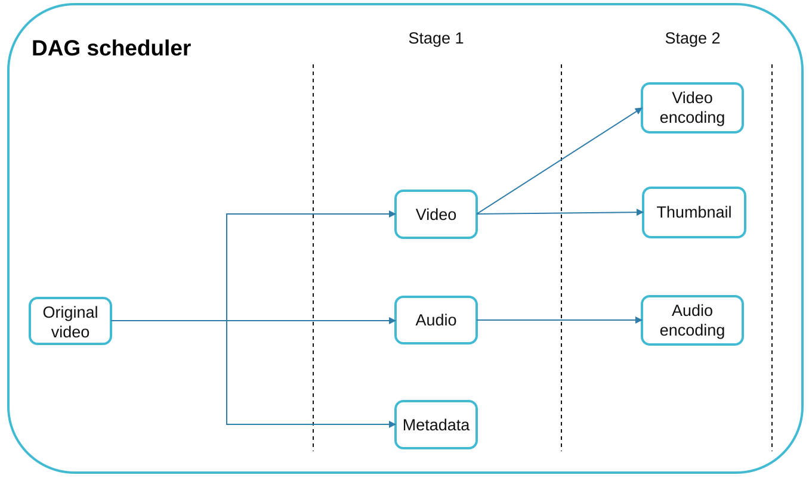
    

    - It splits a DAG into stages of tasks and puts them in the task queue in the resource manager.
    - Stage 1: video, audio, and metadata.
    - The video file is further split into two tasks in stage 2: video encoding and thumbnail.

3. **Resource Manager:** Responsible for managing the efficiency of resource allocation. It
contains 3 queues and a task scheduler.
    

        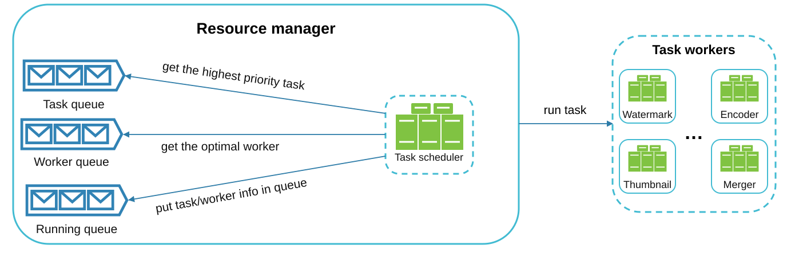
    

    - Task queue: priority queue that contains tasks to be executed.
    - Worker queue: priority queue that contains worker utilization info.
    - Running queue: contains currently running tasks and workers running the tasks.
    - Task scheduler: picks the optimal task/worker and instructs the chosen task worker to execute the job.

4. **Task Workers:** Perform transcoding and other operations.
    

        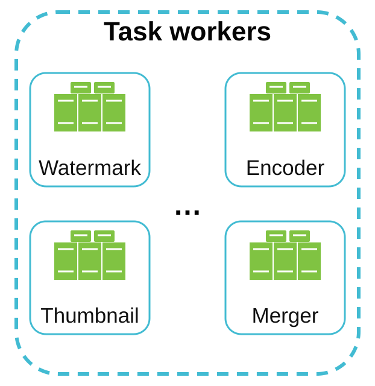
   

    - Different task workers may run different tasks.

5. **Temporary Storage:** Stores intermediate data for retries.
    - The choice of storage system depends on factors like data type, data size, access frequency, data life span, etc.
6. **Output:** Transcoded videos ready for distribution.

---

## System Optimizations

### Speed Optimizations
1. **Parallel Video Uploads:** Split videos into smaller chunks for faster, resumable uploads.

    

2. **Distributed Upload Centers:** Use CDNs as upload hubs close to users.
3. **Parallel Processing:** Decouple modules using message queues for high parallelism.

    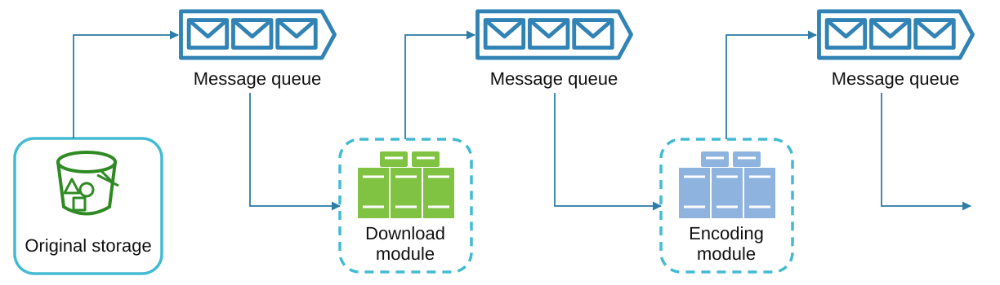

    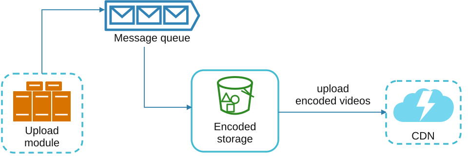

### Safety Optimizations
1. **Pre-Signed URLs:** Restrict video uploads to authorized users.

    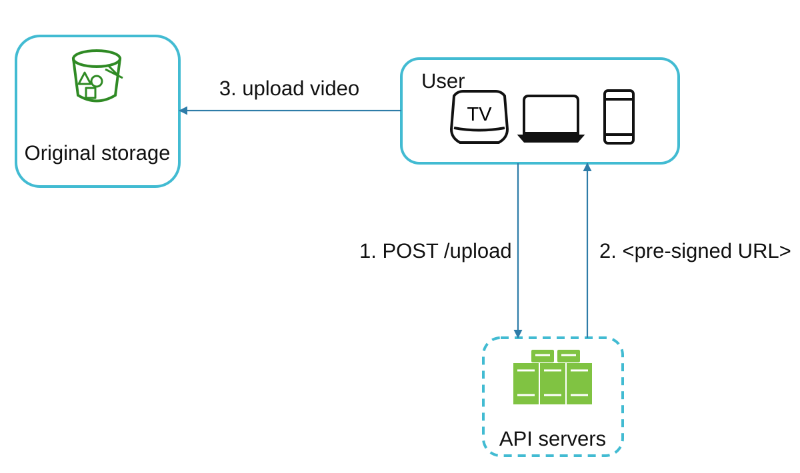

2. **Protect Videos:**
   - **DRM Systems** (e.g., Apple FairPlay, Google Widevine).
   - **AES Encryption.**
   - **Watermarking.**

### Cost-Saving Optimizations
1. Serve only popular videos via CDN; less popular ones from high-capacity servers.
2. Encode on-demand for rarely accessed videos.
3. Regionalize video distribution based on popularity.
4. Build custom CDNs and partner with ISPs to reduce bandwidth costs.

---

## Error Handling
### Recoverable Errors
- Retry failed uploads, transcoding, or resource allocation tasks.

### Non-Recoverable Errors
- Stop malformed video processing and return error codes.

## Reference materials

1. [YouTube by the numbers](https://www.omnicoreagency.com/youtube-statistics/)
2. [2019 YouTube Demographics](https://blog.hubspot.com/marketing/youtube-demographics)
3. [Cloudfront Pricing](https://aws.amazon.com/cloudfront/pricing/)
4. [Netflix on AWS](https://aws.amazon.com/solutions/case-studies/netflix/)
5. [Akamai homepage](https://www.akamai.com/)
6. [Binary large object](https://en.wikipedia.org/wiki/Binary_large_object)
7. [Here’s What You Need to Know About Streaming Protocols](https://www.dacast.com/blog/streaming-protocols/)
8. [SVE: Distributed Video Processing at Facebook Scale](https://www.cs.princeton.edu/~wlloyd/papers/sve-sosp17.pdf)
9. [Video-on-Demand Transcoding Architecture Best Practices (in Chinese)](https://developer.volcengine.com/resource/7272947763787071544/)
10. [Delegate access with a shared access signature](https://docs.microsoft.com/en-us/rest/api/storageservices/delegate-access-with-shared-access-signature)
11. [YouTube scalability talk by early YouTube employee](https://www.youtube.com/watch?v=w5WVu624fY8)
12. [Understanding the characteristics of internet short video sharing: A youtube-based measurement study](https://arxiv.org/pdf/0707.3670.pdf)
13. [Content Popularity for Open Connect](https://netflixtechblog.com/content-popularity-for-open-connect-b86d56f613b)
