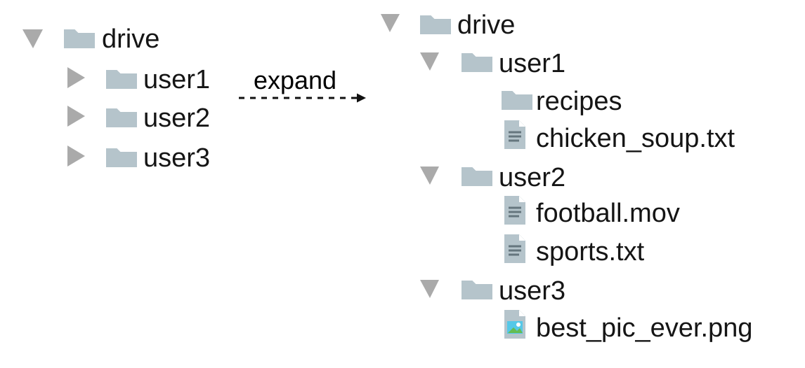
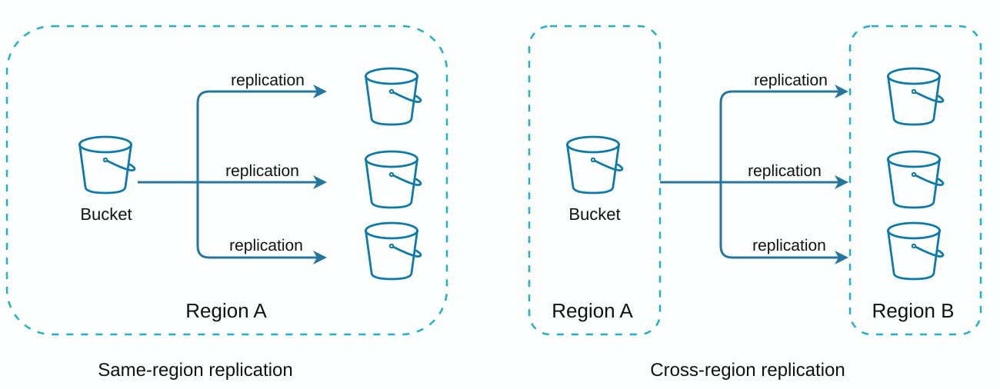
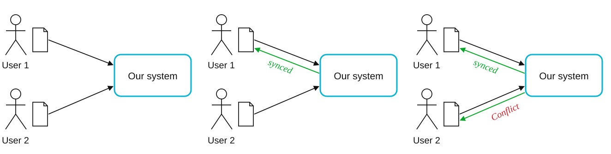
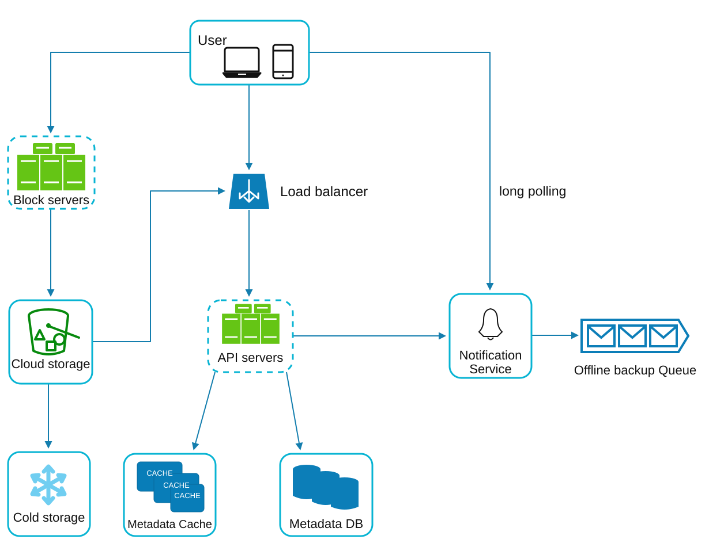
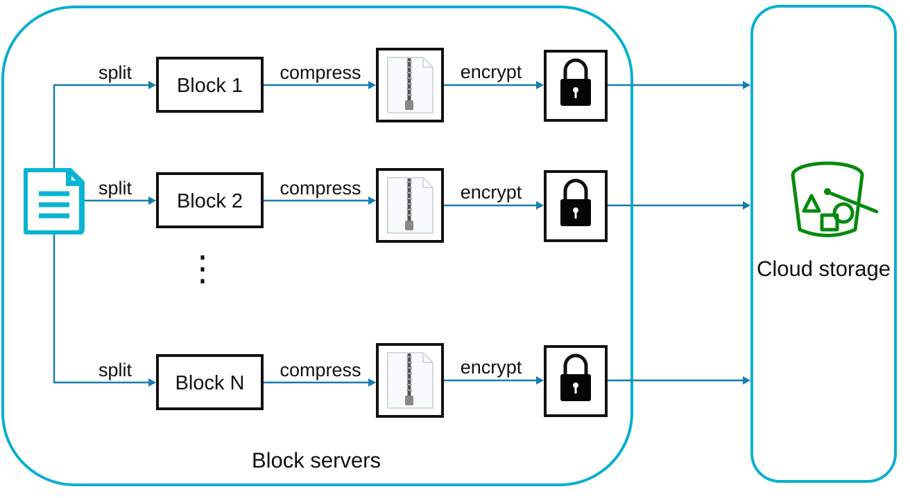
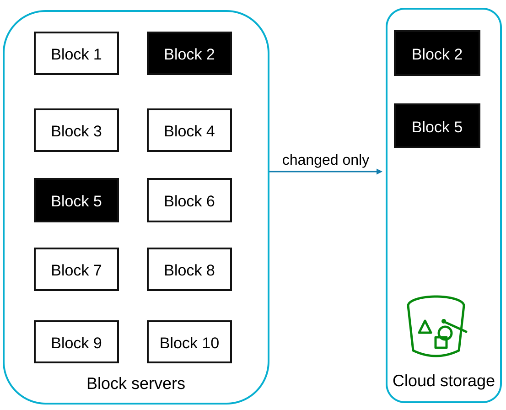
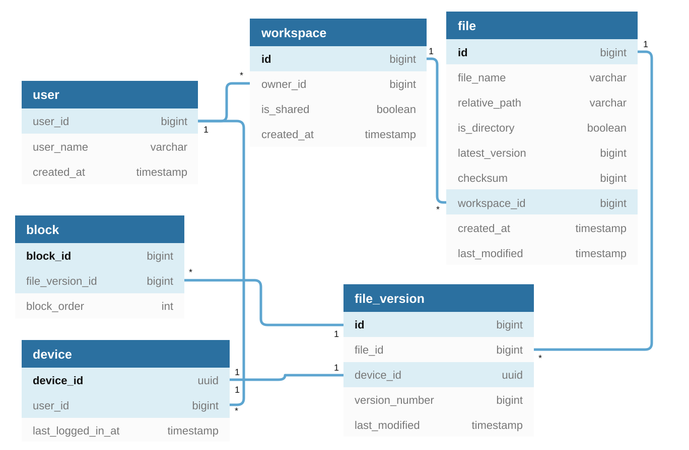
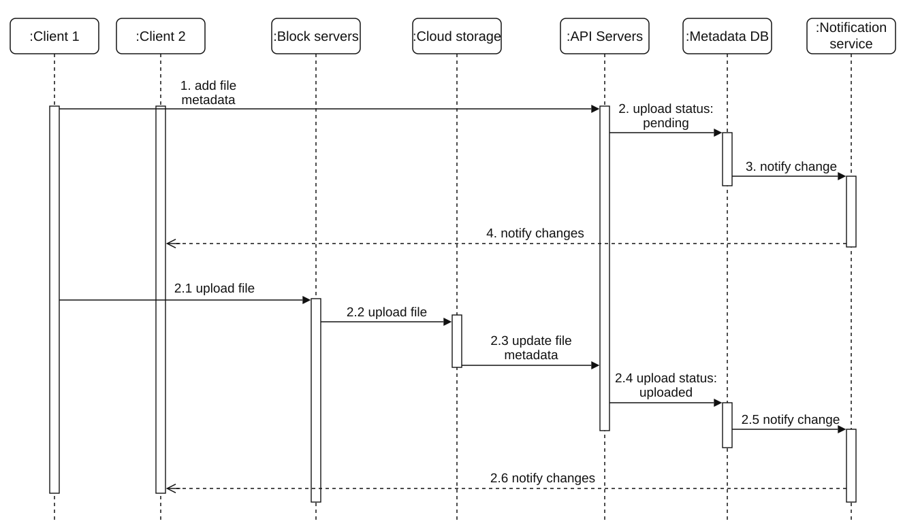
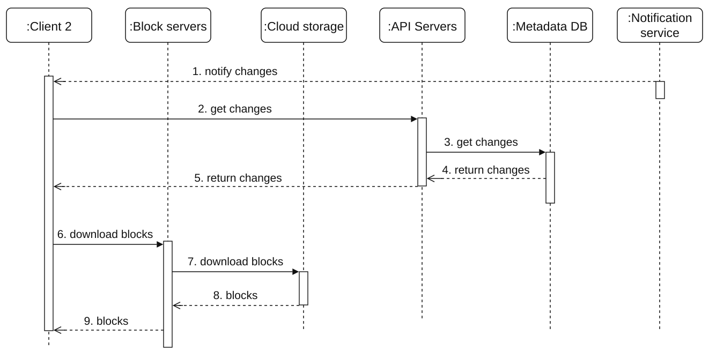

# Chapter 15: Design Google Drive
[Back to System Design](../Readme.md#content)

## Introduction

Google Drive is a cloud-based file storage and synchronization service that allows users to store, access, and share files from various devices. This chapter discusses designing a scalable system with the following features:
- **File Upload and Download**
- **File Sync Across Devices**
- **File Sharing**
- **File Revision History**
- **Notifications for Edits, Deletes, and Shares**

## Step 1: Understanding the Problem

### Key Requirements

#### **Functional Requirements**:
- Upload and download files.
- Sync files across multiple devices.
- Maintain file revisions.
- Enable file sharing with permissions.
- Send notifications on file edits, deletions, and shares.

#### **Non-Functional Requirements**:
- **Reliability:** Data loss is unacceptable.
- **Fast Sync Speed:** Avoid user impatience with delayed syncing.
- **Bandwidth Efficiency:** Minimize unnecessary data usage.
- **Scalability:** Handle 10 million daily active users (DAU).
- **High Availability:** Operate seamlessly during server failures or network issues.

### Constraints and Assumptions
- Users get **10 GB of free space**.
- Maximum file size: **10 GB**.
- Average file upload size: **500 KB**.
- Upload frequency: **2 files per day per user**.
- Total storage required: **500 PB**.

## Step 2: High-Level Design

### Single-Server Setup
A basic setup includes:
1. **Web Server:** Handles uploads and downloads.
2. **Metadata Database:** Keeps track of metadata such as user data, login information, and file information.
3. **Storage Directory:** Holds files organized by namespaces.

    

- A web server is set up with a directory called drive/ as the root directory to store uploaded files.
- Under the drive/ directory, there is a list of directories called namespaces.
- Each namespace contains all the uploaded files for that user.
- Each file or folder can be uniquely identified by joining the namespace and the relative path.

This design serves as a starting point but is inadequate for scaling.

#### APIs
1. **Upload a file to Google Drive:** Two types of uploads are supported.
    - Simple upload: Used when the file size is small.
    - Resumable upload:
        - Endpoint: https://api.example.com/files/upload?uploadType=resumable
        - Send the initial request to retrieve the resumable URL.
        - Upload the data and monitor the upload state.
        - If the upload is interrupted, resume the upload.
2. **Download a file from Google Drive:** To download a file:
    - Endpoint: https://api.example.com/files/download
3. **Get file revisions:**
    - Endpoint: https://api.example.com/files/list_revisions

### Moving to Distributed Systems

#### Improvements

1. **Sharding:** Split storage across servers based on `user_id`.
2. **Amazon S3:** Use S3 for scalable and redundant file storage with cross-region replication.

    

3. **Load Balancer:** Distribute traffic across multiple web servers.
4. **Metadata Database Replication:** Ensure availability through database sharding and replication.

#### Sync Conflicts

For a large storage system like Google Drive, sync conflicts happen from time to time.
When two users modify the same file or folder at the same time, a conflict happens.

   

- In the example, user 1 and user 2 try to update the same file at the same time, but user 1’s file is processed by our system first.
- User 1’s update operation goes through, but user 2 gets a sync conflict.
- The system presents both copies of the same file: user 2’s local copy and the latest version from the server.
- User 2 has the option to merge both files or overwrite one version with the other.

### High-level design

   

1. **User Interaction:** Users access the application via a browser or mobile app.

2. **Block Servers:**
   - Files are split into **4 MB blocks** (maximum size) and assigned unique hash values.
   - Blocks are stored independently in cloud storage (e.g., Amazon S3).
   - File reconstruction involves joining blocks in a specific order.

3. **Cloud Storage:** Blocks are stored in cloud storage for scalability and redundancy.

4. **Cold Storage:** Inactive files are moved to cold storage to reduce costs.

5. **Load Balancer:** Distributes requests evenly among API servers to ensure efficient operation.

6. **API Servers:**
   - Handle user authentication, profile management, and file metadata updates.
   - Manage all non-uploading workflows.

7. **Metadata Database and Cache:**
   - Store metadata for users, files, blocks, and versions.
   - Frequently accessed metadata is cached for faster retrieval.

8. **Notification Service:**
   - A **publisher/subscriber system** that notifies clients about file changes (add, edit, delete).
   - Ensures clients can pull the latest updates.

9. **Offline Backup Queue:** Temporarily stores file change information for offline clients to sync when back online.

## Step 3: Design Deep Dive

### Block servers

For a large file that is updated regularly, sending the whole file on each update consumes a lot of bandwidth. Two optimizations are proposed to minimize the amount of network traffic being transmitted:
* **Delta sync**. When a file is modified, only modified blocks are synced instead of the whole file using a sync algorithm [[7]](https://rsync.samba.org/tech_report/)[[8]](https://github.com/librsync/librsync).
* **Compression**. Applying compression to blocks can significantly reduce the data size. Thus, blocks are compressed using compression algorithms depending on file types. For example, gzip and bzip2 are used to compress text files. Different compression algorithms are needed to compress images and videos.

In our system, block servers do the heavy lifting for uploading files. Block servers process files passed from clients by splitting them into blocks, compressing each block, and encrypting it. Instead of uploading the whole file to the storage system, block servers transfer only modified blocks.

The image below shows how a block server works when a new file is added.

   

* A file is split into smaller blocks.
* Each block is compressed using compression algorithms.
* To ensure security, each block is encrypted before it is sent to cloud storage.
* Blocks are uploaded to the cloud storage.

The image below illustrates delta sync, meaning only modified blocks are transferred to cloud storage. The highlighted blocks "block 2" and "block 5" represent changed blocks. With delta sync, only those two blocks are uploaded to the cloud storage.

   

Block servers allow us to reduce network traffic by providing delta sync and compression.

### High consistency requirement

Our system requires strong consistency by default. It is unacceptable for a file to be shown differently by different clients at the same time. The system needs to provide strong consistency for the metadata cache and database layers.

Memory caches adopt an eventual consistency model by default, which means different replicas might have different data. To achieve strong consistency, we must ensure the following:
* Data in cache replicas and the master is consistent.
* Invalidate caches on database writes to ensure the cache and database hold the same value.

Achieving strong consistency in a relational database is easy because it maintains the ACID (Atomicity, Consistency, Isolation, Durability) properties [[9]](https://en.wikipedia.org/wiki/ACID). However, NoSQL databases do not support ACID properties by default. ACID properties must be programmatically incorporated in synchronization logic. In our design, we choose relational databases because ACID is natively supported.

### Metadata database

The image below shows the database schema design. It's a simplified version.

   

* **User**. The user table contains basic information about the user, such as a username, email, profile photo, etc.
* **Device**. The device table stores device info. `Push_id` is used for sending and receiving mobile push notifications. Please note a user can have multiple devices.
* **Namespace**. A namespace is the root directory of a user.
* **File**. The file table stores everything related to the latest file.
* **File_version**. It stores the version history of a file. Existing rows are read-only to preserve the integrity of the file revision history.
* **Block**. It stores everything related to a file block. A file of any version can be reconstructed by joining all the blocks in the correct order.

### Upload Flow

To better understand the flow, we draw the sequence diagram as shown in the image below.

   

Two requests are sent in parallel: one to add file metadata and one to upload the file to cloud storage. Both requests originate from client 1.
* Add file metadata.
   1. `Client 1` sends a request to add the metadata of the new file.
   2. Store the new file metadata in the metadata DB and change the file upload status to "pending".
   3. Notify the notification service that a new file is being added.
   4. The notification service notifies relevant clients (`client 2`) that a file is being uploaded.
* Upload files to cloud storage.
   * 2.1 `Client 1` uploads the content of the file to block servers.
   * 2.2 Block servers chunk the file into blocks, compress and encrypt the blocks, and upload them to cloud storage.
   * 2.3 Once the file is uploaded, cloud storage triggers an upload completion callback. The request is sent to API servers.
   * 2.4 The file status changes to "uploaded" in the metadata DB.
   * 2.5 Notify the notification service that the file status has changed to "uploaded".
   * 2.6 The notification service notifies relevant clients (`client 2`) that a file is fully uploaded.

When a file is edited, the flow is similar, so we skip it.

### Download Flow

The download flow is triggered when a file is added or edited elsewhere. There are two ways a client can know:
- If `client A` is online while a file is changed by another client, the notification service will inform `client A` that changes have been made somewhere, so it needs to pull the latest data.
- If `client A` is offline while a file is changed by another client, data will be saved to the cache. When the offline client is online again, it pulls the latest changes.

Once a client knows that a file has changed, it first requests metadata via API servers, then downloads blocks to construct the file.

   

1. The notification service informs `client 2` that a file has changed somewhere else.
2. Once `client 2` knows that new updates are available, it sends a request to fetch data.
3. API servers call the metadata DB to fetch metadata about the changes.
4. Metadata is returned to the API servers.
5. `Client 2` gets the metadata.
6. Once the client receives the metadata, it sends requests to block servers to download blocks.
7. Block servers first download blocks from cloud storage.
8. Cloud storage returns blocks to the block servers.
9. `Client 2` downloads all the new blocks to reconstruct the file.

### Notification Service
1. **Purpose:** Keeps clients updated about file changes.
2. **Mechanism:** Implements **long polling** for asynchronous notifications. Dropbox uses long polling [[10]](https://assets.dropbox.com/www/en-us/business/solutions/solutions/dfb_security_whitepaper.pdf).
3. **Example:** When a file is added, edited, or deleted, notifications are pushed to all relevant clients.

### Storage Optimization
1. **De-duplication:** Remove duplicate blocks at the account level using hash-based comparisons.
2. **Versioning Strategy:**
   - Limit the number of saved revisions.
   - Prioritize recent versions for frequently edited files.
3. **Cold Storage:** Move rarely accessed files to cheaper storage solutions (e.g., Amazon S3 Glacier).

### Failure Handling
1. **Load Balancer Failure:** A secondary load balancer becomes active.
2. **Block Server Failure:** Pending tasks are reassigned to other servers.
3. **Metadata Database Failure:**
   - Promote a slave node to master.
   - Redirect traffic to remaining replicas.
4. **Cloud Storage Failure:** Use cross-region replication to fetch unavailable files.
5. **Notification Service Failure:** Clients reconnect to alternative servers.

## Step 4: Wrap-up

In a different design, a file could be uploaded directly to cloud storage from the client instead of going through block servers. The advantage of this approach is that it makes file upload faster because a file only needs to be transferred once to the cloud storage.

In our design, a file is transferred to block servers first and then to the cloud storage. However, the different approach has a few drawbacks:
* First, the same chunking, compression, and encryption logic must be implemented on different platforms (iOS, Android, Web). It is error-prone and requires a lot of engineering effort. In our design, all that logic is implemented in a central place: block servers.
* Second, as a client can easily be hacked or manipulated, implementing encryption logic on the client side is not ideal.

## Reference materials

1. [Google Drive](https://www.google.com/drive/)
2. [Upload file data](https://developers.google.com/drive/api/v2/manage-uploads)
3. [Amazon S3](https://aws.amazon.com/s3)
4. [Differential Synchronization — written article](https://neil.fraser.name/writing/sync/)
5. [Differential Synchronization — video talk](https://www.youtube.com/watch?v=S2Hp_1jqpY8)
6. [How We’ve Scaled Dropbox](https://youtu.be/PE4gwstWhmc)
7. [Tridgell, A., & Mackerras, P. (1996). The rsync algorithm.](https://rsync.samba.org/tech_report/)
8. [Librsync. (n.d.). Retrieved April 18, 2015](https://github.com/librsync/librsync)
9. [ACID](https://en.wikipedia.org/wiki/ACID)
10. [Dropbox Security Whitepaper](https://assets.dropbox.com/www/en-us/business/solutions/solutions/dfb_security_whitepaper.pdf)
11. [Amazon S3 Glacier](https://aws.amazon.com/glacier/faqs/)
