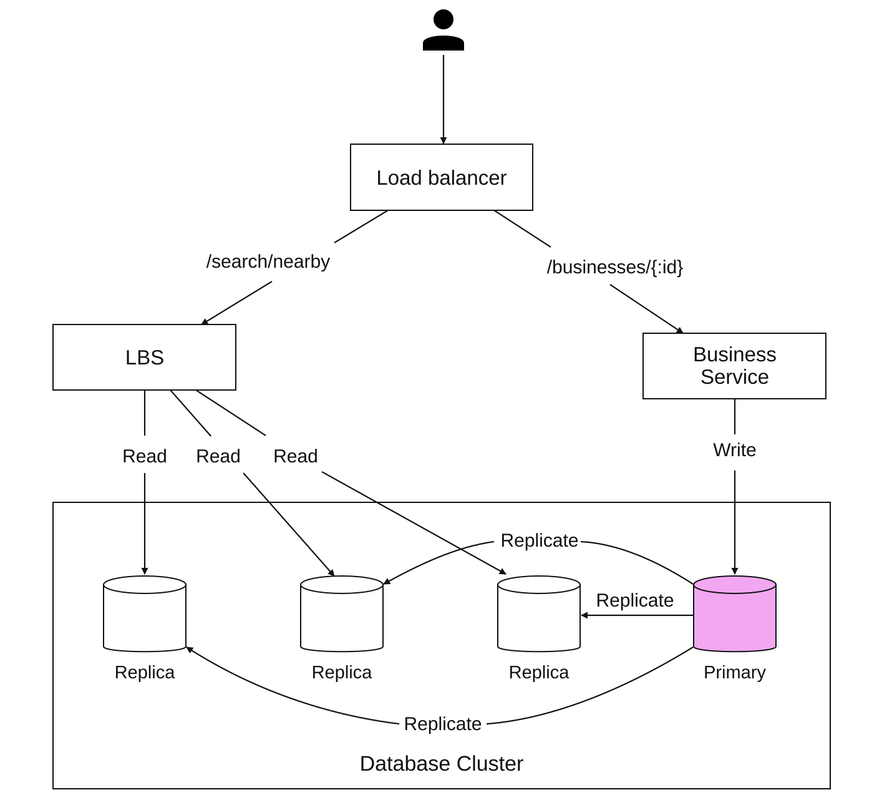
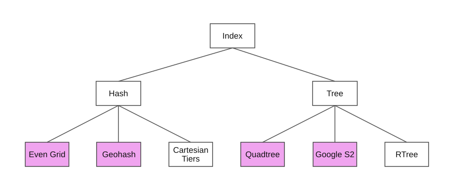
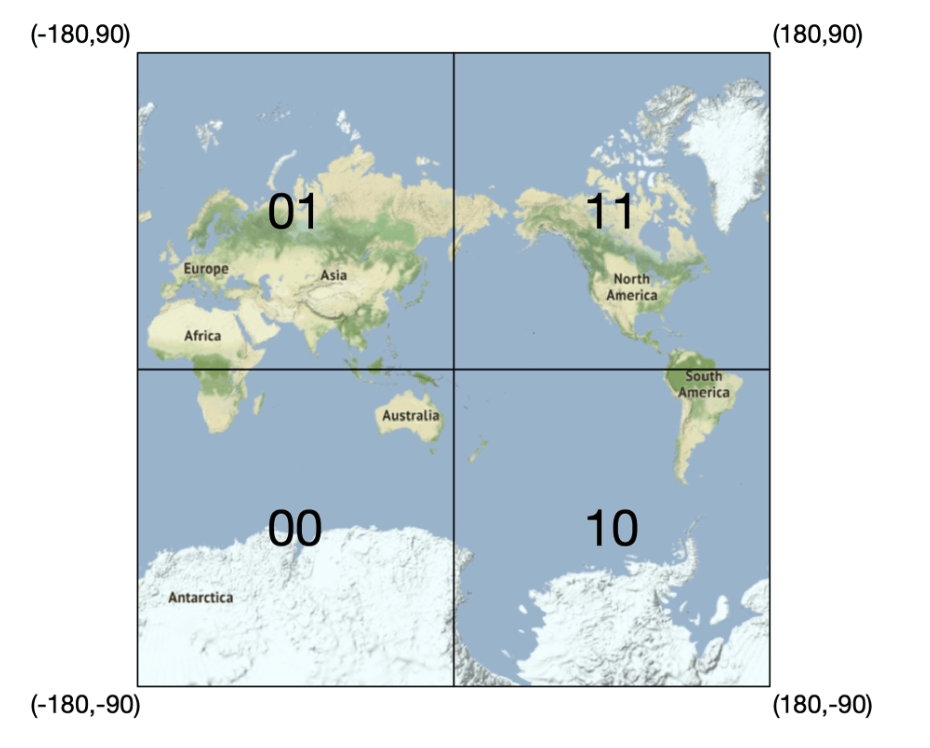
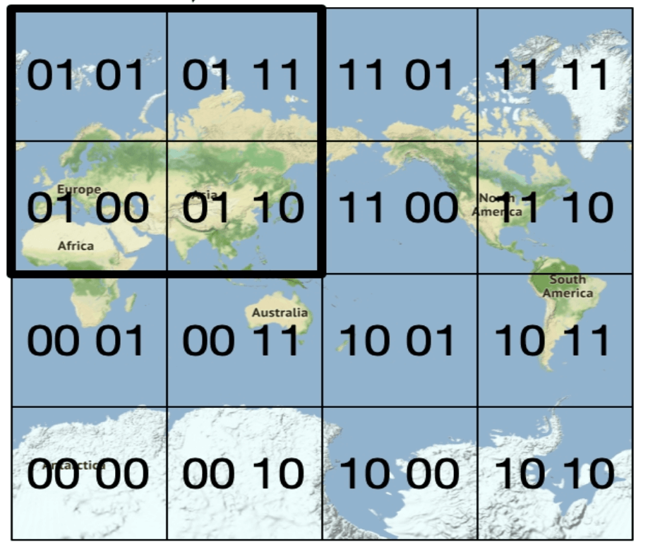
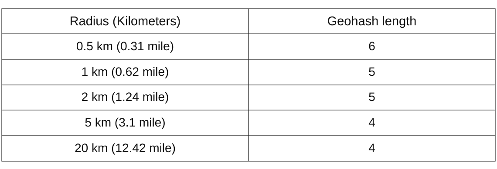
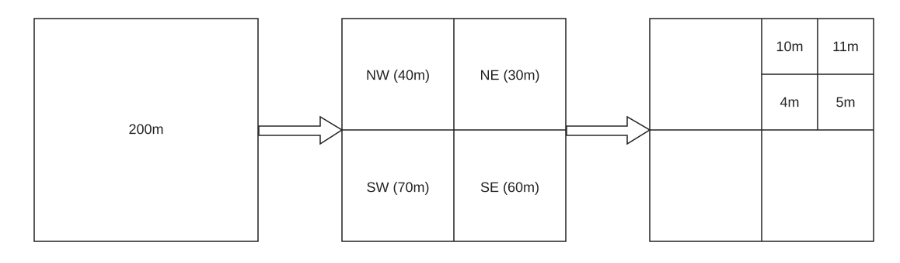
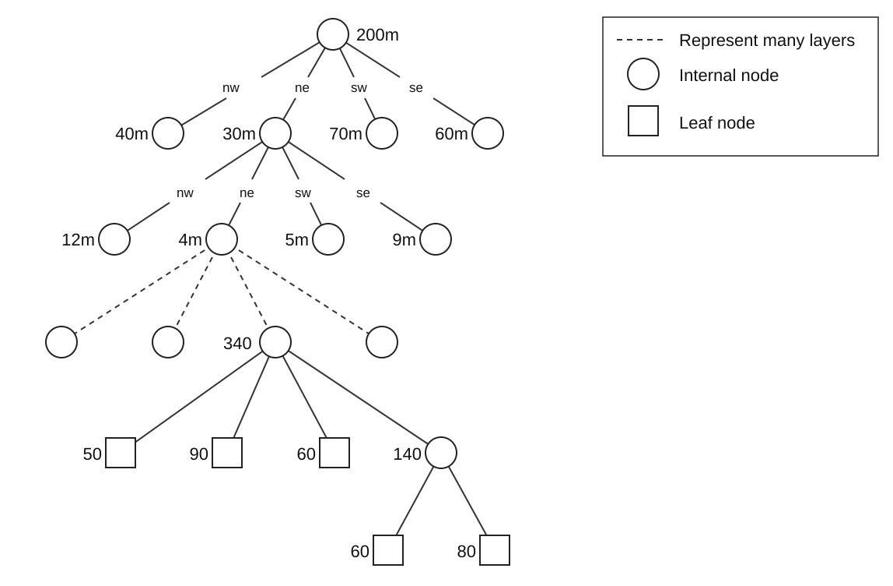
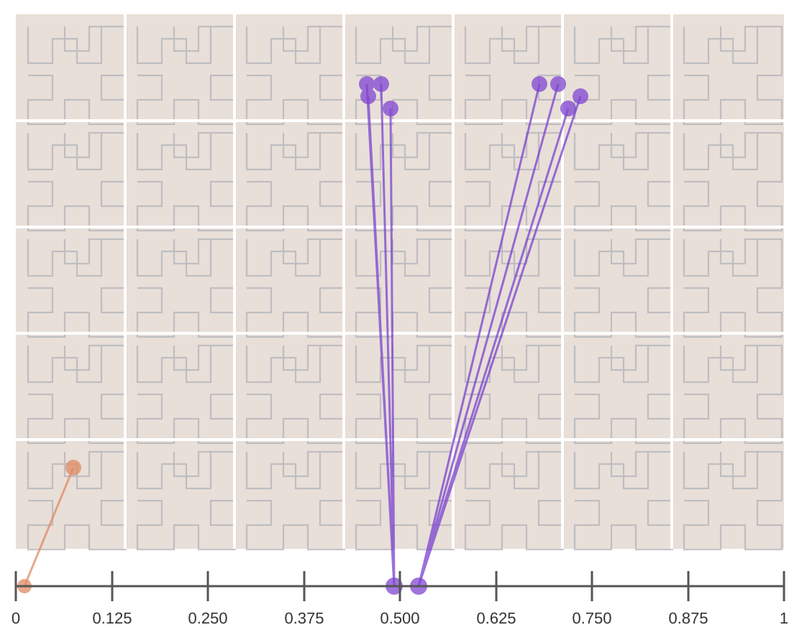
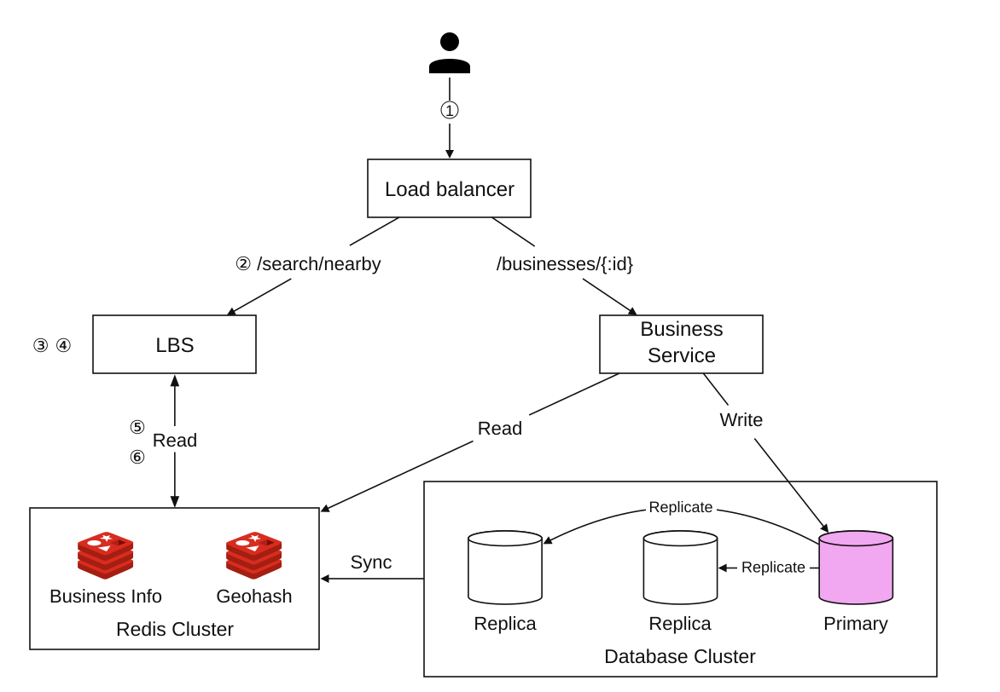

# Chapter 16: Proximity Service
<sub>[Back to System Design](../Readme.md#content)</sub>

## Introduction
A **proximity service** is designed to find nearby locations, such as restaurants, hotels, gas stations, and other businesses. This functionality is used in applications like **Google Maps** and **Yelp** to help users discover places within a defined radius.

## Step 1: Understanding the Problem and Establishing Scope

### **Functional Requirements**
1. **Search for businesses** based on user location (latitude, longitude) and search radius.
2. **Allow business owners** to add, update, or delete businesses (not real-time).
3. **Provide detailed business information** when requested.

### **Non-Functional Requirements**
- **Low latency**: Users should get quick responses.
- **Data privacy**: Compliance with GDPR and CCPA regulations.
- **High availability**: Handle peak-hour spikes in busy locations.

### **Back-of-the-Envelope Estimation**
- **100 million daily active users**.
- **200 million businesses** in the system.
- **Search QPS Calculation**:
  - Users make **5 searches per day**.
  - **Search QPS** = (100M × 5) / 86,400 ≈ **5,000 QPS**.

---

## Step 2: High-Level Design

### **API Design**
#### **Search Nearby Businesses**
GET /v1/search/nearby

- **Request Parameters**:
  - `latitude`: User’s location latitude.
  - `longitude`: User’s location longitude.
  - `radius`: Search radius (default: 5000 m).

#### **Business APIs**
| API Endpoint                     | Description                                      |
|-----------------------------------|--------------------------------------------------|
| `GET /v1/businesses/{id}`         | Fetch detailed business info                    |
| `POST /v1/businesses`             | Add a new business                              |
| `PUT /v1/businesses/{id}`         | Update business details                         |
| `DELETE /v1/businesses/{id}`      | Remove a business from the system               |


### **Data Model**
- Since the read volume is high because two features are very commonly used, a relational database such as MySQL is a good fit.
  - Search for nearby businesses
  - View the detailed information of a business

### **Data Schema**
- Key database tables are the business table and the geospatial index table.
- The business table contains detailed information about a business.

### **High-Level System Architecture**
The system comprises two parts: a location-based service (LBS) and a business-related service.

<div style="margin-left:3rem">
    
</div>

- **Location-Based Service (LBS)**:
  - Processes location-based search queries.
  - Read-heavy service with no write requests.
  - QPS is high especially during peak hours in dense areas and the system is stateless.
- **Business Service**: Deals with two types of requests.
  - Business owners create, update or delete businesses.
  - Customers view detailed information about a business.
- **Load Balancer**: Routes traffic to LBS and Business service.
- **Database Cluster**:
  - Uses **primary-replica architecture** for read-heavy workloads.
  - There might be some discrepancy between data read by LBS and data written by the primary database.
  - This inconsistency is not an issue because the business information is not updated in real time.

---

## Step 3: Algorithms for Fetching Nearby Businesses

### **Option 1: Two-Dimensional Search (Naive Approach)**

<div style="margin-left:3rem">
    
</div>

The most intuitive way is to draw a circle with a predefined radius and find all the businesses within the circle.

**SQL Query:**
```sql
SELECT business_id, latitude, longitude
FROM business
WHERE (latitude BETWEEN :lat - radius AND :lat + radius)
AND (longitude BETWEEN :long - radius AND :long + radius);
```
**Problems:**
- **Inefficient**: Requires scanning the entire database.
- **Limited by one-dimensional indexes** (latitude/longitude).

A potential improvement is to build indexes on the longitude and latitude columns. Although this is slightly better, it is still very slow.

### Better Approach
- The problem with the previous approach is that the database index can only increase search speed in one dimension.
- An optimal approach is to represent the two-dimensional data in one dimension using geospatial indexing.
  - Hash: Even grid, Geo Hash
  - Tree: Quadtree, Google S2, RTree

  <div style="margin-left:3rem">
    
  </div>


### **Option 2: Evenly Divided Grid**

  <div style="margin-left:3rem">
    
  </div>

- **Divides the world into fixed-size grids**.
- **Issue**: Uneven business distribution (high density in cities, sparse in rural areas).

### **Option 3: Geohash**
- Divide the planet into four quadrants along with the prime meridian and equator. And then divide each grid into four smaller grids.
- Each grid can be represented by alternating between longitude and latitude bits.
- Repeat this subdivision.

  <div style="margin-left:3rem">
    
    
  </div>


- **Encodes latitude and longitude into a single alphanumeric string**. It has 12 precision levels.
- **Hierarchical grid structure** allows for efficient searching.
- The right precision is chosen by using the minimal geohash length according to the table.
  <div style="margin-left:3rem">
    
  </div>
- Geohash guarantees that the longer a shared prefix is between two geohashes, the closer they are.

- **Challenges**:
  <div style="margin-left:3rem">
    
  </div>

  - **Boundary issues** (businesses close to grid edges may get excluded).
    - Two locations can be very close but have no shared prefix at all (they can be on the other side of the equator).
    - Two locations can have a long shared prefix but belong to different geohashes.
  - Solution: Need to search neighboring grids.


### **Option 4: Quadtree**

  A quadtree is a tree data structure that recursively divides a two-dimensional space into four quadrants, with each internal node having exactly four children, representing the four sub-regions of the space.
  - The quadtree is an in-memory data structure that runs on each LBS server and is built when the server starts.

  <div style="margin-left:3rem">
    
  </div>

  - The root node is recursively broken down into 4 quadrants until no nodes are left with more than x number of businesses (100 in this case).

  <div style="margin-left:3rem">
    
  </div>

- The quadtree index doesn't take too much memory (typically in GBs) and can easily fit on one server.
- Since the time complexity to build the tree is O(n log n), it might take a few minutes to build the tree.
- **Efficient for k-nearest search queries** (e.g., find the closest gas station).

  <div style="margin-left:3rem">
    
  </div>

#### Operational considerations
 - For around 200 million businesses, it might take a few minutes to build a quadtree when the server starts.
 - While the quadtree is built it cannot serve traffic, therefore a new release should be rolled out incrementally to a subset of servers.
 - When updating a business or adding a new one, the easiest approach is to incrementally rebuild the quadtree. (This leads to a lot of cache invalidation.)
 - Also possible to update the quadtree on the fly but more complex to implement. (Needs locking mechanism)

### **Option 5: Google S2**
It maps a sphere to a 1D index based on a Hilbert curve. Two points that are close to each other on the Hilbert curve are close in 1D space.


  <div style="margin-left:3rem">
    
    
  </div>

- **Divides the earth into small cells using a Hilbert curve**.
- Great for geofencing because it can cover arbitrary areas with varying levels.
- Geofencing also allows us to define parameters that surround the area of interest.
- Another advantage is that, instead of having a fixed level of precision, we can specify minimum and maximum levels and a maximum number of cells in S2.


## Tradeoff Comparison

#### Geohash
- Easy to use and implement - No need to build/rebuild a tree
- Supports fixed radius results
- Updating the index is easy.
- Cannot dynamically adjust the grid size based on population density.

#### Quadtree
- Slightly harder to implement.
- Supports fetching k-nearest businesses.
- Can dynamically adjust the grid size based on population density.
- Updating the index is more complicated as might need to rebuild the whole tree.

---

## Step 4: Scaling the Database and Caching Strategy

### **Scaling the Business Table**
- **Sharding by business ID** ensures even data distribution.
- We have separate rows for each business in the table.

| Geohash | Business ID |
|---------|------------|
| 9q9hvu  | 343        |
| 9q9hvu  | 347        |
| 9q9hvu  | 112        |

### **Scaling the Geospatial Index**
- Sharding might not be a good fit for the geohash table. In this case, everything can fit on a single server, so there's no technical reason for sharding.
- A better approach is to have read-replicas to help with read loads.

---

### **Cache Strategy**
The most obvious cache key choice is the location coordinate, however it has a few issues:
 - Location coordinates from GPS are not accurate.
 - A user can move, causing the location coordinate to change.
 - A better key is the geohash.

| Cache Key  | Cache Value |
|------------|------------|
| `geohash`  | List of business IDs in that grid |
| `business_id` | Business details (name, address, reviews, etc.) |

---

## Step 5: Deployment Strategy and Final Architecture

### **Region and Availability Zones**
- Deploy LBS and Business Service **across multiple regions**.

### **Handling Real-Time Updates**
- **Business updates are batch processed daily**.

### **Final System Architecture**

  <div style="margin-left:3rem">
    
  </div>


This final algorithm looks like this:

## Steps to Retrieve Nearby Businesses
1. **User Request:**
   - A user searches for restaurants within **500 meters**.
   - The client sends **latitude (37.776720), longitude (-122.416730), and radius (500m)** to the **load balancer**.

2. **Request Forwarding:**
   - The **load balancer (LB)** forwards the request to the **Location-Based Service (LBS)**.

3. **Geohash Calculation:**
   - LBS determines the **geohash length** matching the radius.
   - Using a reference table, **500m corresponds to geohash length = 6**.

4. **Fetching Neighboring Geohashes:**
   - LBS calculates **neighboring geohashes** to include nearby areas.
   - The result is a list:
     ```text
     [my_geohash, neighbor1_geohash, neighbor2_geohash, ..., neighbor8_geohash]
     ```

5. **Fetching Business IDs from Redis:**
   - For each geohash in the list, LBS queries the **Geohash Redis server** to fetch **business IDs**.
   - Parallel queries are used to minimize latency.

6. **Retrieving & Ranking Businesses:**
   - LBS fetches **full business details** from the **Business Info Redis server**.
   - Businesses are **sorted by distance** from the user’s location.
   - The **ranked results** are sent back to the client.

## Key Optimizations
- **Parallel Redis Calls**: Reduces response time.
- **Geohash Indexing**: Ensures efficient spatial queries.
- **Caching**: Speeds up lookup and retrieval of business data.

This method ensures **low-latency, scalable** retrieval of businesses near a user’s location.

---

### **Choosing the Best Indexing Method**
| Indexing Method | Pros | Cons |
|----------------|------|------|
| **Geohash** | Easy to implement, efficient for proximity search | Boundary issues, fixed grid size |
| **Quadtree** | Dynamically adjusts to density, supports k-nearest queries | More complex, requires tree rebalancing |
| **Google S2** | Advanced geofencing, used in Google Maps | Harder to implement |

---

## Reference materials

1. [Yelp](https://www.yelp.com/)
2. [Map tiles by Stamen Design](http://maps.stamen.com/)
3. [OpenStreetMap](https://www.openstreetmap.org)
4. [GDPR](https://en.wikipedia.org/wiki/General_Data_Protection_Regulation)
5. [CCPA](https://en.wikipedia.org/wiki/California_Consumer_Privacy_Act)
6. [Pagination in the REST API](https://developer.atlassian.com/server/confluence/pagination-in-the-rest-api/)
7. [Google places API](https://developers.google.com/maps/documentation/places/web-service/search)
8. [Yelp Places API — Business Search](https://docs.developer.yelp.com/reference/v3_business_search)
9. [Regions and Zones](https://docs.aws.amazon.com/AWSEC2/latest/UserGuide/using-regions-availability-zones.html)
10. [Redis GEOHASH](https://redis.io/commands/GEOHASH)
11. [POSTGIS](https://postgis.net/)
12. [Apache SpatialLucene and Cartesian tiers](https://cwiki.apache.org/confluence/spaces/LUCENEJAVA/pages/120735316/SpatialLucene)
13. [R-tree](https://en.wikipedia.org/wiki/R-tree)
14. [Global map in a Geographic Coordinate Reference System](https://bit.ly/3DsjAwg)
15. [Base32](https://en.wikipedia.org/wiki/Base32)
16. [Geohash grid aggregation](https://bit.ly/3kKl4e6)
17. [Geohash](https://www.movable-type.co.uk/scripts/geohash.html)
18. [Quadtree](https://en.wikipedia.org/wiki/Quadtree)
19. [How many leaves has a quadtree](https://stackoverflow.com/questions/35976444/how-many-leaves-has-a-quadtree)
20. [Blue green deployment](https://martinfowler.com/bliki/BlueGreenDeployment.html)
21. [Bing Maps Tile System and quadkeys](https://learn.microsoft.com/en-us/bingmaps/articles/bing-maps-tile-system)
22. [S2](https://s2geometry.io/)
23. [Hilbert curve](https://en.wikipedia.org/wiki/Hilbert_curve)
24. [Hilbert mapping](http://bit-player.org/extras/hilbert/hilbert-mapping.html)
25. [Geo-fence](https://en.wikipedia.org/wiki/Geo-fence)
26. [S2RegionCoverer implementation](https://github.com/google/s2geometry/blob/master/src/s2/s2region_coverer.h)
27. [Bing map](https://bit.ly/30ytSfG)
28. [MongoDB](https://docs.mongodb.com/manual/tutorial/build-a-2d-index/)
29. [Geospatial Indexing: The 10 Million QPS Redis Architecture Powering Lyft](https://www.youtube.com/watch?v=cSFWlF96Sds&t=2155s)
30. [Geo Shape Type](https://www.elastic.co/guide/en/elasticsearch/reference/1.6/mapping-geo-shape-type.html)
31. [Geosharded Recommendations Part 1: Sharding Approach](https://medium.com/tinder-engineering/geosharded-recommendations-part-1-sharding-approach-d5d54e0ec77a)
32. [Get the last known location](https://developer.android.com/training/location/retrieve-current#Challenges)
