# Chapter 17: Nearby Friends
<sub>[Back to System Design](../Readme.md#content)</sub>

## Introduction

This chapter focuses on designing a scalable backend for an application that enables users to share their locations and discover friends who are **nearby**.

The major difference with the proximity chapter is that in this problem, **locations constantly change**, whereas in that one, business addresses more or less stay the same.

## Step 1: Understand the Problem and Establish Design Scope

Some questions to drive the interview:
* C: How geographically close is considered to be "nearby"?
* I: 5 miles; this number should be configurable.
* C: Is distance calculated as straight-line distance without taking into consideration, for example, a river between friends?
* I: Yes, that is a reasonable assumption.
* C: How many users does the app have?
* I: 1 billion users, and 10% of them use the nearby friends feature.
* C: Do we need to store location history?
* I: Yes, it can be valuable for, e.g., machine learning.
* C: Can we assume inactive friends will disappear from the feature in 10 minutes?
* I: Yes.
* C: Do we need to worry about GDPR, etc.?
* I: No, for simplicity's sake.

### **Functional requirements**

* Users should be able to see nearby friends on their mobile app. Each friend has a distance and timestamp indicating when the location was updated.
* The nearby friends list should be updated every few seconds.

### **Non-functional requirements**

- **Low latency**: It's important to receive location updates without too much delay.
- **Reliability**: Occasional data point loss is acceptable, but the system should be generally available.
- **Eventual consistency**: The location data store doesn't need strong consistency. A few seconds' delay in receiving location data in different replicas is acceptable.

### **Back-of-the-envelope**

Some estimations to determine potential scale:
* Nearby friends are friends within a 5-mile radius.
* The location refresh interval is 30 seconds. Human walking speed is slow; hence, there is no need to update locations too frequently.
* On average, 100 million users use the feature every day, with 10% concurrent users, i.e., 10 million.
* On average, a user has 400 friends, all of whom use the nearby friends feature.
* The app displays 20 nearby friends per page.
* **Location Update QPS** = 10 million / 30 = ~334,000 updates per second

## Step 2: Propose High-Level Design and Get Buy-In

Before exploring API and data model design, we'll study the communication protocol we'll use, as it's less ubiquitous than the traditional request-response communication model.

### **High-level design**

At a high level, this problem calls for a design with efficient message passing. Conceptually, a user would like to receive location updates from every active friend nearby. It could in theory be done purely peer-to-peer; that is, a user could maintain a persistent connection to every other active friend in the vicinity.

<div style="margin-left:3rem">
    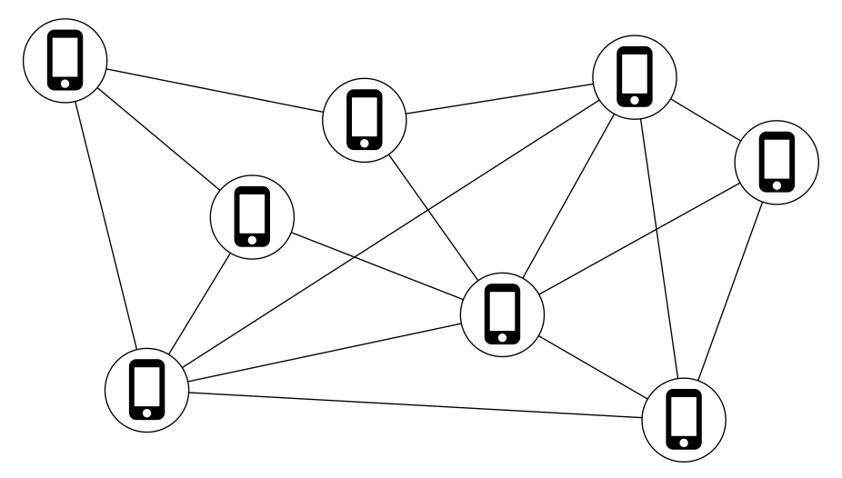
</div>

This solution is not practical for a mobile device with sometimes flaky connections and a tight power consumption budget.

A more practical approach is to use a shared backend as a fan-out mechanism towards friends you want to reach:

<div style="margin-left:3rem">
    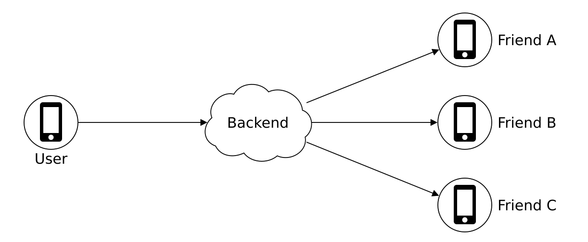
</div>

What does the backend do?
* Receives location updates from all active users.
* For each location update, finds all active users who should receive it and forwards it to them.
* Does not forward location data if the distance between friends is beyond the configured threshold.

This sounds pretty simple. What is the issue? Well, to do this at scale is not easy.

Let's assume we have 10 million active daily users. With each user updating the location information every 30 seconds, there are 333k updates per second. If on average each user has 400 friends, and we further assume that roughly 10% of those friends are online and nearby, the backend forwards 333k x 400 x 10% = 13 million location updates per second. That is a lot of updates to forward.

#### **Proposed design**

We'll start with a simpler design at first and discuss a more advanced approach in the deep dive:

<div style="margin-left:3rem">
    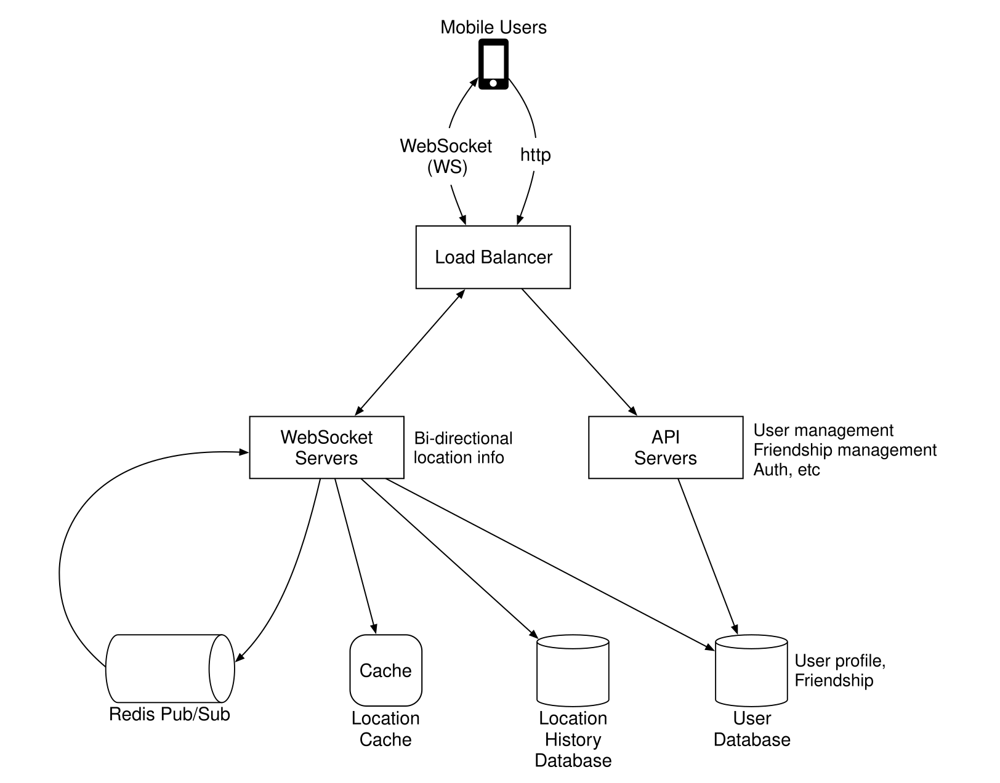
</div>

- **Load balancer**: spreads traffic across REST API servers as well as bidirectional WebSocket servers.
- **REST API servers**: handle auxiliary tasks such as managing friends, updating profiles, etc.
- **WebSocket servers**: stateful servers that forward location update requests to respective clients. They also seed the mobile client with nearby friends' locations at initialization (discussed in detail later).
- **Redis location cache**: used to store the most recent location data for each active user. There is a TTL set on each entry in the cache. When the TTL expires, the user is no longer active, and their data is removed from the cache.
- **User database**: stores user and friendship data. Either a relational or NoSQL database can be used for this purpose.
- **Location history database**: stores a history of user location data that is not necessarily used directly within the nearby friends feature, but is instead used for analytical purposes.
- **Redis Pub/Sub** [[2]](#ref-2): used as a lightweight message bus that enables different topics for each user channel for location updates. The image below shows how Redis Pub/Sub works.

<div style="margin-left:3rem">
    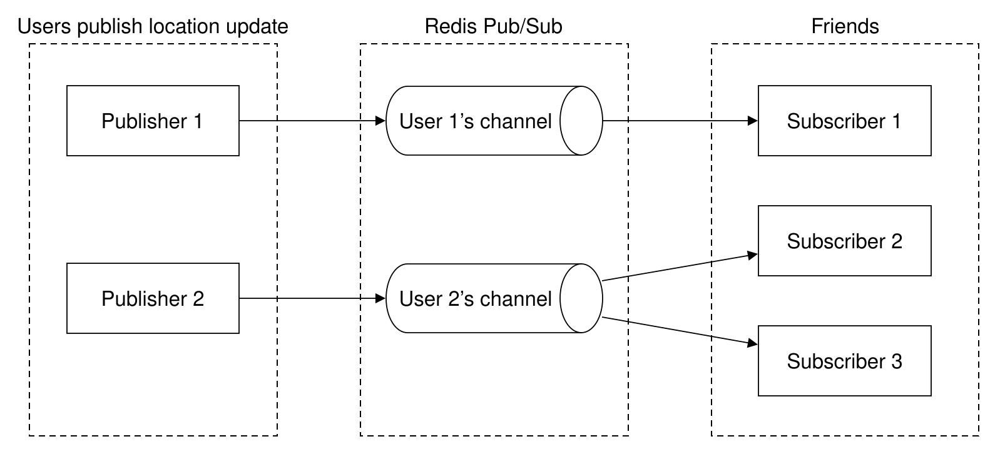
</div>

In the above example, WebSocket servers subscribe to channels for the users who are connected to them and forward location updates to the appropriate users whenever they receive them.

### **Periodic location update**

Here's how the periodic location update flow works:

<div style="margin-left:3rem">
    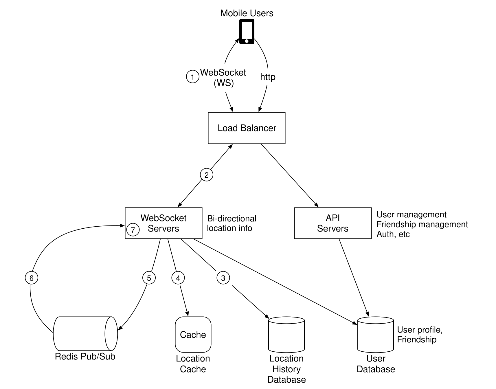
</div>

1. The mobile client sends a location update to the load balancer.
2. The load balancer forwards the location update to the persistent connection on the WebSocket server for that client.
3. The WebSocket server saves the location data to the location history database.
4. The WebSocket server updates the new location in the location cache. The update refreshes the TTL. The WebSocket server saves the new location in a variable in the user’s WebSocket connection handler for subsequent distance calculations.
5. The WebSocket server publishes the new location to the user’s channel in the Redis pub/sub server. Steps 3 to 5 can be executed in parallel.
6. When Redis pub/sub receives a location update on a channel, it broadcasts the update to all the subscribers (WebSocket connection handlers). In this case, the subscribers are all the online friends of the user sending the update. For each subscriber (i.e., for each of the user’s friends), its WebSocket connection handler would receive the user location update.
7. On receiving the message, the WebSocket server, on which the connection handler lives, computes the distance between the user sending the new location (the location data is in the message) and the subscriber (the location data is stored in a variable with the WebSocket connection handler for the subscriber).
8. This step is not drawn on the diagram. If the distance does not exceed the search radius, the new location and the last updated timestamp are sent to the subscriber’s client. Otherwise, the update is dropped.

Since understanding this flow is extremely important, let’s examine it again with a concrete example, as shown in the image below. Before we start, let’s make a few assumptions.
* User 1’s friends: user 2, user 3, and user 4.
* User 5’s friends: user 4 and user 6.

<div style="margin-left:3rem">
    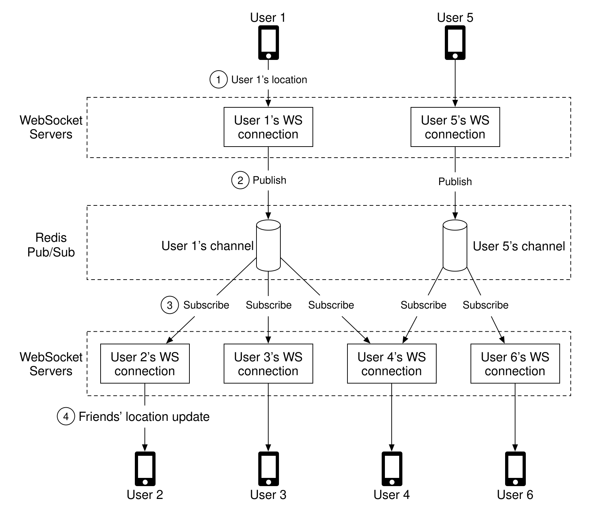
</div>

1. When user 1’s location changes, their location update is sent to the WebSocket server which holds user 1’s connection.
2. The location is published to user 1’s channel in the Redis pub/sub server.
3. The Redis pub/sub server broadcasts the location update to all subscribers. In this case, subscribers are WebSocket connection handlers (user 1’s friends).
4. If the distance between the user sending the location (user 1) and the subscriber (user 2) doesn’t exceed the search radius, the new location is sent to the client (user 2).

This computation is repeated for every subscriber to the channel. Since there are 400 friends on average, and we assume that 10% of those friends are online and nearby, there are about 40 location updates to forward for each user’s location update.

### **API Design**

WebSocket routines we'll need to support:
1. **Periodic location update** - the user sends location data to the WebSocket server.
2. **Client receives location updates** - the server sends friend location data and a timestamp.
3. **WebSocket client initialization** - the client sends the user's location; the server sends back nearby friends' location data.
4. **Subscribe to a new friend** - the WebSocket server sends a friend ID that the mobile client is supposed to track, e.g., when the friend appears online for the first time.
5. **Unsubscribe from a friend** - the WebSocket server sends a friend ID that the mobile client is supposed to unsubscribe from due to, e.g., the friend going offline.

**HTTP requests** - traditional request/response payloads for auxiliary responsibilities.

### **Data model**

#### **Location cache**

The location cache stores the latest locations of all active users who have had the nearby friends feature turned on. We use Redis for this cache. The key and value are `user_id` and `{latitude, longitude, timestamp}`. Redis is a great choice for this cache, as we only care about the current location, and it supports the TTL eviction that we need for our use case.

### **Why don’t we use a database to store location data?**

The “nearby friends” feature only cares about the **current** location of a user. Therefore, we only need to store one location per user. Redis is an excellent choice because it provides super-fast read and write operations. It supports TTL, which we use to auto-purge users from the cache who are no longer active. The current locations do not need to be durably stored. If the Redis instance goes down, we could replace it with an empty new instance and let the cache be filled as new location updates stream in. The active users could miss location updates from friends for an update cycle or two while the new cache warms. It is an acceptable tradeoff. In the deep dive section, we will discuss ways to lessen the impact on users when the cache gets replaced.

#### **Location history database**

The location history database stores users' historical location data, and the schema looks like this: `user_id`, `latitude`, `longitude`, `timestamp`.

We need a database that handles the write-heavy workload well and can be horizontally scaled. Cassandra is a good candidate.

## Step 3: Design Deep Dive

Let's discuss how we scale the high-level design so that it works at the scale we're targeting.

### **How well does each component scale?**

#### **API servers**

The methods to scale the RESTful API tiers are well understood. These are stateless servers, and there are many ways to auto-scale the clusters based on the CPU usage, load, or I/O. No need to go deeper.

#### **WebSocket servers**

For the WebSocket cluster, it is not difficult to auto-scale based on usage. However, the WebSocket servers are stateful, so care must be taken when removing existing nodes.

Before a node can be removed, all existing connections should be allowed to drain. To achieve that, we can mark a node as "draining" at the load balancer so that no new WebSocket connections will be routed to the draining server. Once all existing connections are closed (or after a reasonably long wait), the server is then removed.

Releasing a new version of the application software on a WebSocket server requires the same level of care.

It is worth noting that effective auto-scaling of stateful servers is the job of a good load balancer. Most cloud load balancers handle this job very well.

#### **Client Initialization**

The mobile client on startup establishes a persistent WebSocket connection with one of the WebSocket server instances. Each connection is long-running. Most modern languages are capable of maintaining many long-running connections with a reasonably small memory footprint.

When a WebSocket connection is initialized, the client sends the initial location of the user, and the server performs the following tasks in the WebSocket connection handler:
1. It updates the user's location in the location cache.
2. It saves the location in a variable of the connection handler for subsequent calculations.
3. It loads all the user's friends from the user database.
4. It makes a batched request to the location cache to fetch the locations for all the friends. Note that because we set a TTL on each entry in the location cache to match our inactivity timeout period, if a friend is inactive, then their location will not be in the location cache.
5. For each location returned by the cache, the server computes the distance between the user and the friend at that location. If the distance is within the search radius, the friend's profile, location, and last updated timestamp are returned over the WebSocket connection to the client.
6. For each friend, the server subscribes to the friend's channel in the Redis pub/sub server. Since creating a new channel is cheap, the user subscribes to all active and inactive friends. The inactive friends will take up a small amount of memory on the Redis pub/sub server, but they will not consume any CPU or I/O (since they do not publish updates) until they come online.
7. It sends the user's current location to the user's channel in the Redis pub/sub server.

#### **User Database**

The user database holds two distinct sets of data: user profiles (user ID, username, profile URL, etc.) and friendships.
These datasets at our design scale will likely not fit in a single relational database instance. The good news is that the data is horizontally scalable by sharding based on user ID. Relational database sharding is a very common technique.

### **Location cache**

We choose Redis to cache the most recent locations of all the active users. As mentioned earlier, we also set a TTL on each key. The TTL is renewed upon every location update.

This puts a cap on the maximum amount of memory used. With 10 million active users at peak, and with each location taking no more than 100 bytes, a single modern Redis server with many GBs of memory should be able to easily hold the location information for all users.

The real issue is the number of updates. By our previous calculations, it's 334,000 updates per second, which is too high for a single server. Luckily, this cache data is easy to shard.

#### **Redis pub/sub server**

The pub/sub server is used as a routing layer to direct messages (location updates) from one user to all the online friends. As mentioned earlier, we choose Redis pub/sub because it is very lightweight to create new channels. A new channel is created when someone subscribes to it. If a message is published to a channel that has no subscribers, the message is dropped, placing very little load on the server. When a channel is created, Redis uses a small amount of memory to maintain a hash table and linked list to track the subscribers. If there is no update on a channel when a user is offline, no CPU cycles are used after a channel is created. We take advantage of this in our design in the following ways:
1. We assign a unique channel to every user who uses the "nearby friends" feature. A user would, upon app initialization, subscribe to each friend's channel, whether the friend is online or not. This simplifies the design since the backend does not need to handle subscribing to a friend's channel when the friend becomes active or unsubscribing when the friend becomes inactive.
2. The tradeoff is that the design would use more memory. As we will see later, memory use is unlikely to be the bottleneck. Trading higher memory use for a simpler architecture is worth it in this case.

#### **Memory usage**

Assuming a channel is allocated for each user who uses the nearby friends feature, we need 100 million channels (1 billion x 10%). Assuming that on average a user has 100 active friends using this feature (this includes friends who are nearby or not), and it takes about 20 bytes of pointers in the internal hash table and linked list to track each subscriber, we will need about 200 GB (100 million x 20 bytes x 100 friends / 10^9 = 200 GB) to hold all the channels. For a modern server with 100 GB of memory, we will need about **2 Redis pub/sub servers** to hold all the channels.

#### **CPU usage**

As previously calculated, the pub/sub server pushes about 13 million updates per second to subscribers. Even though it is not easy to estimate with any accuracy how many messages a modern Redis server could push a second without actual benchmarking, it is safe to assume that a single Redis server will not be able to handle that load. Let's pick a conservative number and assume that a modern server with a gigabit network could handle about 100,000 subscriber pushes per second. Given how small our location update messages are, this number is likely to be conservative. Using this conservative estimate, we will need to distribute the load among 13 million / 100,000 = **130 Redis servers**. Again, this number is likely too conservative, and the actual number of servers could be much lower.


### **Distributed Redis pub/sub server cluster**

Considering 130 Redis servers, we need to introduce a service discovery component to our design. There are many service discovery packages available, with etcd [[4]](#ref-4) and ZooKeeper [[5]](#ref-5) among the most popular ones. Our need for the service discovery component is very basic: we need only two features:
1. The ability to keep a list of servers in the service discovery component, and a simple UI or API to update it. Fundamentally, service discovery is a small key-value store for holding configuration data. The key and value for the hash ring could look like this:
```text
Key: /config/pub_sub_ring
Value: ["p_1", "p_2", "p_3", "p_4"]
```
2. The ability for clients (in this case, the WebSocket servers) to subscribe to any updates to the "Value" (Redis pub/sub servers).

Using the "Key" mentioned in point 1, we store a hash ring of all the active Redis pub/sub servers in the service discovery component. The hash ring is used by the publishers and subscribers of the Redis pub/sub servers to determine the pub/sub server to talk to for each channel. For example, channel 2 lives in Redis pub/sub server 1 in the image below.

<div style="margin-left:3rem">
    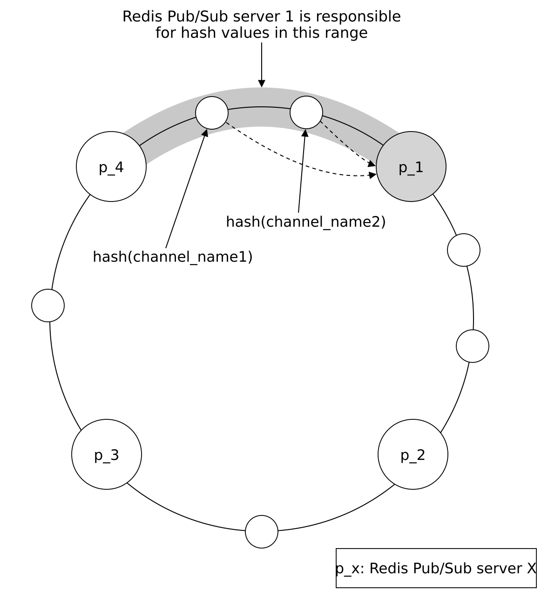
</div>

The image below shows what happens when a WebSocket server publishes a location update to a user's channel.

<div style="margin-left:3rem">
    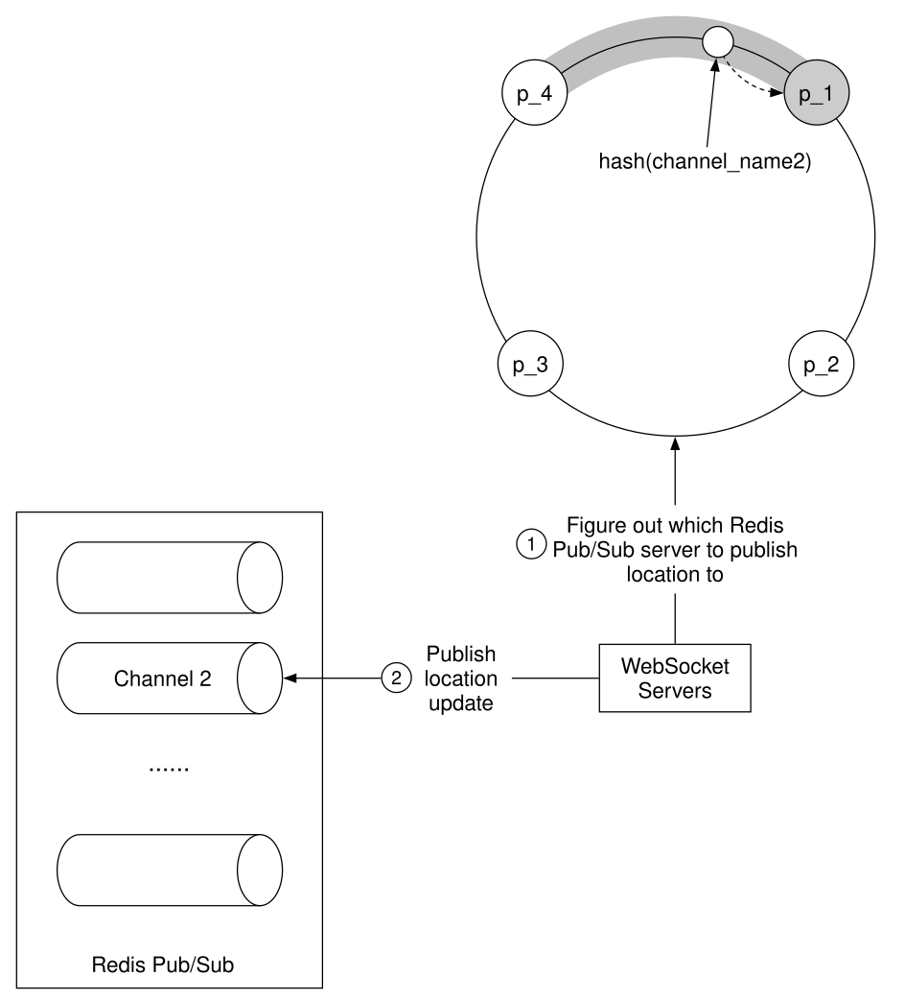
</div>

1. The WebSocket server consults the hash ring to determine the Redis pub/sub server to write to. The source of truth is stored in service discovery, but for efficiency, a copy of the hash ring could be cached on each WebSocket server. The WebSocket server subscribes to any updates on the hash ring to keep its local in-memory copy up to date.
2. The WebSocket server publishes the location update to the user's channel on that Redis pub/sub server.

### **Scaling considerations for Redis pub/sub servers**

Should we scale it up and down daily, based on traffic patterns? This is a very common practice for stateless servers because it is low risk and saves costs. To answer this question, let's examine some of the properties of the Redis pub/sub server cluster.

1. The messages sent on a pub/sub channel are not persisted in memory or on disk. They are sent to all subscribers of the channel and removed immediately after. If there are no subscribers, the messages are just dropped. In this sense, the data going through the pub/sub channel is stateless.
2. However, there is indeed state stored in the pub/sub servers for channels. Specifically, the subscriber list for each channel is a key piece of the state tracked by the pub/sub servers. If a channel is moved, which could happen when the channel's pub/sub server is replaced, or if a new server is added to or an old server removed from the hash ring, then every subscriber to the moved channel must know about it, so they can resubscribe to the replacement channel on the new server. In this sense, a pub/sub server is stateful, and coordination with all subscribers to the server must be orchestrated to minimize service interruptions.

For these reasons, we should treat the Redis pub/sub cluster more like a stateful cluster, similar to how we would handle a storage cluster. With stateful clusters, scaling up or down has some operational overhead and risks, so it should be done with careful planning. The cluster is normally overprovisioned to make sure it can handle daily peak traffic with some comfortable headroom to avoid unnecessary resizing of the cluster.

When we inevitably have to scale, be mindful of these potential issues:
* When we resize a cluster, many channels will be moved to different servers on the hash ring. When the service discovery component notifies all the WebSocket servers of the hash ring update, there will be a ton of resubscription requests.
* During these mass resubscription events, some location updates might be missed by the clients. Although occasional misses are acceptable for our design, we should minimize the occurrences.
* Because of the potential interruptions, resizing should be done when usage is at its lowest in the day.

### **Operational considerations for Redis pub/sub servers**

The operational risk of replacing an existing Redis pub/sub server is much, much lower. It does not cause a large number of channels to be moved.

When a pub/sub server goes down, the monitoring software should alert the on-call operator. The on-call operator updates the hash ring key in service discovery to replace the dead node with a fresh standby node. The WebSocket servers are notified about the update, and each one then notifies its connection handlers to re-subscribe to the channels on the new pub/sub server. Each WebSocket handler keeps a list of all channels it has subscribed to, and upon receiving the notification from the server, it checks each channel against the hash ring to determine if a channel needs to be re-subscribed to on a new server.

For example, if `p_1` went down and we replaced it with `p_1_new`, the hash ring would be updated like so:

```text
Old: ["p_1", "p_2", "p_3", "p_4"]
New: ["p_1_new", "p_2", "p_3", "p_4"]
```

<div style="margin-left:3rem">
    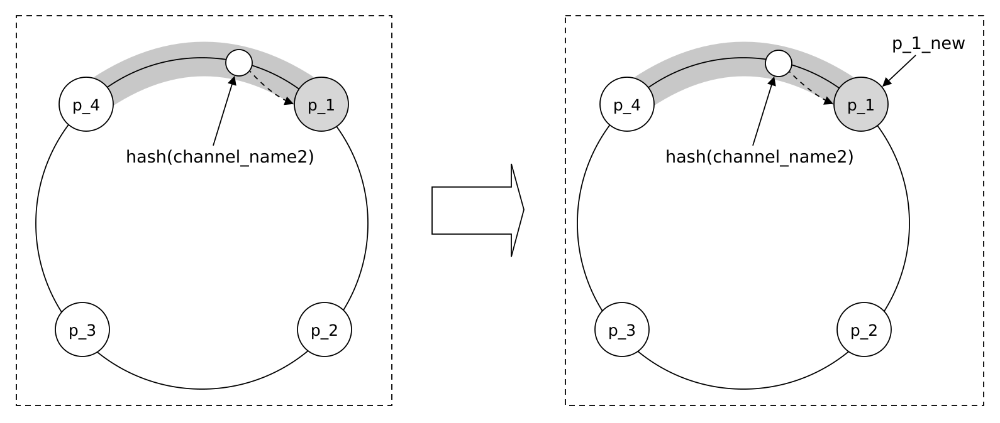
</div>

### **Adding/removing friends**

Whenever a friend is added or removed, the WebSocket server responsible for the affected user needs to subscribe to or unsubscribe from the friend's channel.

Since the "nearby friends" feature is part of a larger app, we can assume that a callback on the mobile client side can be registered whenever any of the events occurs and the client will send a message to the WebSocket server to perform the appropriate action.

### **Users with many friends**

We can put a cap on the total number of friends one can have; e.g., Facebook has a cap of 5000 friends.

The WebSocket server handling the "whale" user might have a higher load on its end, but as long as we have enough WebSocket servers, we should be okay.

### **Nearby random person**

What if the interviewer wants to update the design to include a feature where we can occasionally see a random person pop up on our nearby friends map?

One way to handle this is to define a pool of pub/sub channels, based on geohash:

<div style="margin-left:3rem">
    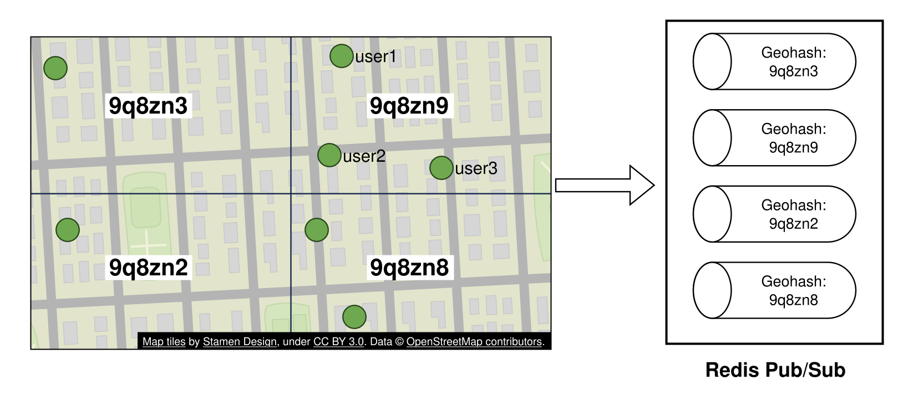
</div>

Anyone within the grid subscribes to the same channel.

<div style="margin-left:3rem">
    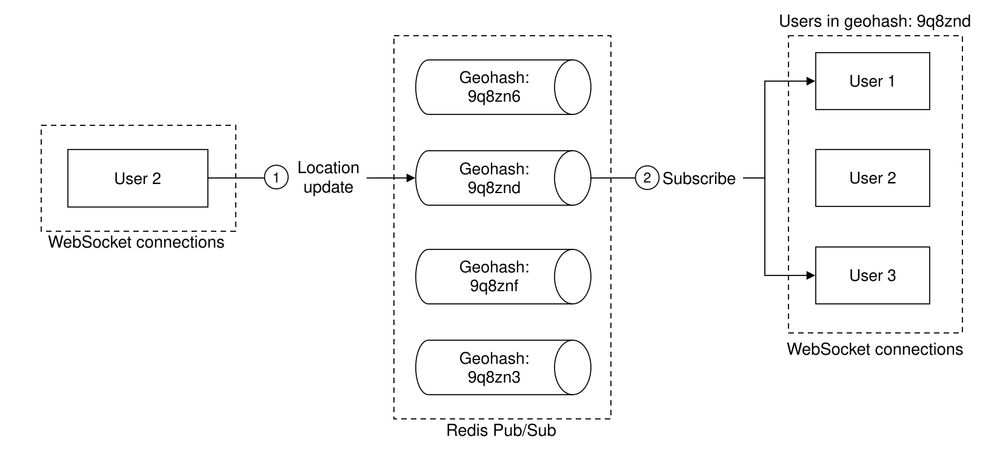
</div>

1. Here, when user 2 updates their location, the WebSocket connection handler computes the user's geohash ID and sends the location to the channel for that geohash.
2. Anyone nearby who subscribes to the channel (excluding the sender) will receive a location update message.

To handle people who are close to the border of a geohash grid, every client could subscribe to the geohash the user is in and eight surrounding geohash grids. An example with all nine geohash grids highlighted is shown in the image below.

<div style="margin-left:3rem">
    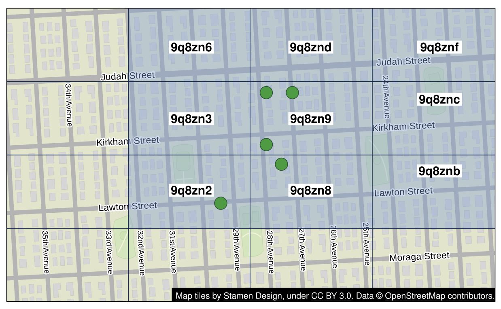
</div>

### **Alternative to Redis pub/sub**

An alternative to using Redis for pub/sub is to leverage Erlang [[7]](#ref-7) - a general programming language, optimized for distributed computing applications.

With it, we can spawn millions of small Erlang processes that communicate with each other. We can handle both WebSocket connections and Pub/Sub channels within the distributed Erlang application.

A challenge with using Erlang, though, is that it's a niche programming language, and it could be hard to source strong Erlang developers.

## Step 4: Wrap Up

We successfully designed a system that supports the nearby friends feature.

Core components:
- **WebSocket servers**: real-time comms between client and server
- **Redis**: fast read and write of location data + pub/sub channels

We also explored how to scale RESTful API servers, WebSocket servers, the data layer, and Redis Pub/Sub servers. We also explored an alternative to using Redis Pub/Sub and a "random nearby person" feature.

## Reference materials

1. <a id="ref-1"></a>[Facebook Launches “Nearby Friends”](https://techcrunch.com/2014/04/17/facebook-nearby-friends/)
2. <a id="ref-2"></a>[Redis Pub/Sub documentation](https://redis.io/docs/latest/develop/pubsub/)
3. <a id="ref-3"></a>[Redis Pub/Sub implementation](https://github.com/redis/redis/blob/unstable/src/pubsub.c)
4. <a id="ref-4"></a>[etcd](https://etcd.io/)
5. <a id="ref-5"></a>[ZooKeeper](https://zookeeper.apache.org/)
6. <a id="ref-6"></a>[Consistent hashing](https://www.toptal.com/big-data/consistent-hashing)
7. <a id="ref-7"></a>[Erlang](https://www.erlang.org/)
8. <a id="ref-8"></a>[Elixir](https://elixir-lang.org/)
9. <a id="ref-9"></a>[A brief introduction to BEAM](https://www.erlang.org/blog/a-brief-beam-primer/)
10. <a id="ref-10"></a>[OTP](https://www.erlang.org/doc/design_principles/des_princ.html)
