# Chapter 19: Distributed Message Queue

[Back to System Design](../Readme.md#content)

## Introduction

We'll be designing a **distributed message queue** in this chapter.

Benefits of message queues:

- **Decoupling**: Eliminates tight coupling between components, allowing them to be updated independently.
- **Improved scalability**: Producers and consumers can be scaled independently based on traffic.
- **Increased availability**: If one part of the system goes down, other parts continue interacting with the queue.
- **Better performance**: Producers can produce messages without waiting for consumer confirmation.

Some popular message queue implementations include Kafka, RabbitMQ, RocketMQ, Apache Pulsar, ActiveMQ, and ZeroMQ.

Strictly speaking, Kafka and Pulsar are not message queues. They are event-streaming platforms.
There is, however, a convergence of features that blurs the distinction between message queues and event-streaming platforms.

In this chapter, we'll be building a message queue with support for more advanced features such as long-term data retention and repeated message consumption.

## Step 1: Understand the Problem and Establish Design Scope

Message queues ought to support a few basic features: producers produce messages, and consumers consume them.

There are, however, different considerations with regard to performance, message delivery, data retention, etc.

Here's a potential exchange between a candidate (C) and an interviewer (I):

* C: What are the message format and average size? Is it text only?
* I: Messages are text-only and usually a few KB in size.
* C: Can messages be repeatedly consumed?
* I: Yes, messages can be repeatedly consumed by different consumers. This is an added requirement that traditional message queues don't support.
* C: Are messages consumed in the same order in which they were produced?
* I: Yes, the ordering guarantee should be preserved. This is an added requirement; traditional message queues don't support this.
* C: What are the data retention requirements?
* I: Messages need to be retained for two weeks. This is an added requirement.
* C: How many producers and consumers do we want to support?
* I: The more, the better.
* C: What data-delivery semantics do we want to support? At-most-once, at-least-once, or exactly-once?
* I: We definitely want to support at-least-once. Ideally, we can support all three and make them configurable.
* C: What are the target throughput and end-to-end latency?
* I: It should support high throughput for use cases like log aggregation and low throughput for more traditional use cases.

### **Functional requirements**

* Producers send messages to a message queue.
* Consumers consume messages from the queue.
* Messages can be consumed once or repeatedly.
* Historical data can be truncated.
* Message sizes are in the KB range.
* The order of messages needs to be preserved.
* Data-delivery semantics are configurable: at-most-once, at-least-once, or exactly-once.

### **Non-functional requirements**

- **High throughput or low latency**: Configurable based on the use case.
- **Scalable**: The system should be distributed and support a sudden surge in message volume.
- **Persistent and durable**: Data should be persisted on disk and replicated among nodes.

Traditional message queues typically don't support data retention and don't provide ordering guarantees. This greatly simplifies the design, as we'll discuss below.

## Step 2: Propose a High-Level Design and Get Buy-In

Key components of a message queue:

    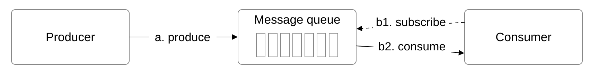

* A producer sends messages to a queue.
* A consumer subscribes to a queue and consumes its messages.
* A message queue is an intermediary service that decouples producers from consumers, letting them scale independently.
* Producers and consumers are clients, while the message queue is the server.

### **Messaging models**

#### **Point-to-point**

The first type of messaging model is **point-to-point**, and it's commonly found in traditional message queues:

    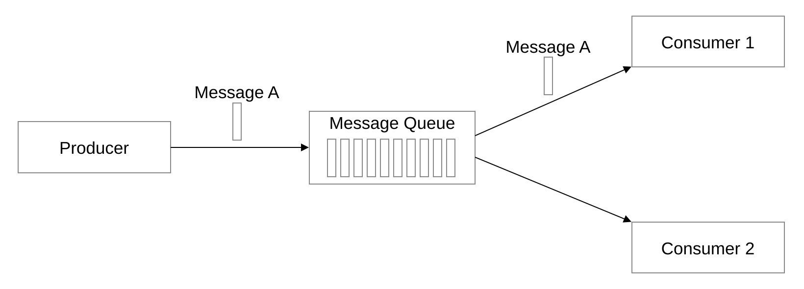

* A message is sent to a queue and consumed by exactly one consumer.
* There can be multiple consumers, but a message is consumed only once.
* Once a message is acknowledged as consumed, it is removed from the queue.
* There is no data retention in the **point-to-point** model, but our design has it.

#### **Publish-subscribe**

First, let's introduce a new concept, the **topic**. Topics are categories used to organize messages. Each topic has a name that is unique across the entire message queue service. Messages are sent to and read from a specific topic.

In the **publish-subscribe** model, a message is sent to a topic and received by the consumers subscribed to that topic. As shown in the image below, message A is consumed by both consumer 1 and consumer 2.

    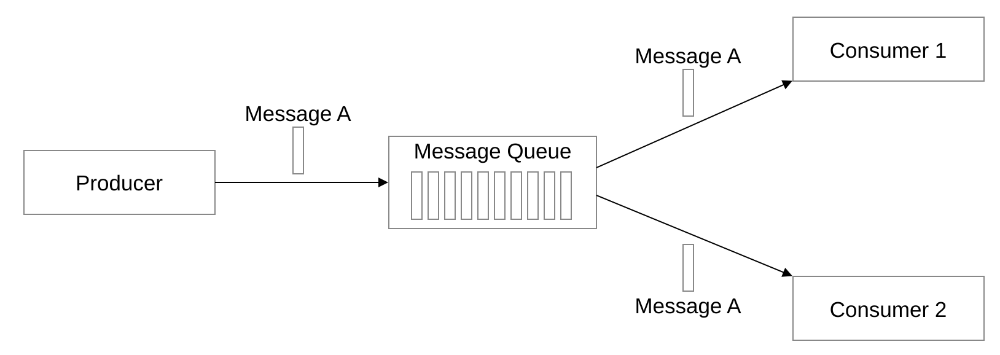

* In this model, messages are associated with a topic.
* Consumers subscribe to a topic and receive all messages sent to it.

### **Topics, partitions, and brokers**

As mentioned earlier, messages are persisted by topic. What if the data volume in a topic is too large for a single server to handle? One approach to solving this problem is called **partitioning** (also known as **sharding**). As the image below shows, we divide a topic into partitions and deliver messages evenly across partitions.

    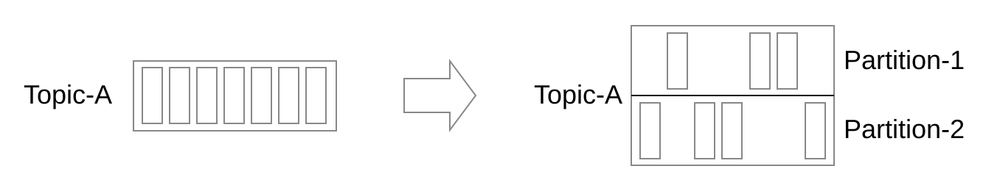

* Messages sent to a topic are evenly distributed across partitions.
* The servers that host partitions are called **brokers**.
* Each topic operates like a queue using first-in, first-out (FIFO) message processing. Message order is preserved within a partition.
* The position of a message within the partition is called an **offset**.
* When a message is sent by a producer, it is actually sent to one of the partitions for the topic.
* An optional message key (for example, a `user_id`) could guarantee that all messages with that key are sent to the same partition.
* Each consumer subscribes to one or more partitions. When there are multiple consumers for the same messages, they form a consumer group.

### **Consumer groups**

A **consumer group** is a set of consumers working together to consume messages from topics.

    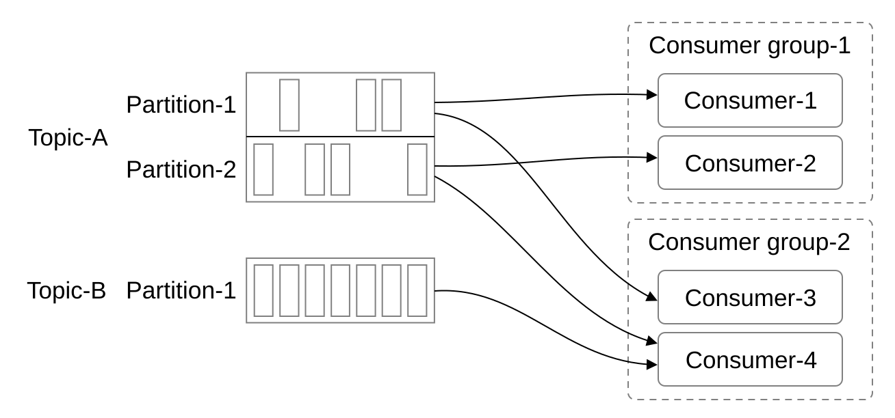

* Messages are replicated per **consumer group** (not per consumer).
* Each **consumer group** maintains its own offset.
* Having a **consumer group** read messages in parallel improves throughput but hampers the ordering guarantee.
* This can be mitigated by allowing only one consumer from a group to subscribe to a given partition.
* This means that we can't have more consumers in a group than there are partitions.

### **High-level architecture**

    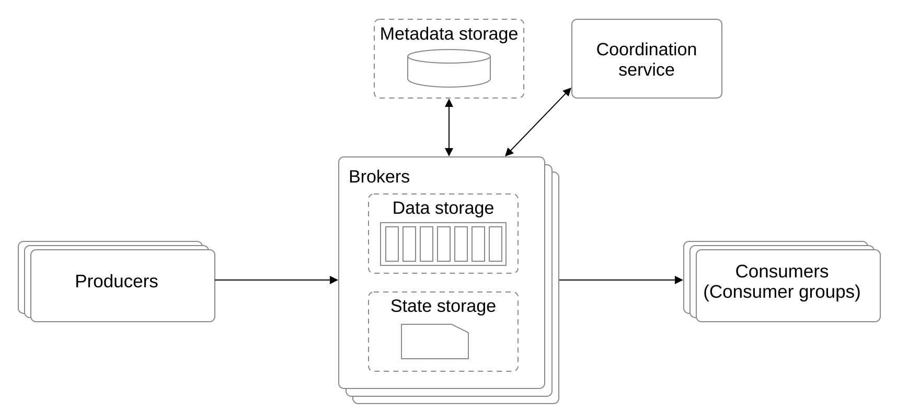

Clients:

* **Producer**: pushes messages to specific topics.
* **Consumer group**: subscribes to topics and consumes messages.

Core service and storage:

* **Broker**: holds multiple partitions. A partition holds a subset of messages for a topic.
* Storage:
    - **Data storage**: stores messages in partitions.
    - **State storage**: stores consumer state.
    - **Metadata storage**: stores configuration and topic properties.
* Coordination service:
    - Service discovery: identifies which brokers are alive.
    - Leader election: one of the brokers is selected as the active controller. There is only one active controller in the cluster. The active controller is responsible for assigning partitions.
    - Apache ZooKeeper [[2]](#ref-2) or etcd [[3]](#ref-3) are commonly used to elect a controller.

## Step 3: Design Deep Dive

To achieve high throughput and meet the long-term data retention requirement, we made some important design choices:

* We chose an on-disk data structure that takes advantage of the properties of modern HDDs and the disk-caching strategies of modern operating systems.
* The message data structure is immutable to avoid extra copying in a high-volume, high-traffic system.
* We designed our writes around batching because small I/O operations limit throughput.

### **Data storage**

To find the best data store for messages, we must examine their access patterns:

* Both write-heavy and read-heavy.
* No update or delete operations. In traditional message queues, there is a "delete" operation as messages are not retained.
* Predominantly sequential reads and writes.

What are our options?

- **Database**: Not ideal, as typical databases don't support both write- and read-heavy systems well.
- **Write-ahead log (WAL)**: A plain-text file that only supports appending data and is well suited to HDDs.
  * We split partitions into segments to avoid maintaining a very large file.
  * Old segments are read-only. Writes are accepted only by the latest segment.

    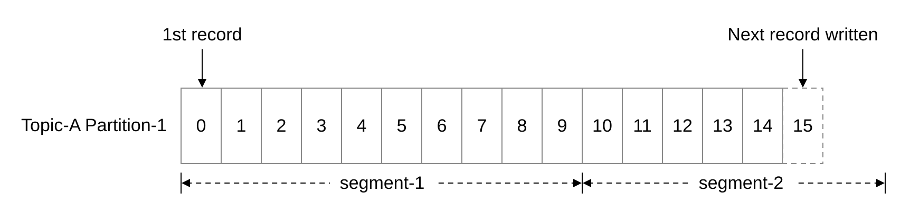

Segment files for the same partition are organized in a folder named `Partition-{:partition_id}`. The structure is shown in the image below.

    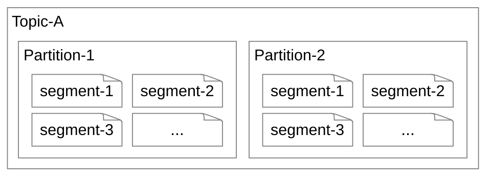

WAL files are extremely efficient when used with traditional HDDs.

There is a misconception that HDD access is slow, but that depends heavily on the access pattern.

When the access pattern is sequential (as in our case), HDDs can achieve read and write speeds of several MB/s, which is sufficient for our needs.

We also benefit from the fact that the operating system aggressively caches disk data in memory.

### **Message data structure**

It is important that the message schema is consistent across the producer, queue, and consumer to avoid extra copying. This allows much more efficient processing.

Example message structure:

    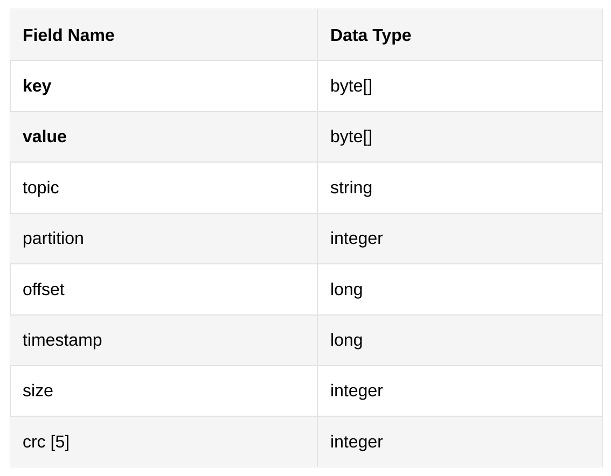

#### **Message key**

The message key is used to determine the message's partition. If the key is not defined, the partition is randomly chosen. Otherwise, the partition is chosen by `hash(key) % numPartitions`.

For more flexibility, the producer can override the default keys to control which partitions receive messages.

#### **Message value**

The message value is the message payload. It can be plaintext or a compressed binary block.

> **Note**: Unlike keys in traditional key-value (KV) stores, message keys need not be unique. It is acceptable to have duplicate keys or even a missing key.

#### **Other message fields**

- **Topic**: The topic to which the message belongs.
- **Partition**: The ID of the partition to which the message belongs.
- **Offset**: The position of the message in a partition. A message can be located using its `topic`, `partition`, and `offset`.
- **Timestamp**: When the message is stored.
- **Size**: The size of the message.
- **CRC**: A cyclic redundancy check used to verify message integrity.

Features such as filtering can be supported by adding fields.

### **Batching**

Batching is critical for the performance of our system. We apply it in the producer, consumer, and message queue.

It is critical because:

* It allows the operating system to group messages together, amortizing the cost of expensive network round trips.
* Messages are written to the WAL in sequential batches, taking advantage of sequential writes and disk caching.

There is a trade-off between latency and throughput:

* Larger batches lead to higher throughput and higher latency.
* Smaller batches lead to lower throughput and lower latency.

If we need lower latency because the system is deployed as a traditional message queue, we can tune it to use a smaller batch size.

If the system is tuned for throughput, we might need more partitions per topic to compensate for the slower sequential disk write throughput.

### **Producer flow**

If a producer wants to send a message to a partition, which broker should it connect to?

One option is to introduce a routing layer that routes messages to the correct broker. If replication is enabled, the correct broker is the one hosting the leader replica:

    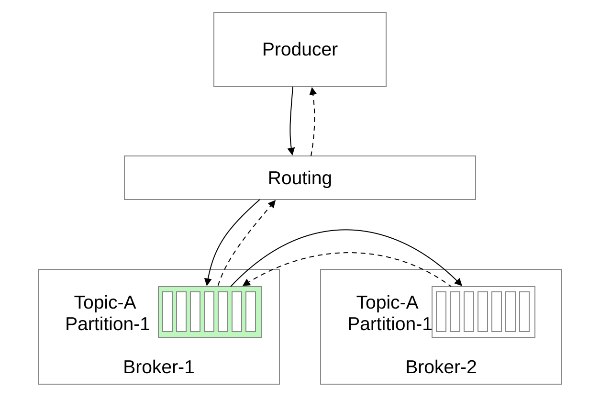

Routing layer:

1. The producer sends messages to the routing layer.
2. The routing layer reads the replica distribution plan from the metadata storage and caches it locally. When a message arrives, it routes the message to the leader replica of partition 1, which is hosted on broker 1.
3. The leader replica receives the message, and follower replicas pull data from the leader.
4. When “enough” replicas have synchronized the message, the leader commits the data (persisted on disk), which means the data can be consumed. Then it responds to the producer.

The reason for having replicas is to enable fault tolerance.

This approach works, but it has some drawbacks:

* Additional network hops due to the extra component.
* The design doesn't enable message batching.

To mitigate these issues, we can embed the routing layer into the producer:

    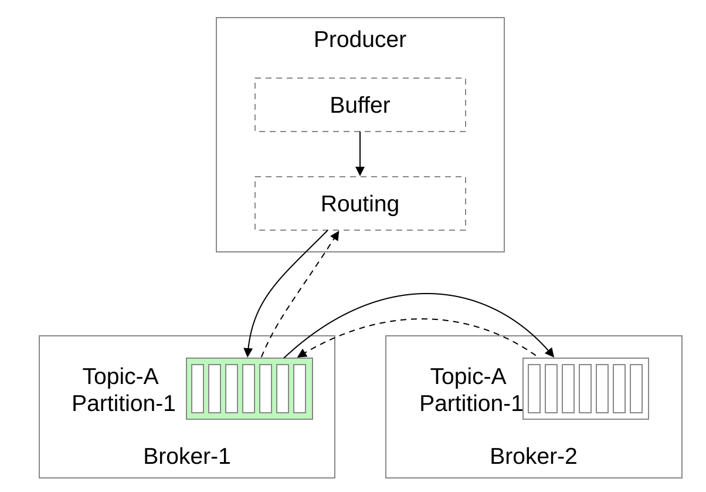

* Fewer network hops lead to lower latency.
* Producers can control which partition a message is routed to.
* The buffer allows us to batch messages in memory and send out larger batches in a single request, which increases throughput.

Choosing a batch size involves a classic trade-off between throughput and latency.

    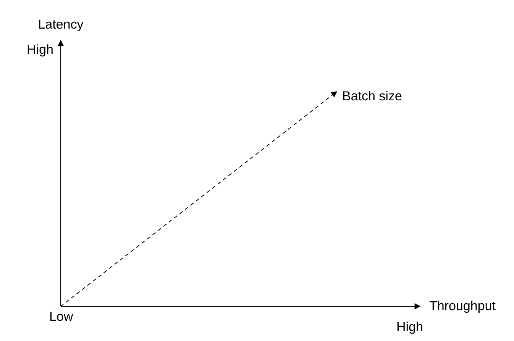

* A larger batch size leads to a longer wait before the batch is committed.
* A smaller batch size allows requests to be sent sooner, resulting in lower latency but lower throughput.

### **Consumer flow**

The consumer specifies its offset in a partition and receives a chunk of messages beginning at that offset:

    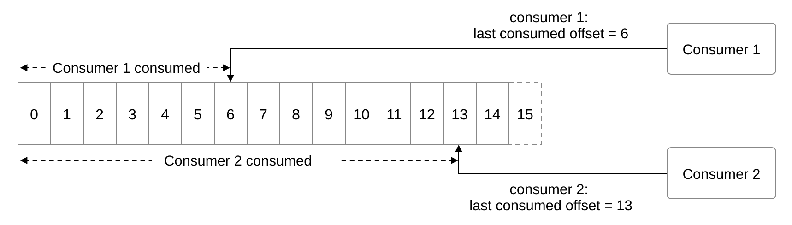

One important consideration when designing the consumer is whether to use a push or a pull model:

- **Push model**: Leads to lower latency because the broker pushes messages to the consumer as it receives them.
  * However, if the consumption rate falls below the production rate, the consumer can be overwhelmed.
  * It is challenging to deal with consumers with varying processing power as the broker controls the rate of consumption.
- **Pull model**: Allows the consumer to control the consumption rate.
  * If the consumption rate is low, the consumer will not be overwhelmed, and we can scale the consumers to catch up.
  * The pull model is more suitable for batch processing because, with the push model, the broker can't know how many messages a consumer can handle.
  * With the pull model, on the other hand, consumers can aggressively fetch large message batches.
  * The downsides are higher latency and additional network requests when there are no new messages. The latter issue can be mitigated using long polling [[6]](#ref-6).

Hence, most message queues, including ours, choose the pull model.

    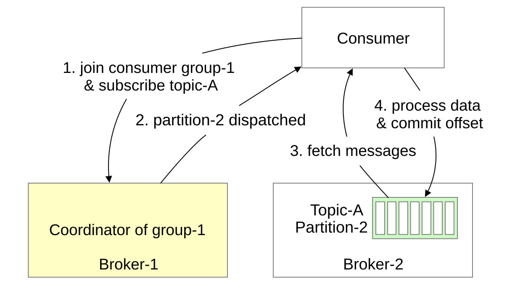

1. A new consumer wants to join group 1 and subscribes to topic A. It finds the corresponding broker node by hashing the group name. By doing so, all the consumers in the same group connect to the same broker, which is also called the coordinator of this consumer group. Despite the naming similarity, the consumer group coordinator is different from the coordination service mentioned in the high-level design. The former coordinates the consumer group, while the latter coordinates the broker cluster.
2. The coordinator confirms that the consumer has joined the group and assigns partition 2 to the consumer. There are different partition assignment strategies, including round-robin and range [[7]](#ref-7).
3. The consumer fetches messages from the last consumed offset, which is managed by the state storage.
4. The consumer processes messages and commits the offset to the broker. The order in which data is processed and offsets are committed affects the message delivery semantics, which will be discussed shortly.

### **Consumer rebalancing**

Consumer rebalancing determines which consumers are responsible for which partitions.

This process occurs when a consumer joins or leaves a group, or when a partition is added or removed.

The broker, acting as a coordinator, plays a major role in orchestrating the rebalancing workflow.

    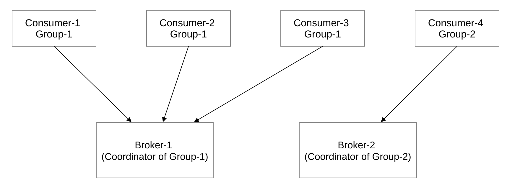

* All consumers from the same group are connected to the same coordinator. The coordinator is found by hashing the group name.
* When the consumer list changes, the coordinator chooses a new leader of the group.
* The leader of the group calculates a new partition dispatch plan and reports it back to the coordinator, which broadcasts it to the other consumers.

When the coordinator stops receiving heartbeats from the consumers in a group, rebalancing is triggered:

    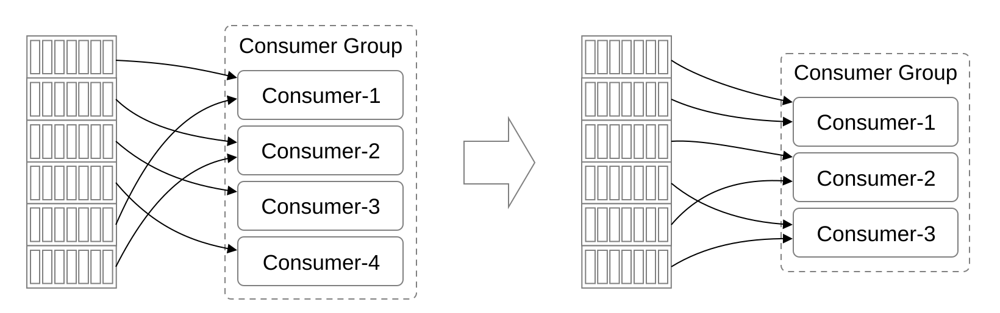

Let's explore what happens when a **consumer joins a group**:

    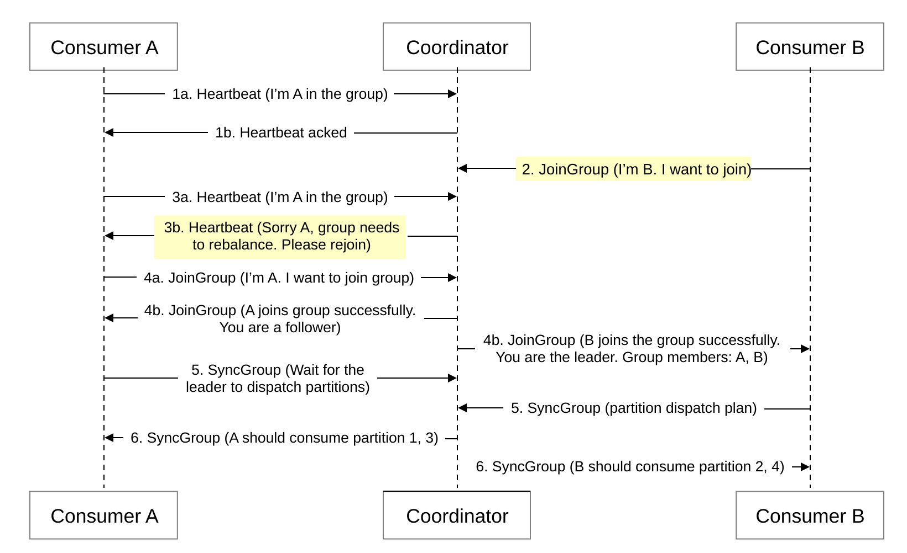

1. Initially, only consumer A is in the group. It consumes messages from all the partitions and sends regular heartbeats to the coordinator.
2. Consumer B sends a request to join the group.
3. The coordinator knows it’s time to rebalance, so it notifies all the consumers in the group through heartbeat responses. When the coordinator receives A’s heartbeat, it asks A to rejoin the group.
4. Once all the consumers have rejoined the group, the coordinator chooses one of them as the leader and informs all the consumers of the election result.
5. The group leader generates the partition dispatch plan and sends it to the coordinator. Follower consumers ask the coordinator about the partition dispatch plan.
6. Consumers start consuming messages from their newly assigned partitions.

Here's what happens when a **consumer leaves the group**:

    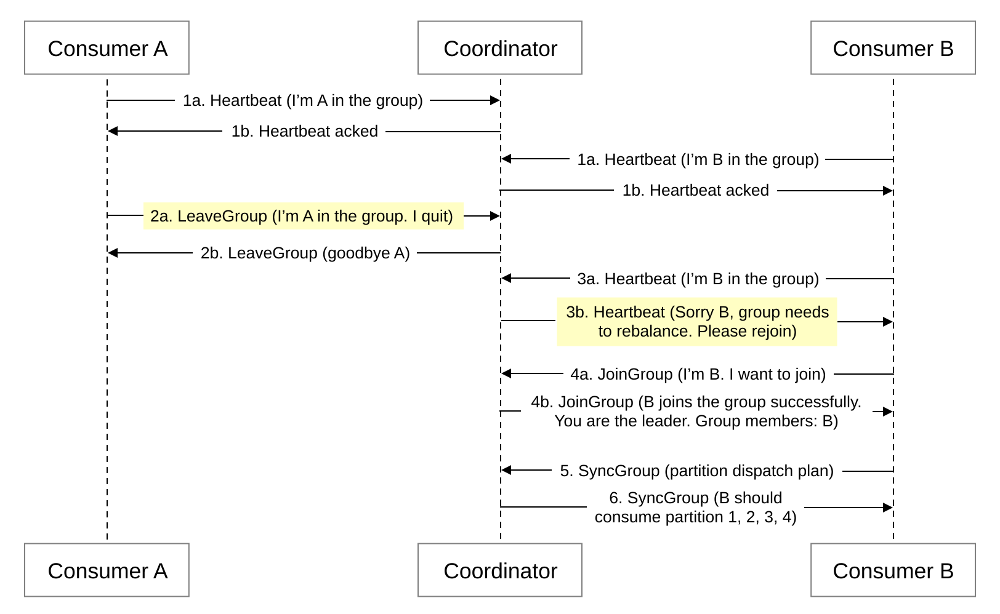

1. Consumers A and B are in the same consumer group.
2. Consumer A needs to be shut down, so it requests to leave the group.
3. The coordinator knows it’s time to rebalance. When the coordinator receives B’s heartbeat, it asks B to rejoin the group.
4. The remaining steps are the same as those in the previous scenario.

The process is similar when a **consumer crashes** and stops sending heartbeats:

    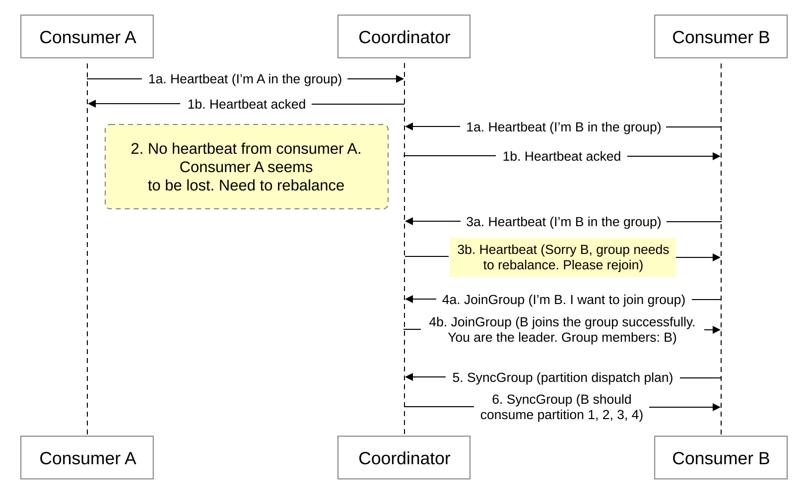

1. Consumers A and B send regular heartbeats to the coordinator.
2. Consumer A crashes and stops sending heartbeats to the coordinator. If the coordinator does not receive a heartbeat from consumer A within the specified time, it marks that consumer as dead.
3. The coordinator triggers the rebalance process.
4. The remaining steps are the same as those in the previous scenario.

### **State storage**

The state storage stores mappings between partitions and consumers, as well as the last consumed offsets for each partition.

    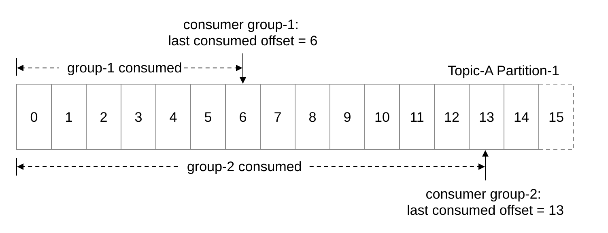

Group 1's offset is 6, meaning all previous messages have been consumed. If a consumer crashes, the new consumer will continue from that message onward.

Data access patterns for consumer states:

* Frequent reads and writes, but low data volume.
* Data is updated frequently but rarely deleted.
* Random reads and writes.
* Data consistency is important.

Given these requirements, a fast KV store like ZooKeeper is ideal.

### **Metadata storage**

The metadata storage stores configuration and topic properties: the number of partitions, the retention period, and the replica distribution.

Metadata doesn't change often, and its volume is small, but consistency requirements are strict.
ZooKeeper is a good choice for this storage.

### **ZooKeeper**

ZooKeeper is essential for building distributed message queues.

It is a hierarchical key-value store commonly used for distributed configuration, synchronization services, and naming registries (i.e., service discovery) [[2]](#ref-2).

    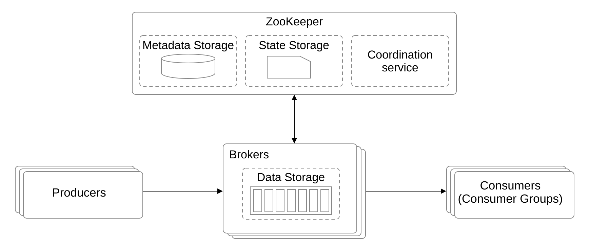

With this change, the broker only needs to maintain message data. Metadata and state storage are in ZooKeeper.

ZooKeeper also helps elect leaders among the broker replicas.

### **Replication**

In distributed systems, hardware issues are inevitable. We can address these issues through replication to achieve high availability.

    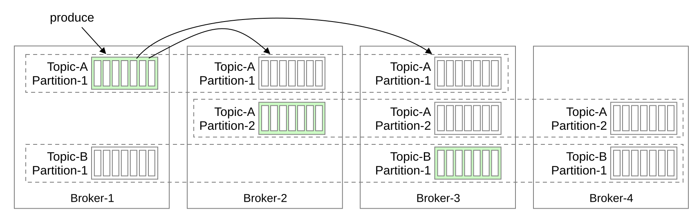

* Each partition is replicated across multiple brokers, but there is only one leader replica.
* Producers send messages to leader replicas.
* Followers pull the replicated messages from the leader.
* Once enough replicas are synchronized, the leader returns an acknowledgment to the producer.
* The distribution of replicas for each partition is called the replica distribution plan.
* The leader for a given partition creates the replica distribution plan and saves it in ZooKeeper.

### **In-sync replicas**

One problem we need to tackle is keeping messages in sync between the leader and the followers for a given partition.

**In-sync replicas (ISR)** are replicas for a partition that stay in sync with the leader.

The `replica.lag.max.messages` setting defines how many messages a replica can lag behind the leader and still be considered in sync.

    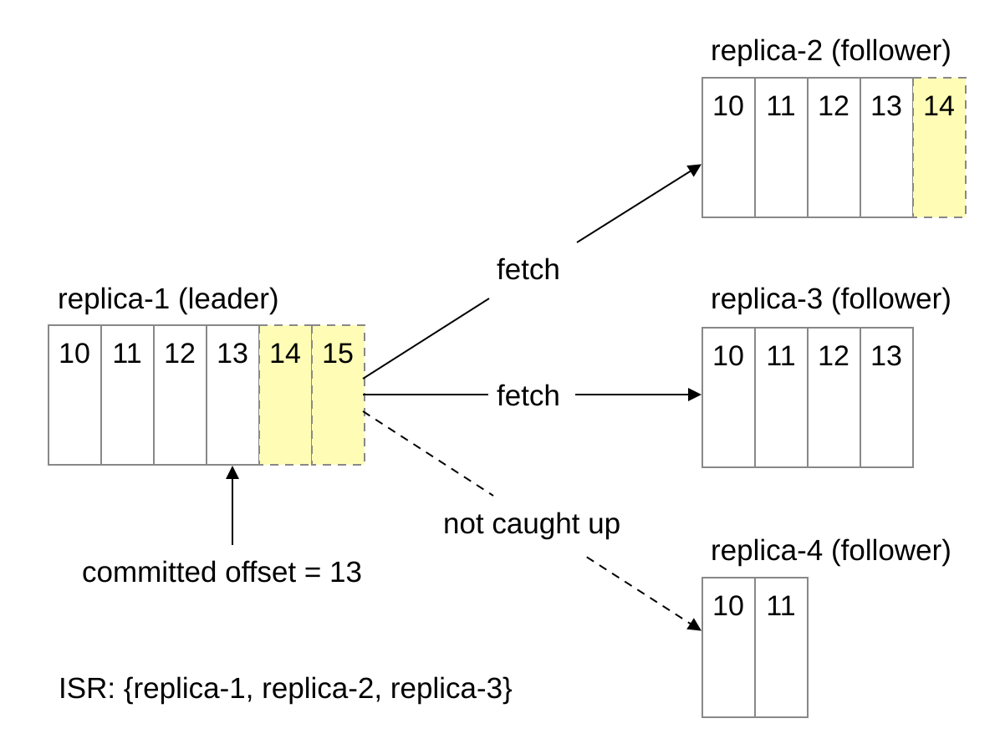

* The committed offset is 13.
* Two new messages have been written to the leader but have not yet been committed.
* A message is committed once all replicas in the ISR have synchronized that message.
* Replicas 2 and 3 have fully caught up with the leader, so they are in the ISR set.
* Replica 4 has fallen behind, so it has been removed from the ISR set for now.

ISR reflects a trade-off between performance and durability.

* To prevent producers from losing messages, all replicas should be in sync before the leader sends an acknowledgment.
* But a slow replica will cause the whole partition to become unavailable.

Acknowledgment handling is configurable.

`ACK=all` means that all replicas in the ISR set have to synchronize a message. Message sending is slow, but message durability is highest.

    

`ACK=1` means that the producer receives an acknowledgment once the leader receives the message. Message sending is fast, but message durability is low.

    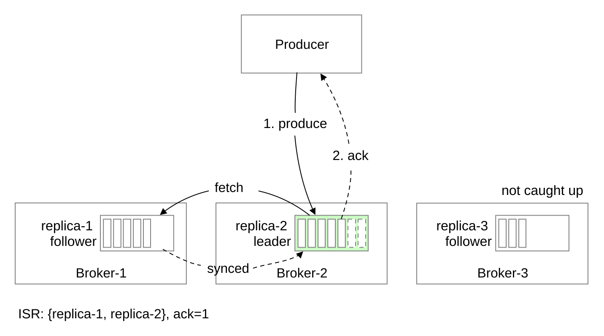

`ACK=0` means that the producer sends messages without waiting for an acknowledgment from the leader. Message sending is fastest, but message durability is lowest.

    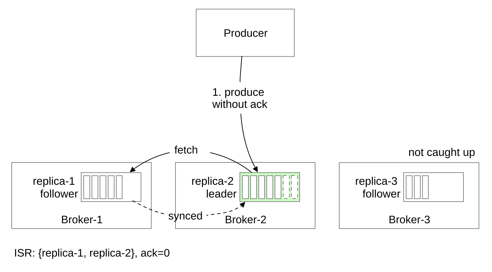

On the consumer side, we can connect all consumers to the leader for a partition and let them read messages from it:

* This provides the simplest design and is the easiest to operate.
* Messages in a partition are sent to only one consumer in a group, which limits the connections to the leader replica.
* The number of connections to the leader replica is typically low as long as the topic is not extremely busy.
* We can scale a hot topic by increasing the number of partitions and consumers.
* In certain scenarios, it might make sense to let a consumer read from an in-sync replica, for example, if the consumer and that replica are located in a different data center from the leader [[11]](#ref-11).

The ISR list is maintained by the leader, which tracks the lag between itself and each replica [[12]](#ref-12) [[13]](#ref-13).

### **Scalability**

Let's evaluate how we can scale different parts of the system.

#### **Producer**

The producer is much smaller than the consumer. It can be scaled easily by adding or removing producer instances.

#### **Consumer**

Consumer groups are isolated from each other. It is easy to add or remove consumer groups as needed.

Rebalancing helps gracefully handle cases in which consumers are added to or removed from a group.

Consumer groups and rebalancing help us achieve scalability and fault tolerance.

#### **Broker**

How do brokers handle failure?

    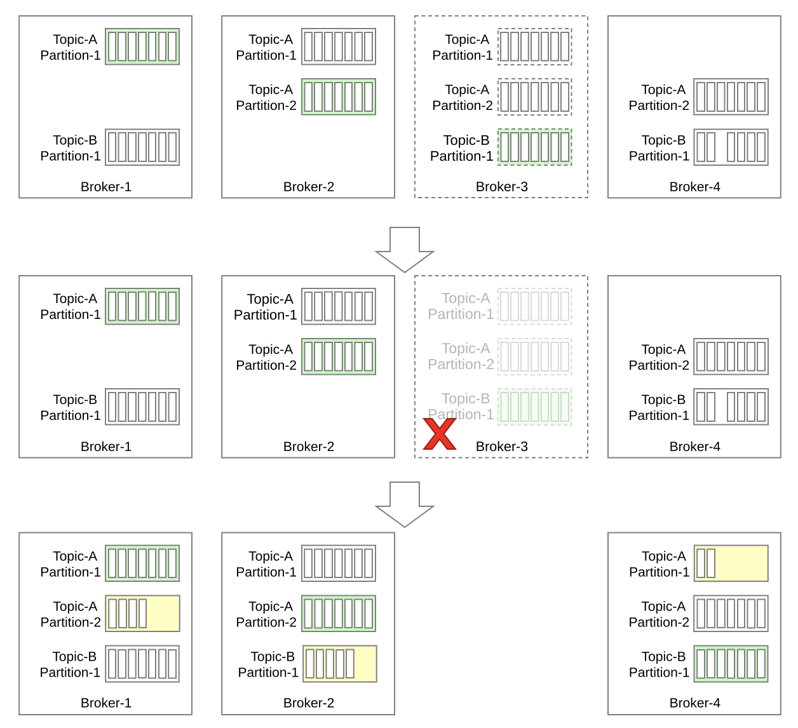

* Once a broker fails, there are still enough replicas to avoid partition data loss.
* A new leader is elected, and the broker coordinator redistributes partitions that were on the failed broker to existing replicas.
* Existing replicas pick up the new partitions and act as followers until they have caught up with the leader and joined the ISR set.

Additional considerations to make the broker fault-tolerant:

* The minimum number of in-sync replicas balances latency and safety. You can fine-tune it to meet your needs.
* If all replicas of a partition are on the same node, then it's a waste of resources. Replicas should be spread across different brokers.
* If all replicas of a partition crash, then the data is lost forever. Spreading replicas across data centers can help, but it adds a lot of latency. One option is to use data mirroring [[14]](#ref-14) as a workaround.

How do we handle the redistribution of replicas when a new broker is added?

    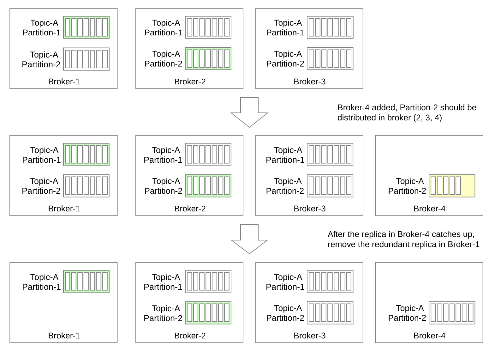

1. The initial setup has 3 brokers, 2 partitions, and 3 replicas for each partition.
2. A new broker, broker 4, is added. Assume the broker controller changes the replica distribution of partition 2 to brokers 2, 3, and 4. The new replica on broker 4 starts copying data from the leader on broker 2. The number of replicas for partition 2 temporarily exceeds 3.
3. After the replica on broker 4 catches up, the redundant replica on broker 1 is gracefully removed.

#### **Partition**

Whenever a new partition is added, the producer is notified, and consumer rebalancing is triggered.

In terms of data storage, we can store only new messages in the new partition rather than copying all the old messages:

    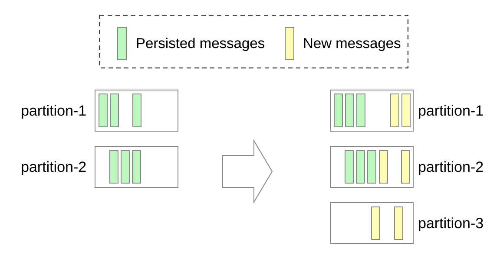

Decreasing the number of partitions is more involved:

    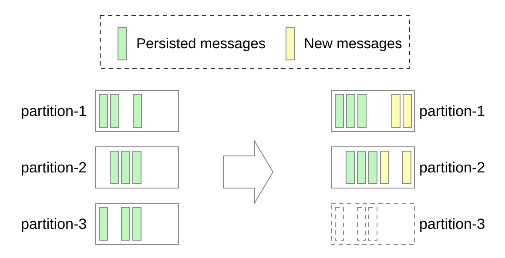

* Once a partition is decommissioned, only the remaining partitions receive new messages.
* The decommissioned partition isn't removed immediately because messages can still be consumed from it.
* Once a preconfigured retention period expires, we truncate the data, and storage space is freed up.
* During the transitional period, producers send messages only to active partitions, but consumers read from all partitions.
* Once the retention period expires, consumers are rebalanced.

### **Data delivery semantics**

Let's discuss different delivery semantics.

#### **At-most-once**

With this guarantee, messages are delivered no more than once and might not be delivered at all.

    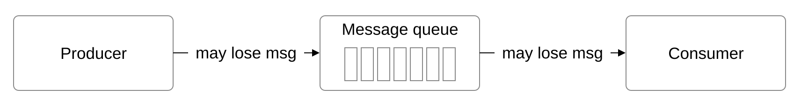

* The producer sends a message asynchronously to a topic. If message delivery fails, there is no retry.
* The consumer fetches a message and immediately commits the offset. If the consumer crashes before processing the message, the message will not be processed.

#### **At-least-once**

A message can be sent more than once, and no message should be left unprocessed.

    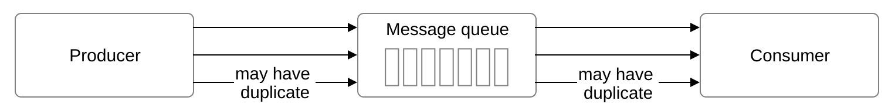

* The producer sends a message with `ack=1` or `ack=all`. If there is any issue, it will keep retrying.
* The consumer fetches the message and commits the offset only after it has finished processing the message.
* It is possible for a message to be delivered more than once if, for example, a consumer crashes after processing the message but before committing its offset.
* This makes it suitable for use cases in which data duplication is acceptable or deduplication is possible.

#### **Exactly-once**

This is extremely costly for the system to implement, although it's the friendliest guarantee for users:

    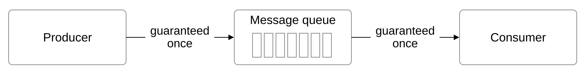

Use cases include financial applications such as payments, trading, and accounting. Exactly-once delivery is especially important when duplication is not acceptable and the downstream service or third party doesn't support idempotency.

### **Advanced features**

Let's discuss some advanced features we might mention in the interview.

#### **Message filtering**

Some consumers might want to consume only messages of a certain type within a partition.

This can be achieved by building separate topics for each subset of messages, but this can be costly if systems have too many different use cases.

* It is a waste of resources to store the same message in different topics.
* The producer is now tightly coupled to consumers because it must change with each new consumer requirement.

We can resolve this using message filtering.

* A naive approach would be to do the filtering on the consumer side, but that introduces unnecessary consumer traffic.
* Alternatively, messages can have tags attached to them, and consumers can specify which tags they're subscribed to.
* Filtering could also be done using message payloads, but that can be challenging and unsafe for encrypted or serialized messages.
* For more complex mathematical formulas, the broker could implement a grammar parser or script executor, but that can be heavyweight for the message queue.

    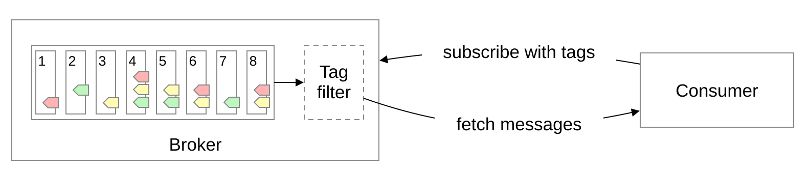

#### **Delayed and scheduled messages**

For some use cases, we might want to delay or schedule message delivery.

For example, we might schedule a payment verification check for 30 minutes from now, prompting the consumer to check whether a payment was successful.

This can be achieved by sending messages to temporary storage in the broker and moving them to the partition at the right time:

    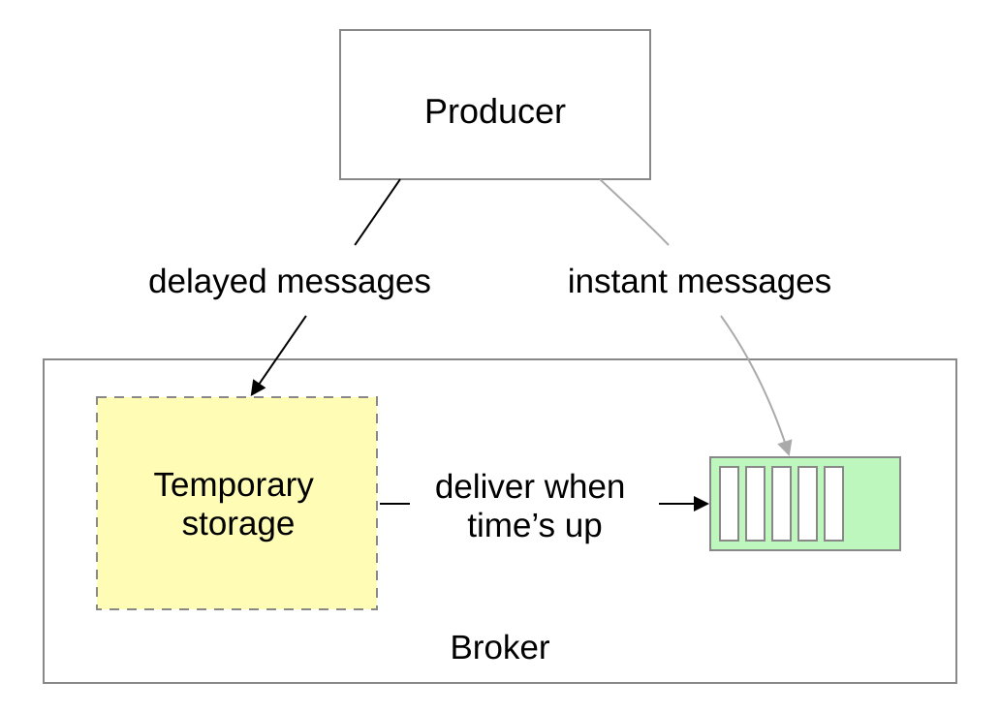

* The temporary storage can be one or more special message topics.
* The timing function can be achieved using dedicated delay queues [[16]](#ref-16) or a hierarchical timing wheel [[17]](#ref-17).

## Step 4: Wrap Up

Additional talking points:

- **Communication protocol**: Important considerations include supporting all use cases, handling high data volumes, and verifying message integrity. Popular protocols include AMQP and the Kafka protocol.
- **Consumption retries**: If we can't process a message immediately, we could send it to a dedicated retry topic for another processing attempt later.
- **Historical data archiving**: Old messages can be backed up in high-capacity storage such as HDFS [[20]](#ref-20) or object storage (e.g., S3).

# Sources

1. [Queue Length Limit](https://www.rabbitmq.com/maxlength.html)
2. [Apache ZooKeeper - Wikipedia](https://en.wikipedia.org/wiki/Apache_ZooKeeper)
3. [etcd](https://etcd.io/)
4. [Comparison of disk and memory performance](https://deliveryimages.acm.org/10.1145/1570000/1563874/jacobs3.jpg)
5. [Cyclic redundancy check](https://en.wikipedia.org/wiki/Cyclic_redundancy_check)
6. [Push vs. pull](https://kafka.apache.org/documentation/#design_pull)
7. [Kafka 2.0 Documentation](https://kafka.apache.org/20/documentation.html#consumerconfigs)
8. [Kafka No Longer Requires ZooKeeper](https://towardsdatascience.com/kafka-no-longer-requires-zookeeper-ebfbf3862104)
9. [Martin Kleppmann. (2017). ‘Replication’ in Designing Data-Intensive Applications. O'Reilly Media. pp. 151-197](https://www.oreilly.com/library/view/designing-data-intensive-applications/9781491903063/ch05.html)
10. [Apache Kafka replication and in-sync replicas](https://kafka.apache.org/41/design/design/)
11. [Apache Kafka: Allow consumers to fetch from the closest replica](https://cwiki.apache.org/confluence/display/KAFKA/KIP-392%3A+Allow+consumers+to+fetch+from+closest+replica)
12. [Hands-free Kafka Replication](https://www.confluent.io/blog/hands-free-kafka-replication-a-lesson-in-operational-simplicity/)
13. [Kafka high watermark](https://rongxinblog.wordpress.com/2016/07/29/kafka-high-watermark/)
14. [Kafka mirroring](https://cwiki.apache.org/confluence/pages/viewpage.action?pageId=27846330)
15. [Message filtering in RocketMQ](https://partners-intl.aliyun.com/help/doc-detail/29543.htm)
16. [Scheduled messages and delayed messages in Apache RocketMQ](https://partners-intl.aliyun.com/help/doc-detail/43349.htm)
17. [Hashed and hierarchical timing wheels](http://www.cs.columbia.edu/~nahum/w6998/papers/sosp87-timing-wheels.pdf)
18. [Advanced Message Queuing Protocol](https://en.wikipedia.org/wiki/Advanced_Message_Queuing_Protocol)
19. [Kafka protocol guide](https://kafka.apache.org/protocol)
20. [HDFS](https://hadoop.apache.org/docs/r1.2.1/hdfs_design.html)
