# Chapter 22: Hotel Reservation System

<sub>[Back to System Design](../Readme.md#content)</sub>

## Introduction
In this chapter, we're designing a **hotel reservation system**, similar to Marriott International's.

The design is also applicable to other types of systems, such as Airbnb, flight reservations, and movie-ticket booking.

## Step 1: Understand the Problem and Establish Design Scope
Before diving into designing the system, we should ask the interviewer questions to clarify the scope:
- C: What is the scale of the system?
- I: We're building a website for a hotel chain with 5000 hotels and 1 million rooms.
- C: Do customers pay when they make a reservation or when they arrive at the hotel?
- I: They pay in full when making reservations.
- C: Do customers book hotel rooms through the website only? Do we have to support other reservation options such as phone calls?
- I: They make bookings through the website or app only.
- C: Can customers cancel reservations?
- I: Yes.
- C: Other things to consider?
- I: Yes, we allow overbooking by 10%. A hotel will sell more rooms than it actually has. Hotels do this in anticipation that clients will cancel bookings.
- C: Since there isn't much time, we'll focus on showing a hotel-related page, showing a hotel-room details page, reserving a room, providing an admin panel, and supporting overbooking.
- I: Sounds good.
- I: One more thing - hotel prices change all the time. Assume a hotel room's price changes every day.
- C: OK.

### **Non-functional requirements**
- Support high concurrency - there might be a lot of customers trying to book the same hotel during peak season.
- Moderate latency - it's ideal to have low latency when a user makes a reservation, but it's acceptable if the system takes a few seconds to process it.

### **Back-of-the-envelope estimation**
- 5,000 hotels and 1 million rooms in total
- Assume 70% of rooms are occupied and the average stay duration is 3 days
- Estimated daily reservations - 1 million * 0.7 / 3 = ~240,000 reservations per day
- Reservations per second - 240k / 10^5 seconds in a day = ~3. Average reservation TPS is low.

Let's estimate the QPS. If we assume that there are three steps to reach the reservation page and there is a 10% conversion rate per page, we can estimate that if there are 3 reservations, then there must be 30 views of the reservation page and 300 views of the hotel-room details page.

<div style="margin-left:3rem">
    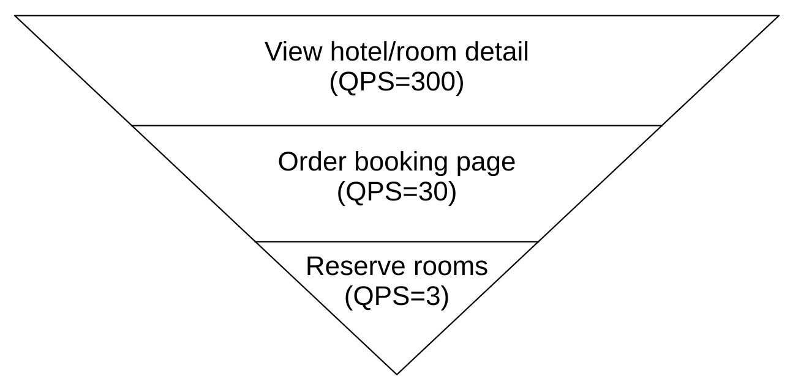
</div>

## Step 2: Propose High-Level Design and Get Buy-In
We'll explore API design, the data model, and the high-level design.

### **API Design**
This API design focuses on the core endpoints (using RESTful practices) that we'll need to support a hotel reservation system.

A fully-fledged system would require a more extensive API with support for searching for rooms based on lots of criteria, but we won't be focusing on that in this section.
The reason is that these search features aren't technically challenging, so they're out of scope.

**Hotel-related API**
- `GET /v1/hotels/{id}` - get detailed info about a hotel
- `POST /v1/hotels` - add a new hotel. Only available to ops
- `PUT /v1/hotels/{id}` - update hotel info. Only available to ops
- `DELETE /v1/hotels/{id}` - delete a hotel. The API is only available to ops

**Room-related API**
- `GET /v1/hotels/{id}/rooms/{id}` - get detailed information about a room
- `POST /v1/hotels/{id}/rooms` - Add a room. Only available to ops
- `PUT /v1/hotels/{id}/rooms/{id}` - Update room info. Only available to ops
- `DELETE /v1/hotels/{id}/rooms/{id}` - Delete a room. Only available to ops

**Reservation-related API**
- `GET /v1/reservations` - get the reservation history of the current user
- `GET /v1/reservations/{id}` - get detailed info about a reservation
- `POST /v1/reservations` - make a new reservation
- `DELETE /v1/reservations/{id}` - cancel a reservation

Here's an example request to make a reservation:

```json
{
  "startDate":"2021-04-28",
  "endDate":"2021-04-30",
  "hotelID":"245",
  "roomID":"U12354673389",
  "reservationID":"13422445"
}
```

Note that the `reservationID` is an idempotency key to avoid double booking. Details are explained in the [concurrency section](#concurrency-issues).

### **Data model**
Before we choose what database to use, let's consider our access patterns.

We need to support the following queries:
- View detailed info about a hotel
- Find available types of rooms given a date range
- Record a reservation
- Look up a reservation or past history of reservations

From our estimations, we know the scale of the system is not large, but we need to prepare for traffic surges.

Given this knowledge, we'll choose a relational database because:
- Relational DBs work well with read-heavy and less write-heavy systems.
- NoSQL databases are normally optimized for writes, but we know we won't have many as only a fraction of users who visit the site make a reservation.
- Relational DBs provide ACID guarantees. These are important for such a system because, without them, we won't be able to prevent problems such as negative balances, double charges, etc.
- Relational DBs can easily model the data as the structure is very clear.

Here is our schema design:

<div style="margin-left:3rem">
    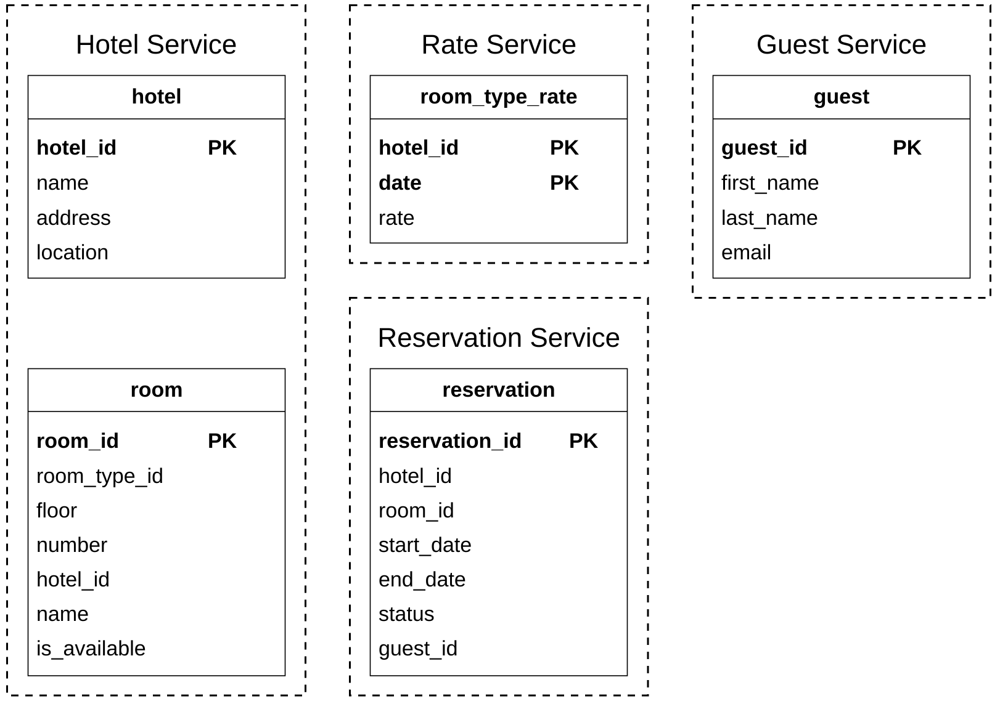
</div>

Most fields are self-explanatory. The only field worth mentioning is the `status` field, which represents the state machine of a given room:

<div style="margin-left:3rem">
    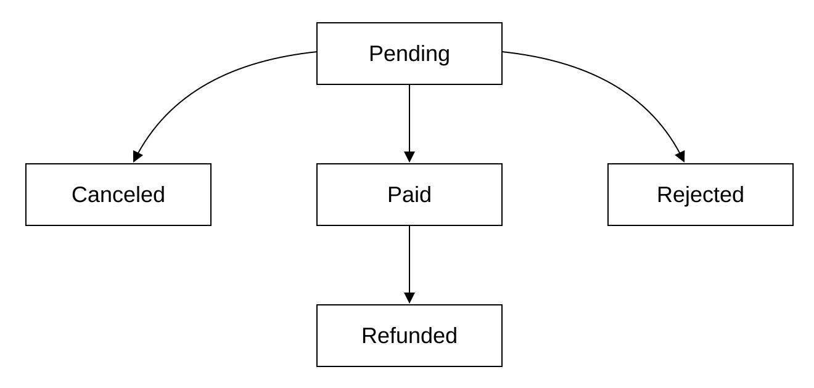
</div>

This data model works well for a system like Airbnb, but not for hotels where users don't reserve a particular room but a room type.

They reserve a type of room, and a room number is chosen at the point of reservation.

This shortcoming will be addressed in the [Improved Data Model](#improved-data-model) section.

### **High-level Design**
We've chosen a microservice architecture for this design. It has gained great popularity in recent years:

<div style="margin-left:3rem">
    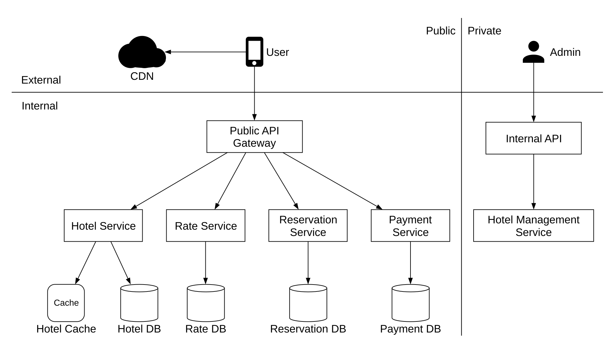
</div>

- **Users**: book a hotel room on their phone or computer
- **Admin**: performs administrative functions such as refunding/cancelling a payment, etc.
- **CDN**: caches static resources such as JS bundles, images, videos, etc.
- **Public API Gateway**: fully managed service that supports rate limiting, authentication, etc.
- **Internal APIs**: only visible to authorized personnel. Usually protected by a VPN.
- **Hotel service**: provides detailed information about hotels and rooms. Hotel and room data is static, so it can be cached aggressively.
- **Rate service**: provides room rates for different future dates. An interesting note about this domain is that prices depend on how full a hotel is on a given day.
- **Reservation service**: receives reservation requests and reserves hotel rooms. Also tracks room inventory as reservations are made/cancelled.
- **Payment service**: processes payments and updates reservation statuses on success.
- **Hotel management service**: available to authorized personnel only. Allows certain administrative functions for managing and viewing reservations, hotels, etc.

Inter-service communication can be facilitated via an RPC framework, such as gRPC.

## Step 3: Design Deep Dive
Let's dive deeper into:
 - Improved data model
 - Concurrency issues
 - Scalability
 - Resolving data inconsistency in microservices

### **Improved data model**
As mentioned in a previous section, we need to amend our API and schema to enable reserving a type of room vs. a particular one.

For the reservation API, we no longer reserve a `roomID`, but we reserve a `roomTypeID`:

```json
POST /v1/reservations
{
  "startDate":"2021-04-28",
  "endDate":"2021-04-30",
  "hotelID":"245",
  "roomTypeID":"12354673389",
  "roomCount":"3",
  "reservationID":"13422445"
}
```

Here's the updated schema:

<div style="margin-left:3rem">
    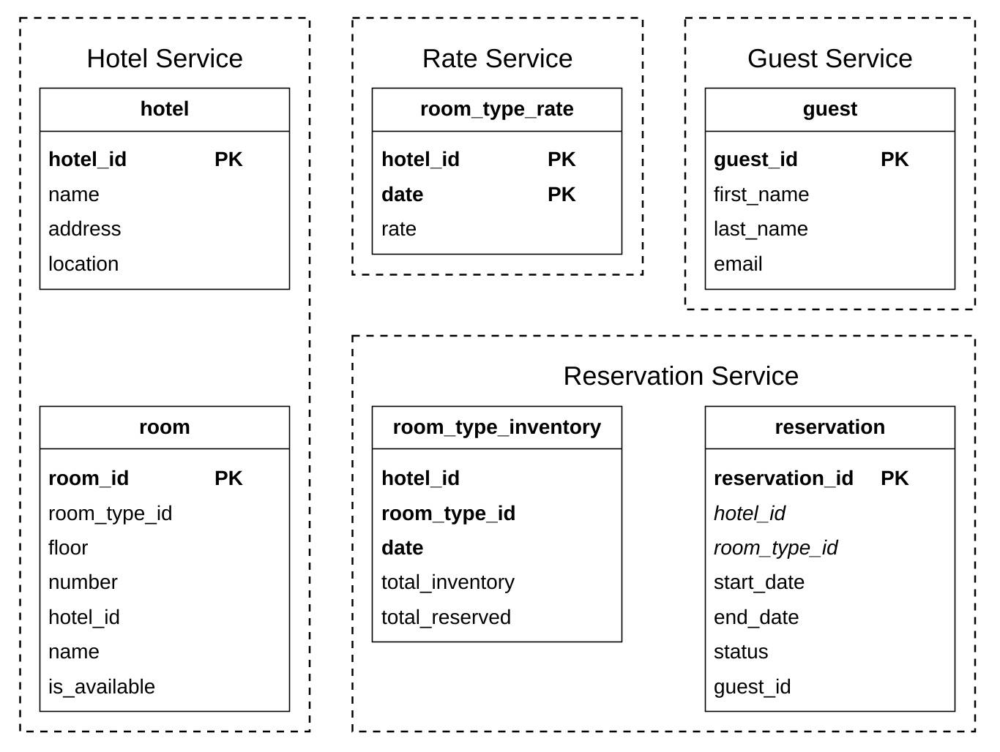
</div>

- **room**: contains information about a room
- **room_type_rate**: contains information about prices for a given room type
- **reservation**: records guest reservation data
- **room_type_inventory**: stores inventory data about hotel rooms

Let's take a look at the `room_type_inventory` columns as that table is more interesting:
- **hotel_id**: ID of a hotel
- **room_type_id**: ID of a room type
- **date**: a single date
- **total_inventory**: total number of rooms minus those that are temporarily taken out of inventory
- **total_reserved**: total number of rooms booked for a given (`hotel_id`, `room_type_id`, `date`)

There are alternative ways to design this table, but having one row per (`hotel_id`, `room_type_id`, `date`) enables easy
reservation management and easier queries.

The rows in the table are pre-populated using a daily CRON job.

Sample data:
| hotel_id | room_type_id | date       | total_inventory | total_reserved |
|----------|--------------|------------|-----------------|----------------|
| 211      | 1001         | 2021-06-01 | 100             | 80             |
| 211      | 1001         | 2021-06-02 | 100             | 82             |
| 211      | 1001         | 2021-06-03 | 100             | 86             |
| 211      | 1001         | ...        | ...             |                |
| 211      | 1001         | 2023-05-31 | 100             | 0              |
| 211      | 1002         | 2021-06-01 | 200             | 16             |
| 2210     | 101          | 2021-06-01 | 30              | 23             |
| 2210     | 101          | 2021-06-02 | 30              | 25             |

Sample SQL query to check the availability of a type of room:

```sql
SELECT date, total_inventory, total_reserved
FROM room_type_inventory
WHERE room_type_id = ${roomTypeId} AND hotel_id = ${hotelId}
AND date between ${startDate} and ${endDate}
```

How to check availability for a specified number of rooms using that data (note that we support overbooking):

```text
if (total_reserved + ${numberOfRoomsToReserve}) <= 110% * total_inventory
```

Now let's do some estimation of the storage volume.
- We have 5000 hotels.
- Each hotel has 20 types of rooms.
- 5,000 * 20 * 2 (years) * 365 (days) = 73 million rows

73 million rows is not a lot of data, and a single database server can handle it.
It makes sense, however, to set up read replication (potentially across different zones) to enable high availability.

Follow-up question - if reservation data is too large for a single database, what would you do?
- Store only current and future reservation data. Reservation history can be moved to cold storage.
- Database sharding - we can shard our data by `hash(hotel_id) % servers_cnt` as we always select the `hotel_id` in our queries.

### **Concurrency issues**
Another important problem to address is double booking.

There are two issues to address:
- The same user clicks on "book" twice
- Multiple users try to book a room at the same time

Here's a visualization of the first problem:

<div style="margin-left:3rem">
    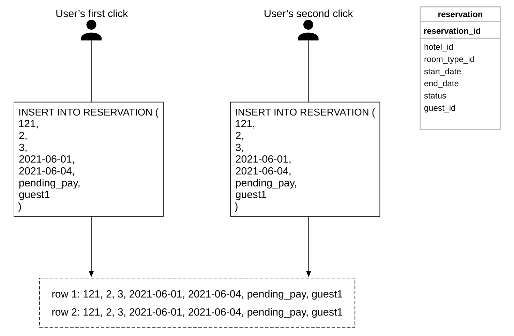
</div>

There are two approaches to solving this problem:
- Client-side handling - the front end can disable the book button once clicked. If a user has disabled JavaScript, however, they won't see the button becoming grayed out.
- Idempotent API - Add an idempotency key to the API, which enables a user to execute an action once, regardless of how many times the endpoint is invoked:

<div style="margin-left:3rem">
    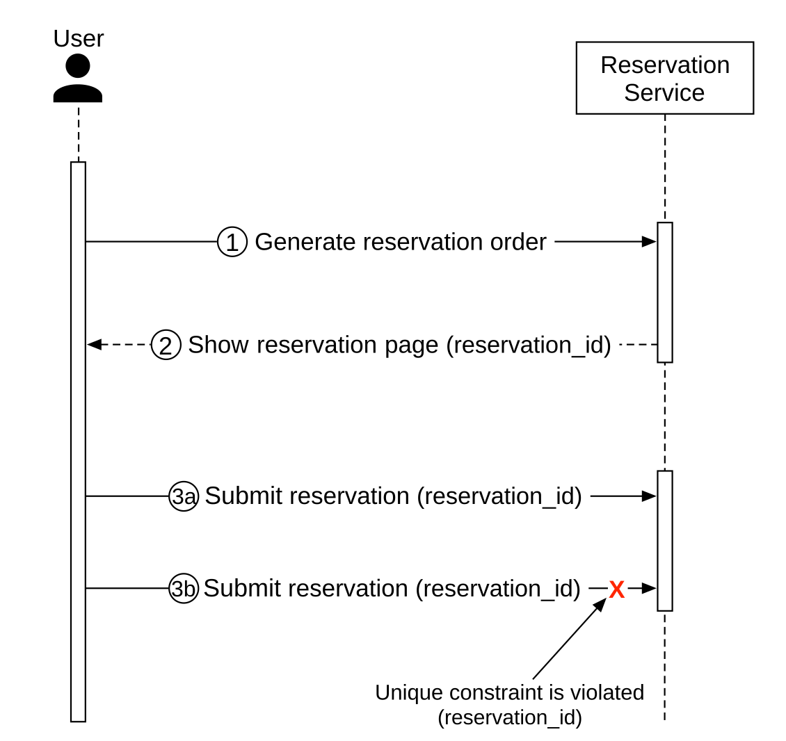
</div>

Here's how this flow works:
1. Generate a reservation order. After a customer enters detailed information about the reservation (room type, check-in date, check-out date, etc.) and clicks the "continue" button, a reservation order is generated by the reservation service.
2. The system generates a reservation order for a customer to review. The unique `reservation_id` is generated by a globally unique ID generator and returned as part of the API response. The UI of this step might look like this:
3. Submit a reservation:
    * a) The `reservation_id` is included as part of the request. It is the primary key of the reservation table. Please note that the idempotency key doesn't have to be the `reservation_id`. We choose `reservation_id` because it already exists and works well for our design.
    * b) If a user clicks the "Complete my booking" button a second time, reservation 2 is submitted. Because `reservation_id` is the primary key of the reservation table, we can rely on the unique constraint of the key to ensure no double reservation happens.

The image below explains why a double reservation can be avoided.

<div style="margin-left:3rem">
    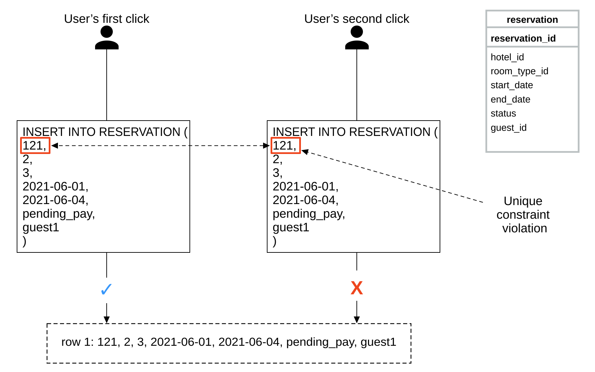
</div>

What if there are multiple users making the same reservation?

<div style="margin-left:3rem">
    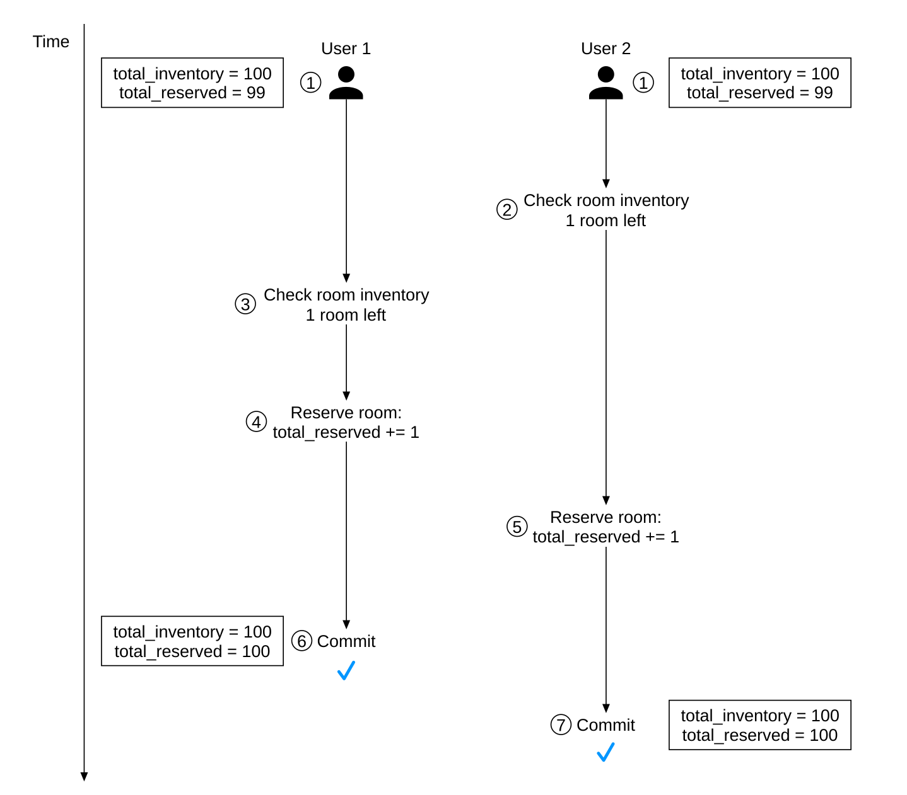
</div>

1. Let's assume the transaction isolation level is not serializable [[5]](#ref-5). `User 1` and `User 2` try to book the same type of room at the same time, but there is only 1 room left. Let's call `User 1`'s execution `Transaction 1` and `User 2`'s execution `Transaction 2`. At this time, there are 100 rooms in the hotel, and 99 of them are reserved.
2. `Transaction 2` checks if there are enough rooms left by checking if `(total_reserved + rooms_to_book) <= total_inventory`. Since there is 1 room left, it returns true.
3. `Transaction 1` checks if there are enough rooms by checking if `(total_reserved + rooms_to_book) <= total_inventory`. Since there is 1 room left, it also returns true.
4. `Transaction 1` reserves the room and updates the inventory: `reserved_room` becomes 100.
5. Then `Transaction 2` reserves the room. The **isolation** property in ACID means database transactions must complete their tasks independently from other transactions. So data changes made by `Transaction 1` are not visible to `Transaction 2` until `Transaction 1` is completed (committed). So `Transaction 2` still sees `total_reserved` as 99 and reserves the room by updating the inventory: `reserved_room` becomes 100. This results in the system allowing both users to book a room, even though there is only 1 room left.
6. `Transaction 1` successfully commits the change.
7. `Transaction 2` successfully commits the change.

The solution to this problem generally requires some form of locking mechanism:
- Pessimistic locking
- Optimistic locking
- Database constraints

Here's the SQL we use to reserve a room:

```sql
-- step 1: check room inventory
SELECT date, total_inventory, total_reserved
FROM room_type_inventory
WHERE room_type_id = ${roomTypeId} AND hotel_id = ${hotelId}
AND date between ${startDate} and ${endDate}

-- For every entry returned from step 1
if((total_reserved + ${numberOfRoomsToReserve}) > 110% * total_inventory) {
    ROLLBACK
}

-- step 2: reserve rooms
UPDATE room_type_inventory
SET total_reserved = total_reserved + ${numberOfRoomsToReserve}
WHERE room_type_id = ${roomTypeId}
AND date between ${startDate} and ${endDate}

COMMIT
```

#### **Option 1: Pessimistic locking**
Pessimistic locking prevents simultaneous updates by putting a lock on a record while it's being updated.

This can be done in MySQL by using the `SELECT... FOR UPDATE` query, which locks the rows selected by the query until the transaction is committed.

<div style="margin-left:3rem">
    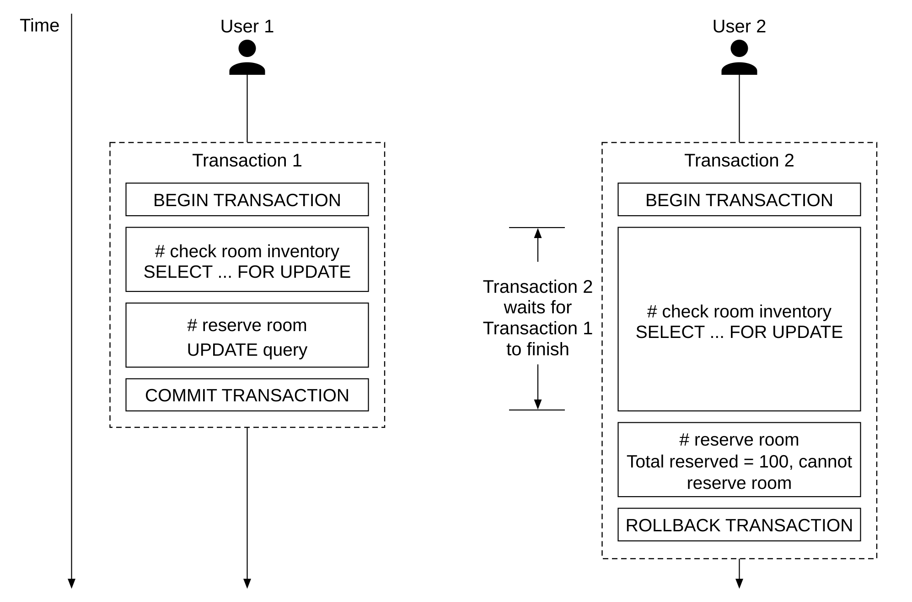
</div>

**Pros:**
- Prevents applications from updating data that is being changed
- Easy to implement and avoids conflict by serializing updates. Useful when there is heavy data contention.

**Cons:**
- Deadlocks may occur when multiple resources are locked.
- This approach is not scalable - if a transaction is locked for too long, this has an impact on all other transactions trying to access the resource.
- The impact is severe when the query selects a lot of resources and the transaction is long-lived.

Due to these limitations, we do not recommend pessimistic locking for the reservation system.

#### **Option 2: Optimistic locking**
Optimistic locking allows multiple users to attempt to update a record at the same time.

There are two common ways to implement it - version numbers and timestamps. Version numbers are recommended as server clocks can be inaccurate.

<div style="margin-left:3rem">
    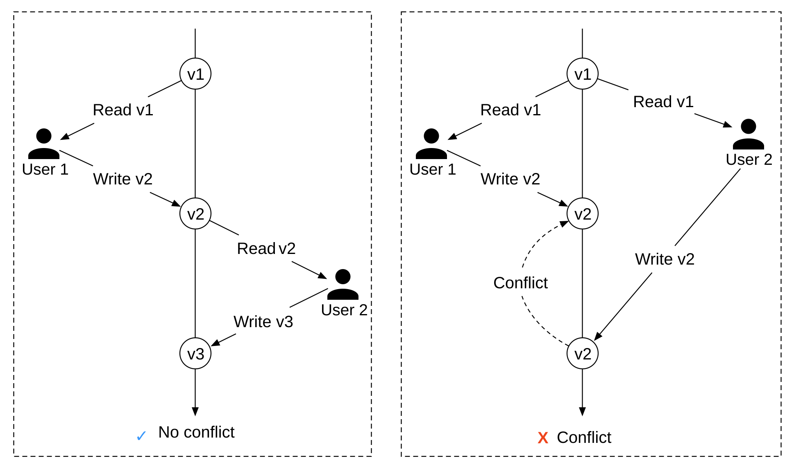
</div>

1. A new column called `version` is added to the database table.
2. Before a user modifies a database row, they read the version number of the row.
3. When the user updates the row, they increase the version by 1 and write the version.
4. A database validation check is put in place; the next version value should exceed the current version value by 1. The transaction aborts if the validation fails, and the user tries again from step 2.

Optimistic locking is usually faster than pessimistic locking as we're not locking the database.
Its performance tends to degrade when concurrency is high, however, as that leads to a lot of rollbacks.

**Pros:**
- It prevents applications from editing stale data
- We don't need to acquire a lock in the database
- Preferred option when data contention is low, i.e., when update conflicts are rare.

**Cons:**
- Performance is poor when data contention is high

Optimistic locking is a good option for our system as reservation QPS is not extremely high.

#### **Option 3: Database constraints**
This approach is very similar to optimistic locking, but the guardrails are implemented using a database constraint:

```sql
CONSTRAINT `check_room_count` CHECK((`total_inventory - total_reserved` >= 0))
```

<div style="margin-left:3rem">
    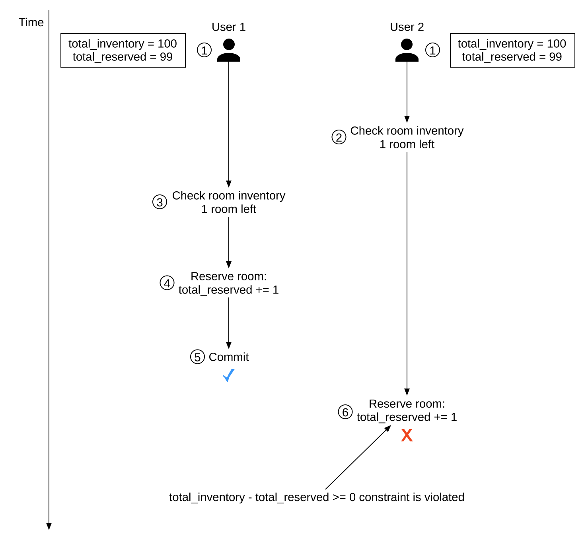
</div>

**Pros:**
- Easy to implement
- Works well when data contention is low

**Cons:**
- Similar to optimistic locking, this approach performs poorly when data contention is high
- Database constraints cannot be easily version-controlled like application code
- Not all databases support constraints

This is another good option for a hotel reservation system due to its ease of implementation.

### **Scalability**
Usually, the load of a hotel reservation system is not high.

However, the interviewer might ask you how you'd handle a situation where the system gets adopted by a larger, popular travel site such as Booking.com.
In that case, QPS can be 1000 times larger.

When there is such a situation, it is important to understand where our bottlenecks are. All the services are stateless, so they can be easily scaled via replication.

The database, however, is stateful, and it's not as obvious how it can get scaled.

### **Database sharding**

One way to scale it is by implementing database sharding - we can split the data across multiple databases, each of which contains a portion of the data.

We can shard based on `hotel_id` as all queries filter based on it.
If QPS is 30,000 and the database is sharded into 16 shards, each shard handles 1875 QPS, which is within a single MySQL cluster's load capacity.

<div style="margin-left:3rem">
    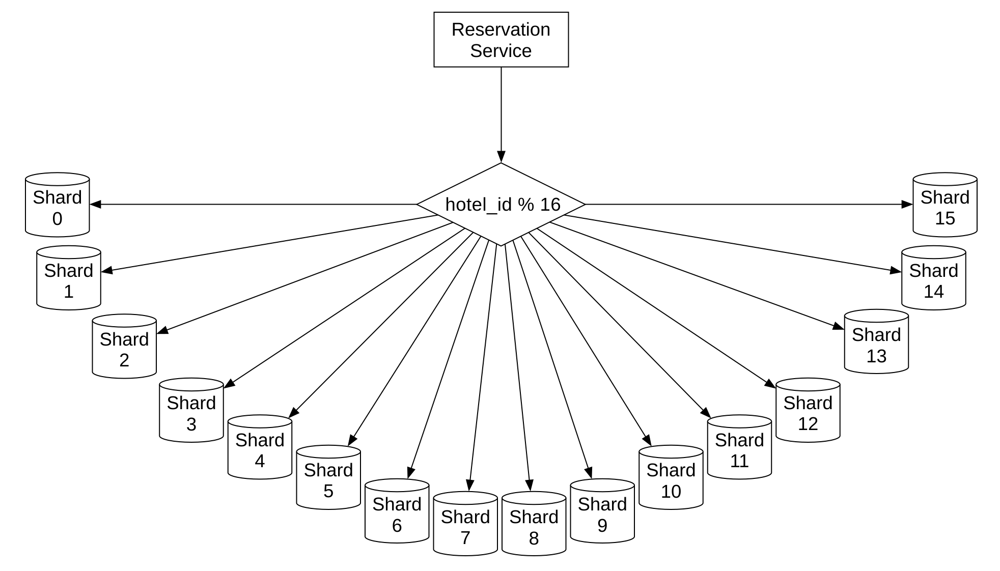
</div>

### **Caching**

We can also utilize caching for room inventory and reservations via Redis. We can set a `time-to-live` (**TTL**) mechanism to expire old data automatically.

Redis is a good choice because TTL and the `Least Recently Used` (**LRU**) cache eviction policy help us to make optimal use of memory.

If the loading speed and database scalability become issues (for instance, we are designing a system at `booking.com` or `expedia.com`'s scale), we can add a cache layer on top of the database and move the logic for checking room inventory and reserving rooms to the cache layer, as shown in the image below.

<div style="margin-left:3rem">
    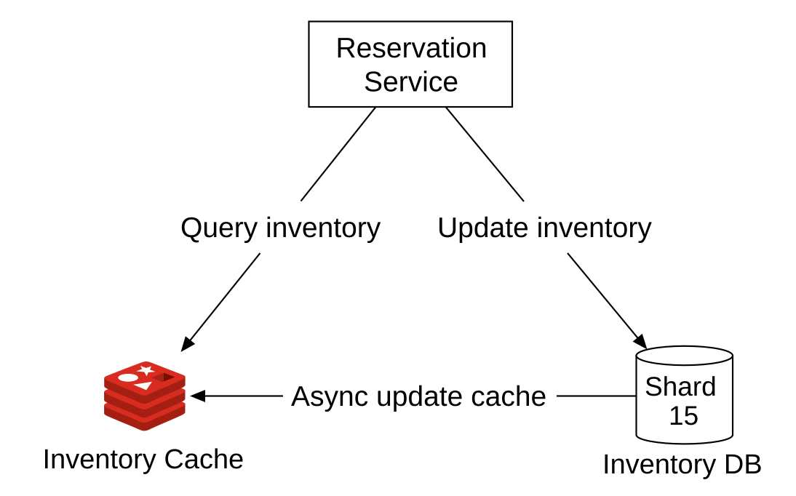
</div>

Let's first go over each component in this system.

**Reservation service**: supports the following inventory management APIs:
* Query the number of available rooms for a given room type and date range.
* Reserve a room by executing `total_reserved + 1`.
* Update inventory when a user cancels a reservation.

**Inventory cache**: all inventory management query operations are moved to the inventory cache (Redis), and we need to pre-populate the cache with inventory data. The cache is a key-value store with the following structure:

```text
key: hotelID_roomTypeID_{date}
value: the number of available rooms for the given hotel ID, room type ID and date.
```

For a hotel reservation system, the volume of read operations (checking room inventory) is an order of magnitude higher than that of write operations. Most of the read operations are answered by the cache.

**Inventory DB**: stores inventory data as the source of truth.

**New challenges posed by the cache**

Adding a cache layer significantly increases the system's scalability and throughput, but it also introduces a new challenge: how to maintain data consistency between the database and the cache.

When a user books a room, two operations are executed on the happy path:
1. Query room inventory to find out if there are enough rooms left. The query runs on the inventory cache.
2. Update inventory data. The inventory DB is updated first. The change is then propagated to the cache asynchronously. This asynchronous cache update could be invoked by the application code, which updates the inventory cache after data is saved to the database. It could also be propagated using change data capture (CDC) [[8]](#ref-8). CDC is a mechanism that reads data changes from the database and applies the changes to another data system. One common solution is Debezium [[9]](#ref-9). It uses a source connector to read changes from a database and applies them to cache solutions such as Redis [[10]](#ref-10).

With such a mechanism, there is a possibility that the cache and database are inconsistent for some time.
This is fine in our case because the database will prevent us from making an invalid reservation.

This will cause some issues in the UI, as a user would have to refresh the page to see that "there are no more rooms left,"
but that is something that can happen regardless of this issue if, e.g., a person hesitates for a long time before making a reservation.

**Pros:**
- Reduced database load
- High performance, as Redis manages data in memory

**Cons:**
- Maintaining data consistency between cache and DB is hard. We need to consider how the inconsistency impacts user experience.

### **Data consistency among services**
A monolithic application [[11]](#ref-11) enables us to use a shared relational database for ensuring data consistency.

In our microservice design, we chose a hybrid approach where some services are separate, but the reservation and inventory APIs are handled by the same service.

This is done because we want to leverage the relational database's ACID guarantees to ensure consistency.

However, if your interviewer is a microservice purist, they might challenge this hybrid approach. In their mind, for a microservice architecture, each microservice has its own databases, as shown in the image below (on the right part of it):

<div style="margin-left:3rem">
    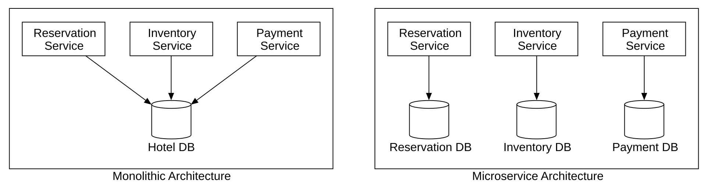
</div>

The pure design introduces many data consistency issues. Let's explain how and why they happen. To make it easier to understand, only two services are used in this discussion. In the real world, there could be hundreds of microservices within a company. In a monolithic architecture, as shown in the image below, different operations can be wrapped within a single transaction to ensure ACID properties.

<div style="margin-left:3rem">
    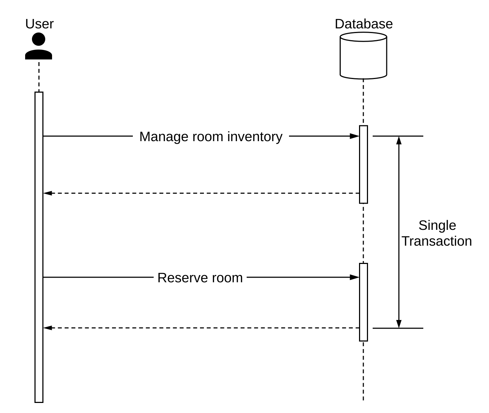
</div>

However, in a microservice architecture, each service has its own database. One logically atomic operation can span multiple services. This means we cannot use a single transaction to ensure data consistency. As shown in the image below, if the update operation fails in the reservation database, we need to roll back the reserved room count in the inventory database. Generally, there is only one happy path, but there are many failure cases that could cause data inconsistency.

<div style="margin-left:3rem">
    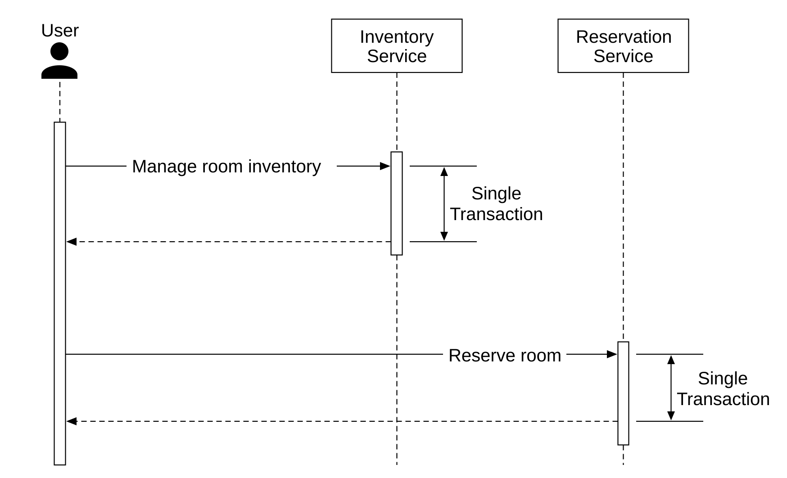
</div>

There are some well-known techniques to handle these data inconsistencies:
- **Two-phase commit** ([[12]](#ref-12)): a database protocol which guarantees atomic transaction commit across multiple nodes. Because 2PC is a blocking protocol, a single node failure blocks the progress until the node has recovered. It's not performant.
- **Saga** ([[13]](#ref-13)): a sequence of local transactions, where compensating transactions are triggered if any of the steps in a workflow fail. This is an eventually consistent approach.

It's worth noting that addressing data inconsistencies across microservices is a challenging problem that raises the system's complexity.

It is good to consider whether the cost is worth it, given our more pragmatic approach of encapsulating dependent operations within the same relational database.

## Step 4: Wrap Up
We presented a design for a hotel reservation system.

These are the steps we went through:
- We gathered requirements and did back-of-the-envelope calculations to understand the system's scale
- We presented the API Design, Data Model and system architecture in the high-level design
- In the deep dive, we explored alternative database schema designs as requirements changed
- We discussed race conditions and proposed solutions - pessimistic/optimistic locking, database constraints
- We explored ways to scale the system via database sharding and caching
- Finally, we addressed how to handle data consistency issues across multiple microservices

## Reference materials

1. <a id="ref-1"></a>[Microservices](https://en.wikipedia.org/wiki/Microservices)
2. <a id="ref-2"></a>[What Are The Benefits of Microservices Architecture?](https://www.appdynamics.com/topics/benefits-of-microservices)
3. <a id="ref-3"></a>[gRPC](https://www.grpc.io/docs/what-is-grpc/introduction/)
4. <a id="ref-4"></a>[Source: Booking.com iOS app](https://apps.apple.com/us/app/booking-com-hotels-travel/id367003839)
5. <a id="ref-5"></a>[Serializability](https://en.wikipedia.org/wiki/Serializability)
6. <a id="ref-6"></a>[Optimistic and pessimistic record locking](https://ibm.co/3Eb293O)
7. <a id="ref-7"></a>[Optimistic concurrency control](https://en.wikipedia.org/wiki/Optimistic_concurrency_control)
8. <a id="ref-8"></a>[Change data capture](https://docs.oracle.com/cd/B10500_01/server.920/a96520/cdc.htm)
9. <a id="ref-9"></a>[Debezium](https://debezium.io/)
10. <a id="ref-10"></a>[Debezium Server Redis sink](https://debezium.io/documentation/reference/stable/operations/debezium-server.html)
11. <a id="ref-11"></a>[Monolithic Architecture](https://microservices.io/patterns/monolithic.html)
12. <a id="ref-12"></a>[Two-phase commit protocol](https://en.wikipedia.org/wiki/Two-phase_commit_protocol)
13. <a id="ref-13"></a>[Saga](https://microservices.io/patterns/data/saga.html)
