# Chapter 23: Distributed Email Service
<sub>[Back to System Design](../Readme.md#content)</sub>

## Introduction

In this chapter, we'll design a **distributed email service** similar to **Gmail**.

In 2020, **Gmail** had 1.8 billion active users, while **Outlook** had 400 million users worldwide.

---

## Step 1: Understand the Problem and Establish Design Scope

- C: How many users use the system?
- I: 1 billion users
- C: I think the following features are important - authentication, sending/receiving email, fetching email, filtering emails, searching email, and anti-spam protection.
- I: Good list. Don't worry about auth for now.
- C: How do users connect to email servers?
- I: Typically, email clients connect via SMTP, POP, IMAP, but we'll use HTTP for this problem.
- C: Can emails have attachments?
- I: Yes

### **Non-functional requirements**

- **Reliability** - we shouldn't lose data
- **Availability** - We should use replication to prevent single points of failure. We should also tolerate partial system failures.
- **Scalability** - As the user base grows, our system should be able to handle it.
- **Flexibility and extensibility** - system should be flexible and easy to extend with new features. One of the reasons we chose HTTP over SMTP/other mail protocols.

### **Back-of-the-envelope estimation**

- **1 billion users**
- Assuming one person sends 10 emails per day -> **100k emails per second**.
- Assuming one person receives 40 emails per day and each email on average has 50kb metadata -> **730pb storage per year**.
- Assuming 20% of emails have attachments and the average size is 500 KB -> **1,460 PB per year**.

---

## Step 2: Propose High-Level Design and Get Buy-In

### **Email knowledge 101**

There are various protocols used for sending and receiving emails:
- **SMTP** - standard protocol for sending emails from one server to another.
- **POP** - standard protocol for receiving and downloading emails from a remote mail server to a local client. Once retrieved, emails are deleted from the remote server.
- **IMAP** - similar to POP, it is used for receiving and downloading emails from a remote server, but it keeps the emails on the server-side.
- **HTTPS** - not technically an email protocol, but it can be used for web-based email clients.

Apart from the mailing protocol, there are some DNS records we need to configure for our email server - the MX records:

<div style="margin-left:3rem">
    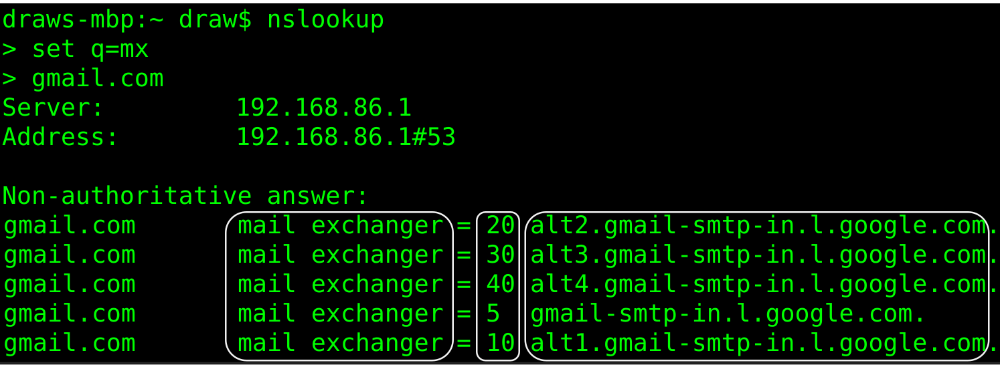
</div>

Email attachments are sent base64-encoded and there is usually a size limit of 25mb on most mail services.
This is configurable and varies from individual to corporate accounts.

### **Traditional mail servers**

Traditional mail servers work well when there are a limited number of users, connected to a single server.

<div style="margin-left:3rem">
    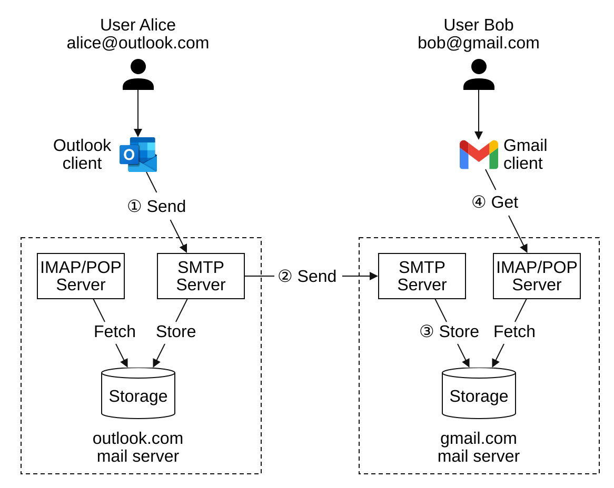
</div>

- Alice logs into her Outlook email and presses "send". Email is sent to Outlook mail server. Communication is via SMTP.
- Outlook server queries DNS to find MX record for gmail.com and transfers the email to their servers. Communication is via SMTP.
- Bob fetches emails from his gmail server via IMAP/POP.

In traditional mail servers, emails were stored on the local file system. Every email was a separate file.

<div style="margin-left:3rem">
    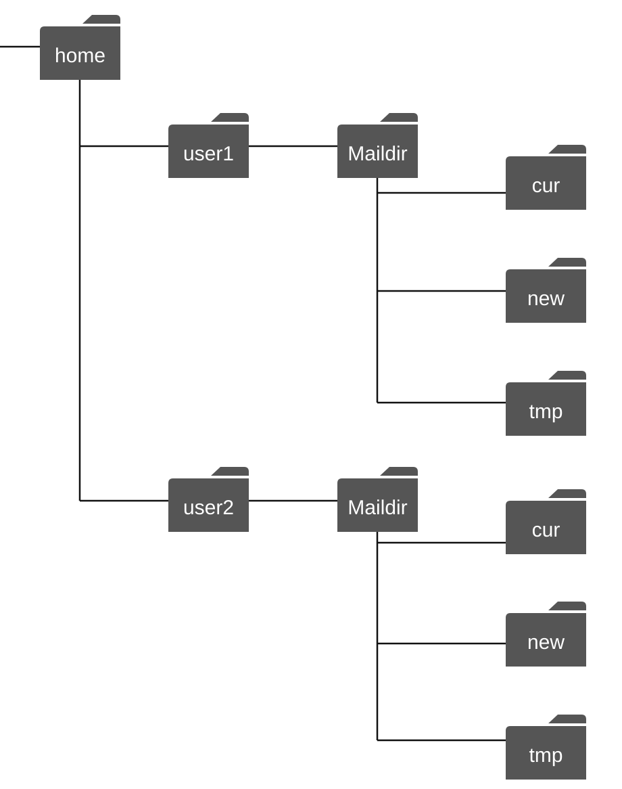
</div>

As the scale grew, disk I/O became a bottleneck. Also, it doesn't satisfy our high availability and reliability requirements.
Disks can be damaged and server can go down.

### **Distributed mail servers**

Distributed mail servers are designed to support modern use cases and solve modern scalability issues.

These servers can still support IMAP/POP for native email clients and SMTP for mail exchange across servers.

But for rich web-based mail clients, a RESTful API over HTTP is typically used.

Example APIs:
- `POST /v1/messages` - sends a message to recipients in To, Cc, Bcc headers.
- `GET /v1/folders` - returns all folders of an email account.

Example response:

```text
[{id: string        Unique folder identifier.
  name: string      Name of the folder.
                    According to RFC6154 [9], the default folders can be one of
                    the following: All, Archive, Drafts, Flagged, Junk, Sent,
                    and Trash.
  user_id: string   Reference to the account owner
}]
```

- `GET /v1/folders/{:folder_id}/messages` - returns all messages under a folder with pagination
- `GET /v1/messages/{:message_id}` - get all information about a particular message

Example response:

```json
{
  user_id: string                      // Reference to the account owner.
  from: {name: string, email: string}  // <name, email> pair of the sender.
  to: [{name: string, email: string}]  // A list of <name, email> pairs
  subject: string                      // Subject of an email
  body: string                         //  Message body
  is_read: boolean                     //  Indicate if a message is read or not.
}
```

Here's the high-level design of the distributed mail server:

<div style="margin-left:3rem">
    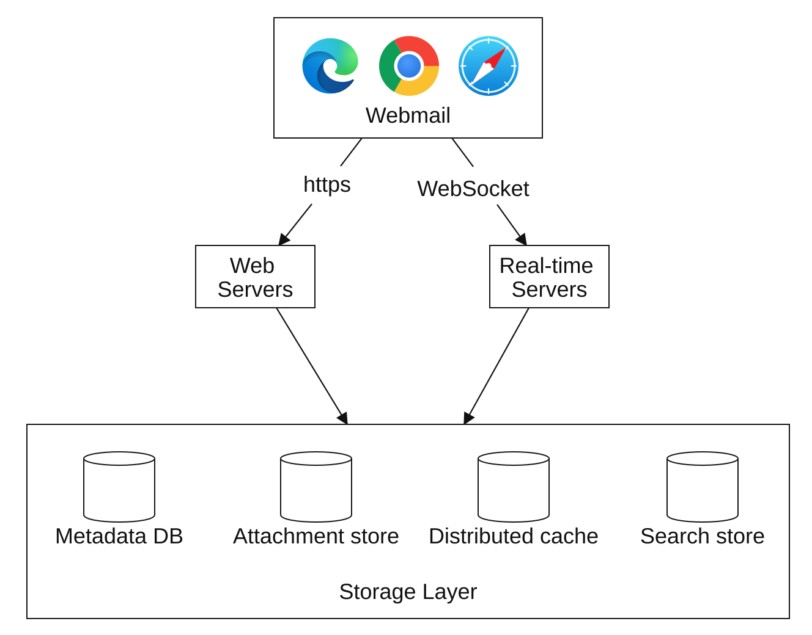
</div>

- **Webmail** - users use web browsers to send/receive emails
- **Web servers** - public-facing request/response services used to manage login, signup, user profile, etc.
- **Real-time servers** - Used for pushing new email updates to clients in real time. We use WebSockets for real-time communication but fall back to long polling for older browsers that don't support them.
- **Metadata DB** - stores email metadata such as subject, body, from, to, etc.
- **Attachment store** - Object store (e.g., Amazon S3) suitable for storing large files.
- **Distributed cache** - We can cache recent emails in Redis to improve UX.
- **Search store** - distributed document store, used for supporting full-text searches.

Here's what the email sending flow looks like:

<div style="margin-left:3rem">
    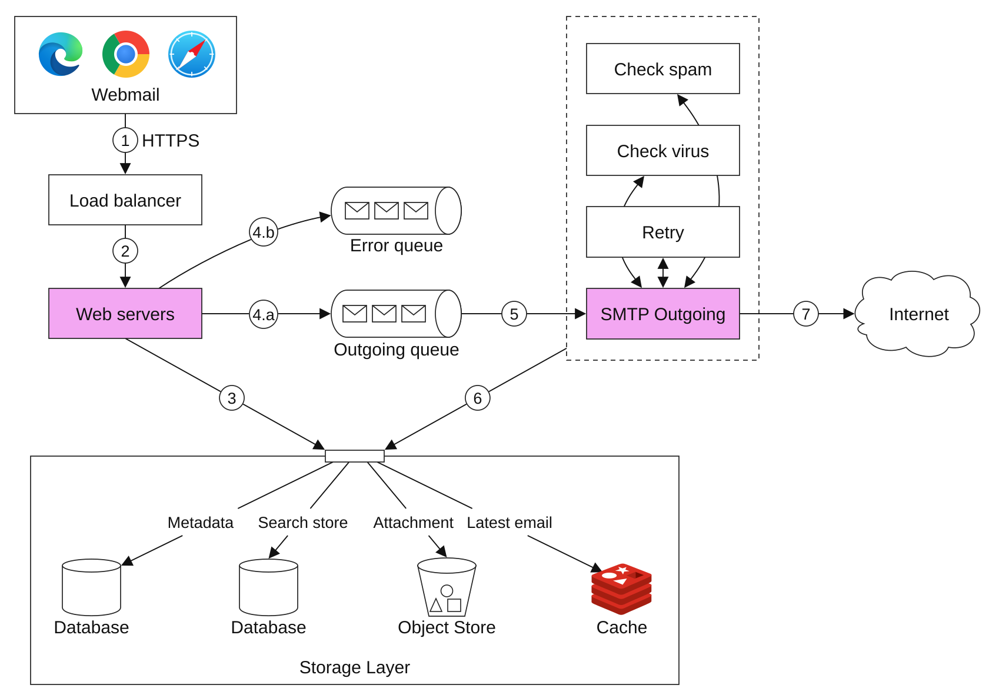
</div>

- User writes an email and presses "send". Email is sent to load balancer.
- Load balancer rate limits excessive mail sends and routes to one of the web servers.
- Web servers do basic email validation (e.g., email size) and short-circuit the outbound flow if the domain is the same as the sender's, but perform a spam check first.
- If basic validation passes, the email is sent to the message queue (the attachment is referenced from the object store).
- If basic validation fails, the email is sent to the error queue.
- SMTP outgoing workers pull messages from outgoing queue, do spam/virus checks and route to destination mail server.
- Email is stored in the "Sent Emails" folder

We need to also monitor size of outgoing message queue. Growing too large might indicate a problem:
- Recipient's mail server is unavailable. We can retry sending the email at a later time using exponential backoff.
- Not enough consumers to handle the load, we might have to scale the consumers.

Here's the email receiving flow:

<div style="margin-left:3rem">
    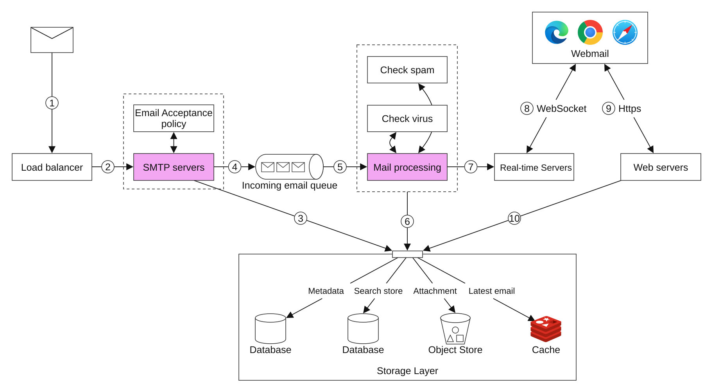
</div>

- Incoming emails arrive at the SMTP load balancer. Emails are distributed to SMTP servers, where mail-acceptance policies are applied (e.g., invalid emails are directly discarded).
- If an email attachment is too large, we can put it in an object store (S3).
- Mail-processing workers do preliminary checks, after which emails are forwarded to storage, cache, the object store, and real-time servers.
- Offline users get their new emails once they come back online via HTTP API.

---

## Step 3: Design Deep Dive

Let's now go deeper into some of the components.

### **Metadata database**

Here are some of the characteristics of email metadata:
- Headers are usually small and frequently accessed.
- Body size ranges from small to large but is typically read once.
- Most mail operations are isolated to a single user - e.g., fetching email, marking as read, or searching.
- Data recency impacts data usage. Users typically read only recent emails.
- Data has high-reliability requirements. Data loss is unacceptable.

At Gmail/Outlook scale, the database is typically custom-built to reduce input/output operations per second (IOPS).

Let's consider what database options we have:
- **Relational database** - we can build indexes for headers and body, but these DBs are typically optimized for small chunks of data.
- **Distributed object store** - this can be a good option for backup storage, but can't efficiently support searching/marking as read/etc.
- **NoSQL** - Google BigTable is used by gmail, but it's not open-sourced.

Based on the above analysis, very few existing solutions seem to fit our needs perfectly.
In an interview setting, it's infeasible to design a new distributed database solution, but it is important to mention its characteristics:
- Single column can be a single-digit MB
- Strong data consistency
- Designed to reduce disk I/O
- Highly available and fault tolerant
- Should be easy to create incremental backups

In order to partition the data, we can use the `user_id` as a partition key, so that one user's data is stored on a single shard.
This prohibits us from sharing an email with multiple users, but this is not a requirement for this interview.

Let's define the tables:
- Primary key consists of partition key (data distribution) and clustering key (sorting data)
- Queries we need to support - get all folders for a user, display all emails for a folder, create/get/delete an email, fetch read/unread email, get conversation threads (bonus)

Legend for tables to follow:

<div style="margin-left:3rem">
    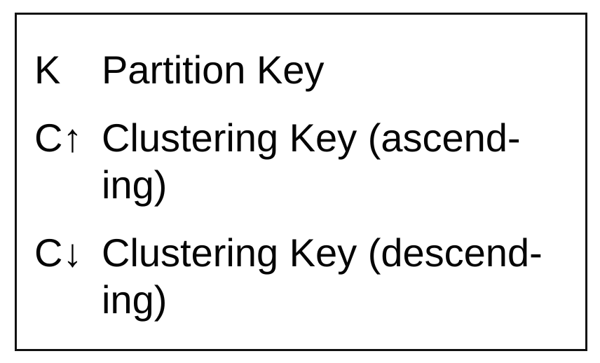
</div>

Here is the folders table:

<div style="margin-left:3rem">
    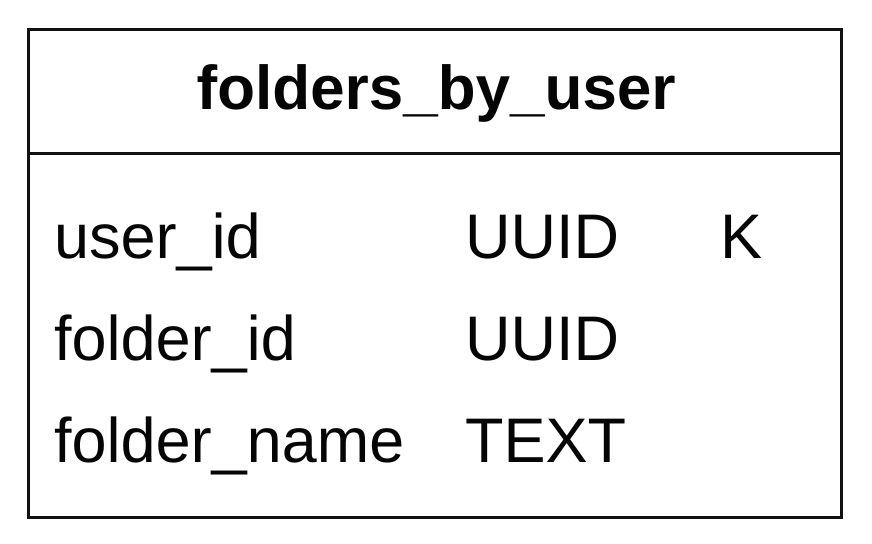
</div>

emails table:

<div style="margin-left:3rem">
    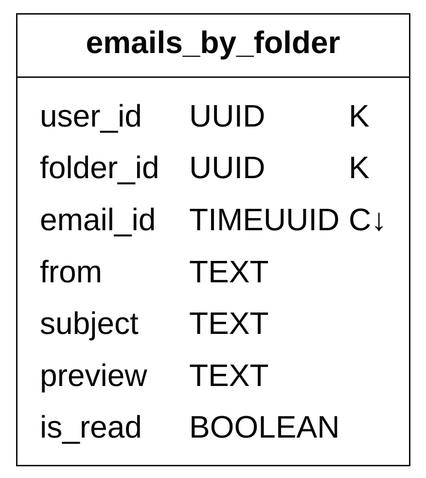
</div>

- `email_id` is a timeuuid that allows sorting based on the timestamp when the email was created.

Attachments are stored in a separate table, identified by filename:

<div style="margin-left:3rem">
    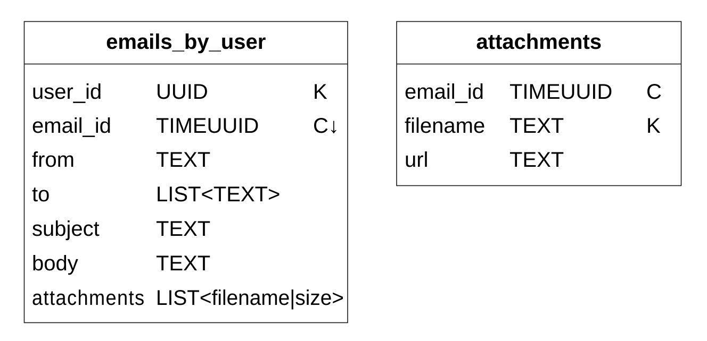
</div>

Supporting fetching read/unread emails is easy in a traditional relational database, but not in Cassandra, since filtering on a non-partition/clustering key is prohibited.
One workaround is to fetch all emails in a folder and filter them in memory, but that doesn't work well for a large application.

What we can do is denormalize the emails table into read/unread emails tables:

<div style="margin-left:3rem">
    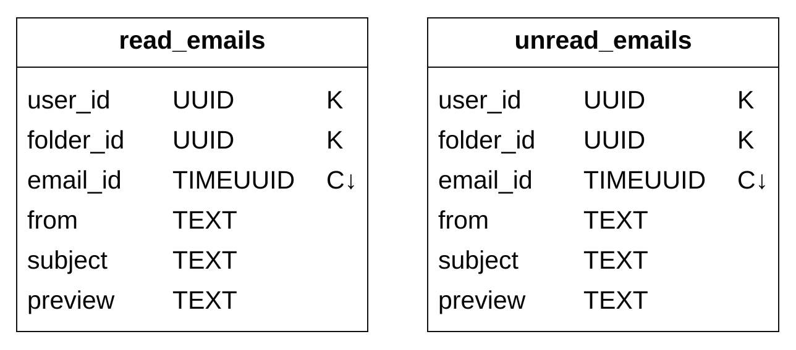
</div>

In order to support conversation threads, we can include some headers, which mail clients interpret and use to reconstruct a conversation thread:

```json
{
  "headers": {
     "Message-Id": "<7BA04B2A-430C-4D12-8B57-862103C34501@gmail.com>",
     "In-Reply-To": "<CAEWTXuPfN=LzECjDJtgY9Vu03kgFvJnJUSHTt6TW@gmail.com>",
     "References": ["<7BA04B2A-430C-4D12-8B57-862103C34501@gmail.com>"]
  }
}
```

Finally, we'll trade availability for consistency for our distributed database, since it is a hard requirement for this problem.

Hence, in the event of a failover or network partition, sync/update actions will be briefly unavailable to impacted users.

### **Email deliverability**

It is easy to set up a server to send emails, but getting an email to a receiver's inbox is hard due to spam-protection algorithms.

If we just set up a new mail server and start sending mail through it, our emails will probably end up in the spam folder.

Here's what we can do to prevent that:
- **Dedicated IPs** - use dedicated IPs for sending emails, otherwise, recipient servers will not trust you.
- **Classify emails** - avoid sending marketing emails from the same servers to prevent more important emails from being classified as spam.
- **Warm up your IP address** - do so slowly to build a good reputation with large email providers. It takes 2 to 6 weeks to warm up a new IP.
- **Ban spammers** quickly to not deteriorate your reputation
- **Feedback processing** - set up a feedback loop with ISPs to keep track of the complaint rate and ban spam accounts quickly.
- **Email authentication** - use common techniques to combat phishing such as Sender Policy Framework, DomainKeys Identified Mail, etc.

You don't need to remember all of this. Just know that building a good mail server requires a lot of domain knowledge.

### **Search**

Searching includes doing a full-text search based on email contents or more advanced queries based on from, to, subject, unread, and other filters.

One characteristic of email search is that it is local to the user and it has more writes than reads, because we need to re-index it on each operation, but users rarely use the search tab.

Let's compare Google Search with email search:

|               | Scope                | Sorting                               | Accuracy                                          |
|---------------|----------------------|---------------------------------------|---------------------------------------------------|
| Google search | The whole internet   | Sort by relevance                     | Indexing takes some time, so not instant results. |
| Email search  | User's own email box | Sort by attributes, e.g., time or date | Indexing should be quick and results accurate.    |

To achieve this search functionality, one option is to use an Elasticsearch cluster. We can use `user_id` as the partition key to group data under the same node:

<div style="margin-left:3rem">
    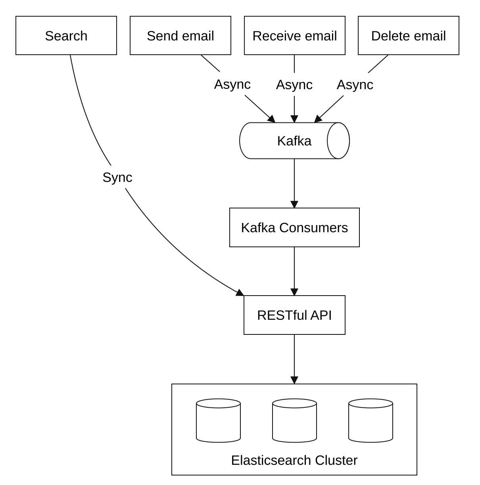
</div>

Mutating operations are async via Kafka in order to decouple services from the reindexing flow.
Actually searching for data happens synchronously.

Elasticsearch is one of the most popular search-engine databases and supports full-text search for emails very well.

Alternatively, we can attempt to develop our own custom search solution to meet our specific requirements.

Designing such a system is out of scope. One of the core challenges when building it is to optimize it for write-heavy workloads.

To achieve that, we can use Log-Structured Merge-Trees (LSM) to structure the index data on disk. The write path is optimized for sequential writes only.
This technique is used in Cassandra, BigTable and RocksDB.

Its core idea is to store data in-memory until a predefined threshold is reached, after which it is merged in the next layer (disk):

<div style="margin-left:3rem">
    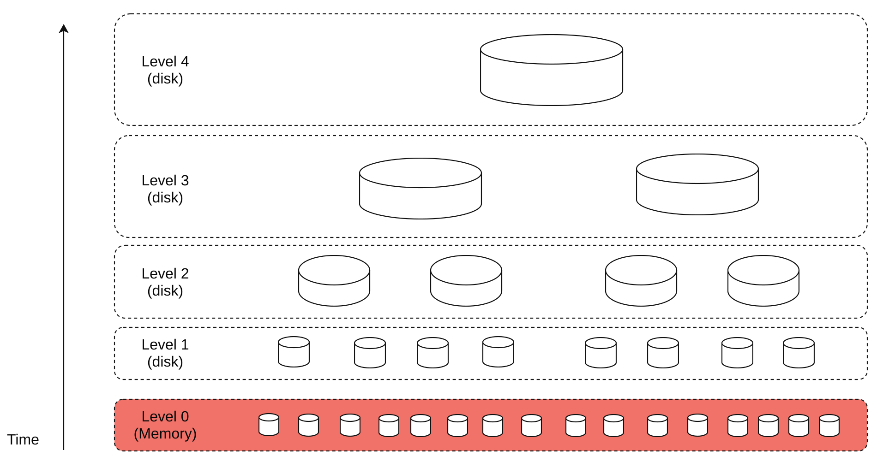
</div>

Main trade-offs between the two approaches:
- Elasticsearch scales to some extent, whereas a custom search engine can be fine-tuned for the email use-case, allowing it to scale further.
- Elasticsearch is a separate service we need to maintain, alongside the metadata store. A custom solution can be the datastore itself.
- Elasticsearch is an off-the-shelf solution, whereas the custom search engine would require significant engineering effort to build.

### **Scalability and availability**

Since individual user operations don't collide with other users, most components can be independently scaled.

To ensure high availability, we can also use a multi-DC setup with leader-follower failover in case of failures:

<div style="margin-left:3rem">
    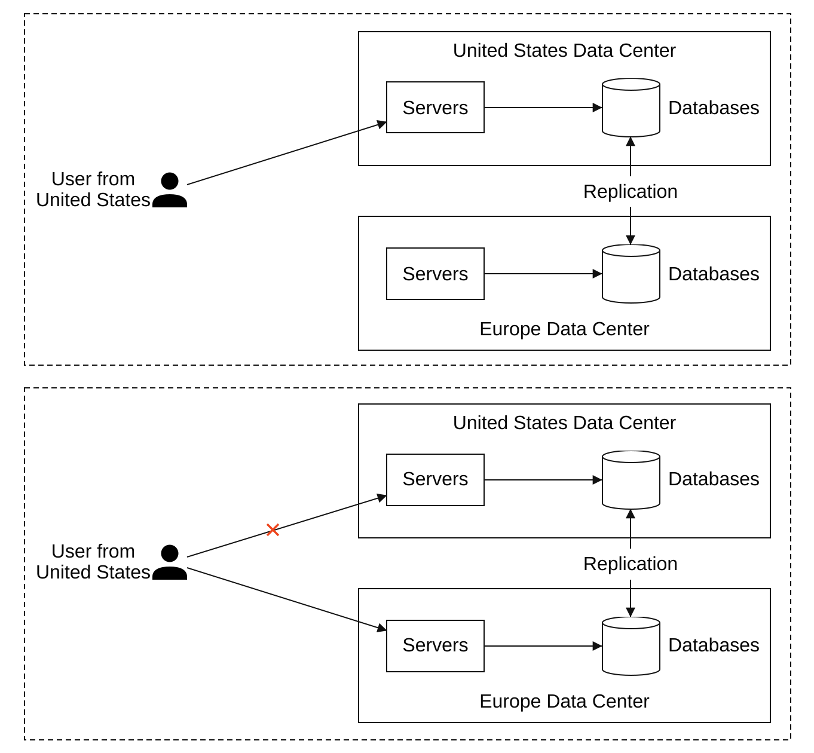
</div>

---

## Step 4: Wrap Up

Additional talking points:
- **Fault tolerance** - Many parts of the system could fail. It is worthwhile to discuss how we'd handle node failures.
- **Compliance** - PII needs to be stored in a reasonable way, given Europe's GDPR laws.
- **Security** - email encryption, phishing protection, safe browsing, etc.
- **Optimizations** - e.g., preventing duplication of the same attachments sent multiple times by different users.
