# Chapter 23: Distributed Email Service
<sub>[Back to System Design](../Readme.md#content)</sub>

## Introduction

In this chapter, we'll design a **distributed email service** similar to **Gmail**.

In 2020, **Gmail** had 1.8 billion active users, while **Outlook** had 400 million users worldwide.

## Step 1: Understand the Problem and Establish Design Scope

- C: How many users use the system?
- I: 1 billion users
- C: I think the following features are important - authentication, sending/receiving email, fetching email, filtering emails, searching email, and anti-spam protection.
- I: Good list. Don't worry about auth for now.
- C: How do users connect to email servers?
- I: Typically, email clients connect via SMTP, POP, or IMAP, but we'll use HTTP for this problem.
- C: Can emails have attachments?
- I: Yes

### **Non-functional requirements**

- **Reliability** - we shouldn't lose data
- **Availability** - We should use replication to prevent single points of failure. We should also tolerate partial system failures.
- **Scalability** - As the user base grows, our system should be able to handle it.
- **Flexibility and extensibility** - the system should be flexible and easy to extend with new features. This is one of the reasons we chose HTTP over SMTP/other mail protocols.

### **Back-of-the-envelope estimation**

- **1 billion users**
- Assuming one person sends 10 emails per day -> **100k emails per second**.
- Assuming one person receives 40 emails per day and each email on average has 50 KB of metadata -> **730 PB of storage per year**.
- Assuming 20% of emails have attachments and the average size is 500 KB -> **1,460 PB per year**.

---

## Step 2: Propose High-Level Design and Get Buy-In

### **Email knowledge 101**

#### **Email protocols**

There are various protocols used for sending and receiving emails:
- **SMTP** - standard protocol for sending emails from one server to another.
- **POP** - standard protocol for receiving and downloading emails from a remote mail server to a local client. Once retrieved, emails are deleted from the remote server.
- **IMAP** - similar to POP, it is used for receiving and downloading emails from a remote server, but it keeps the emails on the server side.
- **HTTPS** - not technically an email protocol, but it can be used for web-based email clients.

#### **Domain name service (DNS)**

A DNS server is used to look up the mail exchanger record (MX record) for the recipient's domain. If you run a DNS lookup for `gmail.com` from the command line, you may get MX records as shown in the image below.

<div style="margin-left:3rem">
    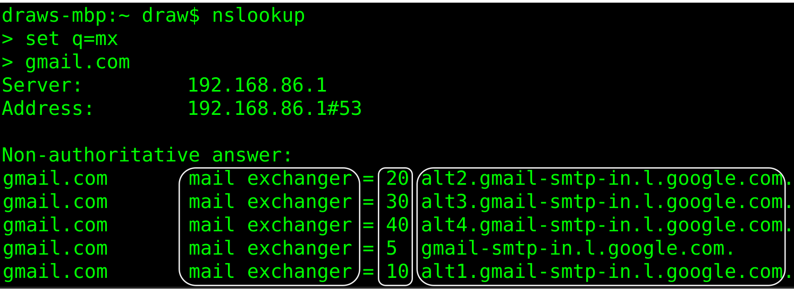
</div>

The priority numbers indicate preferences, where the mail server with a lower priority number is more preferred. In the image above, `gmail-smtp-in.l.google.com` is used first (priority 5). A sending mail server will attempt to connect and send messages to this mail server first. If the connection fails, the sending mail server will attempt to connect to the mail server with the next lowest priority, which is `alt1.gmail-smtp-in.l.google.com` (priority 10).

#### **Attachment**

An email attachment is sent along with an email message, commonly with **Base64 encoding** [[6]](#ref-6). There is usually a size limit for an email attachment. This number is highly configurable and varies from individual to corporate accounts. Multipurpose **Internet Mail Extensions (MIME)** [[7]](#ref-7) is a specification that allows the attachment to be sent over the internet.

### **Traditional mail servers**

Traditional mail servers work well when there are a limited number of users connected to a single server.

<div style="margin-left:3rem">
    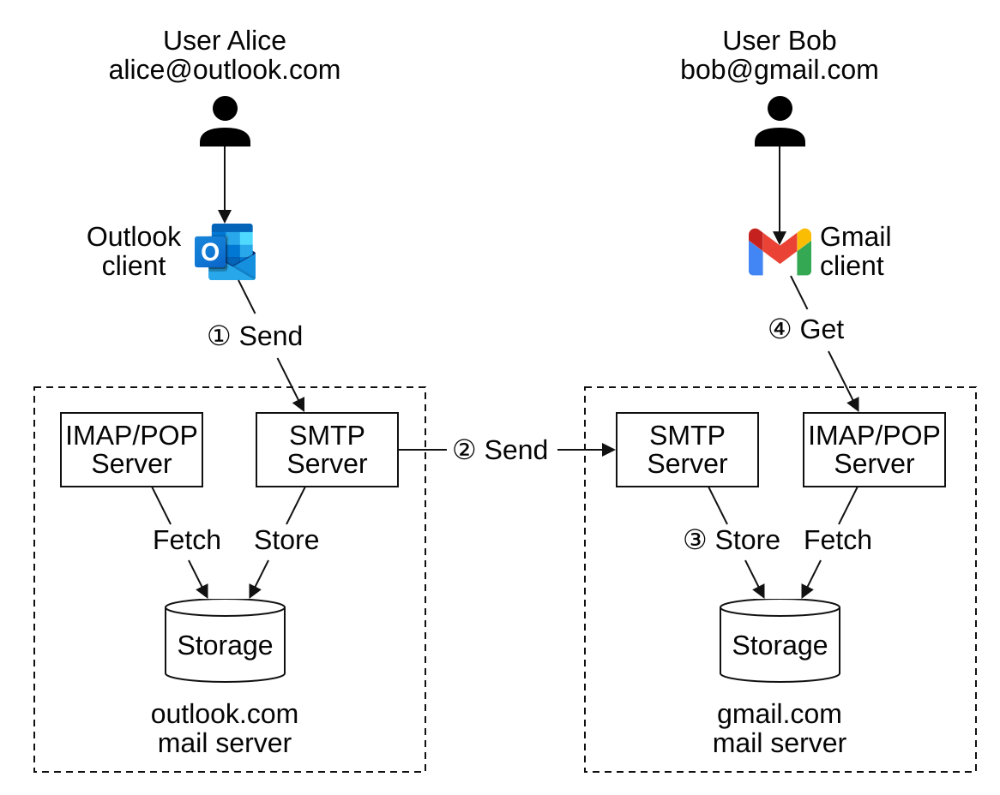
</div>

The process consists of 4 steps:
1. Alice logs in to her Outlook client, composes an email, and presses “send”. The email is sent to the Outlook mail server. The communication protocol between the Outlook client and mail server is SMTP.
2. The Outlook mail server queries the DNS (not shown in the diagram) to find the address of the recipient’s SMTP server. In this case, it is Gmail’s SMTP server. Next, it transfers the email to the Gmail mail server. The communication protocol between the mail servers is SMTP.
3. The Gmail server stores the email and makes it available to Bob, the recipient.
4. The Gmail client fetches new emails through the IMAP/POP server when Bob logs in to Gmail.

In traditional mail servers, emails were stored on the local file system. Every email was a separate file.

<div style="margin-left:3rem">
    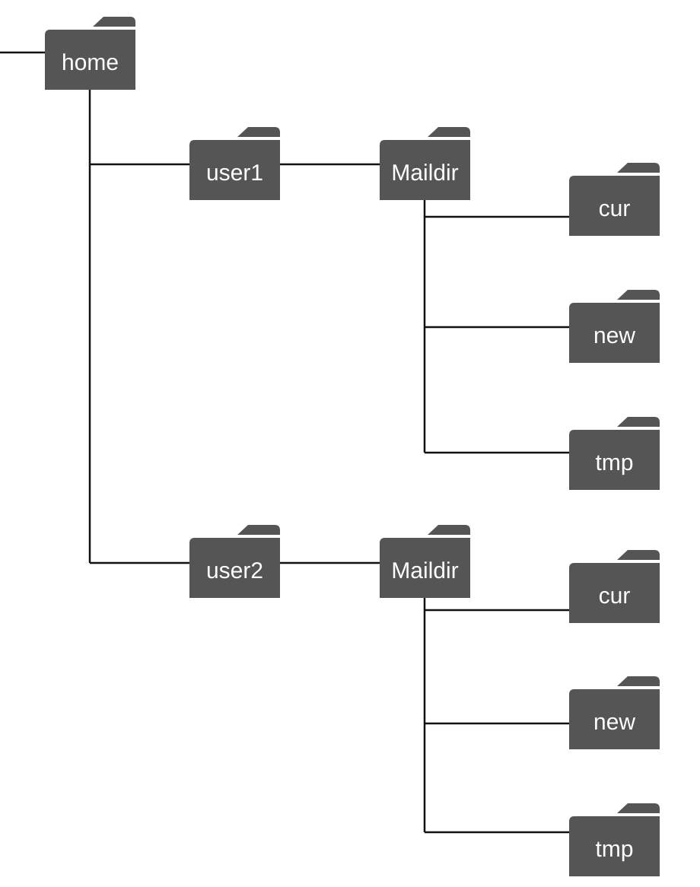
</div>

As the scale grew, disk I/O became a bottleneck. Also, it doesn't satisfy our high availability and reliability requirements. Disks can be damaged, and servers can go down.

### **Distributed mail servers**

Distributed mail servers are designed to support modern use cases and solve the problems of scale and resiliency.

#### **Email APIs**

Distributed mail servers are designed to support modern use cases and solve modern scalability issues.

These servers can still support IMAP/POP for native email clients and SMTP for mail exchange across servers.

But for rich web-based mail clients, a RESTful API over HTTP is typically used.

Example APIs:
- `POST /v1/messages` - sends a message to recipients in the To, Cc, and Bcc headers.
- `GET /v1/folders` - returns all folders of an email account.

Example response (see RFC 6154 [[9]](#ref-9)):

```json
{
    id: string      // Unique folder identifier.
    name: string    // Name of the folder.
                    // According to RFC6154, the default folders can
                    // be one of the following:
                    // All, Archive, Drafts, Flagged, Junk, Sent, and Trash.
    user_id: string // Reference to the account owner
}
```

- `GET /v1/folders/{:folder_id}/messages` - returns all messages under a folder with pagination
- `GET /v1/messages/{:message_id}` - gets all information about a particular message

Example response:

```json
{
    user_id: string                      // Reference to the account owner.
    from: {name: string, email: string}  // <name, email> pair of the sender.
    to: [{name: string, email: string}]  // A list of <name, email> pairs
    subject: string                      // Subject of an email
    body: string                         // Message body
    is_read: boolean                     // Indicates if a message is read or not.
}
```

#### **Distributed mail server architecture**

Here's the high-level design of the distributed mail server:

<div style="margin-left:3rem">
    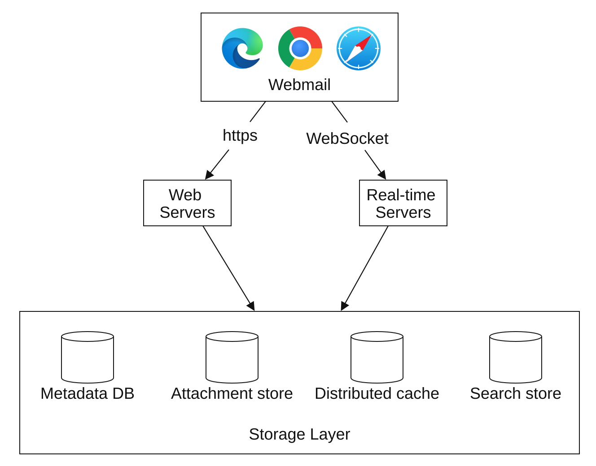
</div>

- **Webmail** - users use web browsers to send/receive emails
- **Web servers** - public-facing request/response services used to manage login, signup, user profiles, etc.
- **Real-time servers** - Used for pushing new email updates to clients in real time. We use WebSockets for real-time communication but fall back to long polling for older browsers that don't support them.
- **Metadata DB** - stores email metadata such as subject, body, from, to, etc.
- **Attachment store** - Object store (e.g., Amazon S3) suitable for storing large files.
- **Distributed cache** - We can cache recent emails in Redis to improve UX.
- **Search store** - distributed document store, used for supporting full-text searches.

#### **Email sending flow**

The email sending flow is shown below.

<div style="margin-left:3rem">
    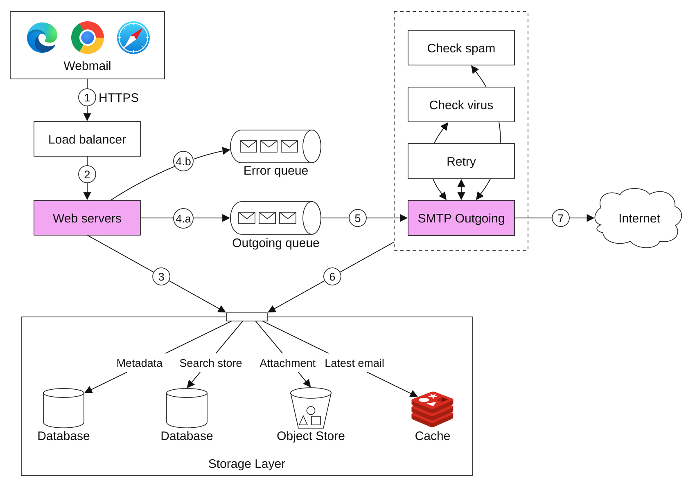
</div>

1. A user writes an email in webmail and presses the “send” button. The request is sent to the load balancer.
2. The load balancer makes sure it doesn’t exceed the rate limit and routes traffic to web servers.
3. Web servers are responsible for:
    - Basic email validation. Each incoming email is checked against pre-defined rules such as the email size limit.
    - Checking if the domain of the recipient’s email address is the same as the sender's. If it is the same, email data is inserted into storage, the cache, and the object store directly. The recipient can fetch the email directly via the RESTful API. There is no need to go to step 4.
4. Message queues.
    - If basic email validation succeeds, the email data is passed to the outgoing queue.
    - If basic email validation fails, the email is put in the error queue.
5. SMTP outgoing workers pull events from the outgoing queue and make sure emails are spam- and virus-free.
6. The outgoing email is stored in the “Sent Folder” of the storage layer.
7. SMTP outgoing workers send the email to the recipient's mail server.

We need to also monitor the size of the outgoing message queue. If it grows too large, this might indicate a problem:
- The recipient's mail server is unavailable. We can retry sending the email at a later time using exponential backoff.
- There are not enough consumers to handle the load; we might have to scale the consumers.

#### **Email receiving flow**

The email receiving flow is shown below.

<div style="margin-left:3rem">
    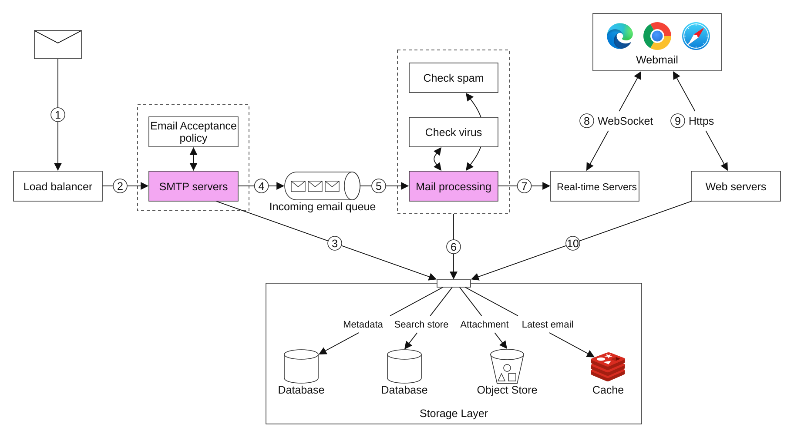
</div>

1. Incoming emails arrive at the SMTP load balancer.
2. The load balancer distributes traffic among SMTP servers. An email acceptance policy can be configured and applied at the SMTP-connection level. For example, invalid emails are bounced to avoid unnecessary email processing.
3. If the attachment of an email is too large to put into the queue, we can put it into the attachment store (S3).
4. Emails are put in the incoming email queue. The queue decouples mail processing workers from SMTP servers so they can be scaled independently. Moreover, the queue serves as a buffer in case the email volume surges.
5. Mail processing workers are responsible for a lot of tasks, including filtering out spam, stopping viruses, etc. The following steps assume an email has passed validation.
6. The email is stored in the mail storage, cache, and object data store.
7. If the receiver is currently online, the email is pushed to real-time servers.
8. Real-time servers are WebSocket servers that allow clients to receive new emails in real time.
9. For offline users, emails are stored in the storage layer. When a user comes back online, the webmail client connects to web servers via the RESTful API.
10. Web servers pull new emails from the storage layer and return them to the client.

## Step 3: Design Deep Dive

Let's now go deeper into some of the components.

### **Metadata database**

Here are some of the characteristics of email metadata:
- Headers are usually small and frequently accessed.
- Body size ranges from small to large, but the body is typically read once.
- Most mail operations are isolated to a single user - e.g., fetching email, marking it as read, or searching.
- Data recency impacts data usage. Users typically read only recent emails.
- Data has high-reliability requirements. Data loss is unacceptable.

At Gmail/Outlook scale, the database is typically custom-built to reduce input/output operations per second (IOPS).

Let's consider what database options we have:
- **Relational database** - we can build indexes for headers and body, but these DBs are typically optimized for small chunks of data. So **MySQL and PostgreSQL are not good fits**.
- **Distributed object store** - this can be a good option for backup storage, but can't efficiently support searching/marking as read/etc.
- **NoSQL** - Google Bigtable is used by Gmail, but it's not open-sourced. In our case, **Cassandra or Elasticsearch could be a good fit**.

Based on the above analysis, very few existing solutions seem to fit our needs perfectly.

In an interview setting, it's infeasible to design a new distributed database solution, but it is important to mention its characteristics:
- A single column can be in the single-digit MB range
- Strong data consistency
- Designed to reduce disk I/O
- Highly available and fault tolerant
- Should be easy to create incremental backups

#### **Data model**

In order to partition the data, we can use the `user_id` as a partition key, so that one user's data is stored on a single shard.
This prohibits us from sharing an email with multiple users, but this is not a requirement for this interview.

Let's define the tables. The primary key contains two components: the partition key and the clustering key.
* Partition key: responsible for distributing data across nodes. As a general rule, we want to spread the data evenly.
* Clustering key: responsible for sorting data within a partition.

Queries we need to support:
1. Get all folders for a user.
2. Display all emails for a specific folder.
3. Create/delete/get a specific email
4. Fetch all read or unread emails
5. Bonus: get conversation threads.

#### **Get all folders for a user**

Legend for tables to follow:

<div style="margin-left:3rem">
    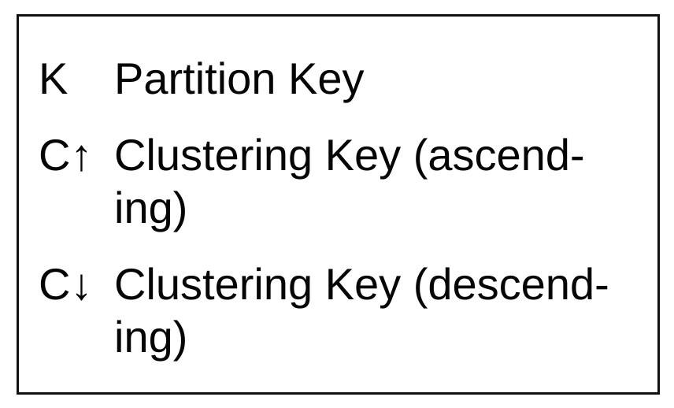
</div>

Here is the folders table:

<div style="margin-left:3rem">
    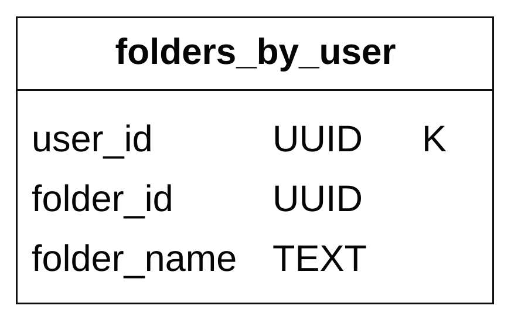
</div>

Emails table:

<div style="margin-left:3rem">
    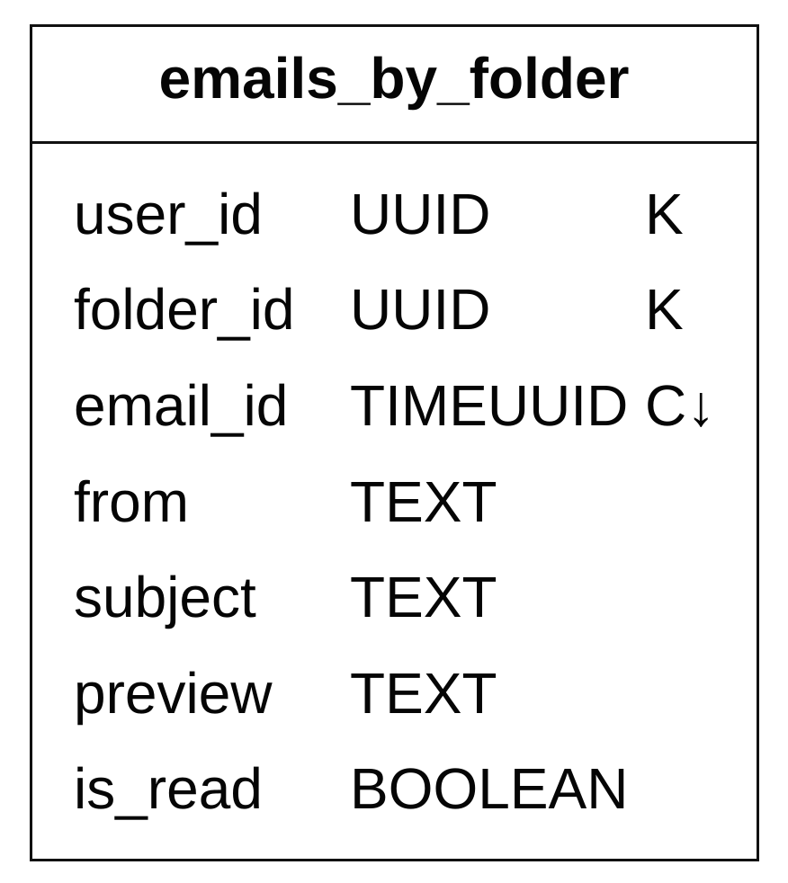
</div>

When a user loads their inbox, emails are usually sorted by timestamp, showing the most recent at the top. In order to store all emails for the same folder in one partition, a composite partition key `<user_id, folder_id>` is used. Another column to note is `email_id`. Its data type is `TIMEUUID` [[17]](#ref-17), and it is the clustering key used to sort emails in chronological order.

#### **Create/delete/get an email**

Getting a single email is easy. The simple query looks like this:

```sql
SELECT * FROM emails_by_user WHERE email_id = 123;
```

Attachments are stored in a separate table:

<div style="margin-left:3rem">
    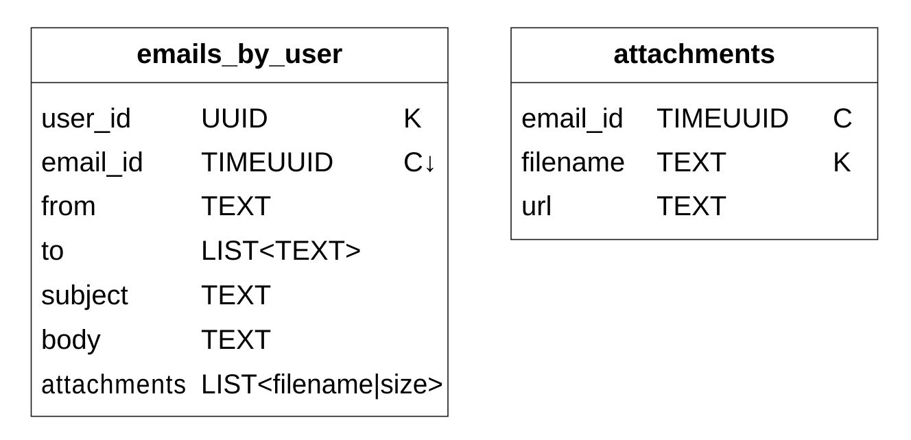
</div>

An email can have multiple attachments, and these can be retrieved by a combination of the `email_id` and `filename` fields.

#### **Fetch all read or unread emails**

If our domain model were for a relational database, the query to fetch all read emails would look like this:

```sql
SELECT * FROM emails_by_folder
WHERE user_id = <user_id>
AND folder_id = <folder_id>
AND is_read = true
ORDER BY email_id;
```

Our data model, however, is designed for NoSQL. A NoSQL database normally only supports queries on partition and clustering keys. Since `is_read` in the `emails_by_folder` table is neither of those, most NoSQL databases will reject this kind of query.

One workaround is to fetch all emails in a folder and filter them in memory, but that doesn't work well for a large application.

This problem is commonly solved with denormalization in NoSQL. To support the read/unread queries, we denormalize `emails_by_folder` data into two tables as shown in the image below.

* `read_emails`: it stores all emails that are in read status.
* `unread_emails`: it stores all emails that are in unread status.

To mark an `UNREAD` email as `READ`, the email is deleted from `unread_emails` and then inserted into `read_emails`.

To fetch all unread emails for a specific folder, we can run a query like this:

```sql
SELECT * FROM unread_emails
WHERE user_id = <user_id>
AND folder_id = <folder_id>
ORDER BY email_id;
```

<div style="margin-left:3rem">
    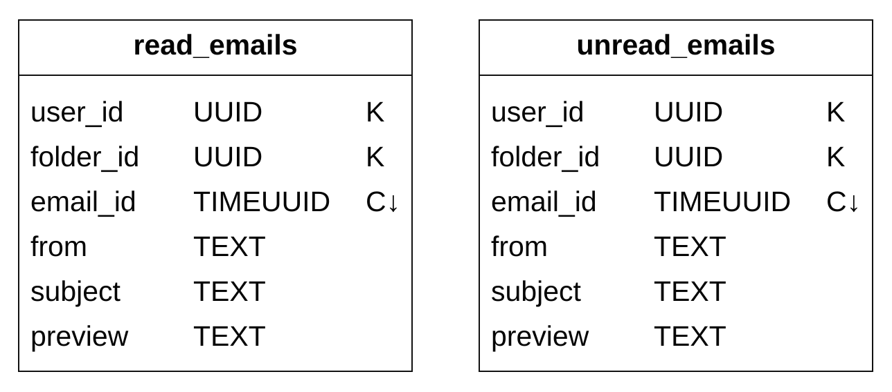
</div>

Denormalization as shown above is a common practice.

#### **Bonus point: conversation threads**

In order to support conversation threads, we can include some headers, which mail clients interpret and use to reconstruct a conversation thread. Traditionally, a thread is implemented using algorithms such as the JWZ algorithm [[18]](#ref-18). An email header generally contains the following three fields.

```json
{
  "headers": {
     "Message-Id": "<7BA04B2A-430C-4D12-8B57-862103C34501@gmail.com>",
     "In-Reply-To": "<CAEWTXuPfN=LzECjDJtgY9Vu03kgFvJnJUSHTt6TW@gmail.com>",
     "References": ["<7BA04B2A-430C-4D12-8B57-862103C34501@gmail.com>"]
  }
}
```

With these fields, an email client can reconstruct email conversations from messages, if all messages in the reply chain are preloaded.

#### **Consistency trade-off**

Distributed databases that rely on replication for high availability must make a fundamental trade-off between consistency and availability.

Correctness is very important for email systems, so by design we want to have a single primary for any given mailbox.

Hence, in the event of a failover or network partition, sync/update actions will be briefly unavailable to impacted users.

### **Email deliverability**

It is easy to set up a server to send emails, but getting an email to a receiver's inbox is hard due to spam-protection algorithms.

If we just set up a new mail server and start sending mail through it, our emails will probably end up in the spam folder.

Here's what we can do to prevent that:
- **Dedicated IPs** - use dedicated IPs for sending emails; otherwise, recipient servers will not trust you.
- **Classify emails** - avoid sending marketing emails from the same servers to prevent more important emails from being classified as spam.
- **Warm up your IP address** - do so slowly to build a good reputation with large email providers. It takes 2 to 6 weeks to warm up a new IP.
- **Ban spammers** quickly to avoid damaging your reputation
- **Feedback processing** - set up a feedback loop with ISPs to keep track of the complaint rate and ban spam accounts quickly. If an email fails to deliver or a user complains, one of the following outcomes occurs:
    - Hard bounce. This means an email is rejected by an ISP because the recipient's email address is invalid.
    - Soft bounce. A soft bounce indicates an email failed to deliver due to temporary conditions, such as ISPs being too busy.
    - Complaint. This means a recipient clicks the 'report spam' button.
- **Email authentication** - use common techniques to combat phishing such as Sender Policy Framework (SPF) [[22]](#ref-22), DomainKeys Identified Mail (DKIM) [[23]](#ref-23), and Domain-based Message Authentication, Reporting and Conformance (DMARC) [[24]](#ref-24).

You don't need to remember all of this. Just know that building a good mail server requires a lot of domain knowledge.

### **Search**

Searching includes doing a full-text search based on email contents or more advanced queries based on from, to, subject, unread, and other filters.

One characteristic of email search is that it is local to the user and it has more writes than reads, because we need to re-index it on each operation, but users rarely use the search tab.

Let's compare Google Search with email search:

|               | Scope                | Sorting                               | Accuracy                                          |
|---------------|----------------------|---------------------------------------|---------------------------------------------------|
| Google search | The whole internet   | Sort by relevance                     | Indexing takes some time, so results are not instant. |
| Email search  | User's own email box | Sort by attributes, e.g., time or date | Indexing should be quick and results accurate.    |

To support search functionality, we compare two approaches:
* Elasticsearch.
* Native search embedded in the datastore.

#### **Elasticsearch**

To achieve this search functionality, one option is to use an Elasticsearch cluster. We can use `user_id` as the partition key to group data under the same node:

<div style="margin-left:3rem">
    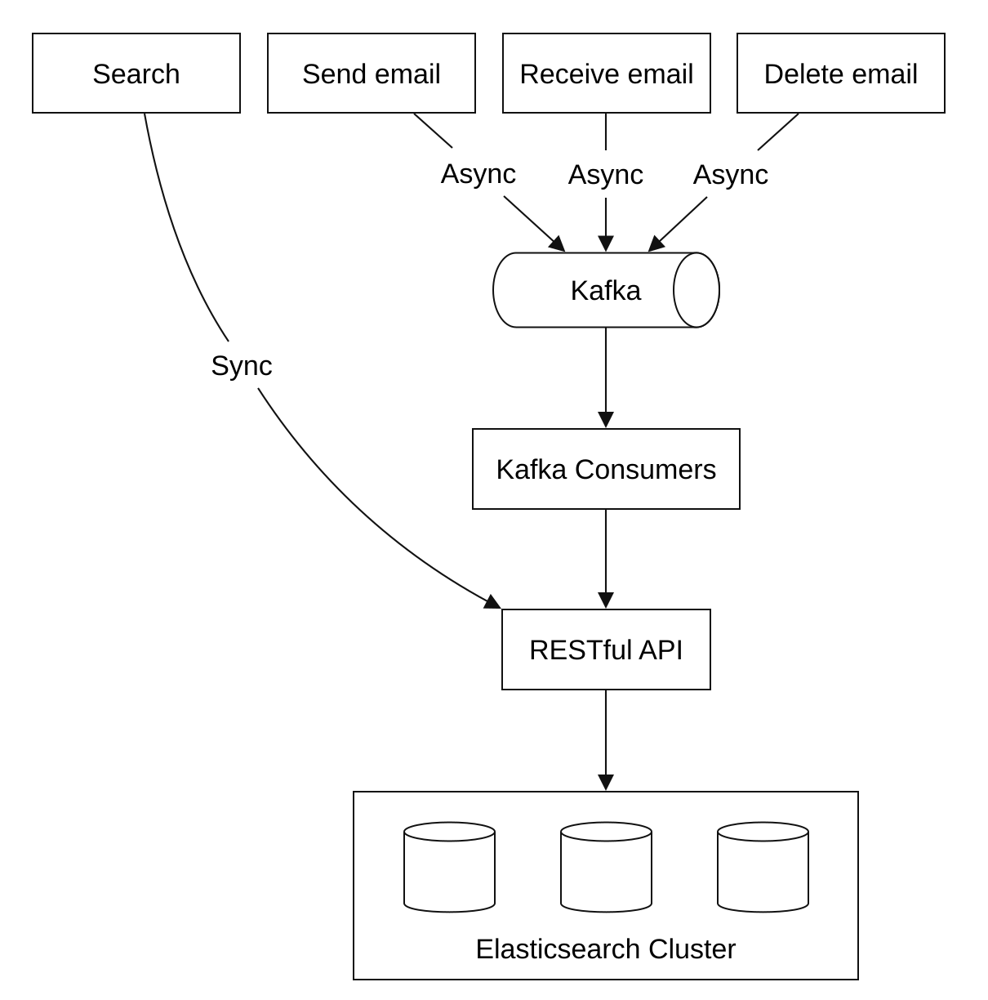
</div>

Mutating operations are async via Kafka in order to decouple services from the reindexing flow.
Actually searching for data happens synchronously.

Elasticsearch is one of the most popular search-engine databases and supports full-text search for emails very well.

#### **Custom search solution**

Alternatively, we can attempt to develop our own custom search solution to meet our specific requirements.

Designing such a system is out of scope. One of the core challenges when building it is to optimize it for write-heavy workloads.

To achieve that, we can use **Log-Structured Merge-Trees (LSM)** to structure the index data on disk. The write path is optimized for sequential writes only.
This technique is used in Cassandra, Bigtable and RocksDB.

Its core idea is to store data in memory until a predefined threshold is reached, after which it is merged into the next layer (disk):

<div style="margin-left:3rem">
    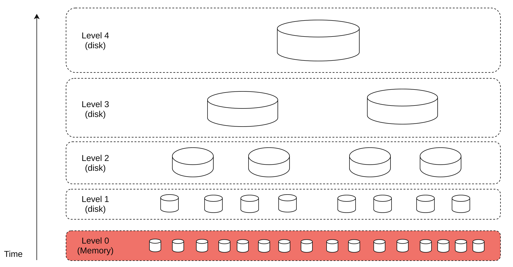
</div>

#### **Comparison between two approaches**

Main trade-offs between the two approaches:
- Elasticsearch scales to some extent, whereas a custom search engine can be fine-tuned for the email use case, allowing it to scale further.
- Elasticsearch is a separate service we need to maintain, alongside the metadata store. A custom solution can be the datastore itself.
- Elasticsearch is an off-the-shelf solution, whereas the custom search engine would require significant engineering effort to build.

### **Scalability and availability**

Since individual user operations don't collide with those of other users, most components can be independently scaled.

To ensure high availability, we can also use a multi-DC setup with leader-follower failover in case of failures:

<div style="margin-left:3rem">
    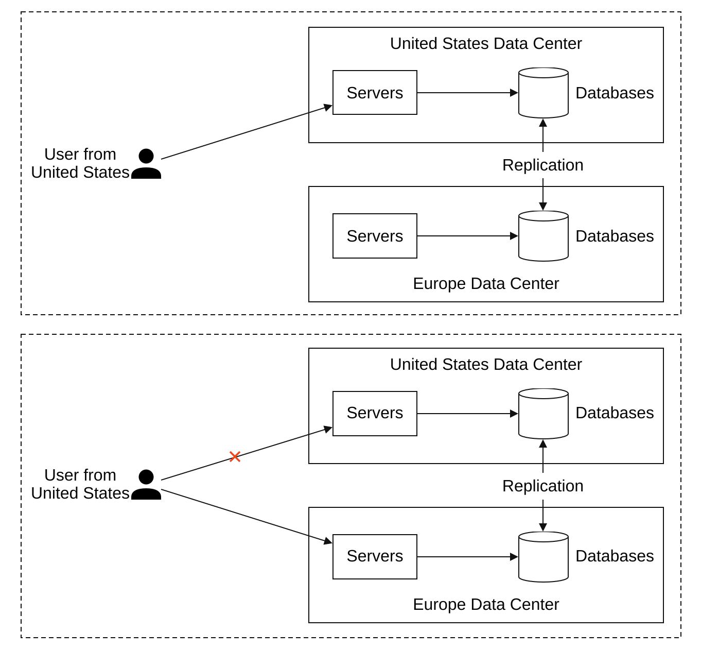
</div>

## Step 4: Wrap Up

Additional talking points:
- **Fault tolerance** - Many parts of the system could fail. It is worthwhile to discuss how we'd handle node failures.
- **Compliance** - PII needs to be stored in a reasonable way, given Europe's GDPR laws.
- **Security** - email encryption, phishing protection, safe browsing, etc.
- **Optimizations** - e.g., preventing duplication of the same attachments sent multiple times by different users.

## Reference materials

1. <a id="ref-1"></a>[Number of Active Gmail Users](https://financesonline.com/number-of-active-gmail-users/)
2. <a id="ref-2"></a>[Outlook](https://en.wikipedia.org/wiki/Outlook.com)
3. <a id="ref-3"></a>[How Many Emails Are Sent Per Day in 2021?](https://review42.com/resources/how-many-emails-are-sent-per-day/)
4. <a id="ref-4"></a>[RFC 1939 - Post Office Protocol - Version 3](http://www.faqs.org/rfcs/rfc1939.html)
5. <a id="ref-5"></a>[ActiveSync](https://en.wikipedia.org/wiki/ActiveSync)
6. <a id="ref-6"></a>[Email attachment](https://en.wikipedia.org/wiki/Email_attachment)
7. <a id="ref-7"></a>[MIME](https://en.wikipedia.org/wiki/MIME)
8. <a id="ref-8"></a>[Conversation threading — Wikipedia overview](https://en.wikipedia.org/wiki/Conversation_threading)
9. <a id="ref-9"></a>[IMAP LIST Extension for Special-Use Mailboxes](https://datatracker.ietf.org/doc/html/rfc6154)
10. <a id="ref-10"></a>[Apache James](https://james.apache.org/)
11. <a id="ref-11"></a>[RFC 8887: JSON Meta Application Protocol over WebSocket](https://datatracker.ietf.org/doc/html/rfc8887)
12. <a id="ref-12"></a>[Cassandra Limitations](https://cwiki.apache.org/confluence/display/CASSANDRA2/CassandraLimitations)
13. <a id="ref-13"></a>[Inverted index](https://en.wikipedia.org/wiki/Inverted_index)
14. <a id="ref-14"></a>[Exponential backoff](https://en.wikipedia.org/wiki/Exponential_backoff)
15. <a id="ref-15"></a>[QQ Email System Optimization (in Chinese)](https://www.slideshare.net/areyouok/06-qq-5431919)
16. <a id="ref-16"></a>[IOPS](https://en.wikipedia.org/wiki/IOPS)
17. <a id="ref-17"></a>[UUID and timeuuid types](https://docs.datastax.com/en/cql-oss/3.3/cql/cql_reference/uuid_type_r.html)
18. <a id="ref-18"></a>[Message threading — JWZ algorithm](https://www.jwz.org/doc/threading.html)
19. <a id="ref-19"></a>[Global spam volume](https://www.statista.com/statistics/420391/spam-email-traffic-share/)
20. <a id="ref-20"></a>[Warming up dedicated IP addresses](https://docs.aws.amazon.com/ses/latest/dg/dedicated-ip-warming.html)
21. <a id="ref-21"></a>[2018 Data Breach Investigations Report](https://enterprise.verizon.com/resources/reports/DBIR_2018_Report.pdf)
22. <a id="ref-22"></a>[Sender Policy Framework](https://en.wikipedia.org/wiki/Sender_Policy_Framework)
23. <a id="ref-23"></a>[DomainKeys Identified Mail](https://en.wikipedia.org/wiki/DomainKeys_Identified_Mail)
24. <a id="ref-24"></a>[Domain-based Message Authentication, Reporting & Conformance](https://dmarc.org/)
25. <a id="ref-25"></a>[DB-Engines Ranking of Search Engines](https://db-engines.com/en/ranking/search+engine)
26. <a id="ref-26"></a>[Log-structured merge-tree](https://en.wikipedia.org/wiki/Log-structured_merge-tree)
27. <a id="ref-27"></a>[Microsoft Exchange Conference 2014 Search in Exchange](https://www.youtube.com/watch?v=5EXGCSzzQak&t=2173s)
28. <a id="ref-28"></a>[General Data Protection Regulation](https://en.wikipedia.org/wiki/General_Data_Protection_Regulation)
29. <a id="ref-29"></a>[Lawful interception](https://en.wikipedia.org/wiki/Lawful_interception)
30. <a id="ref-30"></a>[Email safety](https://safety.google/intl/en_us/gmail/)
