# Chapter 24: S3-like Object Storage
<sub>[Back to System Design](../Readme.md#content)</sub>

## Introduction

In this chapter, we'll be designing an **object storage** service, similar to **Amazon S3**.

### Storage System 101

Storage systems fall into three broad categories:
- **Block storage**
- **File storage**
- **Object storage**

**Block storage** devices emerged in the 1960s. HDDs and SSDs are examples.
These devices are typically physically attached to a server, although they can also be network-attached via high-speed network protocols like Fibre Channel (FC) [[1]](#ref-1) and iSCSI [[2]](#ref-2). Conceptually, the network-attached block storage still presents raw blocks. To the servers, it works the same as physically attached block storage. Whether network-attached or physically attached, block storage is fully owned by a single server. It is not a shared resource.

**File storage** is built on top of block storage. It provides a higher level of abstraction, making it easier to manage folders and files. File storage could be made accessible by a large number of servers using common file-level network protocols like SMB/CIFS [[3]](#ref-3) and NFS [[4]](#ref-4).

**Object storage** sacrifices performance for high durability, vast scale and low cost.
It targets "cold" data and is mainly used for archival and backup.
There is no hierarchical directory structure; all data is stored as objects in a flat structure.
It is relatively slow compared to other storage types. Most cloud providers have an object storage offering - Amazon S3, Google GCS, etc.

#### **Comparison**

<div style="margin-left:3rem">
    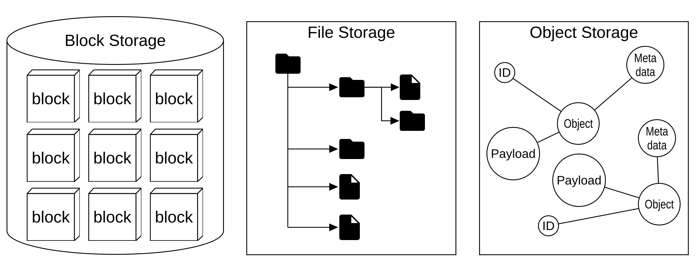
</div>

|                 | Block Storage                    | File Storage                            | Object Storage                 |
|-----------------|----------------------------------|-----------------------------------------|--------------------------------|
| Mutable Content | Y                                | Y                                       | N (has object versioning)     |
| Cost            | High                             | Medium to high                          | Low                            |
| Performance     | Medium to high, very high        | Medium to high                          | Low to medium                  |
| Consistency     | Strong consistency               | Strong consistency                      | Strong consistency [[5]](#ref-5)         |
| Data access     | SAS [[6]](#ref-6)/iSCSI/FC                     | Standard file access, CIFS/SMB, and NFS | RESTful API                    |
| Scalability     | Medium scalability               | High scalability                        | Vast scalability               |
| Good for        | Virtual machines (VMs), databases | General-purpose file system access      | Binary data, unstructured data |

#### **Terminology**

This section provides an overview of terms that apply to object storage:
- **Bucket** - a logical container for objects. The name is globally unique.
- **Object** - an individual piece of data stored in a bucket. It contains object data and metadata.
- **Versioning** - a feature keeping multiple variants of an object in the same bucket.
- **Uniform Resource Identifier (URI)** - each resource is uniquely identified by a URI.
- **Service-level agreement (SLA)** - a contract between the service provider and the client [[8]](#ref-8).

Amazon S3 Standard-Infrequent Access storage class design targets [[31]](#ref-31):
- Durability of 99.999999999% across multiple Availability Zones
- Data is resilient in the event of an entire Availability Zone being destroyed
- Designed for 99.9% availability

## Step 1: Understand the Problem and Establish Design Scope

- C: Which features should be included?
- I: Bucket creation, object upload/download, versioning, listing objects in a bucket
- C: What is the typical data size?
- I: We need to store both massive objects and small objects efficiently
- C: How much data do we store in a year?
- I: 100 petabytes
- C: Can we assume 6 nines of data durability (99.9999%) and service availability of 4 nines (99.99%)?
- I: Yes, sounds reasonable

### Non-functional requirements

- **100 PB of data**
- **6 nines of data durability**
- **4 nines of service availability**
- Storage efficiency. Reduce storage cost while maintaining high reliability and performance

### Back-of-the-envelope estimation

Object storage is likely to have bottlenecks in disk capacity or input/output operations per second (IOPS).

Assumptions:
- We have 20% small (less than 1 MB), 60% mid-size (1-64 MB), and 20% large objects (greater than 64 MB).
- One hard disk (SATA, 7200 rpm) is capable of doing 100-150 random seeks per second (100-150 IOPS)

Given the assumptions, we can estimate the total number of objects the system can persist.
- Let's use the median size per object type to simplify the calculation - 0.5 MB for small, 32 MB for medium, and 200 MB for large.
- Given 100 PB of storage (10^11 MB), 40% of storage usage results in 0.68 billion objects.
- If we assume metadata is 1 KB, then we need 0.68 TB of space to store metadata information.

## Step 2: Propose High-Level Design and Get Buy-In

Let's explore some interesting properties of object storage before diving into the design:
- **Object immutability** - objects in object storage are immutable (unlike in other storage systems). We may delete or replace them, but we cannot update them.
- **Key-value store** - an object URI is its key and we can get its contents by making an HTTP call
- **Write once, read many times** - the data-access pattern is writing once and reading many times. According to some LinkedIn research, 95% of operations are reads [[9]](#ref-9).
- Support both small and large objects

The design philosophy of object storage is similar to that of UNIX - when we save a file, it creates the filename in a data structure called an `inode` [[10]](#ref-10), and file data is stored in different disk locations.
The `inode` contains a list of file block pointers, which point to different locations on disk.

When accessing a file, we first fetch its metadata from the `inode`, prior to fetching the file contents.

Object storage works similarly - a metadata store is used for file information, but contents are stored on disk:

<div style="margin-left:3rem">
    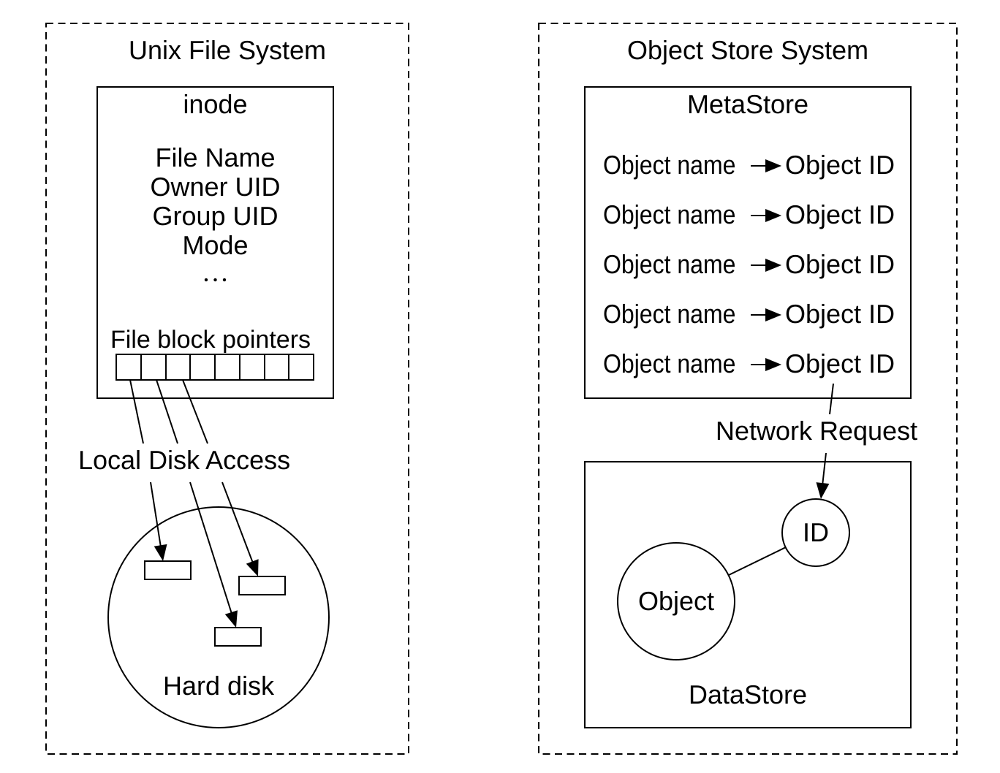
</div>

By separating metadata from file contents, we can scale the different stores independently:

<div style="margin-left:3rem">
    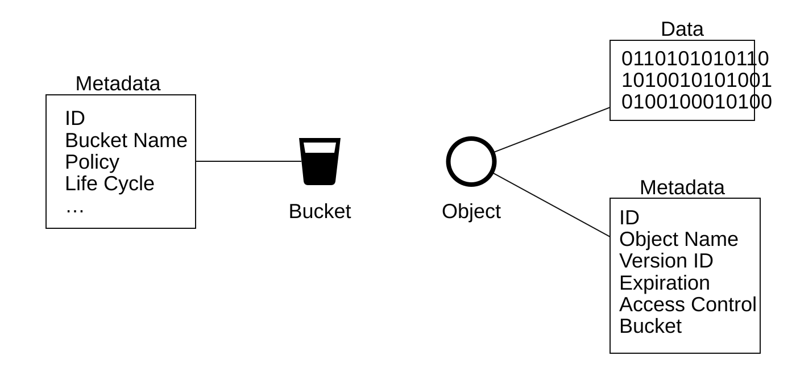
</div>

### High-level design

<div style="margin-left:3rem">
    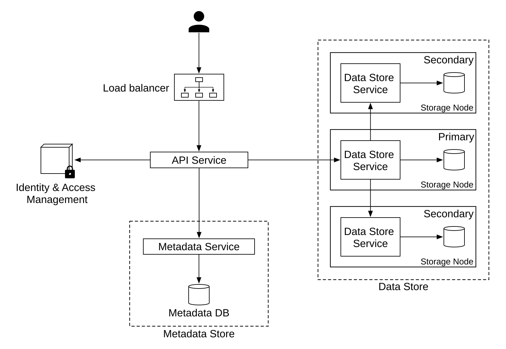
</div>

- **Load balancer** - distributes API requests across service replicas
- **API service** - a stateless server orchestrating calls to the metadata and object stores, as well as the IAM service.
- **Identity and access management (IAM)** - a central place for auth, authz, and access control.
- **Data store** - stores and retrieves actual data. Operations are based on the object ID (UUID).
- **Metadata store** - stores object metadata

### Uploading an object

<div style="margin-left:3rem">
    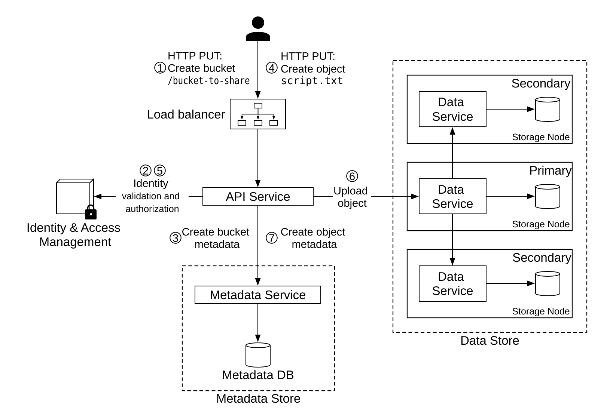
</div>

1. The client sends an `HTTP PUT` request to create a bucket named "bucket-to-share". The request is forwarded to the API service.
2. The API service calls the IAM service to ensure the user is authorized and has `WRITE` permission.
3. The API service calls the metadata store to create an entry with the bucket info in the metadata database. Once the entry is created, a success message is returned to the client.
4. After the bucket is created, the client sends an `HTTP PUT` request to create an object named "script.txt".
5. The API service verifies the user's identity and ensures the user has `WRITE` permission on the bucket.
6. Once validation succeeds, the API service sends the object data in the `HTTP PUT` payload to the data store. The data store persists the payload as an object and returns the UUID of the object.
7. The API service calls the metadata store to create a new entry in the metadata database. It contains important metadata such as the `object_id` (UUID), `bucket_id` (which bucket the object belongs to), `object_name`, etc. A sample entry is shown below.

<div style="margin-left:3rem">
    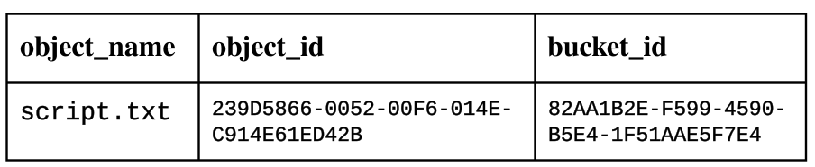
</div>

The API to upload an object could look like this:

```http
PUT /bucket-to-share/script.txt HTTP/1.1
Host: foo.s3example.org
Date: Sun, 12 Sept 2021 17:51:00 GMT
Authorization: authorization string
Content-Type: text/plain
Content-Length: 4567
x-amz-meta-author: Alex

[4567 bytes of object data]
```

### Downloading an object

Buckets have no directory hierarchy, but we can create a logical hierarchy by concatenating the bucket name and object name to simulate a folder structure.

The API to download an object could look like this:

```http
GET /bucket-to-share/script.txt HTTP/1.1
Host: foo.s3example.org
Date: Sun, 12 Sept 2021 18:30:01 GMT
Authorization: authorization string
```

<div style="margin-left:3rem">
    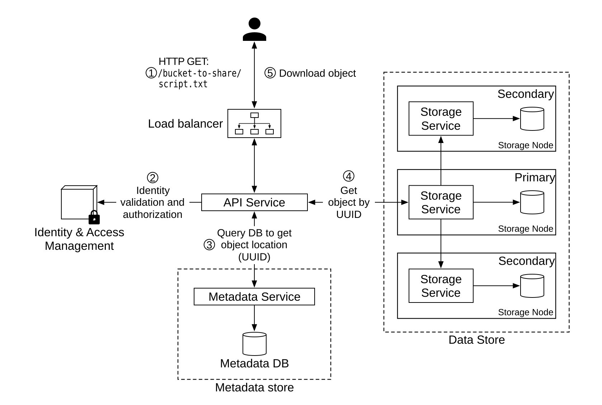
</div>

As mentioned earlier, the data store does not store the name of the object, and it only supports object operations via `object_id` (UUID). In order to download the object, we first map the object name to the UUID. The workflow of downloading an object is shown below:
1. The client sends an HTTP GET request to the load balancer, i.e., `GET /bucket-to-share/script.txt`.
2. The API service queries the IAM to verify that the user has `READ` access to the bucket.
3. Once validated, the API service fetches the corresponding object's UUID from the metadata store.
4. Next, the API service fetches the object data from the data store by its UUID.
5. The API service returns the object data to the client in an `HTTP GET` response.

## Step 3: Design Deep Dive

### Data store

Here's how the API service interacts with the data store:

<div style="margin-left:3rem">
    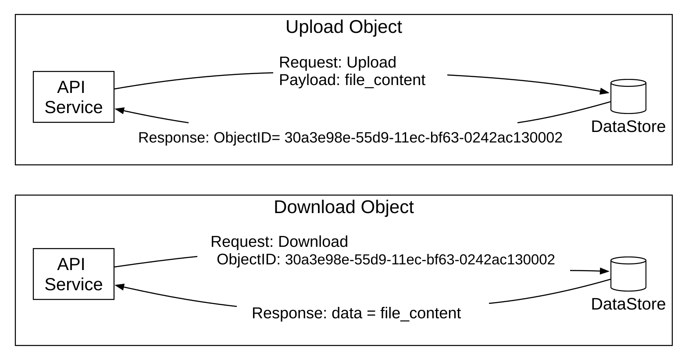
</div>

#### **High-level design for the data store**

The data store has three main components as shown below:

<div style="margin-left:3rem">
    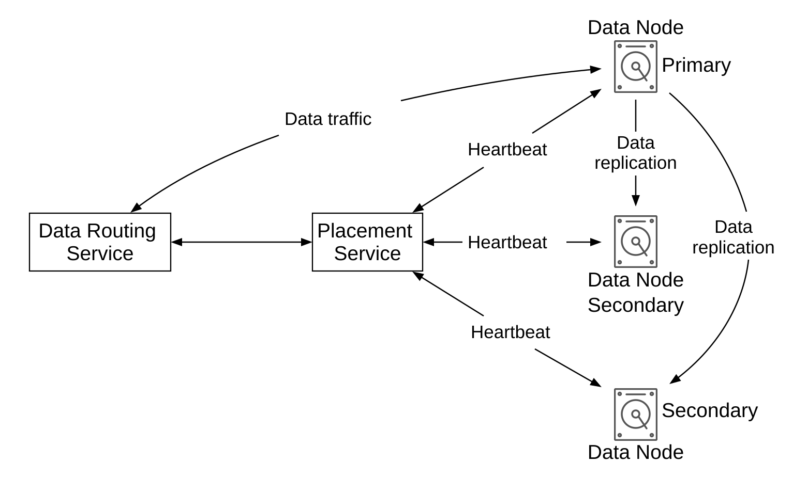
</div>

#### **Data routing service**

The data routing service provides RESTful or gRPC [[12]](#ref-12) APIs to access the data node cluster.
It is a stateless service, which scales by adding more servers.

Its main responsibilities are:
- Querying the placement service to get the best data node to store data
- Reading data from data nodes and returning it to the API service
- Writing data to data nodes

#### **Placement service**

The placement service determines which data nodes (primary and replicas) should be chosen to store an object. It maintains a virtual cluster map, which provides the physical topology of the cluster. The virtual cluster map contains location information for each data node which the placement service uses to make sure the replicas are physically separated. This separation is key to high durability.

<div style="margin-left:3rem">
    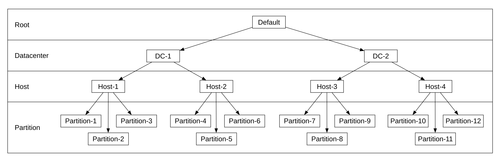
</div>

The service also sends heartbeats to all data nodes to determine if they should be removed from the virtual cluster.

Since this is a critical service, it is recommended to maintain a cluster of 5 or 7 replicas, synchronized via the Paxos [[13]](#ref-13) or Raft [[14]](#ref-14) consensus protocol.
E.g., a 7-node cluster can tolerate 3 node failures.

#### **Data node**

Data nodes store the actual object data. Reliability and durability are ensured by replicating data to multiple data nodes.

Each data node has a data service daemon running on it, which sends heartbeats to the placement service.

The heartbeat includes:
- How many disk drives (HDDs or SSDs) the data node manages
- How much data is stored on each drive

### Data persistence flow

<div style="margin-left:3rem">
    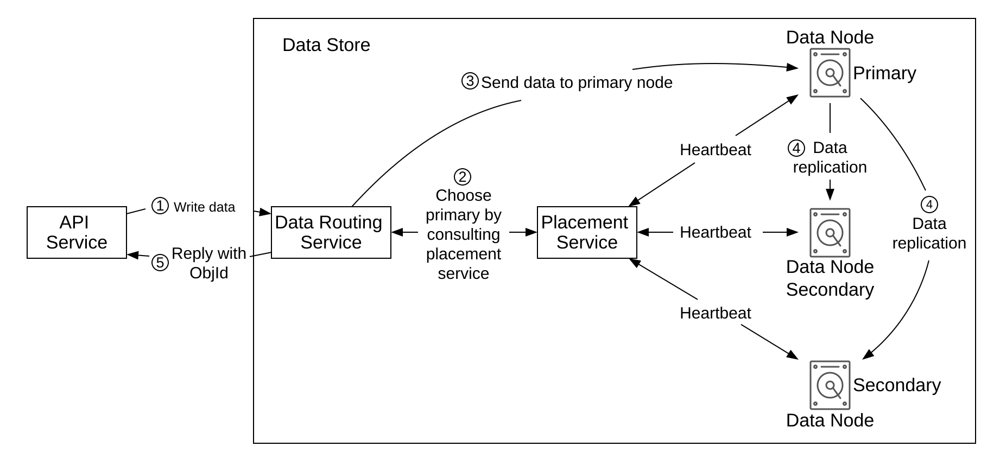
</div>

1. The API service forwards the object data to the data store.
2. The data routing service generates a UUID for this object and queries the placement service to find out which data node should store this object. The placement service checks the virtual cluster map and returns the primary data node.
3. The data routing service sends data directly to the primary data node, together with its UUID.
4. The primary data node saves the data locally and replicates it to two secondary data nodes. The primary node responds to the data routing service when data is successfully replicated to all secondary nodes.
5. The UUID of the object (ObjId) is returned to the API service.

Caveats:
- Given an object UUID, its replication group is deterministically chosen using consistent hashing [[15]](#ref-15).
- In step 4, the primary data node replicates the object data before returning a response. This favors strong consistency over higher latency.

<div style="margin-left:3rem">
    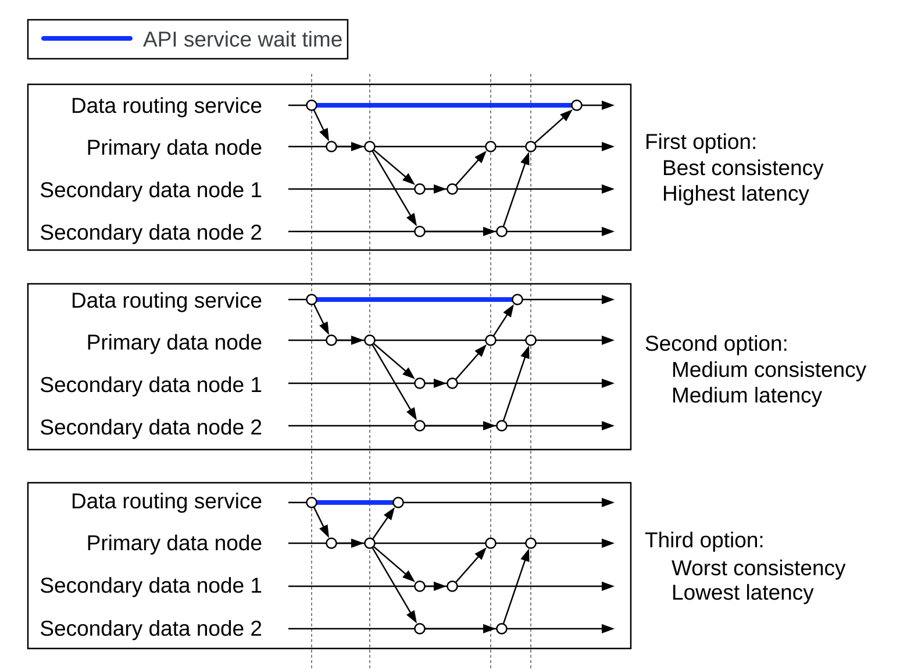
</div>

1. Data is considered successfully saved after all three nodes store the data. This approach has the best consistency but the highest latency.
2. Data is considered successfully saved after the primary and one of the secondaries store the data. This approach has medium consistency and medium latency.
3. Data is considered successfully saved after the primary persists the data. This approach has the worst consistency but the lowest latency.

Both 2 and 3 are forms of eventual consistency.

### How data is organized

One simple approach to managing data is to store each object in a separate file.

This works, but is not performant with many small files in a file system:
- Data blocks on an HDD are wasted, because every file uses the whole block size. A typical block size is 4 KB.
- Many files mean many inodes. Operating systems don't deal well with too many inodes, and there is also a maximum inode limit.

These issues can be addressed by merging many small files into bigger ones via a write-ahead log (WAL). When we save an object, it is appended to an existing read-write file. When the read-write file reaches its capacity threshold - usually set to a few GB - this read-write file is marked as read-only, and a new read-write file is created to receive new objects. Once a file is marked as read-only, it can only serve read requests.

<div style="margin-left:3rem">
    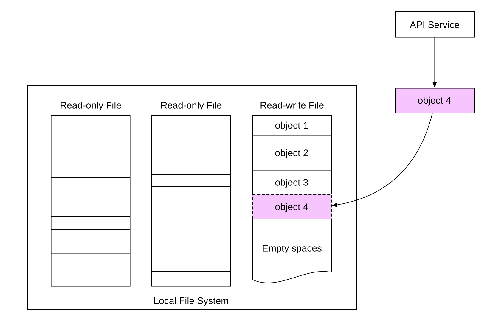
</div>

Note that write access to the read-write file must be serialized. As shown in the image above, objects are stored in order, one after the other, in the read-write file. To maintain this on-disk layout, multiple cores processing incoming write requests in parallel must take their turns to write to the read-write file. To fix this, we could provide dedicated read-write files, one for each core processing incoming requests.

### Object lookup

To support storing multiple objects in the same file, we need to maintain a table, which tells the data node:
- `object_id` - UUID of the object
- `file_name` - The name of the file that contains the object
- `start_offset` - Beginning address of the object in the file
- `object_size` - The number of bytes in the object

There are two options for storing this mapping:
* a file-based key-value store such as RocksDB [[16]](#ref-16)
* a relational database.

RocksDB is based on SSTable [[17]](#ref-17), and it's fast for writes but slower for reads.

A relational database usually uses a B+ tree-based storage engine [[18]](#ref-18), and it is fast for reads but slower for writes.

Since the access pattern is low write+high read, a relational database works better.

How should we deploy it?
We could deploy the db and scale it separately in a cluster, accessed by all data nodes.

Downsides:
- we'd need to aggressively scale the cluster to serve all requests
- there's additional network latency between the data node and the db cluster

An alternative is to take advantage of the fact that data nodes are only interested in data related to them, so we can deploy a simple relational database on each data node.

SQLite [[19]](#ref-19) is a good option as it's a lightweight file-based relational database.

### Updated data persistence flow

<div style="margin-left:3rem">
    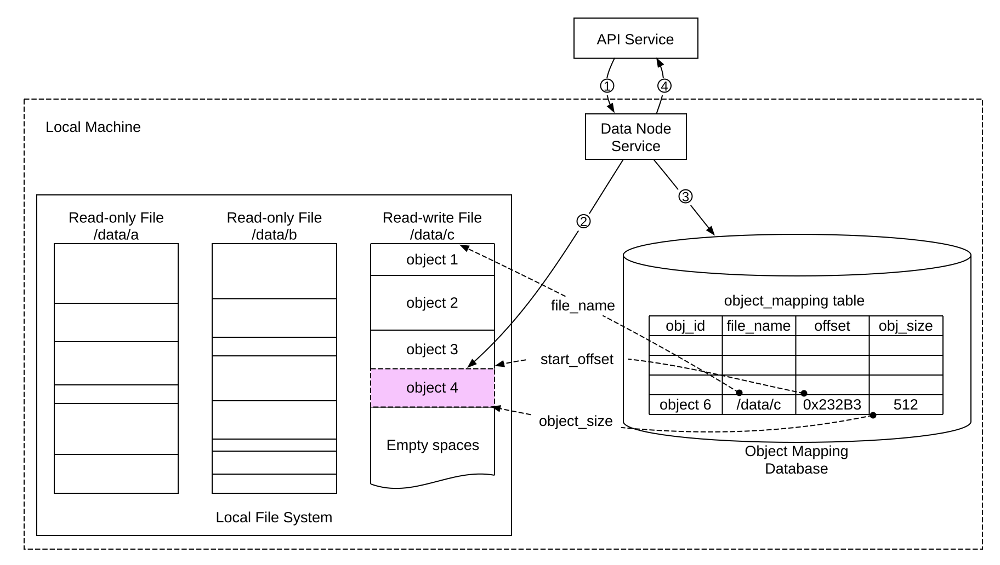
</div>

1. The API service sends a request to save a new object named `object 4`.
2. The data node service appends the object named `object 4` at the end of the read-write file named `/data/c`.
3. A new record of `object 4` is inserted into the object_mapping table.
4. The data node service returns the UUID to the API service.

### Durability

Data durability is an important requirement in our design. In order to achieve 6 nines of durability, every failure case needs to be properly examined.

#### **Hardware failure and failure domain**

Hard drive failures are inevitable no matter which media we use. A proven way to increase durability is to replicate data to multiple hard drives, so a single disk failure does not impact the data availability as a whole.

But in addition to that, we also ought to replicate across different failure domains (cross-rack [[21]](#ref-21), cross-dc, separate networks, etc.). A modern server shares components like the motherboard, processors, power supply, HDD drives, etc. The components in a server are in a node-level failure domain.

Typically, data centers divide infrastructure that shares nothing into different Availability Zones (AZs). We replicate our data to different AZs to minimize the failure impact:

<div style="margin-left:3rem">
    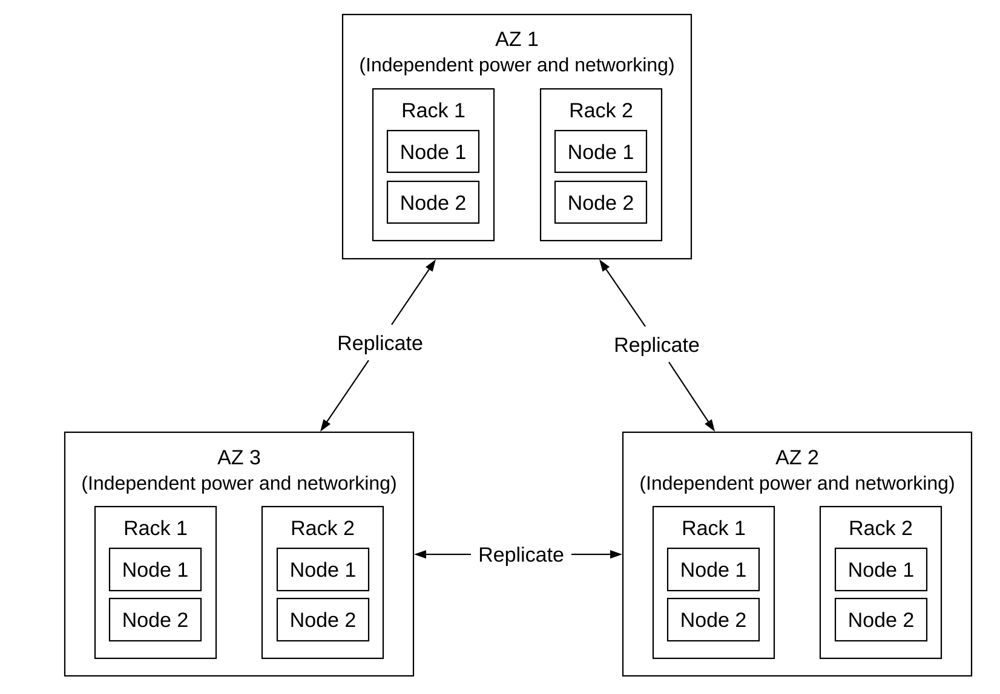
</div>

Assuming the annual failure rate of a typical HDD is 0.81% [[20]](#ref-20), making three copies gives us 6 nines of durability.

Replicating the data nodes like that grants us the durability we want, but we could also leverage erasure coding to reduce storage costs.

#### **Erasure coding**

**Erasure coding** [[22]](#ref-22) enables us to use parity bits, which allow us to reconstruct lost bits in the event of a failure. Let's take a concrete example (4 + 2 erasure coding) as shown in the image below.

<div style="margin-left:3rem">
    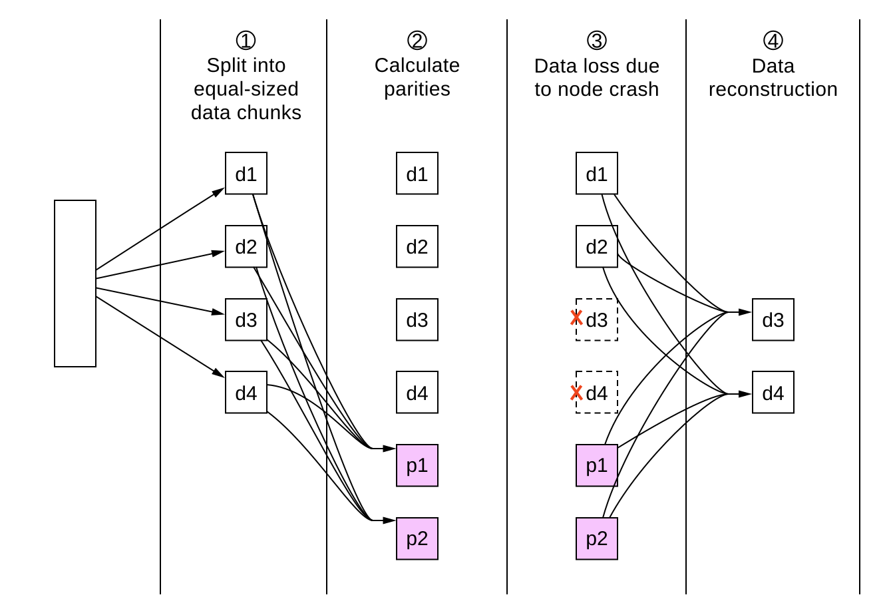
</div>

1. Data is broken up into four even-sized data chunks `d1`, `d2`, `d3`, and `d4`.
2. The mathematical formula behind `Reed–Solomon` coding [[23]](#ref-23) is used to calculate the parities `p1` and `p2`. To give a much simplified example, `p1 = d1 + 2 × d2 - d3 + 4 × d4` and `p2 = -d1 + 5 × d2 + d3 - 3 × d4` [[24]](#ref-24).
3. Data `d3` and `d4` are lost due to node crashes.
4. The mathematical formula is used to reconstruct lost data d3 and d4, using the known values of `d1`, `d2`, `p1`, and `p2`.

Imagine those bits are data nodes. If two of them go down, they can be recovered using the remaining four.

There are different erasure coding schemes. In our case, we could use (8+4) erasure coding. This setup breaks up the original data evenly into 8 chunks and calculates 4 parities. All 12 pieces of data have the same size. All 12 chunks of data are distributed across 12 different failure domains. The mathematics behind erasure coding ensures that the original data can be reconstructed when at most 4 nodes are down.

<div style="margin-left:3rem">
    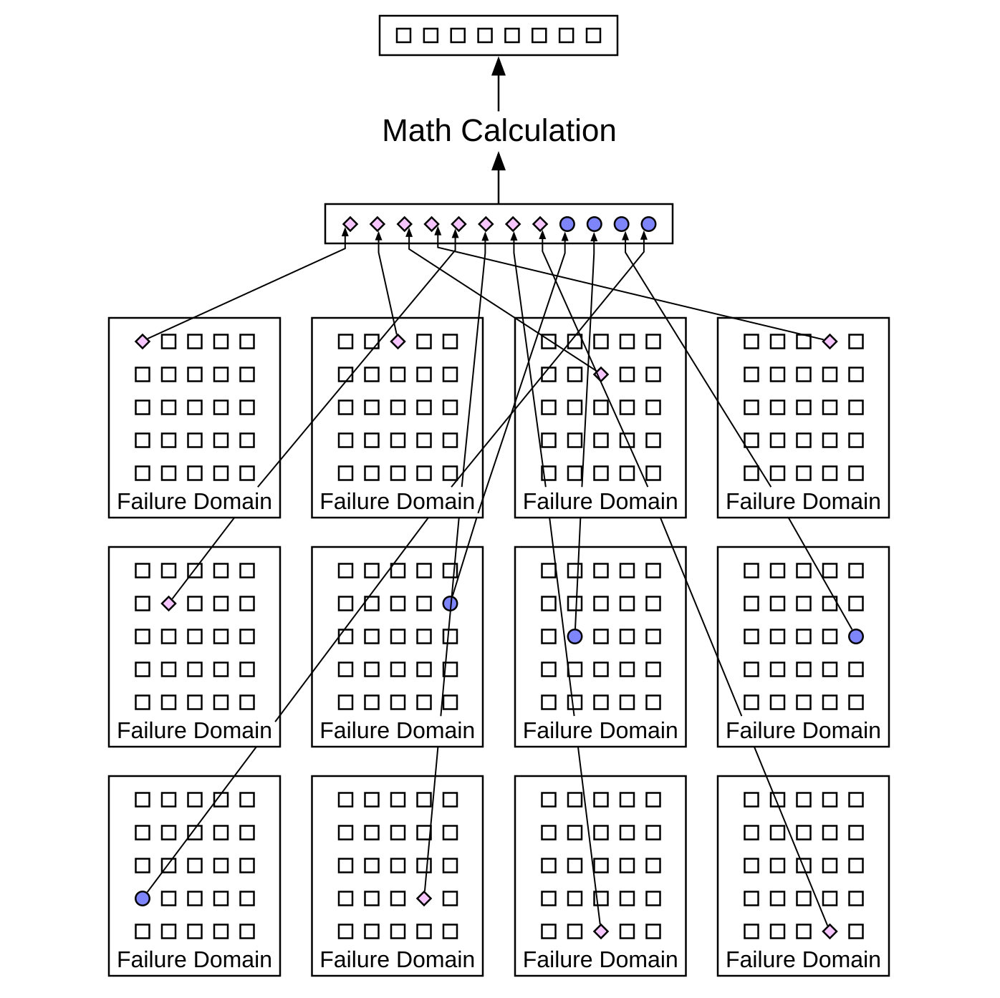
</div>

Erasure coding enables us to achieve a much lower storage cost (50% improvement) at the expense of access speed due to the data routing service having to collect data from multiple locations:

<div style="margin-left:3rem">
    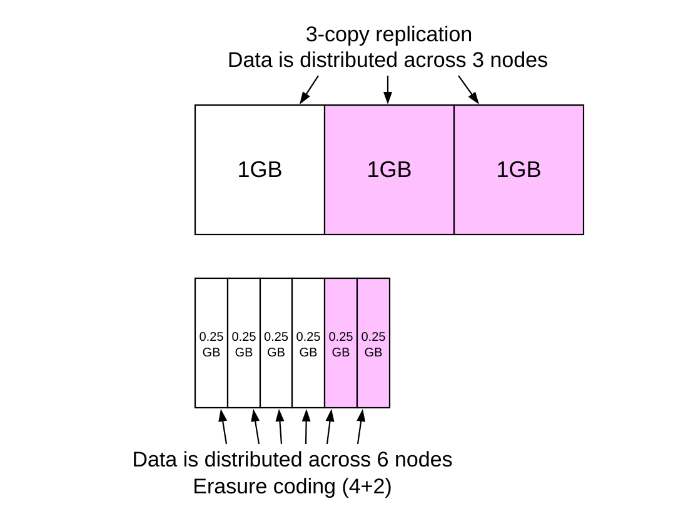
</div>

Other caveats:
- Replication requires 200% storage overhead (in the case of 3 replicas) vs. 50% via erasure coding
- Erasure coding gives us 11 nines of durability [[30]](#ref-30) vs. 6 nines via replication
- Erasure coding requires more computation to calculate and store parities

In sum, replication is more useful for latency-sensitive applications, whereas erasure coding is attractive for storage cost efficiency and durability.
Erasure coding is also much harder to implement.

### Correctness verification

If a disk fails entirely, then the failure is easy to detect. This is less straightforward if part of the disk gets corrupted.

This problem can be addressed by verifying checksums [[25]](#ref-25) between process boundaries. A checksum is a small-sized block of data that is used to detect data errors. The image below illustrates how the checksum is generated.

<div style="margin-left:3rem">
    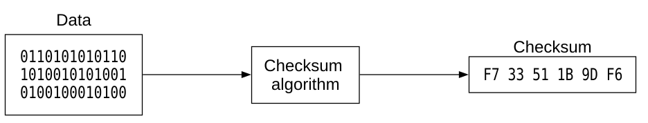
</div>

If we know the checksum of the original data, we can compute the checksum of the data after transmission:
* If they are different, the data is corrupted.
* If they are the same, there is a very high probability that the data is not corrupted. The probability is not 100%, but in practice, we could assume they are the same.

<div style="margin-left:3rem">
    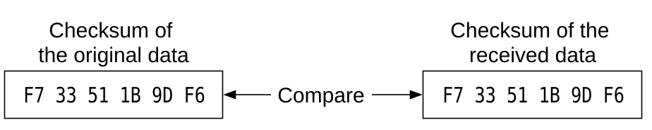
</div>

There are many checksum algorithms, such as MD5 [[26]](#ref-26), SHA-1 [[27]](#ref-27), HMAC [[28]](#ref-28), etc. For this chapter, we choose a simple checksum algorithm such as MD5.

In our case, we append the checksum at the end of each object. Before a file is marked as read-only, we add a checksum of the entire file at the end. The image below shows the layout.

<div style="margin-left:3rem">
    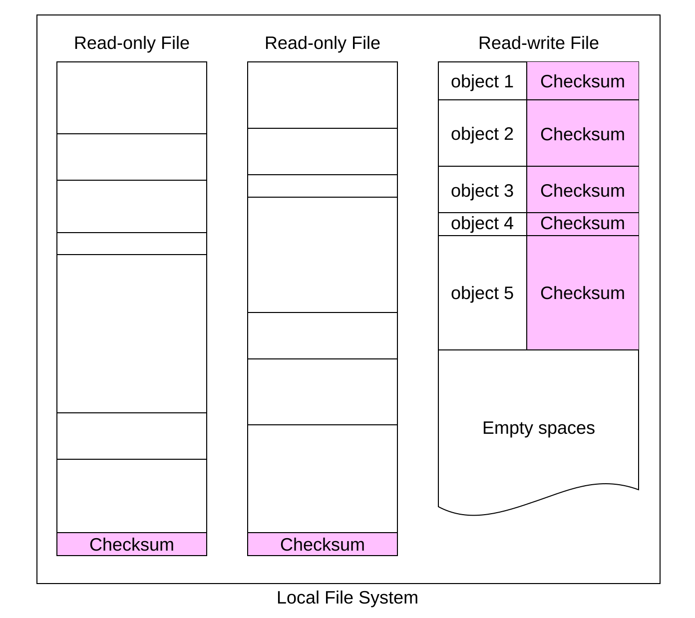
</div>

With (8+4) erasure coding and checksum verification, this is what happens when we read data:
1. Fetch the object data and the checksum.
2. Compute the checksum against the data received.
    - a. If the two checksums match, the data is error-free.
    - b. If the checksums are different, the data is corrupted. We will try to recover by reading the data from other failure domains.
3. Repeat steps 1 and 2 until all 8 pieces of data are returned. We then reconstruct the data and send it back to the client.

### Metadata data model

#### **Schema**

The database schema needs to support the following 3 queries:
* Query 1: Find the object ID by object name.
* Query 2: Insert and delete an object based on the object name.
* Query 3: List objects in a bucket sharing the same prefix.

<div style="margin-left:3rem">
    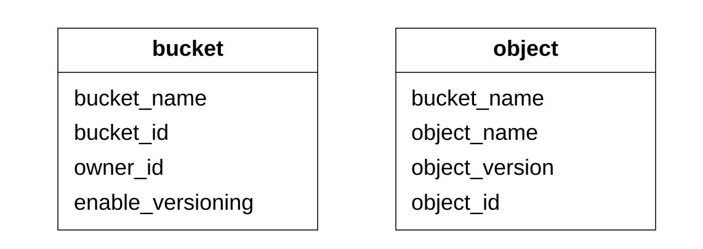
</div>

#### **Scale the `bucket` table**

Since there is usually a limit on the number of buckets a user can create, the size of the bucket table is small. Let’s assume we have 1 million customers. Each customer owns 10 buckets and each record takes 1 KB. That means we need 10 GB (1 million x 10 x 1 KB) of storage space. The whole table can easily fit in a modern database server. However, a single database server might not have enough CPU or network bandwidth to handle all read requests. If so, we can spread the read load among multiple database replicas.

#### **Scale the `object` table**

The object table holds the object metadata. The dataset at our design scale will likely not fit in a single database instance. We can scale the object table by sharding.

One option is to shard by the `bucket_id` so all the objects under the same bucket are stored in one shard. This doesn’t work because it causes hotspot shards as a bucket might contain billions of objects.

Another option is to shard by `object_id`. The benefit of this sharding scheme is that it evenly distributes the load. But we will not be able to execute query 1 and query 2 efficiently because those two queries are based on the URI.

We choose to shard by a combination of `bucket_name` and `object_name`. This is because most of the metadata operations are based on the object URI, for example, finding the object ID by URI or uploading an object via URI. To evenly distribute the data, we can use the hash of (`bucket_name`, `object_name`) as the sharding key.

With this sharding scheme, it is straightforward to support the first two queries, but the last query is less obvious. Let’s take a look.

#### **Listing objects in a bucket**

The object store arranges files in a flat structure instead of a hierarchy, like in a file system. An object can be accessed using a path in this format: `s3://bucket-name/object-name`.

For example, `s3://mybucket/abc/d/e/f/file.txt` contains:
* Bucket name: `mybucket`
* Object name: `abc/d/e/f/file.txt`

To help users organize their objects in a bucket, S3 introduces a concept called 'prefixes'. A prefix is a string at the beginning of the object name. S3 uses prefixes to organize the data in a way similar to directories. However, prefixes are not directories. Listing a bucket by prefix limits the results to only those object names that begin with the prefix.

In the example above with the path `s3://mybucket/abc/d/e/f/file.txt`, the prefix is `abc/d/e/f`.

The AWS S3 listing commands have 3 typical uses [[7]](#ref-7) [[32]](#ref-32):
1. List all buckets owned by a user. The command looks like this:

```bash
aws s3api list-buckets
```

2. List all objects in a bucket that are at the same level as the specified prefix. The command looks like this:

```bash
aws s3 ls s3://mybucket/abc/
```
In this mode, objects with more slashes in the name after the prefix are rolled up into a common prefix. For example, with these objects in the bucket:

```text
CA/cities/losangeles.txt
CA/cities/sanfrancisco.txt
NY/cities/ny.txt
federal.txt
```

Listing the bucket with the 'p' prefix would return these results, with everything under `CA/` and `NY/` rolled up into them:

```text
CA/
NY/
federal.txt
```

3. Recursively list all objects in a bucket that share the same prefix. The command looks like this:

```bash
aws s3 ls s3://mybucket/abc/ --recursive
```
Using the same example as above, listing the bucket with the `CA/` prefix would return these results:

```text
CA/cities/losangeles.txt
CA/cities/sanfrancisco.txt
```

#### **Single database**

To list all buckets owned by a user, we run the following query:

```sql
SELECT * FROM bucket
WHERE owner_id={id}
```

To list all objects in a bucket that share the same prefix, we run a query like this:

```sql
SELECT * FROM object
WHERE bucket_id = "123"
AND object_name LIKE `abc/%`
```

#### **Distributed databases**

When the metadata table is sharded, it's difficult to implement the listing function because we don't know which shards contain the data. The most obvious solution is to run a search query on all shards and then aggregate the results.

To achieve this, we can do the following:
1. The metadata service queries every shard by running the following query:
```sql
SELECT * FROM object
WHERE bucket_id = "123"
AND object_name LIKE 'a/b/%'
```
2. The metadata service aggregates all objects returned from each shard and returns the result to the caller.

This solution works, but implementing paging for this is a bit complicated. Before we explain why, let's review how paging works for a simple case with a single database. To return pages of a listing with 10 objects for each page, the SELECT query would start with this:

```sql
SELECT * FROM object
WHERE bucket_id = "123"
AND object_name LIKE 'a/b/%'
ORDER BY object_name OFFSET 0 LIMIT 10
```

The OFFSET and LIMIT would restrict the results to the first 10 objects. In the next call, the user sends the request with a hint to the server, so it knows to construct the query for the second page with an OFFSET of 10. This hint is usually provided with a cursor that the server returns with each page to the client. The offset information is encoded in the cursor. The client would include the cursor in the request for the next page. The server decodes the cursor and uses the offset information embedded in it to construct the query for the next page.

To continue with the example above, the query for the second page looks like this:

```sql
SELECT * FROM metadata
WHERE bucket_id = "123"
AND object_name LIKE 'a/b/%'
ORDER BY object_name OFFSET 10 LIMIT 10
```

Now, let’s explore why it’s complicated to support paging for sharded databases. Since the objects are distributed across shards, the shards would likely return a varying number of results. Some shards would contain a full page of 10 objects, while others would be partial or empty. The application code would receive results from every shard, aggregate and sort them, and return only a page of 10 in our example. The objects that don’t get included in the current round must be considered again for the next round. This means that each shard would likely have a different offset. The server must track the offsets for all the shards and associate those offsets with the cursor. If there are hundreds of shards, there will be hundreds of offsets to track.

We have a solution that can solve the problem, but there are some tradeoffs. Since object storage is tuned for vast scale and high durability, object listing performance is rarely a priority. In fact, all commercial object storage supports object listing with sub-optimal performance. To take advantage of this, we could denormalize the listing data into a separate table sharded by bucket ID. This table is only used for listing objects. With this setup, even buckets with billions of objects would offer acceptable performance. This isolates the listing query to a single database, which greatly simplifies the implementation.

### Object versioning

Versioning is a feature that keeps multiple versions of an object in a bucket. With versioning, we can restore objects that are accidentally deleted or overwritten.

<div style="margin-left:3rem">
    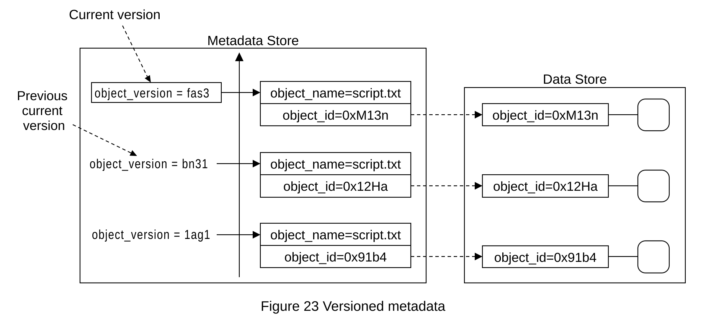
</div>

1. The client sends an HTTP PUT request to upload an object named “script.txt”.
2. The API service verifies the user’s identity and ensures that the user has `WRITE` permission on the bucket.
3. Once verified, the API service uploads the data to the data store. The data store persists the data as a new object and returns a new UUID to the API service.
4. The API service calls the metadata store to store the metadata information of this object.
5. To support versioning, the object table for the metadata store has a column called `object_version` that is only used if versioning is enabled. Instead of overwriting the existing record, a new record is inserted with the same bucket_id and object_name as the old record, but with a new `object_id` and `object_version`. The `object_id` is the UUID for the new object returned in step 3. The `object_version` is a `TIMEUUID` [[29]](#ref-29) generated when the new row is inserted. No matter which database we choose for the metadata store, it should be efficient to look up the current version of an object. The current version has the largest `TIMEUUID` of all the entries with the same object_name.

Each new version produces a new `object_id`:

<div style="margin-left:3rem">
    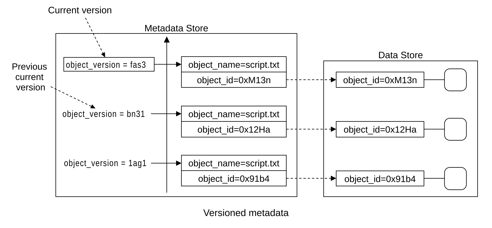
</div>

When we delete an object, all versions remain in the bucket and we insert a delete marker, as shown in the image below.

<div style="margin-left:3rem">
    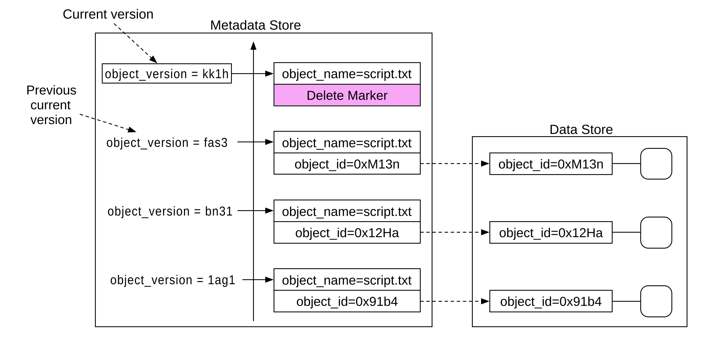
</div>

A delete marker is a new version of the object, and it becomes the current version of the object once inserted. Performing a GET request when the current version of the object is a delete marker returns a `404 Object Not Found` error.

### Optimizing uploads of large files

Uploading large files can be optimized by using multipart uploads - splitting a big file into several chunks that are uploaded independently:

<div style="margin-left:3rem">
    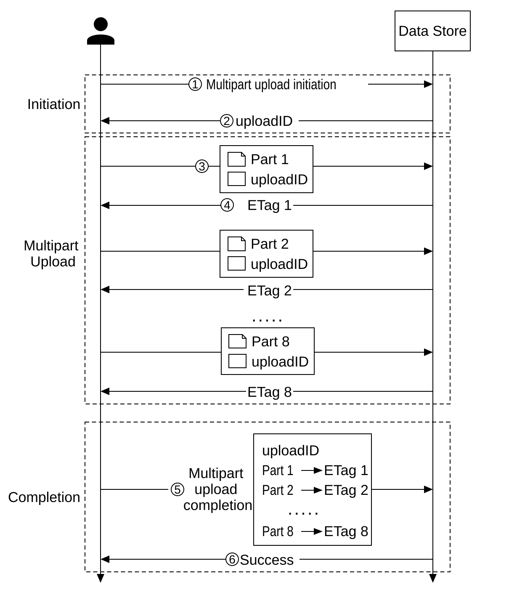
</div>

1. The client calls the object service to initiate a multipart upload.
2. The data store returns an `uploadID`, which uniquely identifies the upload.
3. The client splits the large file into small objects and starts uploading. Let's assume the size of the file is 1.6 GB and the client splits it into 8 parts, so each part is 200 MB in size. The client uploads the first part to the data store together with the `uploadID` it received in step 2.
4. When a part is uploaded, the data store returns an `ETag`, which is essentially the MD5 checksum of that part. It is used to verify multipart uploads.
5. After all parts are uploaded, the client sends a complete multipart upload request, which includes the `uploadID`, part numbers, and all `ETags`.
6. The data store reassembles the object from its parts based on the part number. Since the object is really large, this process may take a few minutes. After reassembly is complete, it returns a success message to the client.

One potential problem with this approach is that old parts are no longer useful after the object has been reassembled from them. To solve this problem, we can introduce a garbage collection service responsible for freeing up space from parts that are no longer needed.

### Garbage collection

Garbage collection is the process of automatically reclaiming storage space that is no longer used. There are a few ways data becomes garbage:
- **lazy object deletion** - an object is marked as deleted without actually getting deleted
- **orphan data** - e.g., an upload failed mid-flight and old parts need to be deleted
- **corrupted data** - data which failed checksum verification

The garbage collector does not remove objects from the data store right away. Deleted objects will be periodically cleaned up with a compaction mechanism.

The garbage collector is also responsible for reclaiming unused space in replicas.
With replication, data is deleted from both primaries and replicas. With erasure coding (8+4), data is deleted from all 12 nodes.

The image below shows an example of how compaction works.
1. The garbage collector copies objects from "/data/b" to a new file named "/data/d". Note the garbage collector skips "Object 2" and "Object 5" because the delete flag is set to true for both of them.
2. After all objects are copied, the garbage collector updates the `object_mapping` table. For example, the `obj_id` and `object_size` fields of "Object 3" remain the same, but `file_name` and `start_offset` are updated to reflect its new location. To ensure data consistency, it's a good idea to wrap the update operations to `file_name` and `start_offset` in a database transaction.

<div style="margin-left:3rem">
    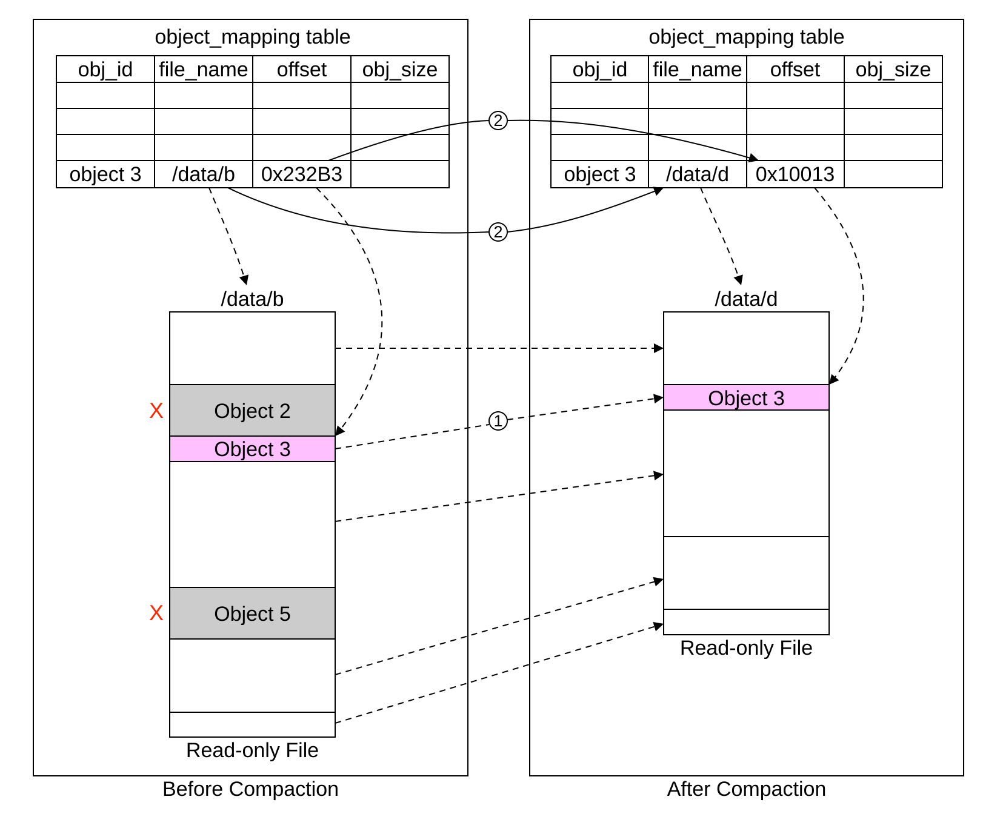
</div>

As we can see from the image above, the size of the new file after compaction is smaller than that of the old file. To avoid creating a lot of small files, the garbage collector usually waits until there are a large number of read-only files to compact, and the compaction process appends objects from many read-only files into a few large new files.

## Step 4: Wrap Up

Things we covered:
- Designing an S3-like object storage service
- Comparing differences between object, block and file storage
- Covering uploading, downloading, listing, and versioning of objects in a bucket
- Diving deep into the design - data store and metadata store, replication and erasure coding, multipart uploads, and sharding

## Reference materials

1. <a id="ref-1"></a>[Fibre Channel](https://en.wikipedia.org/wiki/Fibre_Channel)
2. <a id="ref-2"></a>[iSCSI](https://en.wikipedia.org/wiki/ISCSI)
3. <a id="ref-3"></a>[Server Message Block](https://en.wikipedia.org/wiki/Server_Message_Block)
4. <a id="ref-4"></a>[Network File System](https://en.wikipedia.org/wiki/Network_File_System)
5. <a id="ref-5"></a>[Amazon S3 Strong Consistency](https://aws.amazon.com/s3/consistency/)
6. <a id="ref-6"></a>[Serial Attached SCSI](https://en.wikipedia.org/wiki/Serial_Attached_SCSI)
7. <a id="ref-7"></a>[AWS CLI ls command](https://docs.aws.amazon.com/cli/latest/reference/s3/ls.html)
8. <a id="ref-8"></a>[Amazon S3 Service Level Agreement](https://aws.amazon.com/s3/sla/)
9. <a id="ref-9"></a>[Ambry: LinkedIn’s Scalable Geo-Distributed Object Store](https://assured-cloud-computing.illinois.edu/files/2014/03/Ambry-LinkedIns-Scalable-GeoDistributed-Object-Store.pdf)
10. <a id="ref-10"></a>[inode](https://en.wikipedia.org/wiki/Inode)
11. <a id="ref-11"></a>[Ceph’s Rados Gateway](https://docs.ceph.com/en/pacific/radosgw/index.html)
12. <a id="ref-12"></a>[gRPC](https://grpc.io/)
13. <a id="ref-13"></a>[Paxos](https://en.wikipedia.org/wiki/Paxos_(computer_science))
14. <a id="ref-14"></a>[Raft](https://raft.github.io/)
15. <a id="ref-15"></a>[Consistent hashing](https://www.toptal.com/big-data/consistent-hashing)
16. <a id="ref-16"></a>[RocksDB](https://github.com/facebook/rocksdb)
17. <a id="ref-17"></a>[SSTable](https://www.igvita.com/2012/02/06/sstable-and-log-structured-storage-leveldb/)
18. <a id="ref-18"></a>[B+ tree](https://en.wikipedia.org/wiki/B%2B_tree)
19. <a id="ref-19"></a>[SQLite](https://www.sqlite.org/index.html)
20. <a id="ref-20"></a>[Data Durability Calculation](https://www.backblaze.com/blog/cloud-storage-durability/)
21. <a id="ref-21"></a>[Rack](https://en.wikipedia.org/wiki/19-inch_rack)
22. <a id="ref-22"></a>[Erasure Coding](https://en.wikipedia.org/wiki/Erasure_code)
23. <a id="ref-23"></a>[Reed–Solomon error correction](https://en.wikipedia.org/wiki/Reed%E2%80%93Solomon_error_correction)
24. <a id="ref-24"></a>[Erasure Coding Demystified](https://www.youtube.com/watch?v=Q5kVuM7zEUI)
25. <a id="ref-25"></a>[Checksum](https://en.wikipedia.org/wiki/Checksum)
26. <a id="ref-26"></a>[MD5](https://en.wikipedia.org/wiki/MD5)
27. <a id="ref-27"></a>[SHA-1](https://en.wikipedia.org/wiki/SHA-1)
28. <a id="ref-28"></a>[HMAC](https://en.wikipedia.org/wiki/HMAC)
29. <a id="ref-29"></a>[TIMEUUID](https://docs.datastax.com/en/cql-oss/3.3/cql/cql_reference/timeuuid_functions_r.html)
30. <a id="ref-30"></a>[Backblaze Erasure Coding Durability](https://github.com/Backblaze/erasure-coding-durability)
31. <a id="ref-31"></a>[Amazon S3 Storage Classes](https://docs.aws.amazon.com/AmazonS3/latest/userguide/storage-class-intro.html)
32. <a id="ref-32"></a>[AWS CLI list-buckets command](https://docs.aws.amazon.com/cli/latest/reference/s3api/list-buckets.html)
