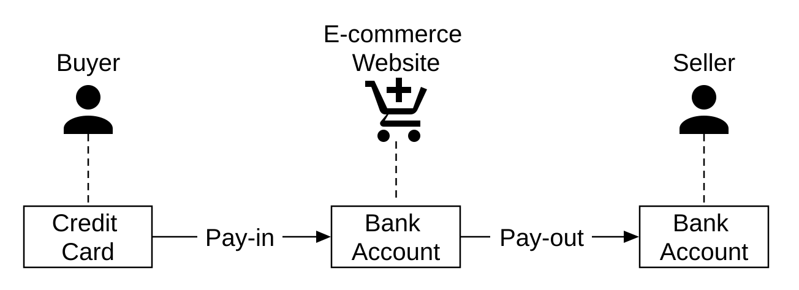
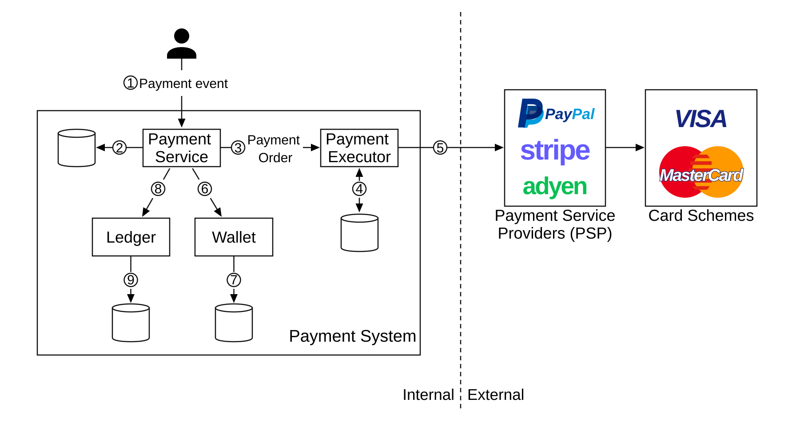
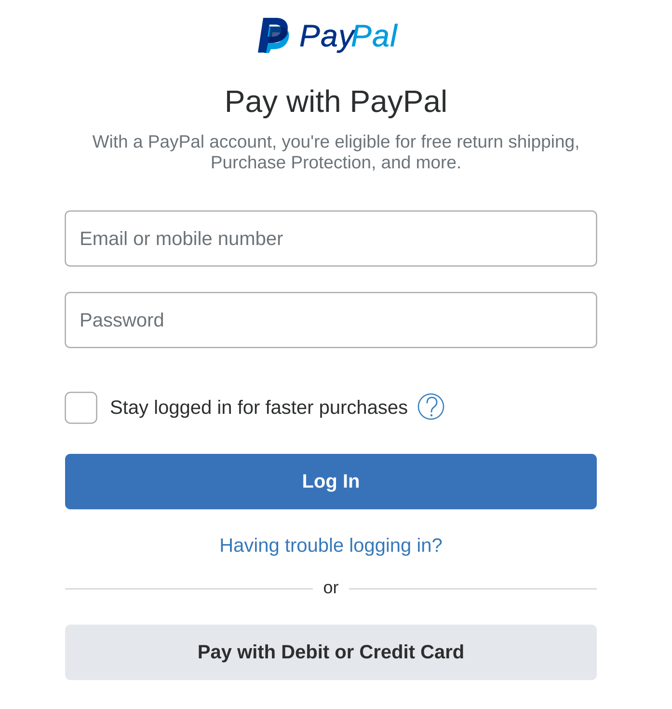
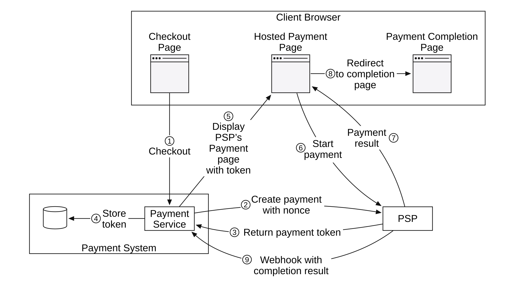
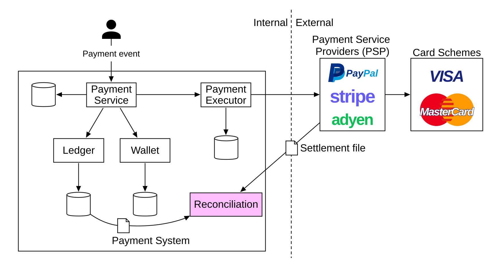
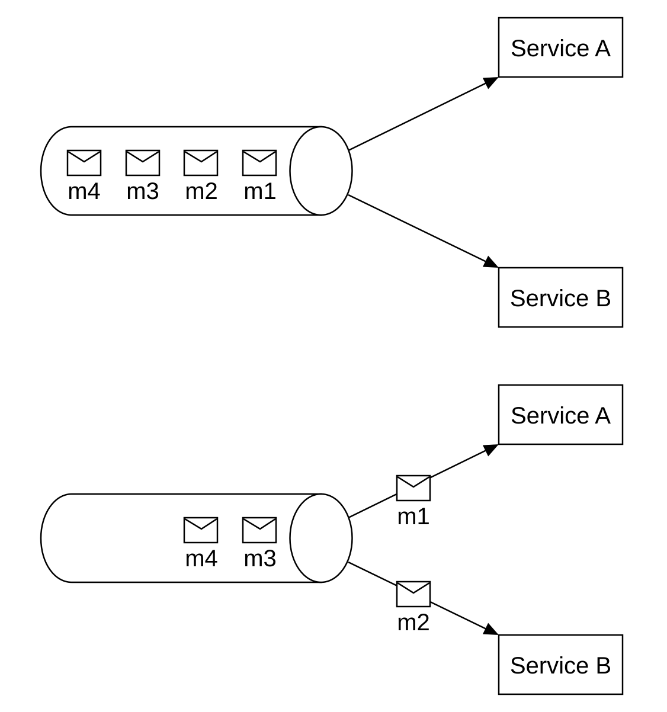
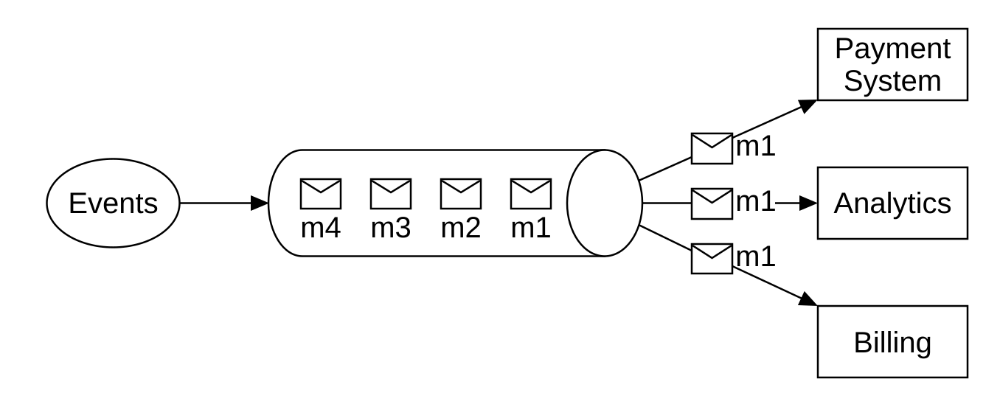
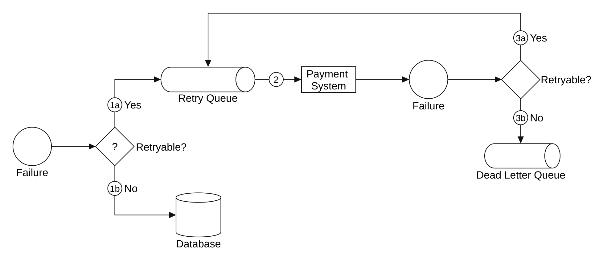
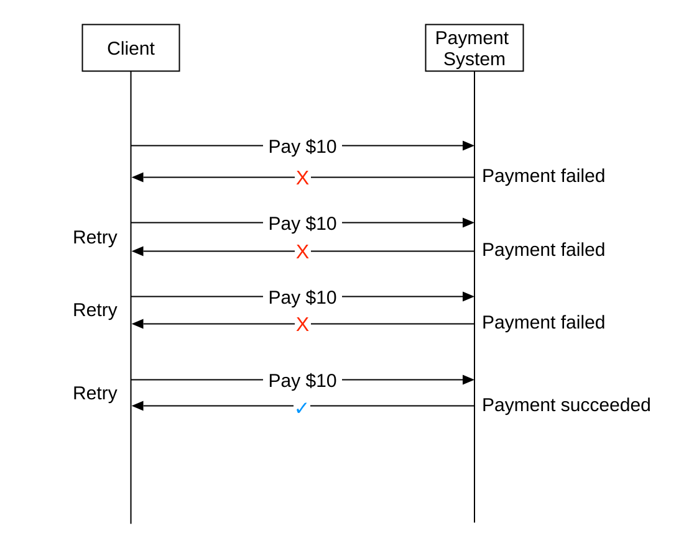
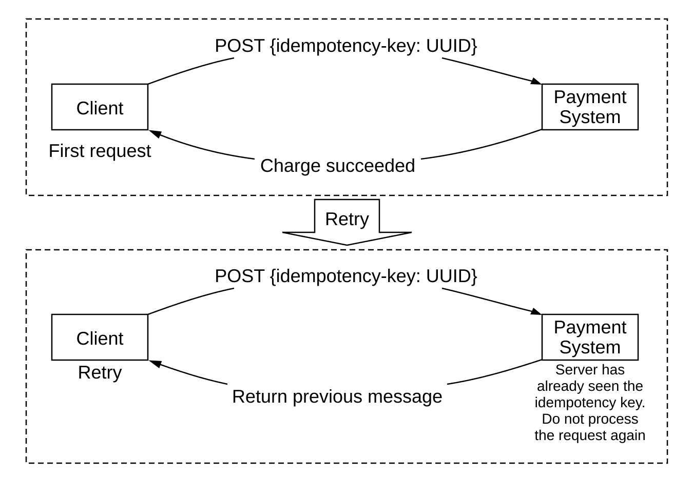

# Chapter 26: Payment System
<sub>[Back to System Design](../Readme.md#content)</sub>

## Introduction
We'll design a **payment system** in this chapter, which underpins all of modern **e-commerce**.

A **payment system** is used to settle financial transactions by transferring monetary value.

---

## Step 1: Understand the Problem and Establish Design Scope
 * C: What kind of payment system are we building?
 * I: A payment backend for an e-commerce system, similar to Amazon.com. It handles everything related to money movement.
 * C: What payment options are supported - credit cards, PayPal, bank cards, etc.?
 * I: The system should support all these options in real life. For the purposes of the interview, we can use credit card payments.
 * C: Do we handle credit card processing ourselves?
 * I: No, we use a third-party provider like Stripe, Braintree, Square, etc.
 * C: Do we store credit card data in our system?
 * I: For compliance reasons, we do not store credit card data directly in our systems. We rely on third-party payment processors.
 * C: Is the application global? Do we need to support different currencies and international payments?
 * I: The application is global, but we assume only one currency is used for the purposes of the interview.
 * C: How many payment transactions per day do we support?
 * I: 1 million transactions per day.
 * C: Do we need to support the payout flow, e.g., paying out to sellers each month?
 * I: Yes, we need to support that
 * C: Is there anything else I should pay attention to?
 * I: We need to support reconciliations to fix any inconsistencies in communicating with internal and external systems.

### **Functional requirements**
 * Pay-in flow - payment system receives money from customers on behalf of merchants
 * Pay-out flow - payment system sends money to sellers around the world

### **Non-functional requirements**
 * Reliability and fault-tolerance. Failed payments need to be carefully handled
 * Reconciliation between internal and external systems needs to be set up.

### **Back-of-the-envelope estimation**
The system needs to process 1 million transactions per day, which is 10 transactions per second.

This is not high throughput for any database system, so it's not the focus of this interview.

---

## Step 2: Propose High-Level Design and Get Buy-In
At a high level, we have three actors participating in money movement:

<div style="margin-left:3rem">
    
</div>

### **Pay-in flow**
Here's the high-level overview of the pay-in flow:

<div style="margin-left:3rem">
    
</div>

 * **Payment service** - accepts payment events and coordinates the payment process. It typically also performs a risk check using a third-party provider for AML violations or criminal activity.
 * **Payment executor** - executes a single payment order via the Payment Service Provider (PSP). Payment events may contain several payment orders.
 * **Payment service provider (PSP)** - moves money from one account to another, e.g., from a buyer's credit card account to an e-commerce site's bank account.
 * **Card schemes** - organizations that process credit card operations, e.g., Visa and Mastercard.
 * **Ledger** - keeps financial record of all payment transactions.
 * **Wallet** - keeps the account balance for all merchants.

Here's an example pay-in flow:
 1. The user clicks "place order," and a payment event is sent to the payment service.
 2. The payment service stores the event in its database.
 3. The payment service calls the payment executor for all payment orders that are part of that payment event.
 4. The payment executor stores the payment order in its database.
 5. The payment executor calls an external PSP to process the credit card payment.
 6. After the payment executor processes the payment, the payment service updates the wallet to record how much money the seller has.
 7. The wallet service stores updated balance information in its database.
 8. The payment service calls the ledger
 9. The ledger service stores the record of all money movements.

### **APIs for payment service**
```http
POST /v1/payments
{
  "buyer_info": {...},
  "checkout_id": "some_id",
  "credit_card_info": {...},
  "payment_orders": [{...}, {...}, {...}]
}
```

Example `payment_order`:
```json
{
  "seller_account": "SELLER_IBAN",
  "amount": "3.15",
  "currency": "USD",
  "payment_order_id": "globally_unique_payment_id"
}
```

Caveats:
 * The `payment_order_id` is forwarded to the PSP to deduplicate payments; i.e., it is the idempotency key.
 * The amount field is `string` as `double` is not appropriate for representing monetary values.

```http
GET /v1/payments/{:id}
```

This endpoint returns the execution status of a single payment, based on the `payment_order_id`.

### **Payment service data model**
We need to maintain two tables - `payment_events` and `payment_orders`.

For payments, performance is typically not an important factor. Strong consistency, however, is.

Other considerations for choosing the database:
 * A large pool of DBAs available to administer the database
 * A proven track record of the database being used by other large financial institutions
 * Richness of supporting tools
 * Traditional SQL over NoSQL/NewSQL for its ACID guarantees

Here's what the `payment_events` table contains:
 * `checkout_id` - string, primary key
 * `buyer_info` - string (personal note - probably a foreign key to another table is more appropriate)
 * `seller_info` - string (personal note - same remark as above)
 * `credit_card_info` - depends on card provider
 * `is_payment_done` - boolean

Here's what the `payment_orders` table contains:
 * `payment_order_id` - string, primary key
 * `buyer_account` - string
 * `amount` - string
 * `currency` - string
 * `checkout_id` - string, foreign key
 * `payment_order_status` - enum (`NOT_STARTED`, `EXECUTING`, `SUCCESS`, `FAILED`)
 * `ledger_updated` - boolean
 * `wallet_updated` - boolean

Caveats:
 * There are many payment orders linked to a given payment event.
 * We don't need the `seller_info` for the pay-in flow. That's required only for payouts.
 * `ledger_updated` and `wallet_updated` are updated when the respective service is called to record the result of a payment.
 * Payment transitions are managed by a background job that checks updates of in-flight payments and triggers an alert if a payment is not processed in a reasonable time frame.

### **Double-entry ledger system**
The double-entry accounting mechanism is key to any payment system. It tracks money movements by always applying money operations to two accounts, where one account's balance increases (credit) and the other decreases (debit):

| Account | Debit | Credit |
|---------|-------|--------|
| buyer   | $1    |        |
| seller  |       | $1     |

Sum of all transaction entries is always zero. This mechanism provides end-to-end traceability of all money movements within the system.

### **Hosted payment page**
To avoid storing credit card information and having to comply with various heavy regulations, most companies prefer utilizing a widget provided by PSPs that stores and handles credit card payments for them:

<div style="margin-left:3rem">
    
</div>

### **Pay-out flow**
The components of the pay-out flow are very similar to the pay-in flow.

Main differences:
 * Money is moved from the e-commerce site's bank account to the merchant's bank account.
 * we can utilize a third-party account payable provider such as Tipalti
 * There's a lot of bookkeeping and regulatory requirements to handle with regards to pay-outs as well

---

## Step 3: Design Deep Dive
This section focuses on making the system faster, more robust and secure.

### **PSP Integration**
If our system can directly connect to banks or card schemes, payment can be made without a PSP.
These kinds of connections are very rare and uncommon, typically done at large companies which can justify the investment.

If we go down the traditional route, a PSP can be integrated in one of two ways:
 * Through API, if our payment system can collect payment information
 * Through a hosted payment page to avoid dealing with payment information regulations

Here's how the hosted payment page workflow works:

<div style="margin-left:3rem">
    
</div>

1. The user clicks the “checkout” button in the client browser. The client calls the payment service with the payment order information.
2. After receiving the payment order information, the payment service sends a payment registration request to the PSP. This registration request contains payment information, such as the amount, currency, expiration date of the payment request, and the redirect URL. Because a payment order should be registered only once, there is a UUID field to ensure the exactly-once registration. This UUID is also called nonce [10]. Usually, this UUID is the ID of the payment order.
3. The PSP returns a token back to the payment service. A token is a UUID on the PSP side that uniquely identifies the payment registration. We can examine the payment registration and the payment execution status later using this token.
4. The payment service stores the token in the database before calling the PSP-hosted payment page.
5. Once the token is persisted, the client displays a PSP-hosted payment page. Mobile applications usually use the PSP’s SDK integration for this functionality. Stripe provides a JavaScript library that displays the payment UI, collects sensitive payment information, and calls the PSP directly to complete the payment. Sensitive payment information is collected by Stripe. It never reaches our payment system. The hosted payment page usually needs two pieces of information:
    - [a] The token we received in step 4. The PSP’s javascript code uses the token to retrieve detailed information about the payment request from the PSP’s backend. One important piece of information is how much money to collect.
    - [b] Another important piece of information is the redirect URL. This is the web page URL that is called when the payment is complete. When the PSP’s JavaScript finishes the payment, it redirects the browser to the redirect URL. Usually, the redirect URL is an e-commerce web page that shows the status of the checkout. Note that the redirect URL is different from the webhook [11] URL in step 9.
6. The user fills in the payment details on the PSP’s web page, such as the credit card number, holder’s name, expiration date, etc, then clicks the pay button. The PSP starts the payment processing.
7. The PSP returns the payment status.
8. The web page is now redirected to the redirect URL. The payment status that is received in step 7 is typically appended to the URL. For example, the full redirect URL could be [12]: `https://your-company.com/?tokenID=JIOUIQ123NSF&payResult=X324FSa`
9. Asynchronously, the PSP calls the payment service with the payment status via a webhook. The webhook is an URL on the payment system side that was registered with the PSP during the initial setup with the PSP. When the payment system receives payment events through the webhook, it extracts the payment status and updates the payment_order_status field in the Payment Order database table.

### **Reconciliation**
The previous section explains the happy path of a payment. Unhappy paths are detected and reconciled using a background reconciliation process.

Every night, the PSP sends a settlement file which our system uses to compare the external system's state against our internal system's state.

<div style="margin-left:3rem">
    
</div>

This process can also be used to detect internal inconsistencies, for example, between the ledger and wallet services.

Mismatches are handled manually by the finance team. Mismatches are handled as:
 * classifiable, hence, it is a known mismatch which can be adjusted using a standard procedure
 * classifiable, but can't be automated. Manually adjusted by the finance team
 * unclassifiable. Manually investigated and adjusted by the finance team

### **Handling payment processing delays**
There are cases where a payment can take hours to complete, although it typically takes seconds.

This can happen due to:
 * a payment being flagged as high-risk and someone has to manually review it
 * A credit card requires extra protection, e.g., 3D Secure Authentication, which requires extra details from the cardholder to complete.

These situations are handled by:
 * waiting for the PSP to send us a webhook when a payment is complete or polling its API if the PSP doesn't provide webhooks
 * showing a "pending" status to the user and giving them a page, where they can check-in for payment updates. We could also send them an email once their payment is complete

### **Communication among internal services**
There are two types of communication patterns services use to communicate with one another - synchronous and asynchronous.

Synchronous communication (i.e., HTTP) works well for small-scale systems, but suffers as scale increases:
 * low performance - request-response cycle is long as more services get involved in the call chain
 * poor failure isolation - if PSPs or any other service fails, user will not receive a response
 * tight coupling - sender needs to know the receiver
 * hard to scale - not easy to support sudden increase in traffic due to not having a buffer

Asynchronous communication can be divided into two categories.

**Single receiver** - multiple receivers subscribe to the same topic and messages are processed only once:

<div style="margin-left:3rem">
    
</div>

**Multiple receivers** - multiple receivers subscribe to the same topic, but messages are forwarded to all of them:

<div style="margin-left:3rem">
    
</div>

The latter model works well for our payment system, as a payment can trigger multiple side effects handled by different services.

In a nutshell, synchronous communication is simpler but doesn't allow services to be autonomous.
Async communication trades simplicity and consistency for scalability and resilience.

### **Handling failed payments**
Every payment system needs to address failed payments. Here are some of the mechanisms we'll use to achieve that:
 * **Tracking payment state** - whenever a payment fails, we can determine whether to retry/refund based on the payment state.
 * **Retry queue** - payments which we'll retry are published to a retry queue
 * **Dead-letter queue** - payments which have terminally failed are pushed to a dead-letter queue, where the failed payment can be debugged and inspected.

<div style="margin-left:3rem">
    
</div>

1. Check whether the failure is retryable.
    - [a] Retryable failures are routed to a retry queue.
    - [b] For non-retryable failures such as invalid input, errors are stored in a database.
2. The payment system consumes events from the retry queue and retries failed payment transactions.
3. If the payment transaction fails again:
    - [a] If the retry count doesn’t exceed the threshold, the event is routed to the retry queue.
    - [b] If the retry count exceeds the threshold, the event is put in the dead letter queue. Those failed events might need to be investigated.

### **Exactly-once delivery**
We need to ensure a payment gets processed exactly once to avoid double-charging a customer.

An operation is executed exactly once if it is executed at least once and at most once at the same time.

To achieve the at-least-once guarantee, we'll use a retry mechanism:

<div style="margin-left:3rem">
    
</div>

Here are some common strategies for deciding the retry intervals:
 * immediate retry - client immediately sends another request after failure
 * fixed intervals - wait a fixed amount of time before retrying a payment
 * incremental intervals - incrementally increase retry interval between each retry
 * exponential backoff - double the retry interval between subsequent retries
 * cancel - client cancels the request. This happens when the error is terminal or retry threshold is reached

As a rule of thumb, default to an exponential-backoff retry strategy. A good practice is for the server to specify a retry interval using a `Retry-After` header.

An issue with retries is that the server can potentially process a payment twice:
 * client clicks the "pay button" twice, hence, they are charged twice
 * payment is successfully processed by PSP, but not by downstream services (ledger, wallet). Retry causes the payment to be processed by the PSP again

To address the double payment problem, we need to use an idempotency mechanism - a property that an operation applied multiple times is processed only once.

From an API perspective, clients can make multiple calls which produce the same result.
Idempotency is managed by a special header in the request (e.g., `idempotency-key`), which is typically a UUID.

<div style="margin-left:3rem">
    
</div>

Idempotency can be achieved using the database's mechanism of adding unique key constraints:
 * server attempts to insert a new row in the database
 * the insertion fails due to a unique key constraint violation
 * server detects that error and instead returns the existing object back to the client

Idempotency is also applied at the PSP side, using the nonce, which was previously discussed. PSPs will take care to not process payments with the same nonce twice.

### **Consistency**
There are several stateful services called throughout a payment's lifecycle - PSP, ledger, wallet, payment service.

Communication between any two services can fail.
We can ensure eventual data consistency between all services by implementing exactly-once processing and reconciliation.

If we use replication, we'll have to deal with replication lag, which can lead to users observing inconsistent data between primary and replica databases.

To mitigate that, we can serve all reads and writes from the primary database and only utilize replicas for redundancy and fail-over.
Alternatively, we can ensure replicas are always in-sync by utilizing a consensus algorithm such as Paxos or Raft.
We could also use a consensus-based distributed database such as YugabyteDB or CockroachDB.

### **Payment security**
Here are some mechanisms we can use to ensure payment security:
 * Request/response eavesdropping - we can use HTTPS to secure all communication
 * Data tampering - enforce encryption and integrity monitoring
 * Man-in-the-middle attacks - use SSL with certificate pinning
 * Data loss - replicate data across multiple regions and take data snapshots
 * DDoS attack - implement rate limiting and firewall
 * Card theft - use tokens instead of storing real card information in our system
 * PCI compliance - a security standard for organizations which handle branded credit cards
 * Fraud - address verification, card verification value (CVV), user behavior analysis, etc

---

## Step 4: Wrap Up
Other talking points:
 * Monitoring and alerting
 * Debugging tools - we need tools which make it easy to understand why a payment has failed
 * Currency exchange - important when designing a payment system for international use
 * Geography - different regions might have different payment methods
 * Cash payment - very common in places like India and Brazil
 * Google/Apple Pay integration

## Reference materials

1. [Payment system](https://en.wikipedia.org/wiki/Payment_system)
2. [AML/CFT](https://en.wikipedia.org/wiki/Money_laundering)
3. [Card scheme](https://en.wikipedia.org/wiki/Card_scheme)
4. [ISO 4217](https://en.wikipedia.org/wiki/ISO_4217)
5. [Stripe API Reference](https://stripe.com/docs/api)
6. [Double-entry bookkeeping](https://en.wikipedia.org/wiki/Double-entry_bookkeeping)
7. [Books, an immutable double-entry accounting database service](https://developer.squareup.com/blog/books-an-immutable-double-entry-accounting-database-service/)
8. [Payment Card Industry Data Security Standard](https://en.wikipedia.org/wiki/Payment_Card_Industry_Data_Security_Standard)
9. [Tipalti](https://tipalti.com/)
10. [Nonce](https://en.wikipedia.org/wiki/Cryptographic_nonce)
11. [Webhooks](https://stripe.com/docs/webhooks)
12. [Customize your success page](https://stripe.com/docs/payments/checkout/custom-success-page)
13. [3D Secure](https://en.wikipedia.org/wiki/3-D_Secure)
14. [Kafka Connect Deep Dive – Error Handling and Dead Letter Queues](https://www.confluent.io/blog/kafka-connect-deep-dive-error-handling-dead-letter-queues/)
15. [Reliable Processing in a Streaming Payment System](https://www.youtube.com/watch?v=5TD8m7w1xE0&list=PLLEUtp5eGr7Dz3fWGUpiSiG3d_WgJe-KJ)
16. [Chain Services with Exactly-Once Guarantees](https://www.confluent.io/blog/chain-services-exactly-guarantees/)
17. [Exponential backoff](https://en.wikipedia.org/wiki/Exponential_backoff)
18. [Idempotence — Wikipedia overview](https://en.wikipedia.org/wiki/Idempotence)
19. [Stripe idempotent requests](https://stripe.com/docs/api/idempotent_requests)
20. [Idempotency — PayPal developer guide](https://developer.paypal.com/reference/guidelines/idempotency/)
21. [Paxos](https://en.wikipedia.org/wiki/Paxos_(computer_science))
22. [Raft](https://raft.github.io/)
23. [YogabyteDB](https://www.yugabyte.com/)
24. [Cockroachdb](https://www.cockroachlabs.com/)
25. [What is DDoS attack](https://www.cloudflare.com/learning/ddos/what-is-a-ddos-attack/)
26. [Fraud Management — Chargebee](https://www.chargebee.com/docs/payments/2.0/fraud-management/chargebee-fraud-management)
27. [How Uber Processes Early Chargeback Signals](https://www.uber.com/us/en/blog/how-uber-processes-early-chargeback-signals/)
28. [Re-Architecting Cash and Digital Wallet Payments for India with Uber Engineering](https://www.uber.com/us/en/blog/india-payments/)
29. [Scaling Airbnb’s Payment Platform](https://medium.com/airbnb-engineering/scaling-airbnbs-payment-platform-43ebfc99b324)
30. [Payments Integration at Uber: A Case Study](https://www.youtube.com/watch?v=yooCE5B0SRA)
